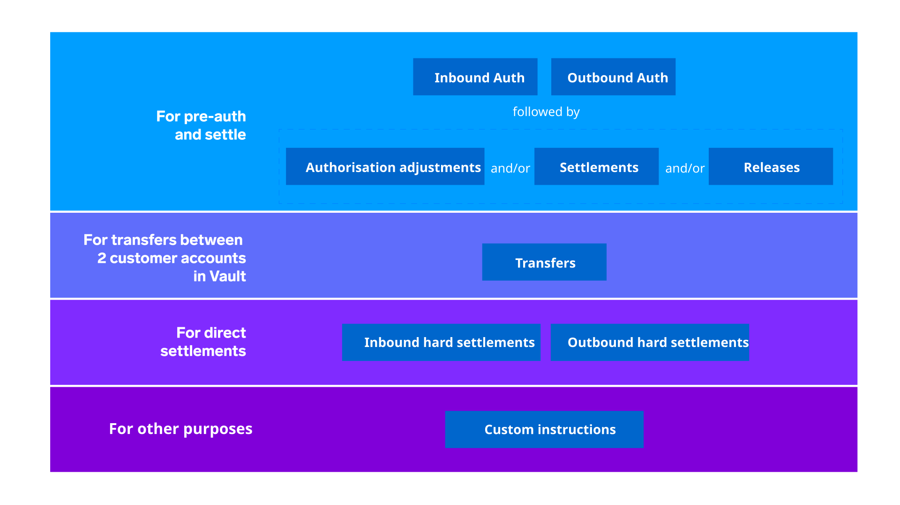

# Module 2: Financial postings and accounting

assignment\_turned\_in

Learning objective

Discover how the Vault Core Accounting Model records and tracks financial transactions and balances associated with a specific product instance.

## [](#postings_balances_and_accounts "Copy link to heading")Postings, balances, and accounts

We shall start by addressing the question of what is a financial record within the Vault Core Platform.

A financial record within Vault Core consists of three components: postings, balances and accounts.

Let’s consider each of these components, starting with Postings.

*Click on each tab below to learn more.*

Postings Balances Accounts

Simply put, in Vault Core, postings move funds.

A **posting** represents **a debit or a credit** in Vault Core.

Postings are instructed using the Postings API and are stored in the append only Ledger, meaning that once a posting has been committed it cannot be removed or edited. The Ledger is the source of truth for the financial state of Vault Core.

There are multiple types of postings used within the Vault platform which provide the degree of flexibility required by most banks within a core banking platform.

Balances are the sum of postings, that is the **net result of all of the postings** that have been made.

A balance in Vault Core is stored against an account address.

The net balance is calculated according to whether the address is associated with an asset or liability account.

An account in Vault Core is one of two types:

-   Internal Account: Used to allocate and track funds owned by the financial institution and is not governed by Smart Contract logic.
    
-   Customer Account: Associated with one or more of the bank’s customers and is governed by Smart Contract logic.
    

Customer Accounts in Vault Core are partitioned into one or more addresses, each storing its own balance.

Addresses can be used in conjunction with Smart Contract logic to keep track of complex account structures.

In total, these addresses represent the financial state of an account in Vault Core.

## [](#posting_objects "Copy link to heading")Posting objects

*Click on the video below to learn more. The transcript is available below.*

  Video transcript

There are three key objects to consider when dealing with postings in Vault Core. These are:

Postings, posting instructions, and posting instruction batches.

These postings have a number of key properties, namely:

-   Is it a credit or debit?
    
-   What is the asset type of the Posting?
    
-   Is it commercial bank money, reward points or something else?
    
-   What is the denomination (currency) of the posting?
    
-   What is the amount to be posted?
    
-   Which phase is the posting at, for example; a pending incoming or pending outgoing posting (a soft posting), or a committed posting (a hard posting).
    
-   Which account ID or address should it be posted to?
    

Moving on to posting instructions…

The second object is a posting instruction.

A posting instruction is considered to be the building block for any financial transaction in the Vault system.

It will always contain two or more postings in order to comply with the double entry bookkeeping principle used in Vault Core.

The posting instruction itself will be a specific type of instruction; such as an outbound or inbound authorisation, a release or settlement to mention a few.

We shall consider the different types in more detail shortly. For now, let’s move onto our third object, which is a posting instruction batch.

Posting instruction batches, also known as PIBs, collect posting instructions together to make a single 'accept or reject' decision.

They therefore contain the smallest group of posting instructions that can be accepted or rejected together in a single message.

warning

Caution! PIBs are not batches in the sense of batch processing, they are not intended for bulk payment processing.

If one posting instruction within the posting instruction batch fails, the entire batch will fail.

The posting instruction batch will capture a status of the result of the postings being processed, that is either accepted or rejected.

Next, we will take a look at the different posting instruction types in more detail.

## [](#posting_overview "Copy link to heading")Posting overview

Vault Core constructs its balance data based on postings, and postings on Vault Core are a representation of the movement of funds.

They are essentially debit and credit instructions to move funds from and to any particular balance address, denomination or phase of one account to another.


Subject to the use case, these instructions are immutable and are processed asynchronously, or synchronously.

For example, an end of day settlement will be processed asynchronously, whereas a credit card transaction will be processed synchronously.

## [](#posting_instruction_types "Copy link to heading")Posting instruction types

Vault Core recognises **several different posting types** as shown below.

These can be further categorised into one of two categories (Standalone or Chainable) based upon the number of API calls required to complete the instruction.



To avoid getting too bogged down in the detail of what each does, we will focus on the most commonly used posting types, for now.

## [](#posting_types "Copy link to heading")Posting types

*Click on the below headers to learn more.*

Inbound or outbound authorisation

**Card payment in shop**: Move funds to a pending state, then settle them - Authorisation and Settlement.

The first example posting type we will consider is: an inbound or outbound authorisation.

This posting type is used to put funds on hold, another term used to describe this is to ring fence the funds in an account. These funds are expected to be settled later or alternatively released. Vault Core does this by moving funds from an account’s balance pending phase to the recipient account’s balance pending phase.

Depending on whether it is an outbound or inbound posting type this will be using the pending outgoing or pending incoming phase.

An example of this instruction type would be when you use the pay-at-pump option at a petrol station. Upon reading your payment card the payment scheme authorises an amount you can spend on fuel, once you have taken the fuel and completed that transaction, an authorisation adjustment is automatically processed to reverse the ‘hold’ put on the funds. This would then be followed by a settlement type posting to cover the actual amount spent for the fuel.

```
The bank or financial institution can decide how to display this ring fencing of funds to customers in their front-end applications.
```

Authorisation adjustment

**Card payment in hotel**: Move funds to a pending state, increase the pending amount - Authorisation and Authorisation Adjustment.

Our second example posting type is an Authorisation Adjustment Posting. This posting type is used to increase the amount that has already been authorised out of an account’s balance.

If accepted, this instruction changes an existing client transaction. More specifically, an authorisation adjustment adjusts the amount authorised by an earlier authorisation.

An example of this is a hotel reservation: An outbound authorisation is submitted when the hotel is booked. If a customer later decides to extend their stay at the hotel, the hotel requests an authorisation adjustment to a higher amount. At the end of the customer’s stay, the client transaction is settled using a settlement transaction and another Authorisation adjustment is processed to zero out the previous Authorisation(s).

Settlement

**Payment scheme with authorisation**: Move funds to a pending state, complete verification and then Settle funds - Authorisation, Settlement.

Our third example posting type is a settlement posting.

This Posting instruction type requires you to link it to an existing Authorisation posting, and you will be able to settle the amount of money that has been authorised out of the account’s balance.

It is possible to settle more or less than the amount that has been authorised out of the account balance.

Being able to settle more than the authorised amount out of the account’s balance is a common requirement for card schemes. If you settle less than has been authorised, Vault Core will automatically do a release posting for the remaining balance.

Settlement of funds will move these funds from the pending outgoing or incoming phase to the committed phase of the relevant account’s balance.

Release

**Online auction**: Move funds to a pending state, price increases, add an Authorisation Adjustment and then make a Settlement.

Our final example is a Release posting type.

A release posting within Vault Core must be linked to an existing authorisation type of posting.

If accepted, this instruction closes an existing client transaction by releasing funds ring-fenced by a client transaction.

No instruction can be chained after a release.

This posting type calculates the amount of funds ring-fenced and then makes the relevant postings (credit and debits) needed to offset these ring-fenced funds.

Effectively this means Vault Core reduces the amount ring-fenced by this client transaction to zero.

*That completes this module.*

Next module