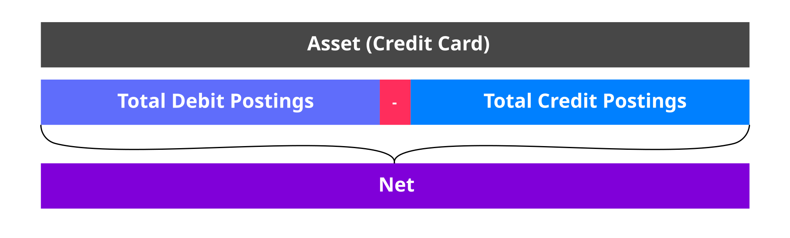
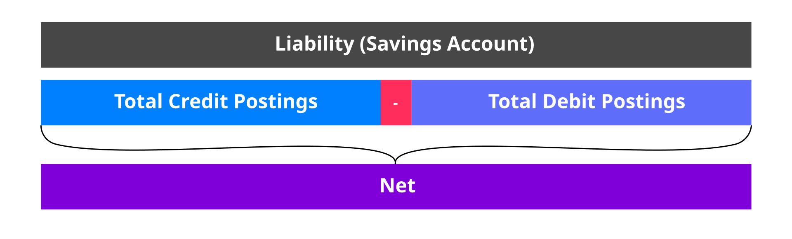

# Module 3: The Vault Core balance model

assignment\_turned\_in

Learning objective

Understand the balance model used in Vault Core.

## The Vault Core balance model

The Vault Core balance model consists of a series of dimensions which allows banks to flexibly represent any account structure.

*Click on the video to play it. A transcript is available below.*

  Video transcript

The Vault Core balance model consists of a series of dimensions which allows banks to flexibly represent any account structure.

At the highest level, you have the account, as depicted here.

Within an account, balances are defined by four key dimensions: asset, denomination, address, and phase.

The asset dimension categorizes the type of asset, such as "commercial money" or other specific assets like "reward points", hence Vault Core does not enforce the use of monetary assets only.

Under "commercial money", you have denominations which represent specific currencies such as; CAD, USD, or GBP, it is worth noting that Vault Core can handle any currency type.

Within each denomination, there is a default address, and further addresses can be added as required.

These are essentially named pots for further segmentation of balances based on specific business rules.

As an example you can use the "Default" address for the primary balance, "Accrued Interest" for tracking interest, or "Fees" for customer fees and so on.

Lastly, each address has three phases which indicate where funds are within a payment lifecycle: the options being; "pending outgoing", "committed", and "pending incoming".

The key takeaway from this is that postings are the mechanism that moves funds and these funds are recorded using all the dimensions of the Vault Core balance model.

The benefit of which is that this delivers a highly granular and flexible way to represent the financial state of accounts in Vault Core.

## Balances

Vault supports two types of balances designed for different purposes:

-   The balance resource
    
-   The ledger balance resource
    

*Click the headers below to learn more.*

Balance resource Ledger balance resource

**Balance resource**

Provides a standard view of the financial state of any Customer account in Vault Core.

Used by Smart Contracts to process payments.

**Ledger balance resource**

Provides a standard view of the financial state of any Customer and Internal account in Vault Core.

Provides a snapshot of the postings ledger.

Used for end of cycle accounting, reconciliation and financial reporting.

## Balance architecture

We can describe and summarise the business problems our balance architecture seeks to address, under two main headings:

Let’s consider each of these in turn.

Firstly, variation of product structure. Different financial products will have different requirements for how balances are calculated, and how money in each customer’s account is partitioned.

For instance, with:

-   Deposits: A typical savings product might need to segregate the accrued interest from the main deposits until it is ready to release the interest accrued to the customer.
    
-   Lending or Credit Products: A credit card product might want to segregate card purchases from ATM withdrawals and fees, and calculate interest differently on each of these types.
    

Secondly, modelling any financial product.

The Vault Core balance architecture is designed to be agnostic to any specific financial product, following the same principle as the Vault Core system.

We provide a flexible balance model that allows products to dynamically create account partitions, called ‘addresses’, according to their need.

At the same time, payment integrations can post funds to accounts without having knowledge of the product internals and its balance partitions.

Our balances model, coupled with the flexibility of the Smart Contract system, enables the definition of any financial product, conventional retail banking products and new innovative ones also.

## Caulculation of balances

A balance within the Vault Core platform is calculated from three key variables, which are:

The net calculation depends on the T-Side of the account the address sits within, that is whether it is an Asset or a Liability.

T-side

The side of the balance sheet that an Account sits on, either an asset or liability.

In an asset account, the calculation of this is:

An example of an asset account is a credit card (since money is owed to the financial institution, hence it becomes an asset on their balance sheet).

Conversely, in a **liability account**, the calculation of the net balance is reversed, therefore it is:

An example of a liability account is a savings account (since money is owed to the account holder by the financial institution, hence it becomes a liability on the banks balance sheet).

## The Vault Core balance model

Having described what a set of balances could look like on a Vault Core Account, we will now walk through the overall balances model.

*Click on the video to play it. A transcript is available below.*

  Video transcript

The Vault Core balance model consists of a series of dimensions to enable flexible representation of any account structure.

In this diagram we have the bank’s account space, within this space the accounts exist as assets or liabilities on the balance sheet.

This is defined by the T-Side of the account as mentioned earlier.

Within Vault Core, the T-Side is determined within the Smart Contract for Customer Accounts and by the API for internal accounts.

Selecting Assets on the balance sheet to review, we see that there are a large number of accounts.

These can be customer or internal accounts as they all follow the same balances model.

These customer accounts could be personal loans, credit cards, mortgages and more - all on the same platform.

In our example, we’ll select a credit card as account A.

Account A has a range of different assets sitting in the account, it contains commercial bank money and an own-bank reward points.

Note! Vault Core is not a reward points system, however the ledger could be used to store the points themselves.

Let’s take a closer look into commercial bank money (called Asset A)

Asset A contains a number of denominations as this is a multi-currency credit card account: it contains USD, SGD and GBP.

Each of these different denominations has multiple addresses to indicate the:

-   available balance
    
-   fees owed
    
-   interest charged
    
-   and current outstanding statement balance
    

Within all of these different addresses there will be 3 phases: pending incoming, committed and pending outgoing.

Within the USD denomination we can see the available balance has a committed phase of $5000, meaning the customer has $5000 available to spend.

How the bank represents the balances and addresses to the customer is entirely up to the bank.

It goes without saying that phases represent transition states for postings, for example pending out is commonly used for card authorisations.

It is also worth noting that a Smart Contract can dynamically create additional addresses that further partition the denomination space to enable representation of any account structure.

Previous module

Back to Fundamentals