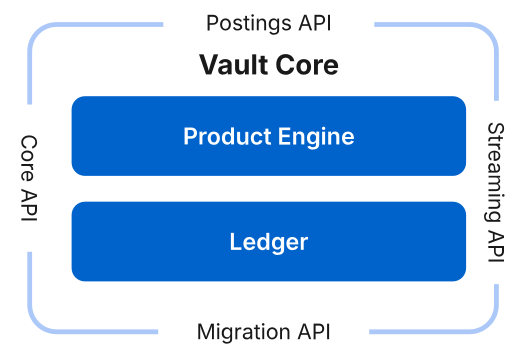
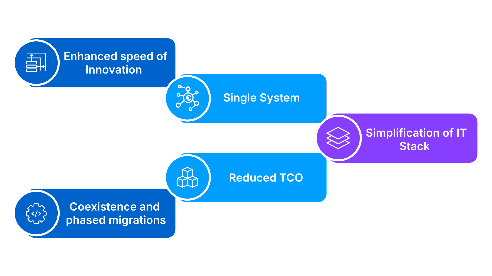

# Module 2: Key benefits

assignment\_turned\_in

Learning objective

Explore what Vault Core can offer and why some of the biggest Tier 1 and Tier 2 banks are now interested in migrating to Vault Core.

## What makes Vault Core different?

So why are so many banks interested in migrating to Vault Core?

The simple answer is that configuration is decoupled from the Core platform, therefore giving full flexibility and control to the bank.

To explain this, we need to understand two key areas of the Vault Core platform, the product engine and the ledger.

Configuration is decoupled from the Core platform, giving full flexibility and control to the bank. **Product Engine** is where you define, manage, and configure all of your banking products, from savings accounts to loans, as well as internal and customer accounts. It is also where the business logic for your financial products exists and is responsible for executing transactions and applying rules based on the product’s design. The product engine interacts with the ledger by generating the postings that represent transactions. **Ledger**: provides a single source of truth for all financial data in your system. It’s an immutable, event-sourced database that records every transaction and event that occurs. It uses a concept called postings.

A **posting** is a record of a debit or credit against an account. Every transaction in Vault Core is represented by a pair of postings: a debit and a credit.

This **double-entry bookkeeping system** ensures that the ledger is always in balance, which is crucial for financial accuracy.

In short, the ledger stores what happened, and the product engine determines what should happen based on the product’s rules. They work in tandem to process and record all financial activity.

By having a unified, real-time ledger, Vault provides a complete and accurate view of all financial positions. It’s the foundation of every financial action that a bank performs. So, by separating the configuration from the core and focusing on these two critical capabilities — a flexible product engine and a unified ledger — Vault Core provides a foundation that is both robust and agile, giving banks the control they need to innovate.

## Competitive advantage

lightbulb

A key principle of the Vault Core platform is that it decouples the banking product level from the capability and cloud levels, providing full flexibility and control.

This separation means that a bank can launch new products or modify existing ones quickly and without a lengthy software development cycle. It also allows banks to define and modify products, change rules, and introduce new features without ever touching the Vault Core Platform code.

This provides banks with the speed and agility to respond to market changes and build new products on demand at speed and at scale, bringing new products to market quicker than ever before, thereby providing a competitive advantage.

### What sets Vault Core apart?

We can address this question under three headings: Design, Cloud and Configurability.

1.  **Design**: The Vault Core platform is a single, horizontal system that breaks down the product silos common in legacy IT systems. This design reduces complexity, making development faster and easier, and creates a single source of truth for all your financial products.
    
2.  **Cloud**: The Vault Core platform is cloud-native, built from the ground up to take full advantage of the cloud’s inherent power. This means banks get a platform that’s resilient and highly performant, with the ability to scale up or down automatically based on demand. Banks get the benefits of flexibility and cost-effectiveness plus the choice of hosting their own Vault Core Platform or using Thought Machine’s SaaS solution.
    
3.  **Configurability**: The Vault Core platform is defined by its decoupled configuration layer. This is a powerful feature that allows banking teams to tailor financial products without writing a single line of code. By using self-service configuration, banks can launch new products and make changes faster than ever, giving the bank the agility to win in a competitive market.
    

In short, the Vault Core platform is simpler, faster, and more flexible than legacy core systems, which allows banks to overcome the limitations of the past and accelerate success in the future.

## Business value

When it comes to privacy:

Many of the world’s top Tier 1 banks trust Thought Machine and Vault Core to run their banking operations and to provide tangible value by delivering a significant ROI.

Here we will highlight a few of these values.

Enhanced speed of innovation

Vault Core enables rapid development and deployment of new and innovative banking products. This allows financial institutions to respond quickly to market opportunities and regulatory changes, reducing time-to-market and avoiding compliance penalties.

Single system

Vault Core supports a wide range of financial products, including deposits, lending, and Shariah banking, all within a single system.

This eliminates silos and simplifies product management.

Simplification of IT stack

The Vault Core platform significantly reduces the complexity of the IT environment by consolidating multiple legacy systems into a unified architecture. This leads to easier maintenance, streamlined operations, and lower operational risk.

Reduced TCO

By simplifying the IT stack and operations, Vault Core helps reduce both modernization and ongoing operational costs. This makes it a cost-effective solution for digital transformation.

Coexistence and phased migrations

Vault Core supports coexistence with legacy systems, enabling financial institutions to run new cloud-native stacks alongside existing infrastructure. This allows for phased migrations, reducing risk and avoiding "big bang" transitions.

*That completes this module.*

Next module