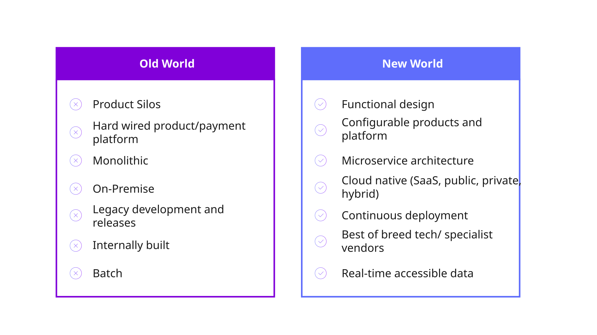
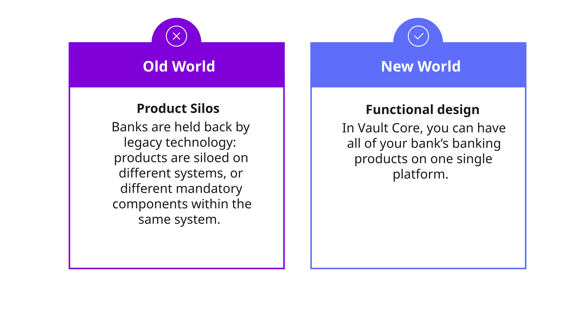
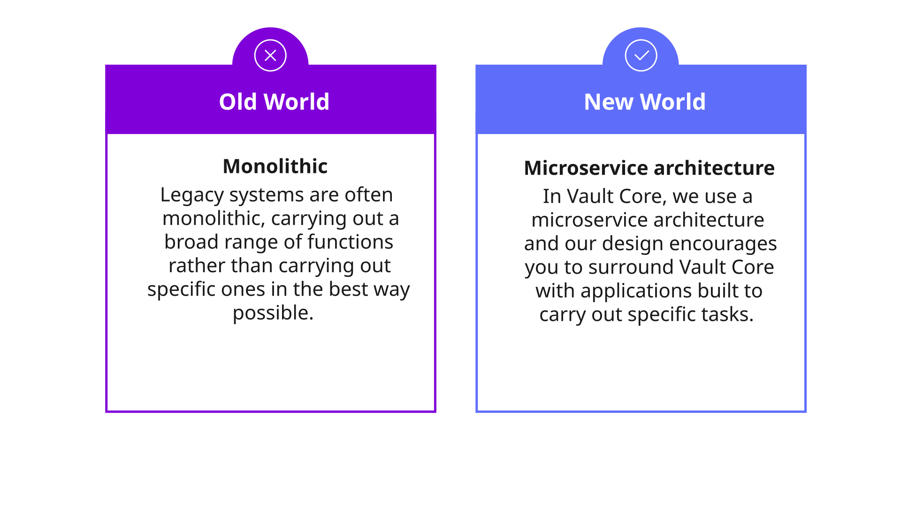
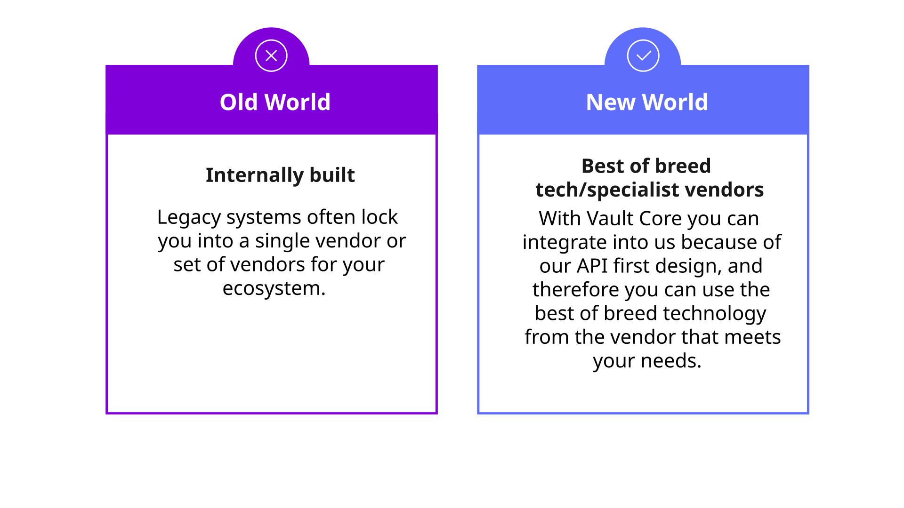
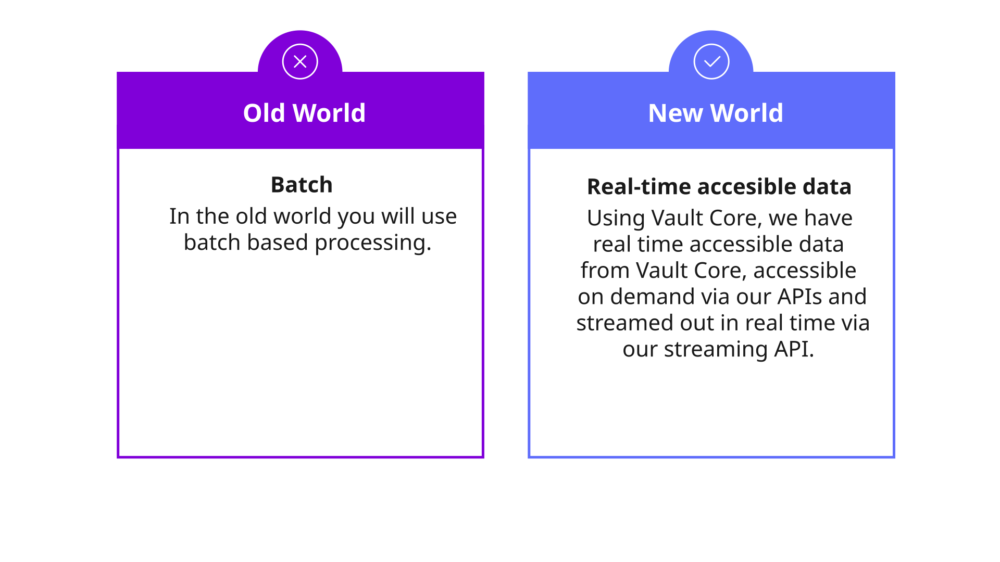
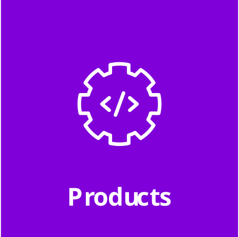
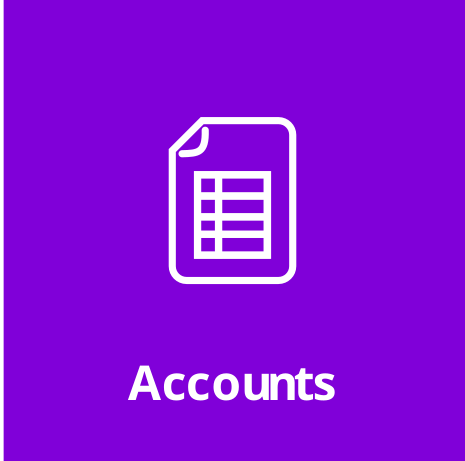

# Module 3: Architecture

assignment\_turned\_in

Learning objective

Explore the architectural model provided by Vault Core and delve into the component parts which make up the platform.

## Three layers of Vault Core’s architecture

The Vault Platform is designed with a clear, three-layered architecture that’s foundational to our products and can also be applied to a bank’s wider technology landscape.

*Click on the tabs below to learn more about each of the layers.*

Banking product layer Capability layer Cloud layer

**Banking product layer**

The banking product layer is where you can find the Smart Contract system. This is what truly sets Vault Core apart. Smart Contracts are essentially the product logic defined in Python code that define how a product behaves, for example, how interest is calculated on a loan, or what fees apply to an account.

The benefit of this system is its flexibility. Banks can choose from three options:

-   Build these Smart Contracts themselves,
    
-   Use one of the pre-built contracts from the product library, or
    
-   Commission Thought Machine or a business partner to build a custom contract for them. This gives banks complete control and freedom to innovate.
    

**Capability layer**

Vault Core’s capabilities are designed for real-time operations. Thanks to the underlying cloud platform, the system can operate 24/7.

This is a crucial point as it means banks can process transactions and provide services even while a system upgrade is taking place, with zero downtime.

Another key feature is that Vault Core is a single platform for every bank and every country.

Vault Core does not have country-specific customisations in its core source code, which ensures consistency and simplifies maintenance.

**Cloud layer**

Vault Core is a true cloud-native system, built with microservices and APIs for the highest levels of performance and resilience.

Vault Core is also completely cloud-agnostic, meaning the software runs identically on major cloud platforms like GCP, AWS, Azure, and even Openshift.

The fact that the functionality is exactly the same on each platform is a strong proof point that Vault Core has achieved complete independence between the cloud and the functional layers.

## The change that Thought Machine brings

Ultimately we can highlight the change that Thought Machine’s Vault Core Product brings by looking at it as the new vs old world.

*Click on the headers below to learn more.*

Old vs new world

Functional design

Configurable products

Microservice attitude

Cloud native

Continuous development

Best of breed tech

Real-time accessible data

## Vault Core key resources

There are four main entities that Vault Core is responsible for within a bank.

Here we will briefly describe them. All of these are fully described within other courses on the Fundamentals Learning pathway.

<table class="tableblock frame-none grid-none stripes-none stretch"><colgroup><col style="width: 20%;"> <col style="width: 80%;"></colgroup><tbody><tr><td class="tableblock halign-left valign-top">

</td><td class="tableblock halign-left valign-top">
Vault Core is responsible for the manufacturing and operation of banking <strong>products</strong>, and these are expressed as Smart Contracts.

These define the behavior of financial products (i.e. loans, savings, current accounts, credit cards and so on).
</td></tr><tr><td class="tableblock halign-left valign-top">

</td><td class="tableblock halign-left valign-top">
<strong>Accounts</strong> represent customer holdings, the primary entities for recording financial activity.

Each account is associated with a product (defined by a Smart Contract); maintains its own balances, and can be controlled by flags, parameters and restrictions.
</td></tr><tr><td class="tableblock halign-left valign-top">

</td><td class="tableblock halign-left valign-top">
<strong>Postings</strong> represent the financial movements between accounts, using a double-entry bookkeeping model.

Each posting includes a debit and a credit, ensuring financial integrity.

They are immutable and timestamped, and form the basis of Vault Core’s ledger.
</td></tr><tr><td class="tableblock halign-left valign-top">

</td><td class="tableblock halign-left valign-top">
The <strong>customer</strong> entity in Vault Core is used to indicate that a customer has a holding in an account, and this can be linked to the actual customer entity outside of Vault Core using a unique ID.
</td></tr></tbody></table>

It should be noted that these are not the only resources in Vault Core.

*That completes this module.*

Previous module

Back to Fundamentals