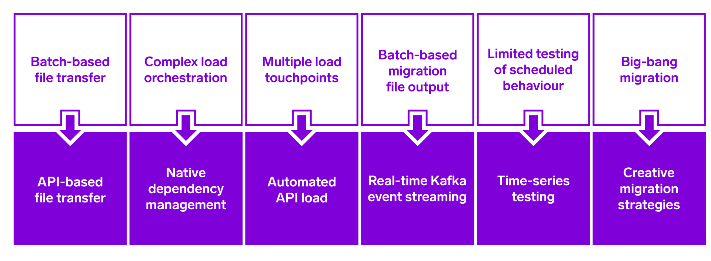
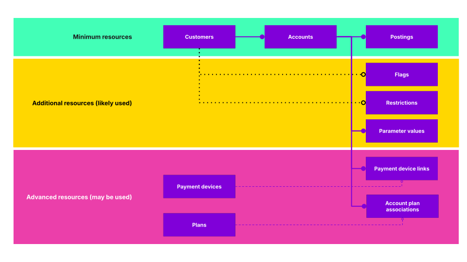

# Module 1: Understanding the challenge

assignment\_turned\_in

Learning objective

Look at examples of old infrastructure, and the resources needed for migration.

Core banking migrations are complex.

*Take a minute to think about potential concerns about migrations you might have considered in general terms, and make a note of 3 of them. Click on the header below when you’re ready to check your answers!*

Collapsible title

Each migration brings its own unique challenges, but the concerns we hear from banks are often very similar and fall into four categories: **cost and time, regulatory and reputational protection, customer and colleague impact** as well as **configuration, capability, cloud level**.

Some of these concerns include:

**Cost and time**

-   More costly and longer than initial estimates.
    
-   Often requiring external expertise.
    
-   Hard deadlines are common.
    

**Regulatory and reputational protection**

-   Requires demonstrable, controlled, and visible migration.
    
-   Regulatory constraints impact strategy.
    
-   High risk of reputational damage if migration fails.
    

**Customer and colleague impact**

-   Migration design causes customer trade-offs (comms, T&Cs changes, downtime, reissues) and business process changes.
    

**Configuration, capability, cloud level**

-   No single, clear definition of banking products or separation of data types.
    
-   Systems have evolved beyond original intent, creating suboptimal, hard-to-manage, and change-resistant architectures.
    
-   Legacy products hold very old product types that are no longer offered and difficult to replicate on new systems.
    
-   Outdated data models don’t align with modern banking practices and are hard to directly migrate.
    
-   Incomplete previous attempts to leverage cloud infrastructure give a false perception that it lacks benefit.
    

## Replatforming at scale

At Thought Machine, the challenges we have considered are mitigated by our migration experience and approaches we recommend.

<table class="tableblock frame-all grid-all stretch"><colgroup><col style="width: 50%;"> <col style="width: 50%;"></colgroup><tbody><tr><td class="tableblock halign-left valign-top">
<strong>Cost and time</strong>
</td><td class="tableblock halign-left valign-top">
The bank has control of the pace of replatforming, keeping costs manageable, results in bank customers moving to a new platform in 12 to 24 months.
</td></tr><tr><td class="tableblock halign-left valign-top">
<strong>Regulatory and reputational protection</strong>
</td><td class="tableblock halign-left valign-top">
We have zero failed deployments. The bank and Thought Machine work together, fixing issues as they are encountered, providing the bank with valuable experience on best practices.
</td></tr><tr><td class="tableblock halign-left valign-top">
<strong>Customer and colleague impact</strong>
</td><td class="tableblock halign-left valign-top">
Disruption is minimised through iterative, phased implementation - split across both product and account tranches driven by APIs with migrated data streamed in real-time. The bank can replatform gradually, at any pace, starting with any product line it wishes. The migration can be invisible to customers, including complex parallel run migrations.
</td></tr><tr><td class="tableblock halign-left valign-top">
<strong>Configuration, capability and cloud level</strong>
</td><td class="tableblock halign-left valign-top">
Our best-in-class architecture allows for a phased approach. Coexistence architecture means account-system links can easily be updated and used for routing. Exact recreation of products is possible ensuring no unintended product divergences created during migration - these can be tested through time series testing.
</td></tr></tbody></table>

## How Vault Core improves migration

Vault Core improves migration by replacing these pain points:

Batch-based migrations demand a large overhead. Vault Core replaces this with an **API-based migration**, to significantly simplify both data transfer and maintenance, with real time synchronisation.

Traditional migrations require managing multiple touchpoints, with batch based migration file outputs, which require manual work and make it challenging to know when and if individual records were loaded.

The need for both is eliminated with Vault Core, as **automated API load** is introduced, with **data streaming providing immediate data** for faster reconciliations and to support other business processes.

On legacy platforms, scheduled behaviour is much harder to test - the test frameworks used are complex and the process itself is time-consuming.

With Vault Core, **time-series testing** lets the organisation fast-forward account activities and quickly test if the product works.

Old ways of migrating data also involve big-bang migrations, which are done all at once, so it’s harder to make it less risky, and the consequences of anything going wrong can be expensive and difficult to clean up.

lightbulb

Vault Core leaves space for **a variety of migration designs** enabled by event-based architecture - this means more thorough testing, space for gradual migrations, and approaches that wouldn’t be possible without the flexibility Vault Core provides.

## Migration tooling

Our Postings and Migration APIs automate the migration process by utilising data streaming whilst providing visibility into the load process, as well as the ability to send the data to Vault Core in any order.

Our tooling makes it simpler to load historical data, and eliminates the complications from redundant behaviour without any requirement for configuration changes.

<table class="tableblock frame-all grid-all stretch"><colgroup><col style="width: 50%;"> <col style="width: 50%;"></colgroup><tbody><tr><td class="tableblock halign-left valign-top">
<strong>Streamlined data migration</strong>
</td><td class="tableblock halign-left valign-top">
Two dedicated migration APIs are available for automated data loading, from submission to event streaming.
</td></tr><tr><td class="tableblock halign-left valign-top">
<strong>Real-time Progress Monitoring</strong>
</td><td class="tableblock halign-left valign-top">
Immediate insights into load progress through streamed events, eliminating the need to wait for completion. Dashboards are available to monitor the process through observability tools (such as Grafana).
</td></tr><tr><td class="tableblock halign-left valign-top">
<strong>Easier Modernisation</strong>
</td><td class="tableblock halign-left valign-top">
Historic data supported via bespoke field-level behaviour, and redundant behaviour is suppressed without configuration changes.
</td></tr><tr><td class="tableblock halign-left valign-top">
<strong>Flexible Load Orchestration and Accelerated Performance</strong>
</td><td class="tableblock halign-left valign-top">
You can send data to Vault Core in any order through configurable dependencies - Vault Core handles the loading process. Up to 5x faster compared to standard REST APIs.
</td></tr></tbody></table>

## Migratable resources

Vault Core supports multiple data types for data migration, which we can divide into three main groups: minimum resources, additional resources, and advanced resources.

They will be migrated through Data Loader API and the Posting API (BAU or Posting Migration API).

As a minimum, **Customer, Account and Postings are required in a migration**. The bank is likely to use additional resources as needed, which include **Flags, Restrictions, and Parameter Values**.

The most common flow of Account Resource relationships is showcased with the solid line on the diagram. Any alternative resource relationships for the Customer resource are shown with a dotted line on the diagram.

Advanced resources are also available. These are **Payment Device Links** and **Account Plan Associations**, as well as **Payment Devices and Plans**, with corresponding resource relationships marked with a dashed line.

Let’s take a look at the migration resources next.

### Minimum resources (Required):

1.  **Customers**: External customer core identifier, as Vault Core is not intended to operate as the customer master (CRM) or to hold Personally Identifiable Information (PII).
    
2.  **Accounts**: Links to a Smart Contract and represents an instance of a Product for a customer.
    
3.  **Postings**: Financial movements (debits and credits) that determine the financial position (balance) of the account.
    

### Additional resources (Likely used):

1.  **Flags**: Boolean (true/false) flag that does not inherently drive behaviour but can be used by Smart Contracts to trigger treatment (events).
    
2.  **Restrictions**: Prevents an action or behaviour within Vault Core (for example, prevent Postings).
    
3.  **Parameter values**: An instance of a Parameter that has a start and end in a timeseries (for example, interest rate = "4") .
    

### Advanced resources (May be used):

1.  **Payment device links**: A dedicated resource to link a Payment Device to an Account.
    
2.  **Account plan associations**: A dedicated resource to link Accounts and Plans (for example, savings current account 123 and mortgage 456 belong to plan XYZ).
    
3.  **Payment devices**: Represents instruments than can receive and initiate Postings (for example, Debit Card or Cheque) to abstract away from Account Resource and associated IDs.
    
4.  **Plans**: Equivalent of the Account Resource but for Supervisor Contracts to orchestrate linked or cross product behaviour on Vault Core (for example, an offset mortgage).
    

## Vault Core migration tools

To prepare for your migration, the following resources are available:

-   Proven migration strategies beyond traditional big bang approaches.
    
-   Expert migration SMEs providing best practice advice to clients.
    
-   Comprehensive suite of migration delivery processes and documentation.
    
-   Pre-integrated partner SMEs and tooling to enhance Vault Core’s load capabilities.
    

*That completes this module.*

Next module