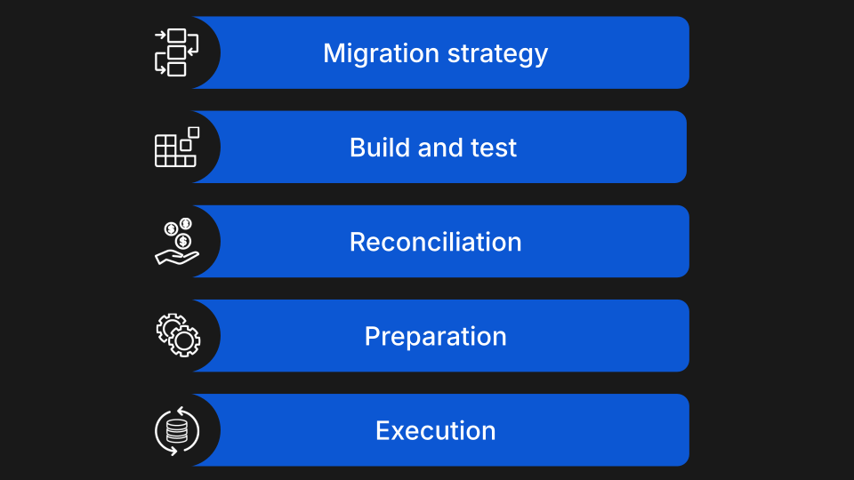
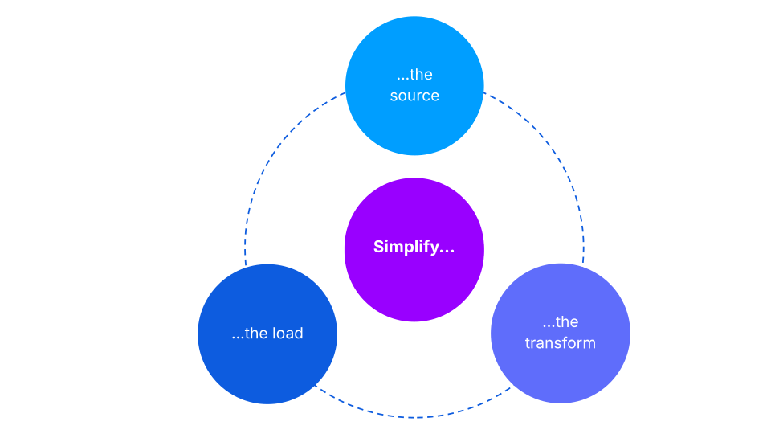

# Module 3: De-risk, simplify, accelerate

assignment\_turned\_in

Learning objective

Explore strategies to de-risk, simplify, and accelerate a migration.

## De-risking migrations

There are plenty of opportunities to do de-risk your migration - we will consider these five main categories:

-   **Migration strategy**:
    
    -   Launch new-to-bank features before the initial migration.
        
    -   Pre-load static data (such as customer) before the main event.
        
    -   Harmonise source and target functionality, products, and data structures outside of migration.
        
    -   Avoid migrating data in a transitory state (in-flight ISA transfers).
        
    -   Consider if and where data is needed (core vs. data warehouse).
        
    
-   **Build and test**:
    
    -   Automate the load routine and failure handling.
        
    -   Test with sanitised production data.
        
    -   Execute simulation testing to prove forward behaviour.
        
    -   Test higher volumes to stress the process and understand weak points.
        
    
-   **Reconciliation**:
    
    -   Conduct discrete reconciliations (considering completeness & accuracy) at each data state/location change.
        
    -   Establish clear test framework, reconciliation scenarios, and exit criteria.
        
    
-   **Preparation**:
    
    -   Conduct at least two production-like dress rehearsals.
        
    -   Implement robust event command and control (consider comms, logistics, incident management, backout, schedule).
        
    -   Coordinate with bank change freeze processes.
        
    -   Minimise BAU traffic during migration events.
        
    
-   **Execution**:
    
    -   Conduct pilot migrations for various scenarios before customer migration.
        
    -   Scale production customer volumes gradually, with selection criteria for early tranches.
        
    -   Establish clear checkpoints/controls in the load schedule; be ready to stop and reassess if migration fails entry criteria for the next stage.
        
    

## Simplifying migration

You can look for opportunities to simplify the migration every step of the way.

You can simplify:

**…​the source**: Prepare extracted data (e.g., isolate active and valuable accounts).

**…​the transform**: Migrate only the latest data (e.g., consolidated balances or latest parameters).

**…​the load/target**: Consider customer impact and minimise in-flight handling.

You can find more information and examples of this migration strategy in our Professional Migrations courses.

## Accelerating migration

*Click on the video below to play it. The transcript is available below.*

  Video transcript

In some cases, migration might take longer than originally planned - in this case, you can accelerate it by trading off delivery speed for delivery risk or customer impact.

Some of the most common (and lower on the risk scale) ways to accelerate are:

-   Minimising the scope by only moving valuable products and accounts as opposed to moving everything.
    
-   Not migrating the posting history, and instead migrating only what Vault Core needs and relying on coexistence to deal with the other requirements.
    
-   Avoiding complex scenarios during early migrations by migrating clean accounts only, deal with anything more difficult later.
    

Next up, we have riskier ways to accelerate, which are used only occasionally.

These include:

-   Manually adjusting migrated accounts without creating complex specific solutions.
    
-   Minimal fix forward capability; the accounts are closed and retried.
    
-   Maximising downtime for the entire event beyond maintenance window.
    
-   Manually migrating pilot volume into production to provide early testing.
    

On the opposite side of the risk scale, we have rarely used opportunities to accelerate.

These could include simplifying reconciliation requirements to focus on key data, minimising scope and accept risk in small differences, or reducing the service temporarily.

Balancing all of these factors is a key consideration for every migration.

*That completes this course.*

Previous module

Back to Fundamentals