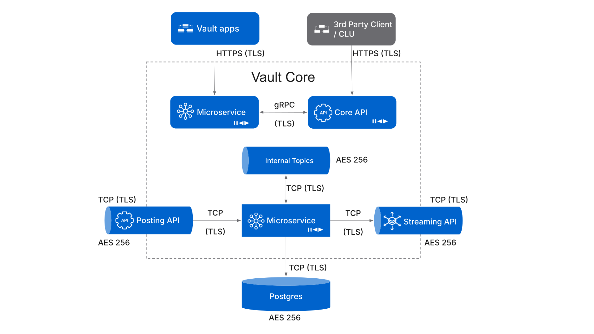
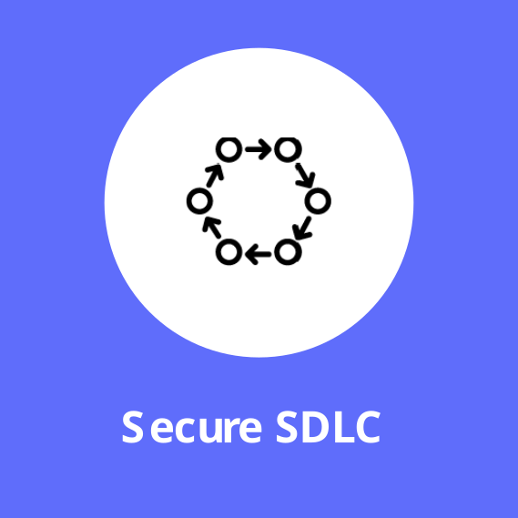
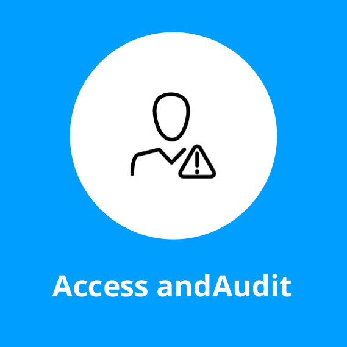
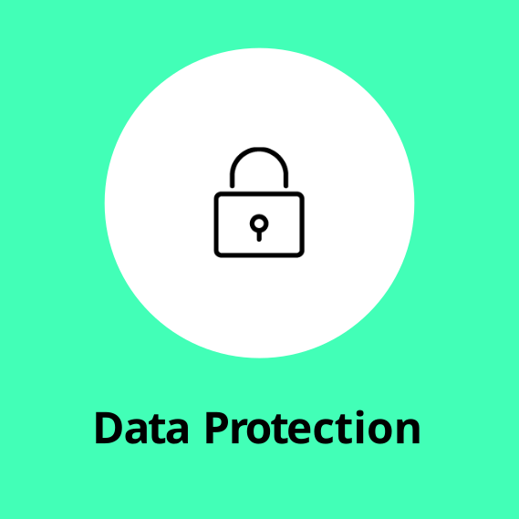

# Module 2: Security approach

assignment\_turned\_in

Learning objective

Explore our approach to encryption at rest and in transit, as well as tooling uses for secrets management.

## Encryption

Data protection relates to the ability to keep sensitive data confidential.

The primary control (outside of IAM) is through encryption.

Vault Core is designed with data protection in mind, hence data is encrypted throughout the product, covering both data in transit and data at rest.

Take a minute to study this diagram where we can see a graphic representation of communication between different components within Vault Core, and their encryption approach.

When it comes to data in transit, all connections are encrypted. This includes:

-   API requests
    
-   Web UI requests
    
-   Kafka requests
    
-   Postgres requests
    
-   Microservice communication
    

The same applies to data at rest. All data is encrypted:

-   SaaS data is encrypted at rest using AES-256 with cloud managed keys.
    
-   Bank hosted implementations may use CSP customer managed keys (CMK).
    

## Secrets Manager

Vault Core requires the use of a secrets manager to securely store and manage sensitive information such as keys and tokens.

**Vault Core supports a number of secrets manager platforms**, such as:

<table class="tableblock frame-none grid-none stripes-none stretch"><colgroup><col style="width: 33.3333%;"> <col style="width: 33.3333%;"> <col style="width: 33.3334%;"></colgroup><tbody><tr><td class="tableblock halign-left valign-top">

</td><td class="tableblock halign-left valign-top">

</td><td class="tableblock halign-left valign-top">

</td></tr><tr><td class="tableblock halign-left valign-top">

<strong>HashiCorp Vault:</strong> supported in all active Vault Core versions; available in bank-hosted and SaaS-hosted deployments

</td><td class="tableblock halign-left valign-top">

<strong>AWS Secrets Manager:</strong> supported from Vault Core version 4.6 onwards; available in bank-hosted deployments

</td><td class="tableblock halign-left valign-top">

<strong>Microsoft Azure:</strong> supported from Vault Core version 5.2 onwards; available in bank-hosted deployments

</td></tr></tbody></table>

Only one secrets manager can be configured per Vault Core instance.

Microservices within Vault Core are scoped down to only access the secrets which they require, in line with the principle of least privilege.

## Foundational security concepts

Vault Core adheres to **3 foundational security concepts**.

<table class="tableblock frame-none grid-none stripes-none stretch"><colgroup><col style="width: 33.3333%;"> <col style="width: 33.3333%;"> <col style="width: 33.3334%;"></colgroup><tbody><tr><td class="tableblock halign-left valign-top">

</td><td class="tableblock halign-left valign-top">

</td><td class="tableblock halign-left valign-top">

</td></tr><tr><td class="tableblock halign-left valign-top">
Thought Machine integrates security throughout the software development life cycle. Vault Core undergoes automated code scanning, component based threat modelling and independent penetration testing.
</td><td class="tableblock halign-left valign-top">
Clients manage and audit all access to their own Vault Core instance, for example access to Vault Core APIs and the Vault apps.
</td><td class="tableblock halign-left valign-top">
Vault Core is designed to ensure consistent encryption in transit and at rest across the product.
</td></tr></tbody></table>

*That completes this module.*

Next module

Previous module