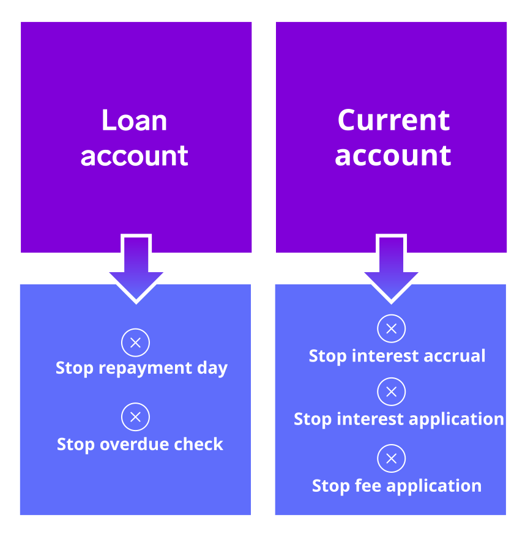
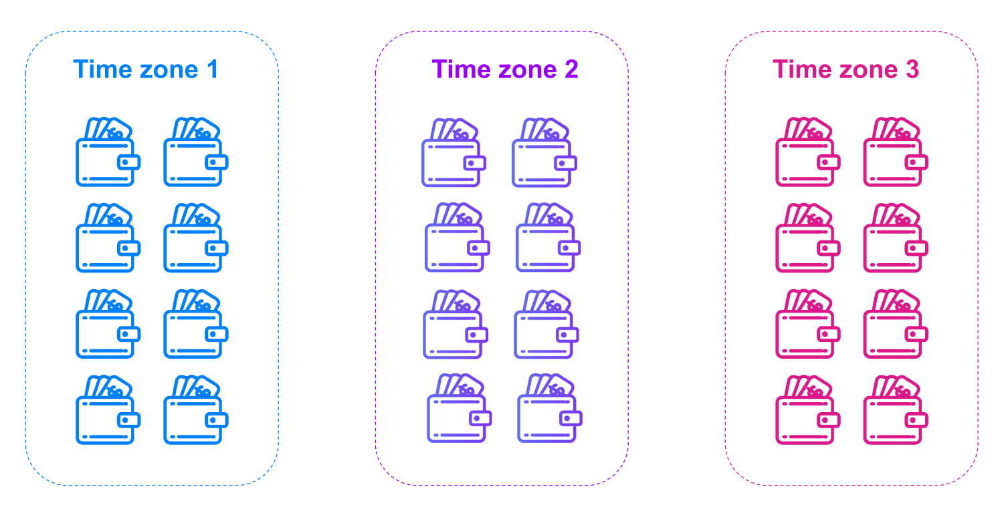

# Module 2: Account operations in Vault Core

assignment\_turned\_in

Learning objective

Summarise the operations you can perform on Customer Accounts.

## Customer Account lifecycle

*Click the video below to learn more. A video transcript is available below.*

  Video transcript

The first port of call in determining the operations that can be performed on a Customer Account is its status, which governs a point along the Account’s lifecycle.

All Customer Accounts follow the same overall lifecycle, and Vault Core performs various built in checks to ensure that Customer Accounts can smoothly transition between states along their journey:

First, you create a Customer Account.

You can do this before you are ready to open the Account; for example to create the record without yet applying any business logic.

Then you open the Account.

At this stage the Account is associated with a live product.

Opening an Account triggers various actions according to your Smart Contract logic, such as depositing an initial balance into the Account, setting up schedules, or sending a message to downstream systems.

An open Customer Account is a normal 'running' Account, subject to all business as usual logic and processes.

Next, you may want to introduce new functionality to the product powering this Customer Account, and likely many other associated Accounts.

That’s where a conversion comes in, where you instruct Vault Core to switch one or more Customer Accounts over to a new Smart Contract version.

This also triggers various processes, such as reallocating funds, instructing subsequent financial movements, or adding parameters, while also preserving features (such as maturity date) from the previous product’s behaviour.

Finally, you would eventually close the Customer Account.

Here Vault Core performs essential checks to make sure that the Account can be closed.

A crucial check ensures that the balance of the Account can be zeroed before closing, for example.

Conversely, Internal Accounts do not have a lifecycle - they are always open and cannot be closed.

Let’s take a look at other operations you can perform on Customer Accounts.

## Flags

First we will cover Flags.

Flags are binary markers that can be applied to Customer Accounts or customers themselves, and they can be used to further adapt behaviour.

For example, a 'Repayment holiday' Flag can be applied to a loan account, and when it is active the Smart Contract can halt the repayment day and overdue payment check until the Flag is made inactive again.

Flags are created and managed via Thought Machine’s Core API, and Smart Contracts can use these to change applied logic as required.

Next, let’s take a look at restrictions, parameter values, and account attributes.

## Restrictions, parameter values, account attributes

*Click the video below to learn more. A video transcript is available below.*

  Video transcript

**Restrictions** provide a rich framework for enforcing custom business logic. They can be used to limit, prevent, or trigger a review of various activities on an account, by a customer, or with a particular payment instrument.

For example, a customer can be prevented from opening any new accounts, or an account could be set to only permit credits, or set a maximum value for one-off transactions before a check is triggered.

Restrictions can be used to handle judicial court orders, AML regulations, payment scheme compliance, security alerts or any other scenarios requiring limitations.

As with Flags, Restrictions are created and managed via Thought Machine’s Core API.

**Parameters** can play a role in managing operations at an Account level, by using Account-owned parameter values.

Account-owned parameter values override values at all levels above the Account, and so they are an effective way to tailor behaviour at a specific Account-level, for example using a specific credit line for an account.

These values can be created when an Account is opened, or updated at any point later on via Thought Machine’s Core API.

**Account Attributes** are a way to compute Account-specific information at particular points in time.

For example, you could calculate an Account’s current balance and its closing balance from yesterday.

You define the Account Attributes themselves inside your Smart Contract, and we have a dedicated attribute hook for this purpose.

Then you call the Core API to calculate and return any values you require for a specific Account.

## Processing groups

While they are not Account-specific operations, it is worth introducing Thought Machine’s Processing groups.

These are a way to carry out financial processes on isolated groups of Accounts.

A typical example of their use is End of Day processing across several time zones, where a single instance of Vault Core allows you to run End of Day independently in each time zone:

It is worth noting that multiple processing groups are an Extension to Vault Core, hence this feature may not be enabled in every installation.

*That concludes this course.*

* * *

Previous module

Start again