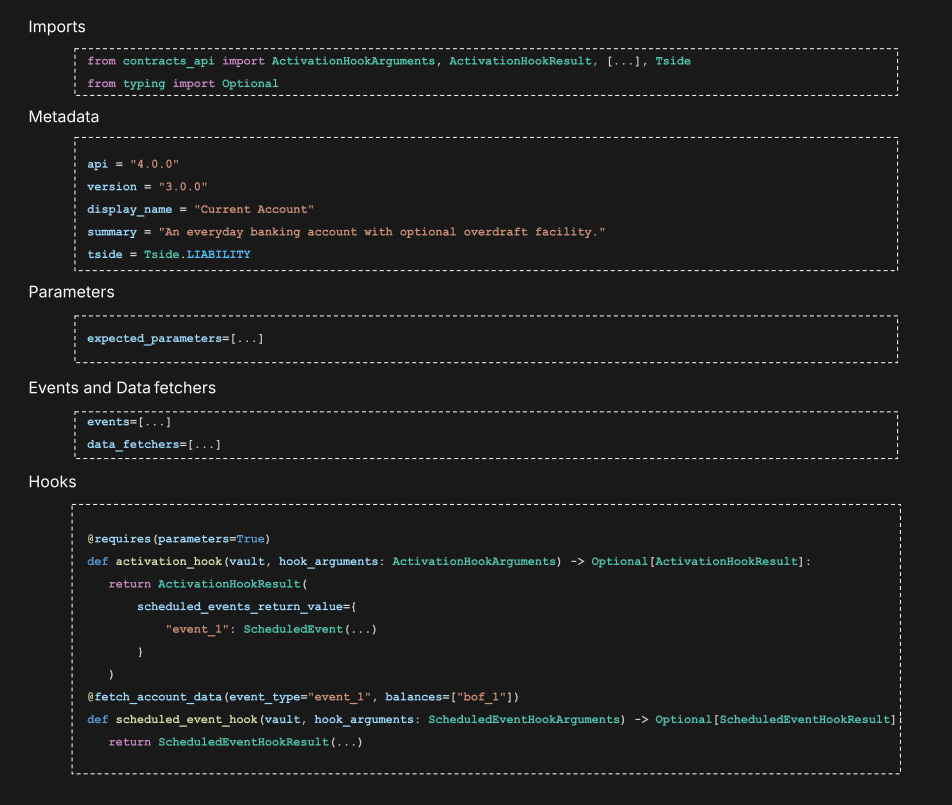
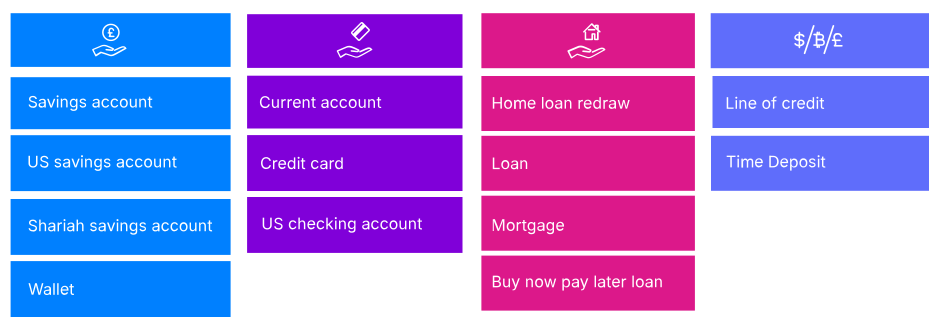

# Module 2: Building products with Smart Contracts

assignment\_turned\_in

Learning objective

Outline some key considerations when pivoting to Thought Machine’s banking product layer for building all banking products and variants.

## A simple Smart Contract

*Click on the video below to learn more. The transcript is available below.*

  Video transcript

At the simplest level, a single Smart Contract encapsulates a financial product’s logic - the terms and conditions behind a mortgage, for example.

Then, any customer account banks create and open can be associated with that Smart Contract, which makes it a mortgage account. So there is a one to many relationship between a Smart Contract and the accounts that it powers.

Next we will show a powerful way to add more customisation to accounts powered by a product.

It’s helpful to think of a Smart Contract as a product template, from which multiple product variants can be created using different parameters.

Parameters are powerful for configuring product behaviour, because their values are stored in Vault Core, outside of Smart Contracts.

To add variation to the behaviour of this mortgage product for example, banks can introduce a Parameter for the mortgage term, and use values to vary the term by customer account. Note that the variation does not require changes to the Smart Contract code, or any other aspect of Vault Core (such as the customer account entities themselves). As long as the Smart Contract is aware of this parameter, it does not itself hold any of the values.

To add even more control, Parameters can apply hierarchically. In this example, we set another Parameter to control interest rates:

-   Starting with a base rate across a bank in one country (which can influence multiple products)
    
-   Varying this rate per territory (such as US state)
    
-   Varying the rate again by product line (such as a line of business)
    
-   Finally overriding it at the individual account level, if required
    

This is one way to introduce significant product variance, and as before, without making any changes to the Smart Contract code.

Banks can continue to create and open new accounts powered by this Smart Contract, using any interest rate value you desire, at any level. Banks can also use Thought Machine’s APIs to create new parameter values at any level, or query any currently active parameter value at any time, to calculate the 'resolved' value having an effect on any particular Customer Account.

Now let’s zoom in to some parts of a Smart Contract code.

## Main aspects of a Smart Contract

Every Smart Contract is a file written in a subset of Python, made up of certain key elements which we will summarise here.

1.  **Imports** enable you to share commonly used code. They include Python native objects, Smart Contracts API objects, and Contracts Modules, which can be used to share partial financial logic across configurations in Vault Core, which speeds up development and reduces the effort required for Smart Contract creation.
    
2.  **Metadata** holds information about the version of the Smart Contracts API the file uses, and the semantic version of the Smart Contract itself among other key aspects, such as which side of the balance sheet the product sits on.
    
3.  **Parameters** are used to reference the parameters and values created in Vault Core.
    
4.  **Events** contain all of the schedules banks intend to use in your product - the time-based events.**Data fetchers** specify the Vault Core data required for hooks, such as account balances. They can specify either time ranges or single points in time for the requested data.
    
5.  **Hooks** define the business logic to be run at various points within a connected account lifecycle.
    

These are the basic building blocks of any Smart Contract.

### Thought Machine’s Product Library

For the more advanced aspects of Smart Contracts, you may find it useful to browse Thought Machine’s Product Library, which is a suite of highly-configurable, feature-rich Smart Contracts that you can adopt, reuse and change as you see fit.

These include market-standard products such as transaction accounts, savings, loans, mortgages, and credit cards, but may contain more than is necessary for simpler products.

assignment\_turned\_in

Due to the comprehensive nature of the content within these templates, it may be more time efficient to build the product template yourself from scratch, rather than modifying existing templates.

The Product Library also contains a full set of tests, including unit tests, simulation tests, and end-to-end tests.

You can download the latest Product Library release package from the Vault Portal, our central documentation site.

### Testing Smart Contracts

To gain confidence that products will work as expected, there are three mechanisms for testing Smart Contracts in Vault Core:

Firstly, there are **Unit Tests**:

These execute individual hooks against mocked dependencies to verify code correctness.

Thought Machine provides a Contracts SDK library for unit testing.

Secondly, there are **Simulation Tests**:

These simulate the entirety of Vault Core and its interaction with the Smart Contract to verify business correctness.

Thought Machine provides a dedicated Contract API, which allows banks to simulate new Smart Contracts using an in-memory approximation of Vault Core.

Banks can also simulate changes to current, live Smart Contracts and current, live customer accounts this way.

Thirdly, there are **System Tests**:

These run the Smart Contracts in a real instance of Vault core to verify integration correctness.

*That completes this course.*

Previous module

Back to Fundamentals