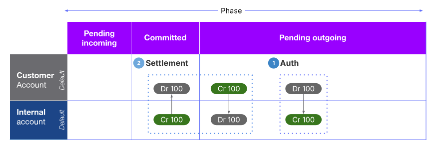
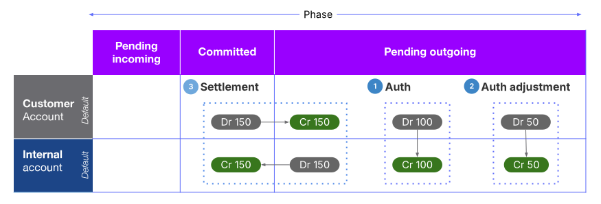

# Module 1: The Vault Core Accounting Model

assignment\_turned\_in

Learning objective

Discover how the Vault Core Accounting Model records and tracks financial transactions and balances associated with a specific product instance.

## Ledger

No banking system would be complete without a robust ledger to support it, so let’s consider what the Vault Core ledger has to offer next.

*Click on the video to play it. A transcript is available below.*

  Video transcript

No banking system would be complete without a robust ledger to support it, so here we will consider what the Vault Core ledger has to offer.

The Vault Core Ledger has been built to support **any bank, large or small**, and any product on a single ledger. There are 3 key characteristics which describe the Vault Core Ledger.

Firstly, the Vault Core ledger is a **Rich Ledger**, meaning it can easily be configured to satisfy the requirements of any product type.

Secondly, the Vault Core ledger is **universal**, meaning it can be used to build complex products of any kind at speed and at scale.

Thirdly the Vault Core ledger is a **real-time ledger**, which records an ordered list of movements of funds for every bank account, 24/7, with zero downtime, providing banks with the visibility that traditional legacy systems cannot.

For example, banks can **use the Posting and balance events to achieve ‘near real-time’ general ledger updates** and **carry out reconciliation operations** at any point during the day.

This ensures an accurate real-time view over the maintained accounting positions is provided at all times.

The relative ease with which Smart Contracts can be reconfigured provides the flexibility needed to meet changing accounting, regulatory or business requirements.

Both **balances and postings can be used for reconciliation**, providing the bank with an additional check on a derived stream (balances) and the ability to identify any posting discrepancies during reconciliation.

An account balance can be derived at any point in time, or the account balances can be ordered into a balance timeseries (to provide a history of fund movements).

Ultimately, using the Vault Core ledger a bank can manage sophisticated lines of funds in any asset and denomination.

This means you can manage anything from international currencies and securities to reward points.

A bank will be able to operate multiple currencies, entities, operation teams, branches, and different lines of business and reporting from a single core.

Support real-time internal and regulatory reporting within the bank, improving business intelligence journeys, by using AI to personalise propositions offered to customers.

And finally it provides a flexible approach to back-book migration.

For example, migrating one customer at a time, one account at a time, bulk migration and the ingesting of historical ledger data or another option that meets the banks requirements.

chat\_bubble

Balance time series

A **balance time series** in Vault Core is a chronological record of an account’s balances over time. It allows you to see how the balance of an account has changed at different points in the past (and in the future, if future-dated postings exist).

## Double entry bookkeeping

Vault Core uses the double entry bookkeeping system.

This means that each debit entry must be balanced by one or more entries of an equal credit amount, and vice-versa, in either a customer account or an internal account.

In this example we will show a possible life cycle of a card transaction in the Vault platform, where you have an **Auth**, **Auth Adjustment** and finally a **Settlement** Posting Instruction type.

* * *

So let’s walk through the below example.

**Auth**

A customer walks into a hotel and puts down a $100 deposit at the hotel front desk in order to reserve a room.

Within Vault Core, this is reflected using an Authorization Posting Instruction of $100, moving funds from the Pending Outgoing phase of the customer’s balance and crediting the same phase of an Internal Account’s balance.

**Auth adjustment**

The customer extends their stay at the hotel, and is required to deposit an additional $50 to secure this extension. This is reflected in Vault Core as an Authorisation Adjustment of $50 in the same phase as the previous posting, that is the Pending outgoing.

**Settlement**

The customer has spent $150 in total on their hotel stay and the customer uses their card to settle the bill. This is reflected in Vault Core using a Settlement Posting Instruction, which will zero out the Pending Outgoing phase to reflect the change to the committed phase in the customer’s balance.

*That completes this module.*

Next module