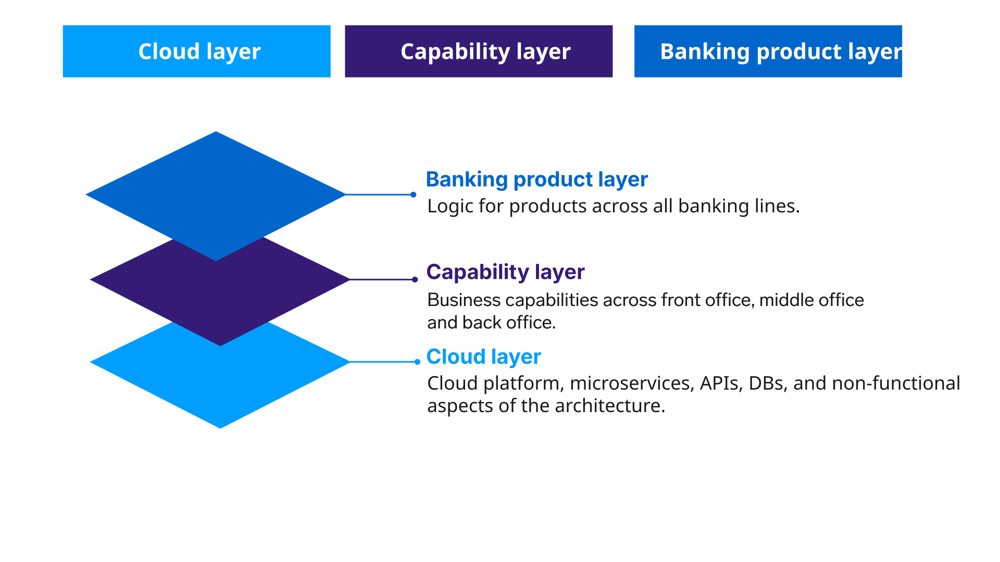
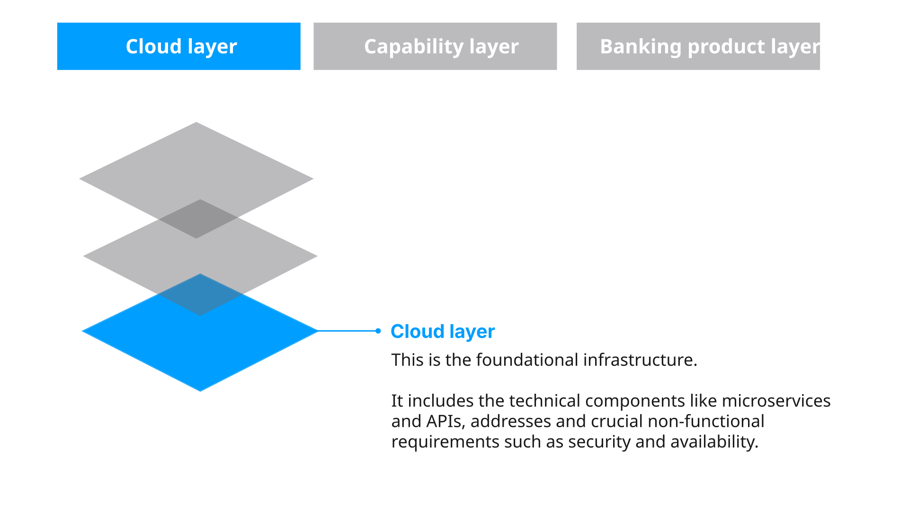
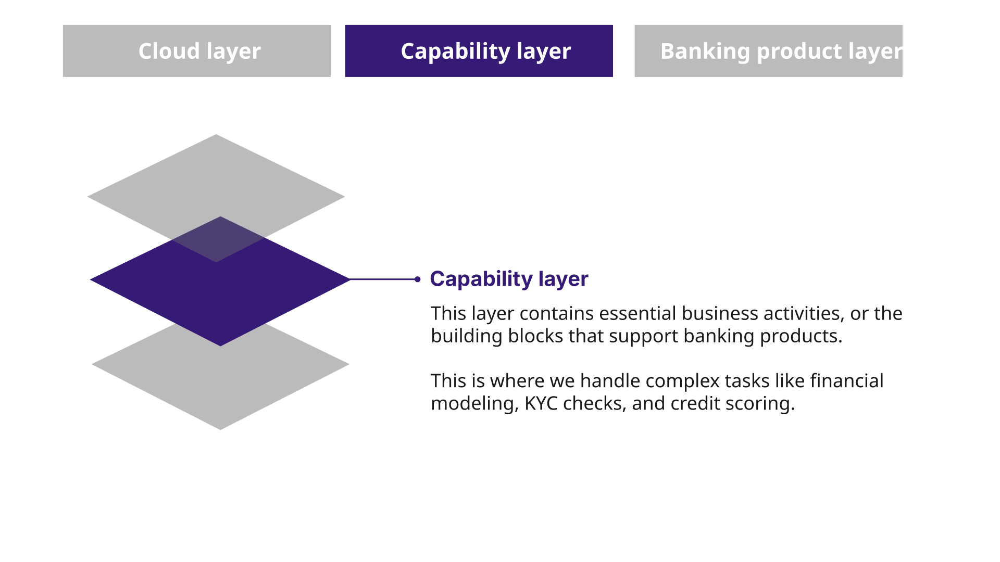
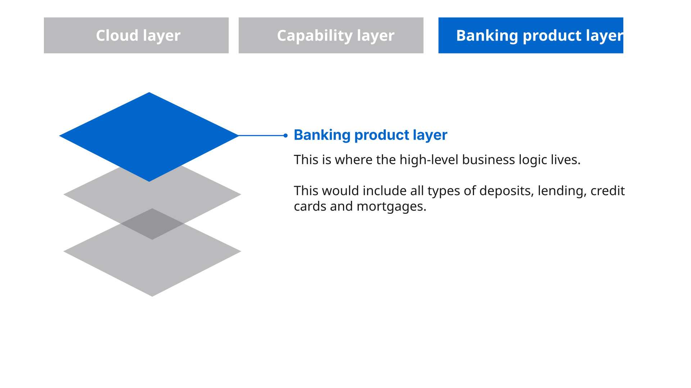
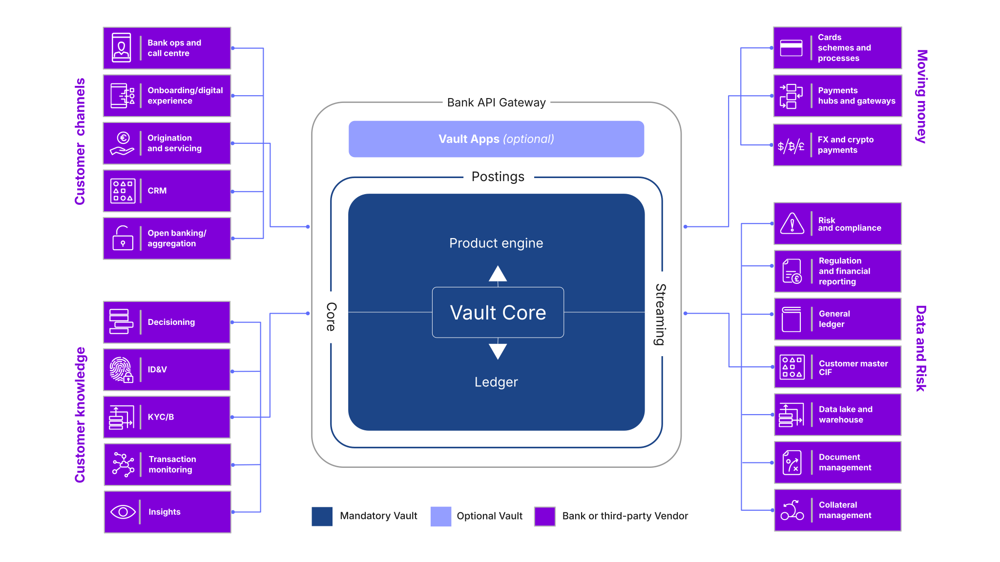

# Module 1: What is Vault Core?

assignment\_turned\_in

Learning objective

Discover how the Vault Core accounting model records and tracks financial transactions and balances associated with a specific product instance.

## Configurability

Vault Core is a headless platform enabling banks to create any product, manage accounts, and process real-time transactions on a single ledger.

The Vault platform is designed with a clear, three-level architecture that’s foundational to our products and can also be applied to a bank’s wider technology landscape.

*Click on the tabs below to learn more about each of the layers.*

Three-layer architecture Cloud layer Capability layer Banking product layer

* * *

The Vault Core platform is cloud-provider-agnostic, and can run on:

-   AWS,
    
-   Google,
    
-   Azure,
    
-   OpenShift.
    

Thought Machine provides both SaaS and bank-hosted versions, which are functionally the same.

The core principle of this design is the strong **independence between these 3 layers**.

### Componentised view

A componentised view of the capabilities means that the best in class of all the major capabilities of a bank can be built or assembled separately.

The platform has been designed to fully embrace the benefits of the cloud from the ground up.

It provides a flexible system for defining products, a capability layer that operates in real-time and is always accessible, and a foundation built for the cloud that works on different cloud platforms.

### Independence between layers

The layers are designed to operate separately.

This separation is critical because it allows product teams to innovate freely at the banking product level without being constrained by the underlying technology.

New products can be rapidly deployed with minimal changes to the software, because the capabilities and the cloud infrastructure are already in place and ready to go.

Independence between layers means that different teams and skill sets can work on parts of the bank at their own pace and priorities.

## What does Vault Core do?

Vault Core empowers banks to centrally own and manage their products through a unified ledger, providing all of the necessary capabilities for creating and operating diverse product types.

These capabilities, integral throughout an account’s lifecycle, are governed and coordinated by Smart Contracts associated with each account.

Thought Machine ensures that these capabilities are current and accessible by standardised APIs, enabling banks to leverage them across their ecosystem seamlessly.

*Click on the video below to play it. The transcript is available below.*

  Video transcript

End to end bank operations are realised by leveraging the essential capabilities provided by the Vault Core platform.

The Product Engine provides the ability to define, manage, and configure a bank’s products through Smart Contracts.

Within the product engine, banks can find the tools for product definition and product versioning, which support the creation of new products or an update to existing products without disrupting the core system.

In addition, banks can define the specific parameters and parameter hierarchies that control things like Interest, fees and charges for each product.

It is also possible to handle account management, including account administration, define restrictions and flags, set up account grouping and hierarchies and monitor account events throughout an account’s lifecycle.

These capabilities are coordinated by Smart Contracts, which act as the defined logic for each account.

The Smart Contract for a savings account, for example, will have the specific code to handle interest calculations.

Every account has an associated Smart Contract, ensuring consistent and predictable behavior across your entire product portfolio.

Next, we have the Ledger, this is the immutable source of truth for all financial records.

The Product ledger keeps track of the specific financial activities for each product;

The Posting ledger records every transaction as it happens;

The Balance ledger provides the real-time balance for every account.

All of this is underpinned by the Vault financial model, which enables support for multi-currency and the creation and management of complex financial products.

All of these capabilities are accessed through standardised APIs.

This allows banks to integrate Vault’s functionality seamlessly with their existing systems, like front-end applications or CRM software.

This API-first approach provides the flexibility to build a technology stack that fits your specific needs.

Ultimately, by providing these essential capabilities through the Product Engine and the Ledger, Vault Core enables a bank’s end-to-end operations.

The platform provides the core functionality needed to manage everything from new product launches to daily customer transactions, all within a single system.

## The Vault Core platform

Here we explore where Vault Core as a core banking system sits within the IT stack.

*Click on the heading below to learn more about the general differences between traditional banking systems and Vault Core.*

Core banking

The term "core banking" has been in use for many years. It’s often used to describe systems that encompass a wide range of capabilities in the banking stack, such as managing customer data, onboarding, and loan origination.

In fact, many traditional core banking systems are designed to include this vast array of banking functions. However, this frequently leads to overly complex, cumbersome systems, which are substandard in their individual performance. This can be challenging to maintain and upgrade, often supporting only a single product line, and their custom nature can really limit innovation.

In contrast, Vault Core adopts a highly focused and streamlined approach, sitting at the foundational layer of the bank’s IT stack. A ledger is used to record all of the postings which have been accepted by Vault Core.

This diagram shows the typical integrations across the ecosystem covering Customer channels, Customer Knowledge, Moving Money and Data and Risk. It is possible to create seamless integrations with these external systems through our comprehensive and standardised Application Programming Interfaces (APIs).

This API-first approach not only simplifies the integration process but also provides banks with the freedom to choose the ancillary systems that best fit their specific needs.

This helps create a highly modular and adaptable IT ecosystem, enabling construction of a banking platform that is both powerful and tailored, avoiding the compromises inherent in those monolithic, all-in-one systems.

Banks can choose from a range of cloud hosting options including self hosting.

You may be aware that within legacy architectures, product functionality is built into the core system and cannot easily be extended or tailored by the bank. Vault Core addresses this by providing unparalleled product flexibility and personalisation for customers, while maintaining a single common platform across all banks, with all functionality exposed via our 3 key APIs as shown above.

The Core API integrates with external applications and enables processes like authentication, account management and more.

The Postings API is responsible for managing all financial movements on accounts held within Vault Core.

The Streaming API provides native support for real-time events streaming.

*That completes this module.*

Next module