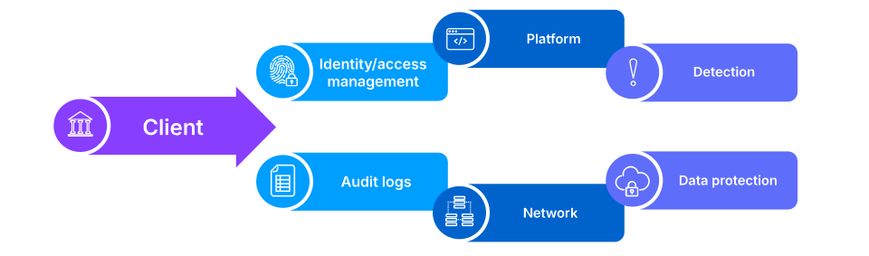
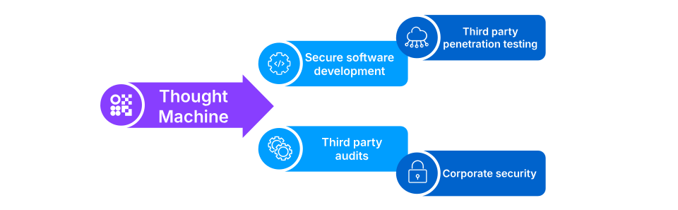
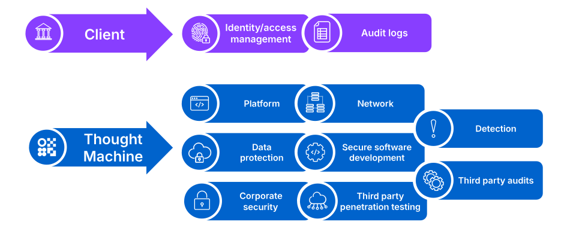

# Module 3: Shared Responsibility Model

assignment\_turned\_in

Learning objective

Understand the Shared Responsibility model between clients and Thought Machine.

## Bank-hosted responsibilities

Security is a shared partnership between Thought Machine and our clients.

This model will be different depending on whether you are operating on a bank-hosted basis or using our SaaS offering.

First, we will take a look at the shared responsibility model for bank-hosted deployments.

As you can see, clients are responsible for:

-   Managing access to Vault Core.
    
-   Auditing all access to Vault Core.
    
-   Ensuring platform services are operating (for example, compute).
    
-   Ensuring network connectivity is in place.
    
-   Ensuring data is encrypted and generating cryptographic materials.
    
-   Detecting malicious activity within their environment.
    

Now let’s consider the activities that Thought Machine is responsible for.

As indicated here, Thought Machine is responsible for:

-   Ensuring Vault Core source code is securely developed and tested.
    
-   Conducting third party penetration testing against Vault Core APIs (and SaaS environments).
    
-   Conducting third party audits to ensure alignment with industry security standards.
    
-   Ensuring the security of our corporate environment and end user devices.
    

Next, let’s take a look at the shared responsibilities when using a SaaS model for comparison purposes.

## SaaS hosted responsibilities

Here we see the shared responsibilities when using a SaaS model for comparison purposes.

Clients are responsible for:

-   Managing access to Vault Core.
    
-   Auditing all access to Vault Core.
    
-   Thought Machine are responsible for everything else.
    

*That completes this course.*

Previous module

Back to learning path