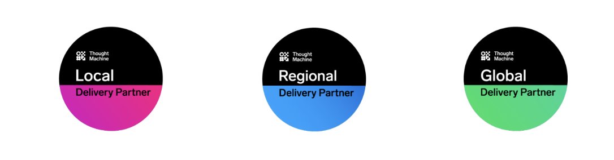

# Delivery Partner Programme

## Delivery Partner Programme Overview

Thought Machine is committed to setting up our clients and partners for success through our enablement and expert services. Thought Machine’s Delivery Partner Programme is designed to meet the growing requirements of our clients looking for professionally certified partners to support their adoption of the Vault platform.

The programme provides a clear pathway for partners to become enabled and professionally certified in the areas of Business Analysis, Architecture, Smart Contract Engineering and Infrastructure. It offers visible differentiation for the most engaged, **professionally certified** and prominent partners.

## A programme designed to meet the needs of our clients and partners

Thought Machine’s clients expect a standard of competence in deploying Vault and integrating and building financial products from Thought Machine and our partners. In addition to the level of experience in Vault deployments, a measure of that competency is achieved through professional certifications.

Thought Machine has invested in developing a wealth of services, supporting tools, and materials including the Thought Machine Academy learning pathways, the Smart Contract College, the Professional Certification scheme, Vault Core sandboxes, the Integration Library and the Vault Delivery Framework to name a few. These resources are designed to enable our partners to become professionally certified in respect of the deployment of Vault.

**Thought Machine’s goal is to enable our delivery partners to:**

-   Become professionally certified and proficient in each of the disciplines required for a successful Vault delivery,
    
-   Become an extension of Thought Machine expert services to support our growing and ever-demanding client base
    
-   Reach a state of self-sufficiency in the deployment of Vault with less reliance on Thought Machine delivery services support, and
    
-   Generate increased income for partners from core banking change programmes through the deployment of Vault including, but not limited to, migration, integration and end-to-end testing services.
    

## Membership tiers

There are three tiers of the Delivery Partner Programme. Local, Regional and Global delivery partners will lead engagements at banks and fintechs, spanning business strategy and design to implementation and managed services to help build and run the bank of the future - powered by Vault Core.

The tiers take into consideration partner geographical reach, capabilities, and professional certification. These tiers will be critical in helping our clients make accurate and informed decisions as to whom they should work with on any given project.

1) **Global partners** are those who have the appetite and geographical reach to support Vault Core deliveries in **all three regions** (APAC, EMEA, AMER) and have met or are working towards the Professionals certification target of 40 individuals.

2) **Regional partners** are those who have the appetite and geographical reach to support Vault Core deliveries across **one of our three regions (APAC, EMEA, AMER)** and have met or are working towards the Professionals certification target of 20 individuals.

3) **Local partners** are those who have the appetite and geographical reach to support Vault Core deliveries within **one country** and have met or are working towards the Professionals certification target of 10 individuals.

## Benefits to partners

As part of the Delivery Partner Programme, partners will have access to a number of services and benefits:

-   Complimentary places, according to the partner’s tiering, on the following Public Professional Bootcamps: Engineering, Analyst Architecture, and Site Reliability Engineering. The schedule is published on the Portal.
    
-   All delegates attending these bootcamps will have up to three free attempts to pass the associated professional certification following their participation immediately after a bootcamp.
    
-   50% reduction on all Vault Fundamentals and Professional Certification fees outside of bootcamp participation, and
    
-   Access to Thought Machine Client Services experts to answer a number of simple queries according to the partner’s tiering.
    

Partners will have access to the following materials via the Portal:

-   All documentation along with best practices and How To guides,
    
-   The Vault Delivery Framework. Please see the Vault Delivery Framework brochure for more information,
    
-   The Vault Core Product Library,
    
-   The Thought Machine Academy, which includes courses, ebooks, videos, and
    
-   The Smart Contract College. Please see the Smart Contract College brochure for more information,
    
-   The Community forum and access to Quarterly Product Broadcasts, and
    
-   Access to the public shared sandbox.
    

These benefits alone represent a value of at least 100% of the cost of the partner subscription. Pricing details are available on the Portal.

## Contact Information

Please contact your Partner Delivery Manager or [enablement@thoughtmachine.net](mailto:enablement@thoughtmachine.net), who will provide further details and can arrange for your contract and associated subscription to be put in place.

We look forward to welcoming you to the bootcamps, celebrating the success of your professionally certified resources and seeing you succeed in our clients’ delivery of Vault.