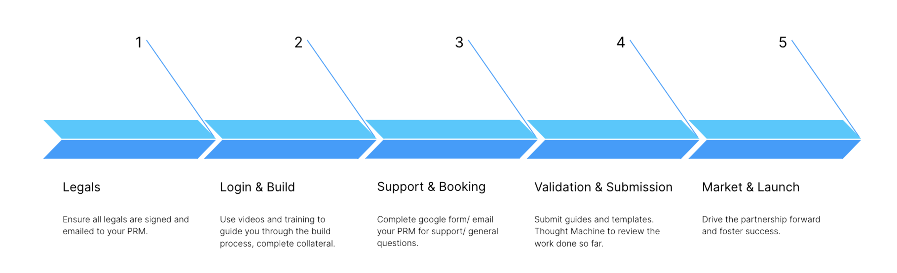

# The ISV Partner Integration Programme

## Legals

In order to access this portal, you will have signed an NDA. If you have not yet signed an NDA, please contact your PRM to do so immediately.

Checklist:

1.  Before accessing the sandbox you will need to get the partner to sign the relevant contract. Note that the Commercial Partnerships strategy is currently being refreshed and so, in the interim, you first need to confirm the proposed sandbox access with Randy and, once he has confirmed that we wish to proceed with this from a general strategic perspective, contact Legal to request a copy of the contract to use for this step
    
2.  You will also need to read and familiarise yourself on our Integration Sandbox terms and conditions which can be found [here](https://www.thoughtmachine.net/api-integration-termshere)
    
3.  Please ensure you have completed or at least started the training under The Academy to support your build and enhance your understanding of Vault Core, before requesting sandbox access. Our Academy page can be found here
    
4.  To request sandbox access, please follow this link.
    

If you have any questions regarding the above, please do not hesitate to reach out to your PRM. Please send a signed version of the letter to your PRM for review and countersignature.

## Log in and Build

### Introduction:

-   ​At this stage you should be using the documentation hub and our academies to help get you up to speed, we also recommend that you complete the Vault fundamentals training.
    
-   These documents and tutorials have been created to foment learning and support you on your build journey.
    

#### Timeline:

We approximate it takes a maximum of 8 weeks to complete an integration build. The integration programme is structured over 8 weeks as follows:

1.  Week One: Sandbox access, onboarding and confirmation of use case to be developed
    
2.  Week Four: Design and midpoint validation. Please [book](https://docs.google.com/forms/d/e/1FAIpQLScImk_VFq17WviVaYL1cZYfDF5TUMsrXB2et68lxd1gCQq1sQ/viewform) a session for us to review reference architecture, proposed design and API mapping.
    
3.  Week Eight: Please [book](https://docs.google.com/forms/d/e/1FAIpQLScImk_VFq17WviVaYL1cZYfDF5TUMsrXB2et68lxd1gCQq1sQ/viewform) the final demo of the integration and integration guide submitted for review. Code to be shared in a zip-file (for validation).
    

#### Guide:

Our integration developer guide details how transactions are generated in the sandbox and how you should use the sandbox. Please read the guide here carefully to understand how the sandbox works.

#### Templates for completion:

All integrations built require an accompanying integration guide which can be passed on to our clients who seek to understand use cases, deployment and design of integrations built. Example guides can be found under the Integration Library section within the portal here. All integrations follow the same template for standardisation.

Please download the template for you to complete here.

An example data mapping template can be found here, which is also required as part of the build process.

## Support and Bookings

You can use the ticketing system linked [here](https://tmpartners.atlassian.net/servicedesk/customer/portal/1) to submit any technical questions or issues you have as you build an integration. These are routed to our enablement engineering team who can respond to you directly on the ticket.

Alternatively, please contact your PRM for support throughout the process as and when required.

#### Meeting bookings:

We use google forms to book both design (Week 4) and final validation (Week 8) sessions. You can access the form here. To provide the best support we would need to have information about the booking as far in advance as possible.

## Validation and Submision

Before we can list an integration on our website, or put an integration in front of a client we must carefully validate the work done by the partner.

#### Validation Process:

-   Please download this overview which explains our validation process and the qualities we consider when validating our integrations and what we require to sign off on an integration and add it to our website.
    
-   At this stage you will also need to complete the various marketing templates below relating to website advertising and our sales pack.
    

#### Web content:

-   Please complete this template to create the content presented on the website. Your PRM and our Comms team will work to produce the end web page that goes live on our website.
    

#### Sales slide:

-   We also have a slide pack for our sales team to use when presenting our integration library. Please complete this slide template so we can add a slide to the wider pack and present it to your sales team.
    

Where to send these completed templates?

-   You can share these over email and work alongside your PRM to get these signed off. You can also work alongside your PRM for wider joint value proposition development, thought leadership and go-to-market strategy beyond what is listed above.
    

#### To summarise:

At this stage it is essential to email all final templates to your PRM :

-   Integration Guide
    
-   API Mapping Sheet
    
-   (Optional additional design diagrams)
    
-   Marketing web page and solution page
    
-   One pager slide
    
-   Graphics and icons for the website in jpeg format
    

## Maket and Launch

All validated integrations are listed on our website [here](https://www.thoughtmachine.net/partnership-strategy).

Your PRM and our marketing team will work with you to ensure the marketing material you have produced is completed and goes live on our website.

Now yourself and your PRM have the responsibility to maintain a relationship, discuss building out any deeper use cases, and joint value propositions as well as net target accounts and a go to market plan.