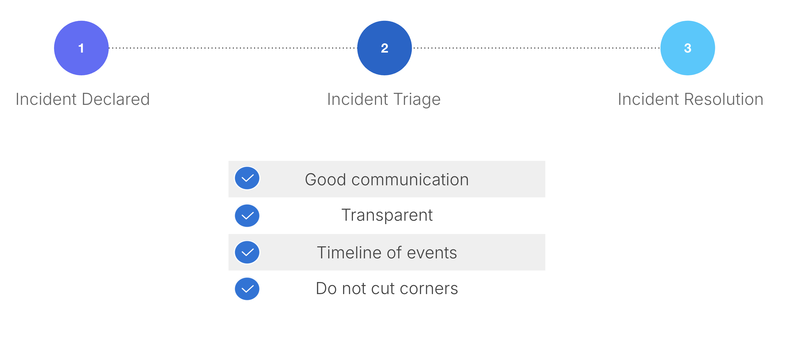

# Security Considerations

## Authentication tokens

In the past year, we have triaged several security incidents related to partners publishing authentication tokens publicly via GitHub or Postman. We actively scan for secrets publicly accessible on the internet related to Thought Machine and in some cases may block a partner from our infrastructure if we assess a high risk of compromise.

## Secure your environment

We have a low tolerance to compromised assets interacting with Thought Machine, if we identify a compromised machine in your environment interacting with our infrastructure we will contact you. We have notified several partners this year and expect an investigation / root cause analysis on the issue.

## Intellectual property

We trust partners to hold our intellectual property, mishandling of Thought Machine binaries or leaving Vault infrastructure overly exposed where attackers can query it is unacceptable. If you are unsure on best security practices, consult Thought Machine Security.

 
| Bad | Good |
| --- | --- |
| 
Processes that are likely to lead to a Thought Machine security incident

 | 

Processes that are unlikely to lead to a Thought Machine security incident

 |
| 

Engineers transferring code onto a personal laptop

 | 

Transparent and vigilant with security

 |
| 

Lack of security incident handling capability

 | 

Secrets management processes

 |
| 

No due diligence on Engineer practices

 | 

No blame culture

 |
| 

Lack of care for our intellectual property

 | 

Public repository secret scanning processes

 |
| 

Poor development environment

 | 

High aptitude in cloud infrastructure

 |
| 

Patchy EDR/AV deployments

 | 

Outlined security processes before an incident

 |

### Incidents happen, what we want

