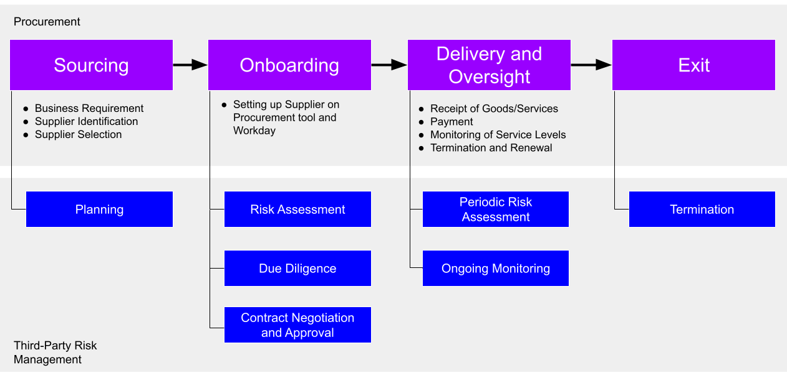
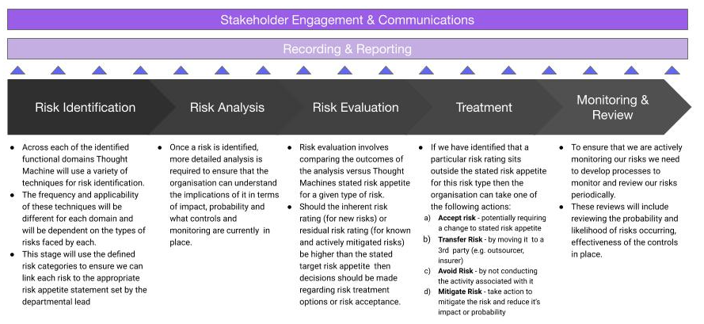

# Third-Party Risk Management Policy

[Download PDF](/policy/latest/EN/resources/third_party_risk_management_policy.pdf)

## 1\. Purpose

This Third-Party Risk Management Policy (the **Policy**) outlines Thought Machine’s approach to identify, assess, mitigate and monitor third-party risks, otherwise referred to as **Third-Party Risk Management** or **TPRM**.

This Policy aims to establish the standards and guidance relating to Thought Machine’s management of its third-party relationships. These risks are present when Thought Machine engages with suppliers (individually referred to in this Policy as a **third party** and collectively as **third parties**) to provide products and services directly to Thought Machine for the benefit of our internal operations, employees and clients, in accordance with the Procurement Policy. The diagram below illustrates the relationship between the processes involved in procurement and third party risk management.

Such third-party relationships benefit Thought Machine by enabling, for example, reduced costs, improved performance, staff augmentation and increased business competitiveness. However, reliance on third party relationships presents many risks that must be identified, assessed, and managed. Failure to manage these risks may expose Thought Machine to financial and reputational losses, and even impair Thought Machine’s ability to service existing client relationships or establish new ones.

Open Third Party Risk Management Policy - Draft Mar2024.png Third Party Risk Management Policy - Draft Mar2024.png In addition, this Policy documents the structure for identifying, assessing, controlling, monitoring and reporting on risks related to Thought Machine’s use of third parties regarding applicable laws and regulations, contractual obligations and safe and sound business practices.

## 2\. Scope and Application

This Policy applies to all business relationships between a third party and Thought Machine.

It is the responsibility of the **Business Owner** and **Cost-Centre Manager** to ensure compliance with this Policy regarding Thought Machine’s third-party relationships (see **Roles and Responsibilities** below for further details). It is possible that certain existing third party relationships do not comply with all policy aspects. However, Thought Machine is obligated to renegotiate, to the extent possible, any existing third-party contracts to comply with this Policy and the related processes. Renegotiation will occur at the first potential and reasonable opportunity (i.e., renewal).

All Thought Machine employees, independent contractors and consultants are subject to this Policy. This Policy does not cover relationships with clients, investors or employees.

## 3\. Roles and Responsibilities

### 3.1. Roles

This Policy is owned and maintained by the **Director of Risk and Compliance**.

The **Governance Risk and Compliance Committee (GRCC)** is responsible for monitoring the inherent and residual risks and corrective actions and controls arising from third party relationships.

The **Finance Department** is responsible for overseeing the budget allocation and expenditure related to procurement activities, and accurate recording and reporting of expenditures. It is responsible for ensuring continuing commercial viability of the proposed third-party relationship and sufficient liquidity to be able to comply with Thought Machine’s financial obligations with third parties. Where necessary, the Finance Department may provide an overview and analysis of costs associated with each activity or third-party relationship. To note, most of these responsibilities fall under the Procurement Policy.

The **Director for Risk and Compliance** ensures that the necessary controls are implemented and the roles and responsibilities are properly allocated.

The **Procurement Lead and Third-Party Risk Management (Compliance Manager)** is responsible for implementing Thought Machine’s third party risk management process throughout the third-party risk management (TPRM) lifecycle, including ensuring all approvals and necessary documents are properly recorded, risks are assessed and recorded, and contracts aligned within Thought Machine’s framework. The Compliance Manager facilitates the internal coordination necessary for the onboarding, monitoring of the relationship and offboarding of the third party.

Where appropriate and qualified, the Compliance Manager, under the supervision of the Legal Department is responsible for providing advice and guidance on contract negotiations and review and approval of third party contracts in accordance with this Policy.

The **Cost-Centre Manager** is the highest role in the reporting line of the Business Owner and is responsible for ensuring that the different phases of the TPRM are complied with and that identified risks are managed throughout the duration of the third party relationship. They play a key role in ensuring that risks have been understood and properly mitigated.

The **Business Owner** owns the relationship with the third party, and is expected to:

-   Ensure the completion of the Planning, Due Diligence, Risk Assessment phases of the TPRM
    
-   Notify and coordinate with the Compliance Manager of new, or changing, third party relationships which may impact operations in their business function
    
-   Maintain third party information within the Procurement tool, e.g., Venminder
    
-   Validate and monitor the accuracy and scope of the services provided by their third parties
    
-   Complete periodic risk assessment process
    
-   Issue identification and reporting during any phase of TPRM
    
-   At exit, ensure the steps to offboard the third party are followed by Thought Machine personnel and the relevant third party, including proper management of Thought Machine data held or processed by the third party in accordance with the relevant data requirements
    

### 3.2. Approval of Third Parties

The Business Owner and the Compliance Manager will coordinate and engage the internal stakeholders that must be consulted or provide approval as part of the third-party onboarding process (and during the TRPM lifecycle) and are listed below:

**IT** is responsible for conducting the IT review of the third party’s software or system that will be used in the delivery of their product or service to Thought Machine. Where possible, it will ensure Single Sign On (SSO) capabilities in the integration of the third party’s software or system.

**Information Security** is responsible for conducting the security review of the third party’s software or system. It is concerned with the confidentiality, integrity and availability of data, software and systems involved in the third party’s delivery of the product and/or service.

**Business Continuity** (Security) is responsible for conducting the necessary business continuity assessments where the third party’s product and/or service directly impacts Thought Machine’s business operations, employees or clients.

**Compliance and Data Protection** is responsible for conducting the review of:

-   the third party’s business practices to assess alignment with Thought Machine’s sustainability, corporate governance, legal (including but not limited to anti-bribery and corruption laws) and health and safety standards rules and regulations.
    
-   the handling of data to be held or processed by the third party. This may include data relating to Thought Machine’s products, prospects or current clients, employees or other parties.
    

**Legal** is involved in the negotiation and review of all third-party contracts. This responsibility may be delegated to the Compliance Manager under the supervision of the Legal Department.

## 4\. Key Principles

### 4.1. Third party

All third parties will undergo the TPRM lifecycle as set out in this Policy. However, as third-party relationships are not all the same, factors such as the type of arrangement between Thought Machine and the third party, and its criticality and materiality to our business, will inform our risk assessment approach.

-   **One-off engagements**, such as sales and marketing initiatives, food catering and employee trainings by facilitators. In such cases, the third party will undergo a simplified TPRM considering the limited risks they pose to Thought Machine.
    
-   **Additional products or services** of properly onboarded existing third parties. In such cases, the third party will not need to undergo a full-blown TPRM, but only a limited one specific to the additional new product or service Thought Machine intends to purchase.
    
-   **Outsourced and/or cloud services essential to the delivery of Thought Machine’s client offerings and are directly impacted by rules and regulations on outsourcing and cloud arrangements imposed on regulated client entities** (e.g., European Banking Authority guidelines on outsourcing arrangements and Bank of England Prudential Regulation Authority Supervisory Statement 2/21 on outsourcing and third party risk management). In such cases, the third party may need to undergo more rigorous due diligence or risk assessments because, under the relevant regulations, the third parties may be considered sub-outsourcers/sub-contractors or supply chain dependencies, and therefore Thought Machine will need to ensure that such third parties comply with the regulatory requirements in the guidelines.
    
-   **Subcontracted services under relevant Thought Machine certifications (including ISO 27001, ISO 223001, PCI-DSS, PCI-PIN) or other applicable regulations (such as data protection regulations)**. These third parties may need to undergo more rigorous due diligence or risk assessments if they are deemed to be subcontractors / subprocessors for the purposes of the relevant certification or applicable regulations, particularly as our contracts with them may need to contain certain terms and Thought Machine will need to implement certain controls to ensure that such relationships are appropriately managed.
    
-   **Services that do not involve the provision of software**, such as the engagement of consultants or professional services, lease of facilities, and cleaning and maintenance services may not require certain approvals, such as IT or Security.
    
-   **Contracts requiring Board approval**. There are certain third party contracts that will be subject to Board Approval. Factors that may trigger this include: commitment to a term of more than 6 months and/or any unusual or onerous contract terms (the latter of which is to be determined by the Legal department). The Compliance Manager will advise the Business Owner if the third party contract in question requires Board approval.
    

### 4.2. Documentation and Reporting

Thought Machine properly documents and reports its third-party risk management process and relationships to facilitate accountability, monitoring and risk management associated with third parties. These reports may be subject to audit and provided as evidence of Thought Machine’s compliance with its certifications and applicable regulations.

## 5\. Key Risks, Methodology, Overview

### 5.1. Third-Party Risk Management Lifecycle Overview

Thought Machine’s TPRM process is mapped against the Procurement process, generally divided into four phases:

-   Planning
    
-   Risk Assessment, Due Diligence, Contract Negotiation & Approval
    
-   Delivery and Oversight
    
-   Exit
    

These phases apply to all third party activities. However, the extent and scope required for any third party are dependent on numerous factors. Thought Machine’s risk identification and management process contemplate the nature of the third party relationship, the complexity, and magnitude of the activity provided, and the risks identified related to the third party relationship. Risk identification, assessment, and monitoring are appropriately scaled and commensurate with the risk.

## 6\. Planning

Before entering into a third party relationship, Thought Machine defines the nature of the proposed relationship and its alignment and impact to Thought Machine’s strategic goals and initiatives. The Business Owner and Cost-Centre Manager will present a broad outline of the risks that engaging an identified third party presents. Other factors relevant to TPRM are evaluated, such as the complexity of the arrangement, the technology needed, the timeline for the end-to-end procurement and TPRM processes. In order to provide adequate oversight of third-party relationships, Thought Machine must determine if sufficient resources are available, and a suitable contingency plan if the activity must be transferred to another third party or brought in-house.

## 7\. Risk Assessment and Management

Each prospective and existing third party relationship is assessed for the inherent risk posed to Thought Machine, based on the nature of the products or services provided. Such assessment determines whether the third party is **Critical** (or **High Risk**) or **Non-critical**.

The approach to risk assessment is based on the Enterprise Risk Management Framework.

Unless otherwise authorised by TPRM, all third party engagements must have a risk rating. To assess risk accurately, the tools, formats and systems defined by this TPRM must be used.

### 7.1. Risk Management Approach

The Risk Assessment Approach in the Enterprise Risk Management Framework, generally following the process outlined at Diagram 2 below, applies. The intention is to understand and manage the third party risks posed by the engagement or renewal of a third party contract.

### 7.2. Criticality

As each third party is risk-rated, a small subset of third party engagements is identified as **Critical**. The distinct and separate classification of critical serves to identify the most essential and highest-risk business activities provided by third parties to Thought Machine in service of its operations, employees, investors, and clients. Third parties rated "**Critical**" or "**High Risk**" are subject to additional monitoring or other internal controls as determined by the Director of Risk and Compliance.

#### 7.2.1. Critical

Although assessed on a case-to-case basis, a third party is considered Critical when performing an activity deemed crucial to the organisation’s operations or it is the sole provider of an essential business function. Additionally, any sudden interruption of that activity (or failure to perform it as required) can cause significant disruption to Thought Machine’s core operations if not quickly and easily remedied. As such, critical third parties are subject to more rigorous due diligence.

A third party is considered Critical when:

-   it provides services and/or products that are critical to Thought Machine’s operations, and the sudden loss/disruption of the relevant services and/or products would cause significant disruption or regulatory scrutiny of Thought Machine’s business and its critical functions.
    
-   the engagement would increase regulatory oversight over Thought Machine or pose additional risks to Thought Machine.
    
-   the third party would have access to sensitive or confidential information, such as client data, Thought Machine intellectual property, financial records, personal data.
    
-   service disruption would have a negative impact on Thought Machine’s operations if the time to restore were more than 24 hours.
    

#### 7.2.2. Non-Critical

The third party does not perform a mission-critical business function or serve as the sole provider of an essential function. The sudden loss of the third party’s product and/or services would not cause significant disruption to Thought Machine’s business operations.

### 7.3. Risk Ratings

The risk rating for TPRM varies from the Enterprise Risk Management Framework. While impact and probability are also relevant in determining the risk calculation, the primary determinant would be the criticality of the third party to Thought Machine’s operations to then determine the appropriate risk rating, the due diligence to be performed and whether Thought Machine can proceed to enter into the contract with the third party. The residual risk rating is also informed by whether the appropriate corrective actions or controls have been reflected in the contract.

Standard TPRM risk ratings based on the Risk Assessment can be as follows: High, Moderate, Low. These are utilised for both the inherent and residual risk ratings.

#### 7.3.1. Low

The nature of the third-party relationship or the third party’s risk profile present little to no risk, and minimal ongoing monitoring is warranted. One-off engagements are generally low risk engagements, unless other factors require a different consideration.

#### 7.3.2. Medium

The nature of the third-party relationship or the third party’s risk profile presents some level of risk, and periodic oversight is necessary. The third party has some access to or interaction with clients or confidential client data or personal data and/or connectivity to Thought Machine infrastructure, and they are considered subcontractors under client contracts or other applicable regulations/certification regimes. The arrangement is a medium-term one, with a reasonably long notice period for termination or auto-renewal.

#### 7.3.3. High

The nature of the third-party relationship or the third party’s risk profile presents a significant risk that must be mitigated and requires frequent oversight through due diligence and monitoring activity (otherwise referred to as "enhanced oversight" - see section 10.2). Notwithstanding any other risk factors presented, any third party with regular access or interaction with clients, confidential client data or personal data is deemed High Risk.

### 7.4. Inherent Risk

Inherent risk represents the amount of risk existing in the third-party activity in the absence of controls. The inherent risk assessment identifies the types of risk associated with the products and/or services and its significance to Thought Machine. Once further evaluations and due diligence are complete, the validation of sufficient controls, practices, and assurances help determine the residual risk of the engagement (see below).

### 7.5. Residual Risk

A residual risk rating is used solely to determine if the remaining risk is within Thought Machine’s risk appetite, and if additional risk mitigation actions are warranted before entering into a business relationship with a third party.

Residual risk ratings are never used in place of inherent risk ratings when determining TPRM risk management activities throughout the TPRM lifecycle.

The risks emanating from a future third party relationship are measured using the Enterprise RIsk Management Framework and are properly documented.

## 8\. Due Diligence

Thought Machine conducts due diligence of third parties alongside the onboarding phase of the Procurement process. Due diligence is the process of thorough analysis or obtaining relevant information from a third party conducted before entering into a formal contract. It is a critical component of risk assessment, and the findings either inform the risk assessment process by identifying potential risks or provide answers to initially identified risks . A third party cannot be fully onboarded without the appropriate risk assessment and due diligence being performed, nor can the contract be executed without obtaining the internal approvals of the internal stakeholders identified at section 3.2 (Approval of Third Parties). These internal approvals will be documented on the Procurement tool (e.g., Omnea).

### 8.1. Scope

Third parties, especially Critical and High Risk third parties, are subject to rigorous due diligence to assess their control environment’s sufficiency, resiliency, financial condition, reputation, compliance with all applicable laws and regulations and the ability to service Thought Machine’s operations. This process may require the third party to provide their internal documents such as policies, procedures, financials, business continuity, disaster recovery plans and testing results, and independent third party certifications to evidence the sufficiency of their control environment, e.g., ISO 27001, PCI DSS.

The scope of due diligence documentation required is risk-based and calibrated to both the nature of the relationship and the evidence necessary to assess controls accurately. Additionally, other required evidence may substantiate controls, including on-site visits (when conditions allow) and interviews with key personnel.

### 8.2. Completion of due diligence before contract execution

Due diligence is completed and formally documented before Thought Machine and the third party enter into a contract. Due diligence is then performed periodically during the relationship, the frequency of which is dependent on the risk rating allocated to the third party relationship.

Before renewing Critical or High Risk contracts, satisfactory due diligence must have been completed within the calendar year that the renewal is intended to take place. For third parties rated Moderate or Low Risk, due diligence requirements and intervals are determined by TPRM, based on the engagement’s significance, complexity, and impact.

### 8.3. Approvals

To complete the risk assessment and due diligence, the Business Owner is expected to engage with and obtain the approval of the internal stakeholders set out in section 3.2 As part of due diligence, the relevant internal stakeholders will require, and the Business Owner must obtain from the third party or from another source, the following information:

-   Mutual non-disclosure agreement or confidentiality agreement
    
-   Incorporation or registration details
    
-   Service-level agreements or schedules
    
-   OFAC/PEP checks
    
-   Regulatory compliance (modern slavery, anti-bribery and corruption policies)
    
-   ESG statement and policies
    
-   Negative news search findings
    
-   List of critical or pertinent subcontractors of the third party
    
-   Country regulation or restrictions
    
-   Licences, certifications and reports, such as PCI attestation of compliance, ISO certification, NIST certifications, SOC 1 or 2 reports, security testing, business continuity testing results, professional certifications (CISSP, CIPM, etc.)
    
-   Data protection compliance, including DPIAs and data flows
    

## 9\. Contract Negotiation and Approval

As the third and final part of the TPRM lifecycle that sits alongside the Onboarding phase of the Procurement process, contract negotiation assumes that risk assessment and due diligence are ongoing in parallel or have been completed. This is to ensure that any findings or controls agreed during the risk assessment and due diligence phases are documented and properly reflected in the contract. Any document that binds Thought Machine and requires a signature from us, including standard or templated terms and conditions, statements of work, purchase orders, licensing, servicing, marketing agreements, and other similar written agreements, is considered a contract. Contracts with third parties are negotiated and approved by the Legal department or a qualified member of the Compliance department. Critical or High Risk contracts are subject to more rigorous review considering their potential impact on Thought Machine’s operations.

### 9.1. Contract terms and provisions

Contracts should include clear and concise language regarding the arrangement between Thought Machine and the third party, including the roles and responsibilities of each party. Custom agreements prepared by legal counsel or proposed agreements offered by the third party are acceptable when key terms and provisions are reasonably represented. The contract must protect Thought Machine by providing full audit rights. Other contract terms and conditions may vary based on the risk profile of the third party relationship and the complexity and significance of the products and/or services to be provided by the third party to Thought Machine under the contract.

### 9.2. Negotiation of contracts

Thought Machine will undertake analysis and review of any proposed third-party contract and ensure that the proposed terms are favourable to Thought Machine, and effectively manage the third-party risks identified during the risk assessment and due diligence process. Any obligation imposed on Thought Machine, apart from the payment for the products and/or services must be scrutinised. The following parts of the contract must be reviewed to ensure that they are drafted in favour of Thought Machine or do not impose additional, onerous or unusual obligations on us.

-   Scope of service(s)
    
-   Service level agreements and performance standards (including corresponding reporting requirements)
    
-   Rights and responsibilities of the parties
    
-   Representations and warranties
    
-   Internal controls
    
-   Audit rights reserved for Thought Machine and potentially clients and/or client regulators
    
-   Pricing and payment terms (no earlier than Net30)
    
-   Confidentiality, data protection and security
    
-   Business resumption and contingency plans
    
-   Default and termination, including notice with or without cause (no less than 60 days)
    
-   Subcontracting
    
-   Proprietary information, ownership and licence
    
-   Compliance with applicable laws and regulatory expectations
    
-   Limits of liability
    
-   Indemnification
    
-   Dispute resolution, governing law and jurisdiction
    

### 9.3. Contract Execution and Management

Third party contracts must not be executed until due diligence has been completed and any issues requiring pre-contract remediation are satisfied. The relevant internal team that identifies the original issue(s) must review the evidence of closure and document whether the issue has been resolved adequately.

Contracts may be signed using the e-signature tool of either Thought Machine or the third party. Once signed, it is the responsibility of the Business Owner to ensure that the signed version is forwarded to the Compliance Manager for safekeeping and recording. Even more important is that the Business Owner must keep track of the renewal date, to enable us to renegotiate or send a notice of non-renewal of the contract well in advance of the renewal date.

## 10\. Periodic Risk Assessment and Ongoing Monitoring

This part of the TPRM lifecycle runs alongside the Delivery phase (Phase 3) of the Procurement process. Continuous monitoring provides ongoing visibility into risk exposure, and where necessary, further mitigation activities will be implemented.

### 10.1. Monitoring Activities

Thought Machine monitors the third party’s operations to verify that these are consistent with the terms of the third party contract. The Business Owner is primarily responsible for conducting oversight and service-level monitoring of the third party’s products and/or services. Monitoring activities include: (a) reviewing the performance of the third party vis-a-vis their contractual obligations, service level standards and performance standards; (b) meeting with the third party’s representatives to discuss performance and operational issues; and (c) reviewing audit reports and compliance against applicable rules and regulations.

If necessary, Thought Machine may trigger its audit rights reserved in the third party contract and coordinate with the Compliance Manager to create a plan on how to go about the audit and notify the exercise of this right to the third party.

### 10.2. Enhanced Oversight

Enhanced oversight rules apply to any third-party relationship deemed Critical or High Risk. At a minimum, Critical and inherently High Risk third parties undergo a periodic risk assessment within one calendar year of completing initial due diligence or previous risk assessment. Escalations and correction actions are documented, tackled appropriately, and reported to the GRCC.

## 11\. Termination

This part of the TPRM runs alongside the Exit phase (Phase 4) of the Procurement process. Thought Machine may terminate a third-party relationship for various reasons, including expiration of the contract (where Thought Machine chooses not to renew), dissatisfaction with the third party’s products and/or services, intention to seek an alternate third party or the reasons outlined in section 7.2 of the Procurement Policy on Termination and Renewal of Supplier Contracts.

If Thought Machine determines that a third-party relationship must be terminated, an evaluation is conducted to determine the impact this will have on any business relationships or clients affected by that decision. Procedures and internal controls to reduce the possible negative impact of the termination are identified.

Prior to sending the notice of termination to the third party, the Business Owner and Cost-Centre Manager will coordinate with the Compliance Manager to create an action plan to address operational events related to the termination, especially if it is a Critical or High Risk third party. To ensure a smooth transition and termination, the following factors and steps are to be considered:

-   Capabilities, resources and the time frame required to transition the activity while still managing legal, regulatory, client and other impacts that might arise;
    
-   Potential suppliers to which the services could be transitioned and the timeline for engaging them and obtaining approvals in time for the termination of the existing third party relationship;
    
-   Risks associated with data retention and destruction, information system connections and access controls or other concerns that may require additional risk management during and after the third-party relationship; and
    
-   Handling of intellectual property developed during the course of the relationship.