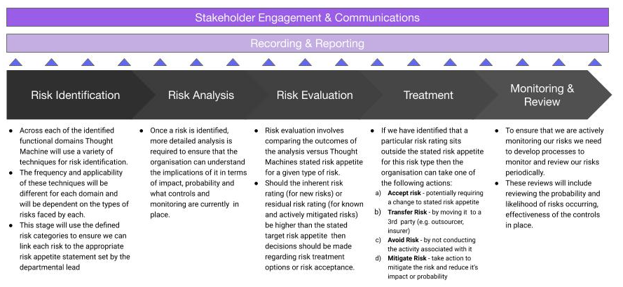
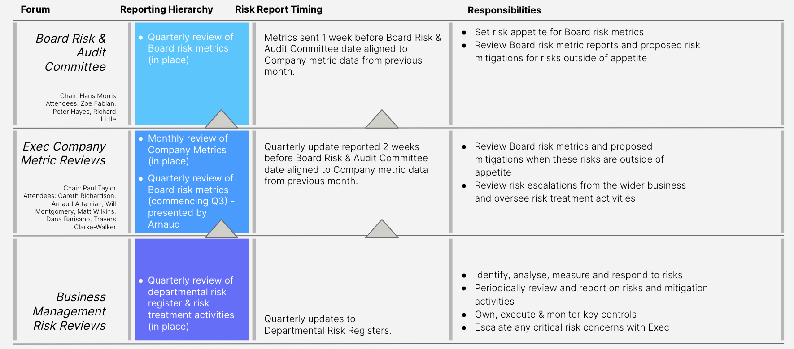

# Enterprise Risk Management Framework

[Download PDF](/policy/latest/EN/resources/enterprise_risk_management.pdf)

## 1\. Introduction & Context

The Enterprise Risk Management Framework (EMRF) sets out the processes and responsibilities for the management of risk across Thought Machine. It applies to all Thought Machine employees and should be embedded consistently across the organisation. It is supported by training and guidance to ensure that our employees are aware of our approach to risk management and their role in identifying, managing and mitigating risk.

### 1.1. Business Context

Thought Machine is a Financial Technology and Services provider that offers Banks the opportunity to move from their legacy IT platforms onto our products which are cloud-native, microservice API architecture platforms. Thought Machine is privately owned and headquartered out of the UK with a developing global presence and client base.

With a team of over 500 people, Thought Machine is primarily an engineering company with a large focus on developing our software and products. Increasingly, as Thought Machine is capturing new customers, it is also a professional services company with delivery teams supporting our clients with the implementations of our product set.

### 1.2. Interested Parties / Stakeholders

An interested party is defined as someone or a group, typically a stakeholder that has an interest in or could affect the risks that the business faces. The list of key stakeholders below demonstrates the breadth of different interests in our organisation.

  
| **Stakeholder** | **Internal/ External** | **Needs and Expectations** |
| --- | --- | --- |
| 
Board

 | 

Internal

 | 

-   Compliance with regulatory, legislative & contractual obligations;
    
-   Protect shareholder value;
    
-   Provide a Competitive advantage; and
    
-   Organisation reputation must be protected
    

 |
| 

Investors

 | 

External

 | 

-   Organisation reputation must be protected
    
-   Protect shareholder value; and
    
-   Productivity and operational efficiency is maintained at the highest level
    

 |
| 

Staff

 | 

Internal

 | 

-   Suitable tools to run Infrastructure and services;
    
-   Training and awareness of Thought Machine operational policies and procedures; and
    
-   Management and guidance with regard to role requirements and expectations
    

 |
| 

Suppliers

 | 

External

 | 

-   Receive payments as per contractual agreements;
    
-   Adequate support to commission their services; and
    
-   Maintain services to SLA
    

 |
| 

Technology partners

 | 

External

 | 

-   Compliance to agreed SLAs / contracts etc.
    

 |
| 

Contractors

 | 

External

 | 

-   As above under STAFF; and
    
-   All work recognises Intellectual Property Rights / copyright
    

 |
| 

Partners

 | 

External

 | 

-   Training and awareness of Thought Machine operational policies and procedures; and
    
-   Suitable access to Thought Machine resources to run full service
    

 |
| 

Client (Banks)

 | 

External

 | 

-   Meet all contractual and SLA requirements; and
    
-   Meet all security requirements
    

 |
| 

Prospective clients

 | 

External

 | 

-   Meet all contractual and SLA requirements; and
    
-   Meet all security requirements
    

 |
| 

Regulatory Bodies

 | 

External

 | 

-   Applicable financial and regulatory requirements; and
    
-   Data privacy supervisory regional bodies.
    

 |

## 2\. Risk Management Framework

### 2.1. Risk Management Principles

Thought Machine has set out a series of strategic principles in terms of how it approaches Risk Management within the firm. These are set out below:

 
| Risk Management Principles | Description |
| --- | --- |
| 
**Protects and Creates Value**

 | 

Thought Machine’s risk management approach aims to create and protect value within the business by aligning the risk management framework with the key strategic priorities of the business.

 |
| 

**Meets the needs of our clients and external stakeholders**

 | 

Thought Machine aims to meet the expectations of our clients and appropriate external stakeholders through the development of a comprehensive risk framework as evidenced by audits undertaken by, or on behalf of, clients. This framework aims to balance the needs of these stakeholders with the size, scale and complexity of Thought Machine’s business to ensure that the framework is appropriate to Thought Machine.

 |
| 

**Relevant & Appropriate**

 | 

Thought Machine’s Risk Framework should be relevant and appropriate to a Technology and Services driven business while acknowledging the needs of our external stakeholders. Thought Machine uses common risk management methods familiar to our clients where appropriate and aligned to recognised good standards and practices (e.g. ISO, SOC2) and looks to ensure the framework is readily accepted and demonstrably embedded within the business.

 |
| 

**Consistent, Measureable & Timely**

 | 

Thought Machine ensures it is able to identify and measure key risks and that these measures are consistently applied and reported on a timely and regular basis. Thought Machine also ensures that as much as possible we are able to test key controls and risk mitigations and ensure that the outcomes of these tests are incorporated in our current risk profile and any opportunities for improvement are identified and implemented.

 |
| 

**Focus on Design, Detection, Prevention, Resilience & Recovery**

 | 

Thought Machine’s risk management approach ensures that it is forward-looking in anticipating future risks by both incorporating risk identification and mitigation as part of our product and services design but also actively looking for emerging risks based on changing business and market dynamics. Thought Machine also ensures preventative controls and monitoring are in place to help Thought Machine detect and mitigate risks. The framework also ensures that recovery plans for key risks are identified to limit the impact of these risks and improve our operational resilience.

 |
| 

**Integrated within our Ways of Working & Embedded within our Culture**

 | 

Thought Machine endeavours to embed a risk management mindset across the business both through the methodology and processes implemented.

 |
| 

**Continuous Improvement**

 | 

Thought Machine reviews its Risk Management Framework periodically to assess its performance and look at updating it in line with any key lessons learned in the period and wider best practice risk management techniques where appropriate.

 |

### 2.2. Risk Management Governance

#### 2.2.1. Key Governance Bodies

Our risk governance model brings together two key elements, the first is a top-down, board-set view of the key risks and associated indicators that the business should be managing and monitoring to support the achievement of its objectives. The second is a bottom-up mechanism to identify, manage and escalate risks to the senior management of the firm. In between these two mechanisms sit the risk management team who are responsible for the effective running of the governance structure from top to bottom.

#### 2.2.2. Roles & Responsibilities

1.  **Thought Machine Board Risk & Audit Committee (Frequency - Quarterly)**
    

The Board is accountable for risk oversight within the business and plays an active role in understanding the risks the business faces to help inform strategic decision-making. It also plays a role in the identification of key strategic risks which it can then delegate accountability to other bodies within the organisation.

Overall, the Board Risk & Audit Committee is responsible for:

-   Identification of Key Risks for the Business;
    
-   Agreeing to a risk appetite & tolerance for each of these Key Risks;
    
-   Reviewing risk reporting and escalating risks & decisions to the Board;
    
-   Challenging Thought Machine’s approach to risk management;
    
-   Reviews the performance of the business in addressing risks through a set of key performance indicators;
    
-   Monitors the performance of risk management activities across the business; and
    
-   Review and approve the statements to be included in the annual report concerning the Framework.
    

**2\. Executive Committee (Frequency - Key Risks on agenda based on upcoming inclusion in Board Agenda)**

The executive management team has a key role in providing assurance to the Board on what is being reported to them is appropriate, accurate and has the attention of the leadership team.

In this context the Executive Committee is responsible for:

-   Reviewing monthly Key Risk report before submission to the Board Risk & Audit Committee;
    
-   Supporting testing and validation of risk appetite; and
    
-   Providing assurance & advice on risks and proposed risk treatment plans.
    

**3\. Governance, Risk & Compliance Committee (Frequency - Quarterly)**

The Committee is accountable for the effectiveness of the Enterprise Risk Management Framework. The Committee will:

-   Review / Approve any changes to the Framework, including the Governance model and reporting;
    
-   Review the results of internal and external audits;
    
-   Ensure staff training and awareness activities;
    
-   Review the outcomes of annual risk assessment exercises; and
    
-   Review any proposed risk escalations for the Executive.
    

**4\. Risk Management Team**

The risk management team acts as the primary point of contact for risk-related issues across the business. The team acts as the focal point for upwards escalation of enterprise-wide risks to the senior management, the Executive and the Board.

The risk management team is accountable for:

-   Defining and implementing the risk management framework, as agreed by the Board & Executive;
    
-   Designing and implementing associated processes, procedures and reporting mechanisms to make the framework effective;
    
-   Collating key risk reporting and escalating any risks as appropriate;
    
-   Planning and conducting regular risk assessments across the business;
    
-   Monitoring and measuring the effectiveness of identified controls and mitigations against identified risks;
    
-   Ensuring that the risks are being identified, addressed and escalated in a consistent manner across the business;
    
-   Supporting the Board and Thought Machine’s senior management in setting their overall risk appetite and ensuring this risk appetite is tested and validated regularly;
    
-   Supporting the development of risk communications across the business; and
    
-   Supporting the development of any risk management training required.
    

**5\. Integration into the Wider Business**

We have identified the following established functional domains within Thought Machine’s organisation. We will be using these functional domains as the basis on which we manage the day-to-day risks.

1.  **People & Operations** - incorporating Human Resources, Recruitment, Facilities, Corporate IT and Learning & Development (Accountable Executive: Matt Wilkins - Chief People Officer)
    
2.  **Engineering** - incorporating the different Engineering teams, Core, Infrastructure, Payments, Vault Bridge, Security, Developer Experience, and Releases (Accountable Executive: Will Montgomery - CTO)
    
3.  **Commercial** - incorporating our Sales, Marketing, Sales Partnerships and Communications teams (Accountable Executive: Paul Taylor - Chief Revenue Officer)
    
4.  **Client Services** - incorporating Client Delivery Management, Client Success Management, Business & Technical Analysis, Client Architecture; Client Support, and SI Partnerships (Accountable Executive: Gareth Richardson - Chief Operating Officer)
    
5.  **Finance** - incorporating our Finance, Legal, Risk & Compliance (Accountable Executive: Arnaud Attamian - Chief Financial Officer)
    

Each functional domain will be responsible for:

-   Setting departmental risk appetite for risks within their domain;
    
-   Adherence with relevant policies, controls and frameworks put in place across the firm to mitigate different risks;
    
-   Proactively identifying risks during their day-to-day activities and escalating within the risk register as appropriate;
    
-   Developing and completing Risk Treatment plans for risks that are outside of departmental risk appetite;
    
-   Monitoring the day-to-day effectiveness of mitigating actions and control mechanisms they are responsible for within the risk register (Note: some of the mitigating actions and controls owned by one function may be associated with risks owned by another function);
    
-   Supporting the risk identification and assessment processes for their areas of responsibility;
    
-   Enacting any additional actions requested by the Board and Executive;
    
-   Regularly reviewing their risks to ensure that the risks, their impact and probability are as current as possible and that the controls in place are still appropriate based on the latest risk ratings; and
    
-   Support the Risk team with any required assurance or audit activities.
    

Accountability for each function performing these responsibilities lies with the appropriate Executive Management Team members (see named individuals above) - these individuals may delegate this responsibility to a senior member or members of their team if appropriate.

### 2.3. Risk Communications

A critical part of ensuring that risk management is embedded in the way that Thought Machine operates is the methods, mechanisms and messages used to communicate risks and decisions about risks across the business.

We use Confluence and Jira, Thought Machine’s internal knowledge management and productivity tools, as the primary repository for firm-wide information on our risk management framework. This will include details of the following:

-   Overview of the Enterprise Risk Framework
    
-   Expectations on employees relating to identifying and escalating risks
    
-   Guidance on how to complete annual risk assessment activities
    
-   Roles and responsibilities around risk management across the business
    
-   Links to the latest policies and procedures
    
-   Departmental and Enterprise Risk Registers
    

For external parties (for example Clients or Partners) we share the Enterprise Risk Framework on the Vault Portal.

### 2.4. Continuous Improvement

To ensure that the risk framework is as effective as possible and reflects the changing nature of business activities and our external environment we conduct an annual review of the risk framework and make changes to the framework based on these findings.

In assessing the effectiveness of the framework across these dimensions we will use the following information sources to identify potential changes:

-   External best practice
    
-   Findings from Audits conducted
    
-   Internal feedback and stakeholder interviews
    
-   Changes to company strategy
    
-   Changes to internal organisational structure
    

Any changes to the Key Risks and supporting reporting model require approval from the Board Risk & Audit Committee and Executive. The Head of Risk & Compliance can provide proposed changes to other elements of the framework.

## 3\. Risk Categorisation

Thought Machine categories risks to enable us to effectively manage and monitor operational risks throughout the business based on the department where these risks reside.

### 3.1. Risk Categories

Thought Machine defines Operational Risk as *"the risk of loss resulting from inadequate or failed internal processes, people and systems or from external events, which can lead to adverse customer impact, reputational damage or financial loss".*

Thought Machine manages and monitors detailed operational risks at a departmental level using the following categories for us to accurately measure our risk profile across the business:

<table class="tableblock frame-all grid-all stretch"><colgroup><col style="width: 20%;"> <col style="width: 40%;"> <col style="width: 40%;"></colgroup><tbody><tr><td class="tableblock halign-left valign-top">
Risk Category - Level 1
</td><td class="tableblock halign-left valign-top">
Risk Category - Level 2
</td><td class="tableblock halign-left valign-top">
High Level Description
</td></tr><tr><td class="tableblock halign-left valign-top" rowspan="5">
People &amp; Operations
</td><td class="tableblock halign-left valign-top">
Human Resources
</td><td class="tableblock halign-left valign-top">
Risks relating to employment policies, benefits, HR processes, workplace diversity and remuneration
</td></tr><tr><td class="tableblock halign-left valign-top">
Recruitment
</td><td class="tableblock halign-left valign-top">
Risks pertaining to recruitment of Thought Machine Staff
</td></tr><tr><td class="tableblock halign-left valign-top">
Learning &amp; Development
</td><td class="tableblock halign-left valign-top">
Risks pertaining to how Thought Machine supports its employees with relevant training for their roles &amp; professional development for their careers
</td></tr><tr><td class="tableblock halign-left valign-top">
Facilities &amp; Operations
</td><td class="tableblock halign-left valign-top">
Risks relating to the use of facilities by Thought Machine employees and the health and safety of Thought Machine staff
</td></tr><tr><td class="tableblock halign-left valign-top">
Corporate IT
</td><td class="tableblock halign-left valign-top">
Risks relating to the internal hardware and software used by Thought Machine
</td></tr><tr><td class="tableblock halign-left valign-top"></td><td class="tableblock halign-left valign-top"></td><td class="tableblock halign-left valign-top"></td></tr><tr><td class="tableblock halign-left valign-top" rowspan="8">
Product &amp; Engineering
</td><td class="tableblock halign-left valign-top">
Vault Core / Product
</td><td class="tableblock halign-left valign-top">
Risks relating to our Vault Core product, our product management process and the associated roadmap
</td></tr><tr><td class="tableblock halign-left valign-top">
Documentation
</td><td class="tableblock halign-left valign-top">
Risks relating to the quality and availability of our product documentation
</td></tr><tr><td class="tableblock halign-left valign-top">
Infrastructure / Product
</td><td class="tableblock halign-left valign-top">
Risks related to our internal infrastructure used to deploy and support our products
</td></tr><tr><td class="tableblock halign-left valign-top">
Payments
</td><td class="tableblock halign-left valign-top">
Risks relating to our Vault Payments product
</td></tr><tr><td class="tableblock halign-left valign-top">
Development Platform
</td><td class="tableblock halign-left valign-top">
Risks relating to the infrastructure used by the engineering team to develop and deploy code
</td></tr><tr><td class="tableblock halign-left valign-top">
SaaS / SRE
</td><td class="tableblock halign-left valign-top">
Risks relating to the cloud infrastructure upon which the Vault platform is deployed for our SaaS product
</td></tr><tr><td class="tableblock halign-left valign-top">
Vault Bridge
</td><td class="tableblock halign-left valign-top">
Risks relating to our suite of Vault Bridge products
</td></tr><tr><td class="tableblock halign-left valign-top">
Corporate Security
</td><td class="tableblock halign-left valign-top">
Risks relating to physical and information security across Thought Machine’s activitiesRisks relating to the Vault platform security from malicious code or actors either internally or externally
</td></tr><tr><td class="tableblock halign-left valign-top"></td><td class="tableblock halign-left valign-top"></td><td class="tableblock halign-left valign-top"></td></tr><tr><td class="tableblock halign-left valign-top" rowspan="3">
Commercial
</td><td class="tableblock halign-left valign-top">
Marketing
</td><td class="tableblock halign-left valign-top">
Risks relating to Thought Machine’s marketing strategy, plans and execution
</td></tr><tr><td class="tableblock halign-left valign-top">
Communications
</td><td class="tableblock halign-left valign-top">
Risks relating to both internal and external communications regarding Thought Machine
</td></tr><tr><td class="tableblock halign-left valign-top">
Sales
</td><td class="tableblock halign-left valign-top">
Risks relating to Thought Machine’s sales processes and pipeline
</td></tr><tr><td class="tableblock halign-left valign-top"></td><td class="tableblock halign-left valign-top"></td><td class="tableblock halign-left valign-top"></td></tr><tr><td class="tableblock halign-left valign-top" rowspan="4">
Client Services
</td><td class="tableblock halign-left valign-top">
Client Delivery
</td><td class="tableblock halign-left valign-top">
Risks relating to the delivery of our client projects
</td></tr><tr><td class="tableblock halign-left valign-top">
Client Success
</td><td class="tableblock halign-left valign-top">
Risks relating to the provision of services to our clients
</td></tr><tr><td class="tableblock halign-left valign-top">
SI Partnerships
</td><td class="tableblock halign-left valign-top">
Risks relating to our relationship with existing and potential strategic &amp; delivery partners
</td></tr><tr><td class="tableblock halign-left valign-top">
Support
</td><td class="tableblock halign-left valign-top">
Risks relating to our ability to provide live support to our customers
</td></tr><tr><td class="tableblock halign-left valign-top"></td><td class="tableblock halign-left valign-top"></td><td class="tableblock halign-left valign-top"></td></tr><tr><td class="tableblock halign-left valign-top" rowspan="5">
Finance
</td><td class="tableblock halign-left valign-top">
Financial Control
</td><td class="tableblock halign-left valign-top">
Risks relating to the financial position of the company and processes around accounting, payables and receivables
</td></tr><tr><td class="tableblock halign-left valign-top">
Risk &amp; Compliance
</td><td class="tableblock halign-left valign-top">
Risks relating to our compliance with legislation and regulation in relevant markets
</td></tr><tr><td class="tableblock halign-left valign-top">
Financial Planning &amp; Analysis
</td><td class="tableblock halign-left valign-top">
Risks relating to our financial plans and objectives
</td></tr><tr><td class="tableblock halign-left valign-top">
Strategy
</td><td class="tableblock halign-left valign-top">
Risks relating to our company strategy
</td></tr><tr><td class="tableblock halign-left valign-top">
Legal
</td><td class="tableblock halign-left valign-top">
Risks relating to our contractual arrangements with shareholders, suppliers and clients
</td></tr></tbody></table>

## 4\. Risk Appetite

To ensure that the Board is supporting the business with decision-making around the risks that Thought Machine faces, it has the responsibility of providing a top-down view of what level of risk (risk appetite) the business should be taking across the Key Risks identified above. As such the Board is responsible for signing off the stated Risk Appetite across Key Risks; these will be reviewed and updated on an annual basis.

For departmental risks, responsibility for setting, reviewing and agreeing to risk appetite levels (based on the risk scoring methodology) sits with the departmental risk leads or delegates. Again these appetite statements will be reviewed and updated annually by these individuals (as per section 2.2.2). Any risks with a residual risk rating score below the stated appetite score can be risk accepted without additional approvals. Risks we decide to accept outside of stated risk appetite (typically risks we must accept as there are no further mitigations we can take) require Director level approval.

The risk appetite agreed for each department is as follows:

  
| **Department** | **Risk Appetite** | **Last Review Date** |
| --- | --- | --- |
| 
Finance

 | 

Risks with a residual risk score of less than or equal to 5 are within appetite

 | 

10/06/2025

 |
| 

People

 | 

Risks with a residual risk score of less than or equal to 6 are within appetite

 | 

10/06/2025

 |
| 

Client Services

 | 

Risks with a residual risk score of less than or equal to 8 are within appetite

 | 

10/06/2025

 |
| 

Engineering

 | 

Risks with a residual risk score of less than or equal to 6 are within appetite

 | 

10/06/2025

 |
| 

Commercial

 | 

Risks with a residual risk score of less than or equal to 6 are within appetite

 | 

10/06/2025

 |
| 

IT

 | 

Risks with a residual risk score of less than or equal to 6 are within appetite

 | 

10/06/2025

 |

## 5\. Risk Management Approach

### 5.1. Risk Assessment Approach

#### 5.1.1. Scope

Thought Machine conducts regular risk assessments for all of its operational and departmental risks. These are conducted on at least an annual basis for each department / functional domain. **Note:** this approach does not apply to Key Strategic Risks which are reviewed by the Board and Executive periodically.

#### 5.1.2. Risk Assessment Process

1.  **Identification** - across each functional domain there will be an initial activity to identify the internal and externally driven risks each part of the business faces. Broadly, each functional domain will look at the internal and externally driven risks and document against the risk categories detailed above. For further details on the risks identified to date please refer to the enterprise risk register.
    
2.  **Analysis -** based on the identified risk an initial analysis of the potential impacts of this risk materialising is undertaken using the Risk Rating Methodology detailed below. This inherent risk rating will be based on the impacts of the risk if no mitigation or controls were in place around it. The inherent risk rating is documented in the risk register.
    
3.  **Evaluation -** the assessment will then take into account any identified mitigations for each risk (these could include actions, controls, policies, processes and recovery plans) and document them for each risk. Note: identified controls will be linked to associated controls inventory - here). The effectiveness of these controls in either reducing the likelihood of the risk materialising or reducing its potential impact provides the basis for the calculation of a residual risk rating which is used as the basis for comparison to the risk appetite statements agreed by the Departmental Risk Lead.
    
4.  **Treatment -** depending on the outcome of the evaluation, and whether there is a difference between risk appetite and the residual risk rating, a series of actions may be required in order to either reduce the impact of the risk or reduce its probability. These measures could include the creation of new controls, development of recovery plans, improvements to risk measurement or other mitigation measures. Agreed actions are developed in consultation with the relevant part of the business and are documented alongside associated risks in the risk register. The actions agreed will be allocated to a business owner to ensure that there is clear accountability for completion. These actions will be monitored by the risk management team on behalf of the Board to ensure that actions are progressed and completed in a timely fashion.
    
5.  **Monitoring & Review** - once the risk assessments have been completed the process moves into a continual phase of monitoring and review as part of the day to day operations of each of the functional domains, the risk team and the wider risk governance model. Detailed mechanisms within each of the functional domains are to be determined subject to the first round of risk assessments. The risk team will use these assessments to provide recommendations on frequency and mechanics of how these risks should be managed, monitored and escalated. In addition to the above, the risk assessment process will be conducted on an annual basis across all domains in the business. As the risk monitoring mechanisms for each functional domain is established further detail will be provided in the table below:
    

  
| **Functional Domain** | **Risk Monitoring Mechanisms / Forums** | **Owner(s)** |
| --- | --- | --- |
| 
**People & Operations**

 | 

People - Quarterly Risk Review  
IT - Quarterly Review  
Facilities / Operations - Quarterly Review

 | 

Human Resources - CPO  
Learning & Development - Head of Learning & Development  
Recruitment - Director of Recruitment  
Corporate IT - IT Director  
Facilities & Operations - Operations Director

 |
| 

**Engineering**

 | 

Engineering (SaaS & Support) - Quarterly Review  
Engineering (Core / Product) - Quarterly Review  
Engineering (Developer Platform) - Quarterly Review  
SaaS / Support - Monthly Review  
Run Review Board - Weekly

 | 

Accountable Executive - CTO  
Engineering - Infrastructure MD  
Engineering - Payments Director  
Engineering - Vault Core Director  
Information Security - Director of Security

 |
| 

**Finance**

 | 

Risk & Compliance - Quarterly Review  
Finance - Quarterly Review  
Legal - Quarterly Review

 | 

Accountable Executive: CFO  
Risk & Compliance - Head of Risk & Compliance  
Finance - Financial Controller  
Legal - General Counsel

 |
| 

**Client Services**

 | 

Weekly Strategic Client Review Board Meeting  
Project Services - Quarterly Review  
Partnerships - Quarterly Review  
SaaS / Support - Monthly Review

 | 

Accountable Executive: COO  
Client Services - Chief of Staff  
Client Delivery Director - EMEA  
Client Delivery Director - APAC  
Head of Partnerships

 |
| 

**Commercial**

 | 

Commercial - Quarterly Review

 | 

Accountable Executive: CRO  
Commercial Chief of Staff  
Head of Marketing & Communications

 |

#### 5.1.3. Supporting Processes

**a) Stakeholder Engagement & Communications**

As part of the risk assessment process, we will need to solicit the input of a variety of stakeholders to help inform the assessments and any treatment plans to mitigate identified risks.

Through the process we will endeavour to ensure our communications relating to the management achieve the following goals:

1.  Ensure awareness of the process, expectations and anticipated timings
    
2.  Ensure that stakeholders engaged have a consistent understanding of what the process is trying to achieve and how it operates
    
3.  Effectively capture and reflect the nature of the risks facing the business
    

Throughout the risk assessment process, there should be an open dialogue between relevant stakeholders to ensure that all viewpoints are taken into account relating to the rating, mitigation and treatment plans for any identified risks.

**b) Recording & Reporting**

Risks identified as part of the risk assessment process will be documented in the enterprise risk register. Please see Section 6 (Risk Register) below for details of what is included in the risk register.

For Key Strategic Risks, we have developed a regular monthly report which is sent to the Executive and then the Board. See the diagram below for details:

In addition, other risks can be escalated to the Executive and Board on an ad hoc basis.

### 5.2. Risk Rating Methodology

In order for Thought Machine to quantify and prioritise the risks we have identified, we have developed a standardised way of rating our risks. Using this methodology allows us to test whether each risk we identify sits within our stated risk appetite for a given risk category and therefore ascertain whether we need to take any additional risk treatment actions for this risk.

#### 5.2.1. Rating risks

Risks are rated for a company to understand which risks are important and require the most attention. Risks are usually rated using an 'impact' and "probability" matrix. The impact is 'what’s the worst that can happen if the risk were to crystallise' and likelihood is 'what are the chances of the risk crystallising/how frequently could it crystallise'.

#### 5.2.2. Methodology

Operational risks should be rated for impact and probability using the descriptors below; the rating for each risk will be the most severe descriptor. These descriptors can be used for inherent (risk prior to any controls) and residual (risks with mitigating controls) calculations.

#### 5.2.3. Probability Descriptors

The possibility of a risk event occurring; e.g. 'what are the chances of the risk crystallising/how frequently could it crystallise'. At Thought Machine, the probability is measured by the frequency of the risk crystallising, with once a day being the highest probability rating and less than once a year being the lowest probability rating.

<table class="tableblock frame-all grid-all stretch"><colgroup><col style="width: 10%;"> <col style="width: 20%;"> <col style="width: 70%;"></colgroup><tbody><tr><td class="tableblock halign-left valign-top" colspan="3">
<strong>Probability descriptors</strong> (Risk likely to crystallize circ…)
</td></tr><tr><td class="tableblock halign-left valign-top">
1
</td><td class="tableblock halign-left valign-top">
<strong>Low</strong>
</td><td class="tableblock halign-left valign-top">
less than once a year
</td></tr><tr><td class="tableblock halign-left valign-top">
2
</td><td class="tableblock halign-left valign-top">
<strong>Medium Low</strong>
</td><td class="tableblock halign-left valign-top">
once every year
</td></tr><tr><td class="tableblock halign-left valign-top">
3
</td><td class="tableblock halign-left valign-top">
<strong>Medium High</strong>
</td><td class="tableblock halign-left valign-top">
once every six-months
</td></tr><tr><td class="tableblock halign-left valign-top">
4
</td><td class="tableblock halign-left valign-top">
<strong>High</strong>
</td><td class="tableblock halign-left valign-top">
once every three-months
</td></tr><tr><td class="tableblock halign-left valign-top">
5
</td><td class="tableblock halign-left valign-top">
<strong>Very High</strong>
</td><td class="tableblock halign-left valign-top">
once a month or more frequently
</td></tr></tbody></table>

#### 5.2.4. Impact Descriptors

The consequences or effects of a risk event crystallising; e.g. "what’s the worst that can happen if the risk were to crystallise". At Thought Machine, this is measured by the worst-case scenario of the following impact categories: Financial Loss; Contractual Incident; Legal & regulatory; Reputational; Operational; Corporate / Strategy; and Client Delivery.

        
| **Impact descriptors** |
| --- |
| 
**Categories/ Rating**

 | 

**Financial Incident**

 | 

**Contractual Incident**

 | 

**Legal & regulatory**

 | 

**Reputational**

 | 

**Operational**

 | 

**Corporate / Strategy**

 | 

**Client Delivery**

 |
| 

0

 | 

**No Impact**

 | 

No financial impact

 | 

No contractual impact

 | 

No legal or regulatory impact

 | 

No reputational impact

 | 

No impact

 | 

No impact

 | 

No impact

 |
| 

1

 | 

**Low**

 | 

Loss of under £1k

 | 

Immaterial contract breach(client of supplier)

 | 

No breach

 | 

Minimal reputational impact

 | 

<1 day to resolve

 | 

Minimal impact

 | 

Delay of 1-2 weeks for one client or impacts one client in terms of delivery quality

 |
| 

2

 | 

**Medium Low**

 | 

Loss of under £5k

 | 

Minor contract breaches(client or supplier)

 | 

Unlikely breach

 | 

Can lead to minor issue specific reputational issues (no brand impact)

 | 

1-5 days to resolve

 | 

Strategy delay (c. 3m)

 | 

Delay of 2-4 weeks for one client or impacts 2 clients in terms of delivery quality

 |
| 

3

 | 

**Medium High**

 | 

Loss of £5k-£25k

 | 

Material contract breach (client or supplier)

 | 

Likely breach

 | 

Thought Machine brand damage (internal or external) but no impact on sales or staff retention

 | 

6-25 days to resolve

 | 

Strategy delay (c. 6m)

 | 

Delay of 4-8 weeks or impacts 3-5 clients in terms of risk of delivery quality

 |
| 

4

 | 

**High**

 | 

Loss of £25k-£150k

 | 

Contract breach likely to lead to the termination of any client contract

 | 

A regulatory breach but no criminal offence

 | 

Thought Machine brand damage that would lead to a <25% fall in sales / staff retention (beyond usual attrition)

 | 

26-100 days to resolve

 | 

Significant delay (c. 12 m) or a minor change to strategy

 | 

Delay of 8-12 weeks for one client or impacts majority of clients in terms of delivery quality

 |
| 

5

 | 

**Very High**

 | 

Loss of over £150k

 | 

Certain termination of any client contract

 | 

Criminal offence

 | 

Reputation irrevocably destroyed or damaged - >25% fall in sales / staff retention

 | 

\>100 days to resolve

 | 

Could not delivery strategy

 | 

Delay of >=12 weeks for one client + or impacts all clients in terms of delivery quality

 |

#### 5.2.5. Risk calculation matrix

Using the impact and probability descriptors described above, the following matrix should be used to determine the severity of the risk. For the purposes of this calculation, the highest risk impact identified for any given risk is used. At an enterprise level, this assumes that each impact type is of an equal level of importance to the Board.

For example: if there is a Very High impact across any of these dimensions, regardless of the rating across any other categories then Very High will be used as the impact measure in the calculation.

**Calculation: Impact x Probability = Risk Severity**

The table below shows the scoring scale associated with the methodology and calculation above.

<table class="tableblock frame-all grid-all" style="width: 99%;"><colgroup><col style="width: 20%;"> <col style="width: 16%;"> <col style="width: 16%;"> <col style="width: 16%;"> <col style="width: 16%;"> <col style="width: 16%;"></colgroup><tbody><tr><td class="tableblock halign-left valign-top">
Impact x Probability
</td><td class="tableblock halign-left valign-top">
Low (1)
</td><td class="tableblock halign-left valign-top">
Medium Low (2)
</td><td class="tableblock halign-left valign-top">
Medium High (3)
</td><td class="tableblock halign-left valign-top">
High (4)
</td><td class="tableblock halign-left valign-top">
Very High (5)
</td></tr><tr><td class="tableblock halign-left valign-top">
Very High (5)
</td><td class="tableblock halign-left valign-top">
5
</td><td class="tableblock halign-left valign-top">
10
</td><td class="tableblock halign-left valign-top">
15
</td><td class="tableblock halign-left valign-top">
20
</td><td class="tableblock halign-left valign-top">
25
</td></tr><tr><td class="tableblock halign-left valign-top">
High (4)
</td><td class="tableblock halign-left valign-top">
4
</td><td class="tableblock halign-left valign-top">
8
</td><td class="tableblock halign-left valign-top">
12
</td><td class="tableblock halign-left valign-top">
16
</td><td class="tableblock halign-left valign-top">
20
</td></tr><tr><td class="tableblock halign-left valign-top">
Medium High (3)
</td><td class="tableblock halign-left valign-top">
3
</td><td class="tableblock halign-left valign-top">
6
</td><td class="tableblock halign-left valign-top">
9
</td><td class="tableblock halign-left valign-top">
12
</td><td class="tableblock halign-left valign-top">
15
</td></tr><tr><td class="tableblock halign-left valign-top">
Medium Low (2)
</td><td class="tableblock halign-left valign-top">
2
</td><td class="tableblock halign-left valign-top">
4
</td><td class="tableblock halign-left valign-top">
6
</td><td class="tableblock halign-left valign-top">
8
</td><td class="tableblock halign-left valign-top">
10
</td></tr><tr><td class="tableblock halign-left valign-top">
Low (1)
</td><td class="tableblock halign-left valign-top">
1
</td><td class="tableblock halign-left valign-top">
2
</td><td class="tableblock halign-left valign-top">
3
</td><td class="tableblock halign-left valign-top">
4
</td><td class="tableblock halign-left valign-top">
5
</td></tr></tbody></table>

#### 5.2.6. Inherent risk ratings

Using the risk calculation matrix, Thought Machine rates its risk on an 'inherent' basis, which is the risk rating absent of any controls being in place. Understanding the inherent risks of Thought Machine helps understand which risks require robust controls.

#### 5.2.7. Control assessment

Thought Machine has controls to mitigate its risks; it is also creates new controls. Controls tend to reduce the impact and probability of a risk crystallising. The effectiveness of each control needs to be periodically assessed to determine whether it sufficiently mitigates the risks. Key control testing is undertaken on a periodic basis and planned on an annual basis.

Our controls management standard, which details our approach to Controls testing is detailed [here](https://pennyworth.atlassian.net/wiki/spaces/TM/pages/1161101548)

#### 5.2.8. Residual risk ratings

A 'residual' risk rating is the rating applied after all relevant controls or mitigations have been considered; this is dependent on the effectiveness of controls. The purpose of recording the residual risk is to understand the level of the risk to Thought Machine if controls are working effectively. Using the same risk calculation matrix helps demonstrate whether controls are effective and can be used to focus on the most relevant residual risk.

The residual risk rating should be lower than the departmental risk appetite; if the residual risk is higher than this, it should be reported to management and an agreed action plan should be put in place to mitigate or accept the level of risk.

Any risk acceptance made where the residual risk rating is outside of the stated appetite requires departmental sign off.

#### 5.2.9. Conversion of Risk Scoring to Company ratings

Thought Machine has implemented a company-wide report scoring framework on a scale of 1-5 ([Report Scoring Guidelines](https://pennyworth.atlassian.net/wiki/spaces/TM/pages/951747105)). In addition to the scores out of 25 above we have converted the risks score into this model to ensure alignment with the wider business reporting.

## 6\. Risk Register

The risk register contains a detailed description of material risks that have been identified by the business in its day-to-day activities. This information will be derived from a series of detailed risk assessments that are undertaken by the constituent parts of the business in cooperation with the Risk team. The risk register will contain details of the following information (Please refer to the risk register document for full details):

1.  The name and a description of the risk & impact if realised
    
2.  Risk categorisation (see Risk Categories section above)
    
3.  Status of the risk (e.g. as per the risk assessment process)
    
4.  A high-level inherent impact assessment, risk probability and risk rating for each risk (see Risk Rating Methodology above)
    
5.  Details of key controls in place to mitigate risk and an assessment of their effectiveness
    
6.  Residual risk rating after controls and mitigation measures are taken into account
    
7.  Details of any Key Risk Indicators for this risk, typically these will be where we have system or documented risk and control measures available for analysis (e.g. Vulnerability Testing Results, Incident Reporting)
    
8.  Action Plans for remediation should the residual risk rating be above the target risk rating
    

### 6.1. Controls Inventory

Within the risk register, we will also be documenting associated controls and linking them to the risks they mitigate. Where possible we will also be providing links to relevant policies, procedures, reports and systems which demonstrate these controls and in some cases their effectiveness.

## 7\. Learning & Development

To ensure that all employees have an understanding of the importance of risk management to our business, our clients and our investors we have developed high level risk management training for both new joiners and existing employees. This training covers:

-   Basic principles of Risk Management
    
-   How risk is managed and governed at Thought Machine
    
-   Individuals' role in identifying and managing risks
    
-   What a risk assessment process involves
    
-   Details on where to find more information and key risk contacts