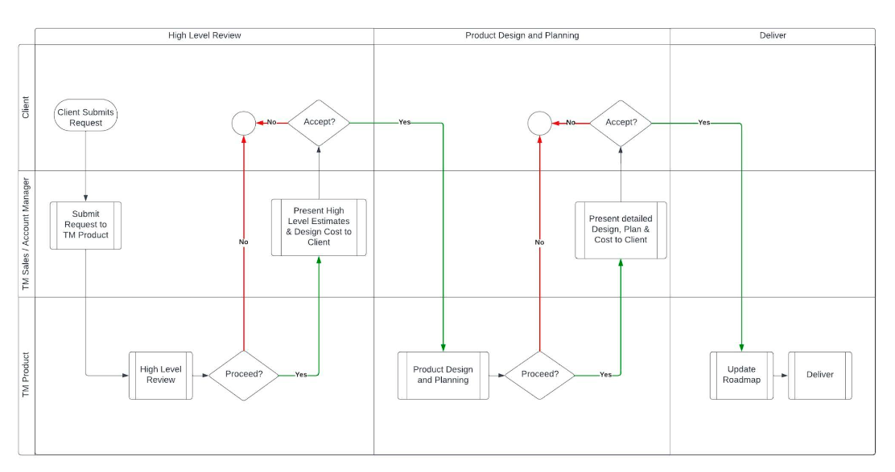

# Thought Machine Vault Core Acceleration Request Process

[Download PDF](/policy/latest/EN/resources/vault_core_acceleration_request_process.pdf)

## 1\. Purpose

The purpose of this document is to help clients understand how to interact with the Product Roadmap owned and maintained by Thought Machine.

## 2\. Owner

This policy is owned and maintained by Thought Machine’s Managing Director of Product and Programme Management.

## 3\. The Policy

### 3.1. The Vault Core Roadmap

Thought Machine’s Vault Core Product Roadmap is a strategic, high level document that outlines the overall vision, direction, and objectives of our product. It details Product Improvements we plan to make over the medium-term (the next 18 months) and our backlog which outlines what we intend to build in the long-term with no committed time frame. For further details on how Thought Machine manages and maintains the roadmap, please see the **Roadmap Planning Policy**.

### 3.2. How clients can interact with our roadmap

If a client wishes to discuss any content in our Product Roadmap, or to raise feedback or a new request, they can do that by contacting their Thought Machine representative. Thought Machine will consider any such feedback or requests but does not guarantee inclusion within the Product Roadmap.

Thought Machine additionally provides the option for clients to request accelerated delivery of Product Improvements, which, where agreed, is done by funding the work directly through a fixed price, fixed scope model. For clarity, acceleration requests are a means of accelerating items which will then be made generally available to all clients. Paid client acceleration work should not impact existing Product Roadmap commitments.

### 3.3. Acceleration Request Process

Please see below for a detailed process description and a high level process flow for an acceleration request.

#### 3.3.1. Stage 1: High Level Review

The client should notify their Thought Machine representative of their interest in accelerating a Product Improvement and provide sufficient detail of the request. Thought Machine will carry out a high level review of the request to assess suitability and aim to respond to the client within 2-3 weeks for Product Improvements that already exist on the backlog.

New items, not already on our backlog, may take longer to review as we will likely need to gather more information to first assess the suitability of the request as a Product Improvement. A request could be rejected by Thought Machine, including on the following grounds:

-   The request lies outside the designated product scope of Vault Core;
    
-   We already have a way of achieving the same ends, just not necessarily in the way the client proposes;
    
-   The request would compromise the design principles of Vault Core; or
    
-   The request is specific to a particular client, market or use case with no wider product benefit.
    

If the request is deemed suitable for acceleration, Thought Machine will review it to determine the size and complexity while also assessing our capacity to deliver it. If, following that review, Thought Machine determines that we are able to proceed, Thought Machine will provide the client with the following:

-   A short description of the request and our understanding of the use cases;
    
-   An initial, high level estimated cost range and effort range (in number of months) for implementing the request based on the high level requirement; and
    
-   A quotation of a fixed price for the completion of Stage 2(Product Design and Planning) phase to further refine the request.
    

For clarity, there is no commitment to accelerating the Product Improvement at this stage.

The client should confirm whether they would like to proceed based on the above information within 2 weeks. If the client would like to proceed on the basis proposed, the acceleration request will move to the Product Design and Planning stage.

#### 3.3.2. Stage 2: Product Design and Planning

Thought Machine will require client availability to collaborate on further refining the request and defining any agreed success criteria for the work.

Commencement of Stage 2 is subject to client’s payment of a fixed fee (referred to, and quoted for during Stage 1, above) covering the time and resources spent on refining the request and design.

If we learn through further refinement of the requirement and design that the request and/or proposed solution is not suitable for acceleration, the request could be rejected by Thought Machine and reasoning will be provided. The client may also, at any stage, withdraw the request for acceleration.

If Thought Machine and the client consider that the request continues to be suitable for acceleration, the expected outputs from Thought Machine during this stage include:

-   A design which includes:
    
    -   A concise description of the request and context of its benefit to clients;
        
    -   The use cases and any agreed success criteria for the request;
        
    -   The top level approach for the request, ie. what sort of shape the request will take when the client receives it (for example, this could be a change to an existing API, brand new functionality, or a change in product behaviour); and
        
    
-   A plan which includes:
    
    -   Quotation for a fixed price cost of a fixed scope for build and delivery;
        
    -   Assumptions that underpin the fixed scope and price;
        
    -   Delivery milestones against which we will report progress;
        
    -   The specific quarter in which the work will be delivered; and
        
    -   An expiry date for the plan (as detailed below).
        
    
-   The plan and quotation outlined above will be valid for a specified period only (such expiry date will be provided with the plan) after which the offer expires and Thought Machine will not be required to contract for the work. Prior to the plan expiry date, Thought Machine will offer a session to run through to the client on the design, providing an opportunity for the client to ask for any clarifications. This run through session is not intended as a negotiation around the offered timelines, costs, or designs.
    

The client should confirm that they would like to proceed based on the above information by the plan expiry date. If the client would like to proceed, subject to agreement and execution of a Statement of Work or other applicable contractual documentation, the acceleration request will move to the Delivery stage.

#### 3.3.3. Stage 3: Delivery

Once the applicable contractual documentation has been signed, Thought Machine will update the Product Roadmap based on what has been agreed and provide updates aligned to the milestones defined in the design as per the agreed frequency.

Thought Machine will notify the client once delivery is complete and the build has been included in a final release.

Note: Accelerated items will only ever be released as part of the latest release and as part of the standard cycle. They will not be backported to previous releases or outside of our standard release cadence.

(See Appendix 1)

## 4\. Changes to policy

Thought Machine as a product and technology company is always seeking to develop and improve its processes to ensure the best outcomes. Thought Machine therefore reserves the right to change this policy without prior consultation and where appropriate communicate these changes to clients.

## 5\. Governance

At a minimum, all company policies are to be reviewed annually or when off cycle material changes occur.

## 6\. Appendix 1

