# Vault Payments - Product Description - June 2026

[Download PDF](/policy/latest/EN/resources/vault_payments_june_2026.pdf)

## 1\. Introduction

Vault Payments is a cloud-native unified payments processing platform. Applying similar design principles to Vault Core, Vault Payments is a single, high-performance, payment-type agnostic platform with powerful configuration capabilities. The platform is designed to seamlessly support the performance requirements of low latency real-time payments as well as more traditional batch workloads, horizontally scaling to serve the largest banks.

Vault Payments is flexible and modular, enabling banks to build bespoke payments processing behaviour in the configuration layer, dynamically managed via APIs or a dedicated UI. All functionality is either hosted by Thought Machine as SaaS or self hosted, and accessible via API.

Vault Payments is core agnostic. It works seamlessly with Vault Core’s highly configurable Smart Contracts – allowing for the creation of financial products which leverage both cards, payments and ledger capabilities, such as buy-now-pay-later, credit cards, multi-currency accounts and more. Clients will also be able to deploy Vault Payments with any number of other core banking systems.

The following describes the main features and functionality that are part of the Vault Payments product, relevant to the release that it is published. Further details on the technical capabilities of the platform and information about the APIs can be found, and may be updated from time to time, on the Vault Portal.

## 2\. Definition of Terms

 
| Term | Definition |
| --- | --- |
| 
Account Link

 | 

Account Link is a Vault Payment’s resource that contains the information required for Vault Payments to direct an Instruction to a core banking system account. An Account Link can be referenced by one or more Payment Instruments.

 |
| 

Account Ranges

 | 

Used to segment a Banking Identification Number (BIN) into ranges with different attributes, enabling support for multiple card programs.

 |
| 

Configuration Layer

 | 

The Configuration Layer is a collection of resources that enable a payment lifecycle orchestration to be configured to an individual client by or on behalf of Thought Machine and/or by or on behalf of Client, by using Instruction Flows, Rules, Parameters, Integrations etc.

 |
| 

Configuration Library

 | 

A collection of pre-built configuration resources designed to accelerate the deployment and customization of payment processing within Vault Payments, available on the Vault Portal and updated by Thought Machine from time to time.

 |
| 

Instruction

 | 

An Instruction is a resource representing a request for, or provision of, information relating to a financial operation. One or more Instructions can make up a Payment.

 |
| 

Instruction Flow

 | 

Instruction Flows define the sequence of operations that Vault Payments will perform to process a Payment; they are a configuration resource that can be built and modified on demand.

 |
| 

OIDC

 | 

OpenID Connect (OIDC) is an authentication protocol that can be used by an application to authenticate users against a central Identity Provider (IdP), allowing federated applications and organisations to communicate and trust each other’s users. Vault Payment App (VPA) allows users to login via OpenID Connect.

 |
| 

Parameter

 | 

The Parameter and Parameter Value are the resources used by the Parameters API to provide a way to configure the behaviour of Instruction Flows and Rules without making changes to the underlying Python code, for example, to set a transaction limit within Instruction Flow code, a Parameter can be used to control this setting allowing for the value to be substituted for a different limit globally or for specific Payment Instruments even after the Flow or Rule has been created. Parameters are not tied to any specific Instruction Flow or Rule.

 |
| 

Payments Engine

 | 

The Payments Engine assigns an Instruction Flow to each Instruction based on Rules that match the instruction’s attributes, and then executes the configuration defined in the Instruction Flow and in the Rules associated with the related Payment Instruments and Account Links.

 |
| 

Payment Instrument

 | 

Payment Instrument represents any instrument that can receive and initiate instructions such as the tokenised PAN for a card, or sort code and account number for a current account. A Payment Instrument dictates where to route Instructions and Payments received from or sent to a scheme.

 |
| 

Platform Layer

 | 

The Platform Layer is a shared payment execution engine that orchestrates the payment life cycle from initiation, through to validation, authorisation, scheme submission and, finally, postings. Payments are submitted to the Payments Engine via Instructions API.

 |
| 

Rule

 | 

Rules define the behaviour that should be run when processing an Instruction. The Rule is defined using Python. Rules can be combined into Rule Sets as a way of grouping of common behaviours that can be reused across different use cases.

 |
| 

Step

 | 

Steps dictate the operations performed within Instruction Flows. Steps are represented by a set of types defined in the Flows API module from the Vault Payments SDK. Steps can update the Instruction fields, call out to an Integration, send the Instruction to Manual Intervention, etc. Each Step must return the next Step to be executed or indicate end of the Instruction Flow

 |
| 

Vault Payments App

 | 

The Vault Payments App is a web-based user interface for the Vault Payments platform, designed to enable bank operators to investigate, repair, initiate and configure payment processing.

 |

## 3\. The Two Layer Architecture

The heart of the Vault Payments platform is based on two layers: (1) the universal payments engine (“Payments Engine”) residing in the Platform Layer and (2) the Configuration Layer.

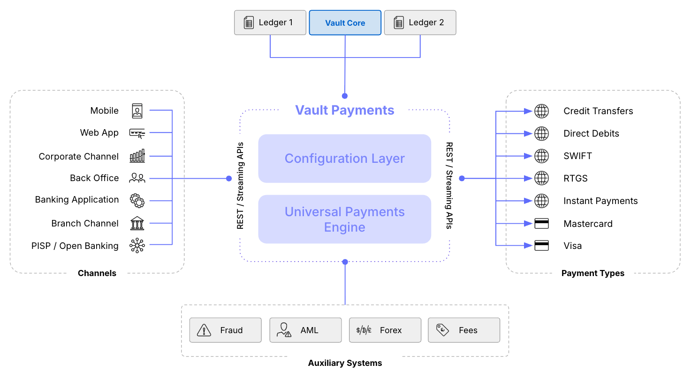

Each layer consists of different components that enable clients to efficiently manage their payments processing by consolidating all payment processing in a single system.

Both layers and their components are described in more detail in the following paragraphs. The following functional architecture diagram highlights where the individual components reside.

### 3.1. Configuration Layer

The Configuration Layer allows clients to configure their own payment life cycle orchestrations. These configurations model the requirements for the payment type, the rules of the payment scheme, regulatory compliance, the operational procedures of the client and bespoke customer offering. The Configuration Library includes example packs which are a collection of pre-built configuration resources (also referred to as “Templates” in the MSA).

The Configuration Layer consists of several key resources which can all be defined and configured by the client:

-   **Instruction Flows**
    
-   **Account Links and Payment Instruments**
    
-   **Rules**
    
-   **Parameters**
    

#### 3.1.1. Instruction Flows

Instruction Flows are configurable payment execution plans that govern how each Instruction is processed. These define the sequence of operations that Vault Payments will perform to process a Payment. Instruction Flows are built from a series of Steps that define the Instruction lifecycle (e.g. updates, schedule & warehouse, external integration, mandate etc). Clients can define as many Instruction Flows as they need, and assign them to Instructions using Rules which evaluate the Instruction’s fields in realtime.

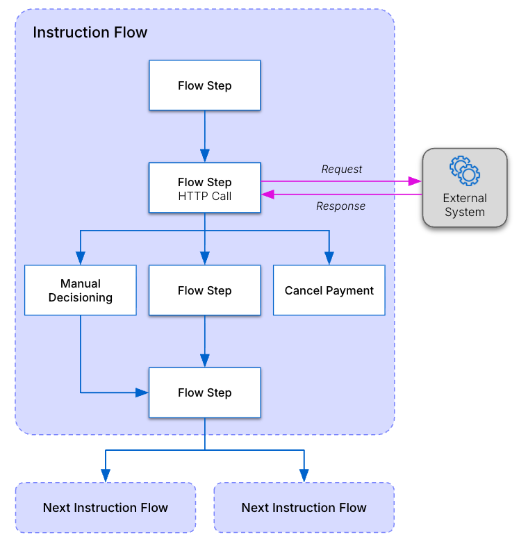

Instruction Flows are a configuration resource that can be built, modified and deployed on demand. Changes are applied via API calls without the need for vendor deployment and releases. Written in Python, they offer unprecedented control over the business logic, allowing clients to directly refer and act on instructions and their fields and essentially write their own payment systems, using shared payment-specific services (e.g. calendars, warehousing, routing etc.), and without having to worry about the considerable infrastructure required for a bank-grade payment processing platform.

Clients can define and deploy as many Instruction Flows as they require. This helps keep flows simple as they don’t need to reason about multiple and sometimes conflicting requirements, and also allows clients to create flows which are dedicated to specific use cases.

Furthermore, as new message types payloads are introduced to the platform, banks can rapidly add flows that utilise these new payloads, without having to wait for the vendor to provide them, and without compromising on their implementation.

Instruction Flows are made up of Steps which clients can add and link to each other to define the Instruction lifecycle. Each Step defines business logic and activities using Python:

-   **Updates** - Any fields on the Instruction, such as the value, fee, etc., can be updated to influence payments processing.
    
-   **Step selection** - Each Step is linked to a default next Step in the Instruction Flow. Decision logic can be used to select alternative Steps, using the data on the Instruction, a response from an externally integrated system, or based on other values, allowing clients to control the outcome of each Instruction.
    
-   **External integration** - allows Vault Payments to interact with an external system (e.g. AML, sanctions, FX) and retrieve data. More on this in the ‘External Integration Framework’ section.
    
-   **Postings** - Providing flows with the ability to send posting requests to core banking systems.
    
-   **Send to manual decisioning** - By initiating manual decisioning, control over the Instruction will be transferred to the Vault Payments App. Instructions can be sent for review, action, or repair, depending on their attributes or the results from external integration responses. This will prompt the Instruction Flow to communicate with the Vault Payments App, specifying the necessary action. After the manual decisioning is completed, the step will resume handling the instruction by using the outcome to determine the next step in the processing flow.
    

We intend to add more built-in step activities to expand the platform capabilities and to simplify Instruction Flow writing.

Further functionality (‘Flow selection’) is planned to dynamically select the Instruction Flow (and by extension the method of payment) to use for each instruction based on configurable rules (e.g. high or low value, or any payment field or configuration value).

#### 3.1.2. Account Links and Payment Instruments

Vault Payments is built on the principle that the payment instrument (e.g. IBAN, BBAN, card, or any other identification method) and the funding source (the account on the ledger) should be decoupled, in order to allow maximum flexibility in defining how payments are routed to different accounts and core banking systems.

Vault Payments takes a much more active role than usual in routing postings to the core banking systems. Unlike traditional systems which post an instruction and expect a messaging hub to reason on where they need to go, Vault Payments treats this as a first class concept. Our product manages the relationship between accounts and where they reside and routes postings dynamically to the relevant Core using the rule engine.

Payment Instruments are a flexible resource that allows any account identifier to be represented, such as an IBAN, tokenised PAN, or an email address. This allows the client to accept or send payment from an account, regardless of how it is identified externally to the market.

Account Links ​​contain the information required for Vault Payments to direct an Instruction to a core banking system account. Account links can point to different core banking systems, allowing multiple ledger systems to be posted to.

Vault Payments exposes APIs for creating and updating Payments Instruments and Account Links, allowing clients to keep the state of the routing information in Vault Payments in sync with the accounts they represent.

#### 3.1.3. Rules

Rules define the relations between Payment Instruments and Accounts Links. Written in Python, and assigned to Payment Instruments, Rules can evaluate any attribute of a payment Instruction, and determine which Account Link to use.

Rules are also used to implement restrictions on accounts, offering a granular approach for the evaluation and application of restrictions based on the payment’s amount, source, direction and more. Evaluating restrictions in Vault Payments can reduce the volume of calls to the core banking system.

Finally, Rules can also be used to update instructions, providing a flexible means for auto-repairing incorrect data or adding data such as address, etc.

Vault Payments exposes APIs for creating and setting Rules, enabling a client to allow its customers to configure their own rules by integrating these into a customer-facing app. For example, a customer could define self-imposed payment restrictions based on amount or payee details.

#### 3.1.4. Parameters

Parameters define specific data points within rules or Instruction Flows, providing an easy way to manage these resources.

Within Instruction Flows, Parameters can be used to manage changes to regulations, scheme rules, payment system operational guidelines and internal processing procedures. Vault Payments facilitates changes to Parameters through a user-friendly interface, empowering business users to independently implement changes without needing to update an Instruction Flow.

Parameters are also present in Rules as part of the rule management resources. The ability to attach Rules and Parameter values to Payment Instruments enables a modern differentiated customer experience.

### 3.2. Payments Engine

The Payments Engine orchestrates the payments lifecycle from initiation, through to validation, authorisation, scheme submission and finally postings. Payments are submitted to the Payments Engine via an API as an Instruction resource which is modelled using the ISO 20022 specification.

The Payments Engine does not incorporate the orchestration logic, but rather it assigns an Instruction Flow to each Instruction based on Rules that match the Instruction’s attributes, and then executes the configuration which was defined in the Instruction Flow and in the Rules that were associated with the payment’s Payment Instruments and Account Links.

#### 3.2.1. Interchangeable Payloads

Payment processing involves handling a large number of payment messages with more added as existing payment schemes evolve and new ones emerge. Vault Payments is built to allow rapid and seamless introduction of new message types, ensuring that users can keep up with changing market requirements.

All payment messages are represented as a single Instruction resource with an interchangeable payload. A payload represents a message containing a particular set of fields for a specific purpose (as per the ISO20022 message definitions). Instructions are received either from the client’s stack (channels and client applications) or from the market (CSMs), and are each assigned a payment flow based on its attributes. Once submitted, Instructions are consumed, persisted and executed by the Payments Engine using the selected Instruction Flow.

Payloads are all modelled after the ISO 20022 (pacs.008, pacs.003, pain.001 etc) making the platform ISO 20022 natively compliant out of the box. This makes the system future proof as it allows the introduction of new message types rapidly, with no need to write new code to support them, other than defining their structure.

Payloads are documented and exposed via Vault Payments API, allowing clients to submit and consume instructions in native ISO 20022 format.

#### 3.2.2. External Integration Framework

A payment engine must be able to call out to various services during the lifecycle of the payment. We believe that clients should have full control over which types of services to call, when to call them, how the messaging looks and how to handle the responses. Vault Payments does not mandate 'fixed' exit points that can at most only be tweaked slightly by parameterisation. Instead, the Instruction Flow and the Integration Framework allows clients to define as many exit points as they need, and how they function.

At the core of the integration framework is the Integration resource, which defines the protocol of the integration, where to reach it and the credentials which are needed to authenticate with the integration.

Once created, the Integration resource can be used in any Instruction Flow which requires the ability to call that particular integration.

Clients have the ability to define the message format that will be sent to the integration. Similarly, there is no strict requirement to define the structure of the response. The Python code within the Integration step enables flow writers to access the response fields, evaluate their values, and use them in their business logic.

Vault Payments can reach integrations on the public internet or via AWS PrivateLink in a selection of regions.

When integrating with modern, supported protocols, there is no need to provision an integration layer, as the Integration configuration provides all the required tools. However, when integrating with systems that expose endpoints via legacy technologies, a client must provision an endpoint to facilitate the integration.

Like all other configuration resources, the Integration resource is managed via the Payments API. The status and details of an Integration can also be checked using the Integrations section of the Vault Payments App.

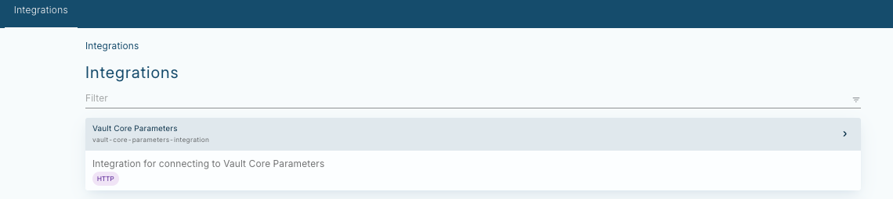

#### 3.2.3. Calendars, Warehousing, and Scheduling

Vault Payments comes with configurable calendars and schedules to support multi-day payment schemes and future-dated payments. Multiple distinct calendars can be configured to support scheduling payments for various payment schemes. Instructions with future execution dates are automatically warehoused and scheduled for further processing. When the scheduled processing time is reached the instruction is awoken and processing continues automatically.

#### 3.2.4. Files Handling

The platform supports the capability to upload files for storage and further processing such as file-based payments and membership directories. Users can store and retrieve any file in Vault Payments in a unified way such as CSM membership directories and more. These can be referenced during Instruction Flow execution to dynamically influence the way payments are processed. Since the system stores these files in their raw format, users should ensure all data validation and sensitive information obfuscation are completed prior to upload.

## 4\. Vault Payments App

Vault Payments comes with a web based user interface - the Vault Payments App. This currently offers four main functions:

-   Manual Payment Initiation
    
-   Investigation and Repair
    
-   Configuration
    
-   Dashboards
    

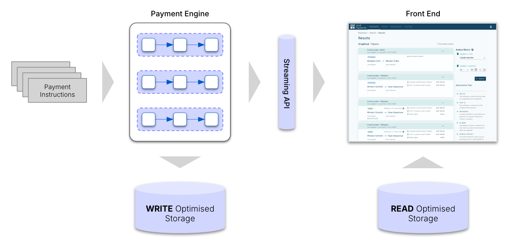

### 4.1. Manual Payment Initiation

The Payment Initiation capability enables operators and non-technical users to create and execute payment Instructions directly through the UI using “Payment Initiation Templates”. Users can choose from a library of pre-defined Templates. The platform supports the capability to amend existing Templates or create entirely new Templates from scratch. Instructions can be created for a specific Payment System or deferred to logic defined by the Instruction Flow. Use cases include but are not limited to:

-   Internal and operations transfers: moving funds between internal accounts or managing treasury and liquidity adjustments; and
    
-   Customer service support: initiating payments on behalf of customers or processing adjustments between customer and internal accounts like compensations and refunds.
    

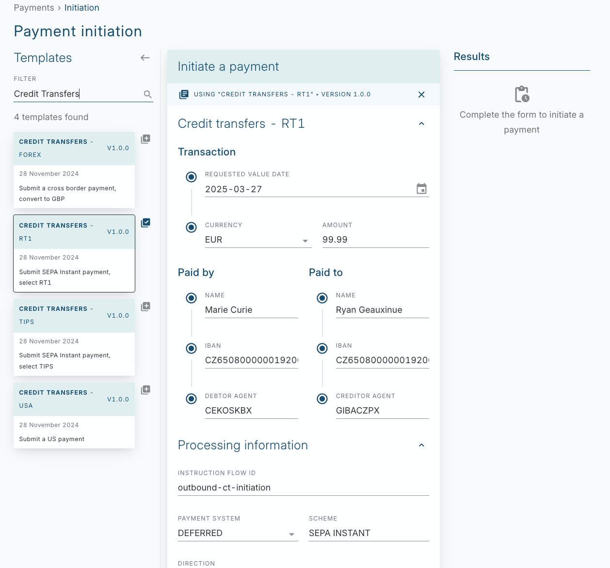

### 4.2. Investigation and Repair

Vault Payments maximises straight-through-processing rate through automation of enrichment and decision making which is defined using the configuration layer.

However, for cases where manual investigation is required, Vault Payments provides a native user-friendly UI. The UI is backed by a separate data store that consumes data in real-time from the processing engine, thereby decoupling processing from search and filtering activities, ensuring the latter does not affect the former negatively.

Related Instructions are linked and presented together as payments, providing a clearer picture of a payments state, and allowing for quicker investigation and resolution. For example, a credit transfer and subsequent return will be presented together as a single payment.

The front end storage is powered by Elasticsearch which offers full text search capabilities on many Instruction fields. This gives users a very powerful tool for searching and filtering, without compromising the processing database.

Users can leverage common UI filters or the full flexibility of Search Query Language (SQL) directly within the Vault Payments App to return specific data and refine search results. Presets can be used to persist searches and easily reuse them later.

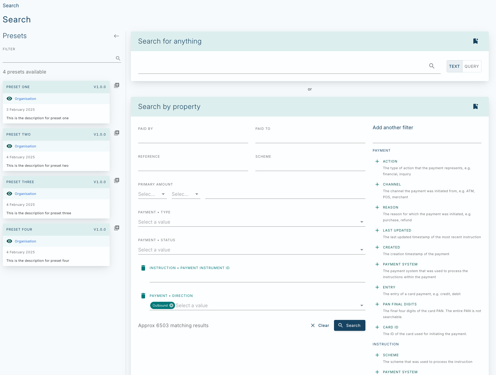

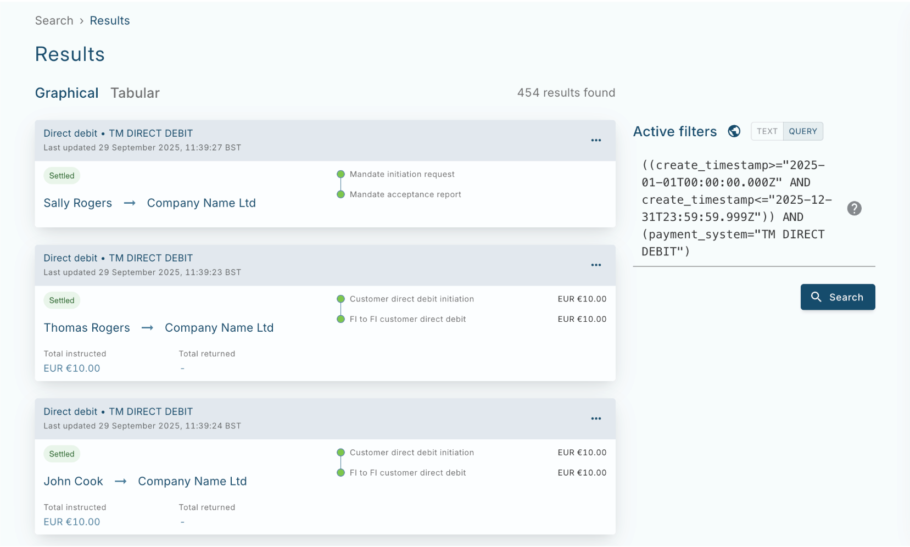

From the search screen, users can drill down into any Instruction, and see all of its fields presented in a user friendly manner. Each stage in the Instruction Flow is visualised with its outcome. This interface can be used to investigate, as well as repair payments by updating values and manually retrying relevant steps.

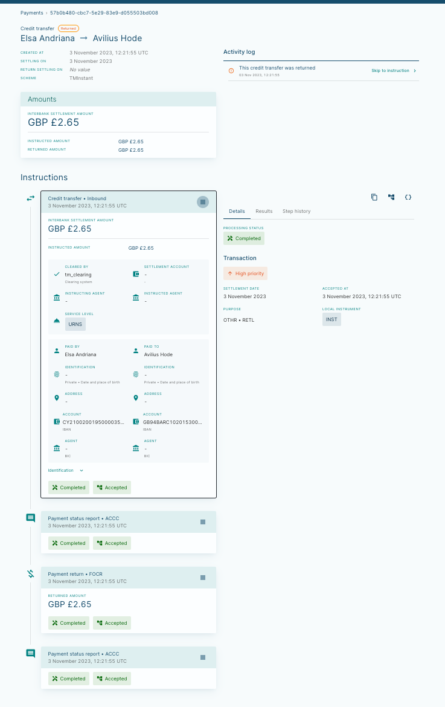

In addition, the raw messages are available as well to be viewed directly from the same UI by technical users with the appropriate permissions.

To support payment repair or exception handling, the Investigation & Repair app supports manual decisioning. The actions that are available to an operator when making a manual decision are fully configurable based on the client’s business logic. Timeouts and default decisions can also be configured to ensure compliance with SLAs.

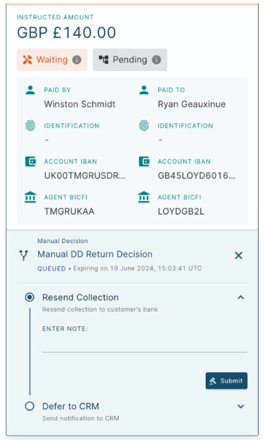

### 4.3. Configuration

The Configuration application is a UI based management system for viewing and validating Instruction Flow resources in the Configuration Layer.

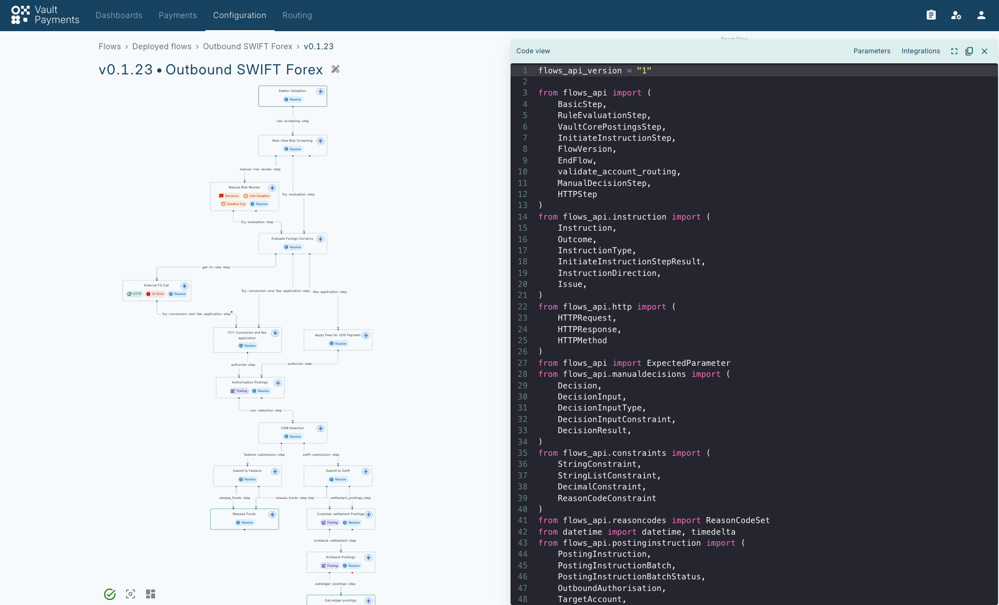

### 4.4. Dashboard

The Dashboard section provides informative aggregate business metrics to users, allowing them to inspect the behaviour of the system at a macro level. Currently we have built the framework to consume streamed data from the backend and define Dashboards.

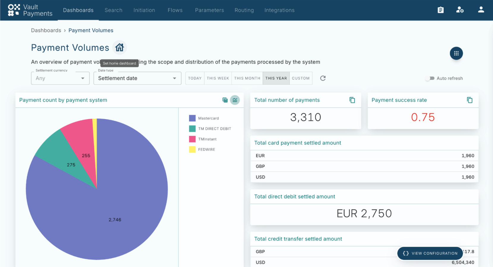

### 4.5. Access Management

#### 4.5.1. Application access

The Vault Payments App can integrate with a client’s identity management solution via OIDC. The client provides the user id and role within the access token. Permissions are assigned to roles within Vault Payments.

#### 4.5.2. UI access

Vault Payments will include a User Access Management (UAM) module which provides control over users access to data and activities via the Vault Payments App. The UAM module will support setting up roles and assigning these to users. Roles have permissions associated with them, which are granted to assigned users.

Permissions can define which data resources a user can access, and under which conditions, e.g. a user can access credit transfers with an amount lower than ‘X’. Permissions also control which activities a user can take. For example, cancel a payment or retry fund authorisation.

Each activity can also be assigned a number of required approvals. Only users with the relevant approval permissions can approve such activities.

Furthermore, any activity (including viewing a payment) is logged and is available for auditing, allowing clients to audit the actions that have been performed, by which user, and when.

## 5\. APIs

The Vault Payments platform consists of different types of APIs:

### 5.1. Streaming APIs

All data - payment and configuration - is streamed out via Vault Payments Streaming API (events) and can be easily ingested into clients’ secondary data stores for data analytics, reporting and other use cases.

### 5.2. REST APIs

The Vault Payments platform offers convenient ISO 20022-compliant RESTful APIs for creating, updating and retrieving payment data. The standard and consistency makes it easy to understand and interact with, as well as providing rich data.

## 6\. Vault Core Integration

Vault Payments is pre-integrated with Vault Core for postings and balance checks. It will offer a configurable posting generation, to any number of accounts or any type of account during the execution of a payment in an Instruction Flow. This can be fully defined by the client.

Using Vault Core as the ledger and financial product engine behind Vault Payments rails can deliver product innovation opportunities for clients. This can be achieved by combining the flexibility of Smart Contracts and Instruction Flows configurability.

Integration of other cores banking platforms is handled as described in the ‘External Integration Framework’ section.

## 7\. Card Payments

Vault Payments card management module provides a flexible way to configure and manage BIN Account Ranges and card products, as well as issue cards to cardholders and perform the full card lifecycle (inactive, active, suspended, disabled). The Vault Payments card management APIs allow all of this to be driven through integrations.

### 7.1. Account Ranges and BIN Management

The Vault Payments platform supports setting up and configuring BINs, splitting BINs by Account Ranges, and applying ranges to card products, allowing a BIN to represent many different card products.

### 7.2. Card Issuing

#### 7.2.1. Card Products

The Vault Payments platform supports the definition of card products such as the card networks they apply to, BIN and Account Ranges, whether they are physical or virtual, the personalisation bureau that will issue them and other attributes related to card issuance.

#### 7.2.2. Cardholders

Card user details are managed within the platform and are used for the purpose of issuing cards and facilitating 3DS challenges.

#### 7.2.3. Card Management

Vault Payments supports the ordering and management of cards. The platform manages the issuing of cards, full card lifecycle management - freezing, unfreezing, renewal, replacement and end of life, as well as assigning limits, restrictions and other card controls.

#### 7.2.4. Integration to Personalisation Bureau

Vault Payments offers an integration with Idemia’s card issuing & pin mailer services. Vault Payments sends card orders for manufacturing to Idemia and tracks their status. Use of this integration is subject to a client entering into a direct contractual relationship with Idemia for card manufacturing and issuance services.

#### 7.2.5. Integration to Strong Customer Authentication

Vault Payments provides an integration with Outseer’s SCA platform. New cards are registered with the Outseer platform, allowing payments to be authenticated using SMS OTP, Out Of Band (OOB) and Email OTP. Use of this integration is subject to a client entering into a direct contractual relationship with Outseer for SCA services.

### 7.3. Security

-   Vault Payments is PCI-DSS certified
    
-   Vault Payments is provided with an integration to a cloud HSM
    

### 7.4. Mastercard Network Support

Vault Payment is certified with the Mastercard network for issuing cards and processing payments in Europe.

### 7.5. Visa Debit Processing Services (DPS) Support

Vault Payments is certified with the Visa DPS service for issuing cards and processing payments in the US.

## 8\. Resilience, Availability and Disaster Recovery

Vault Payments SaaS is designed for High Availability across all infrastructure components, which are deployed and replicated across multiple data centres in a single region.

Vault Payments is deployed in an active-active-active state across data centres in the primary host region, which means that all data centres receive production traffic under normal operating conditions. If a data centre were to fail, production traffic is automatically routed to the other available data centres. Therefore, the failure of a data centre within a single region does not impact the uptime of Vault Payments SaaS.

Vault Payments SaaS has a primary and secondary database deployed in two separate data centres with synchronous data replication between them. This deployment pattern achieves a Recovery Point Objective (RPO) of 0 and a Recovery Time Objective (RTO) of between 60 and 120 seconds in the event of database failure.

Thought Machine performs Disaster Recovery testing at defined time intervals to ensure ongoing resilience against component failure.

## 9\. Performance

### 9.1. Introduction

The performance of Vault Payments is defined by its ability to maintain high throughput and low latency in production. Vault Payments consists of modular, stateless services that scale horizontally across data centres, and uses Kubernetes for orchestration and Istio as a service mesh.

### 9.2. Results

Here we discuss the performance results of a fixed TPS test, designed to verify that Vault Payments can sustain a fixed throughput and report on its latencies. The test had a brief ramp up period and then recorded the latency of processing 10,000 TPS over a period of 20 minutes. The results were obtained using a standard outbound ACH instruction flow to verify the system’s capacity for fixed, high-volume throughput. All external calls were replaced with CPU-bound steps to simulate the strain on the system.

-   Sustained Throughput: 10,000 Transactions Per Second (TPS)
    
-   Process Latency: The test achieved a P95 latency of 800ms
    

For the majority of the test duration, the system maintained a P95 of approximately 500ms and a P99 of approximately 900ms.

### 9.3. Infrastructure

We provide a breakdown of the infrastructure configuration that was required to produce the given results.

 
| Component | Description |
| --- | --- |
| 
Cloud Provider

 | 

AWS

 |
| 

Kubernetes

 | 

EKS 1.32

 |
| 

Database

 | 

PostgreSQL 15.10 (Aurora db.r6g.2xlarge; 1 primary, 1 read)

 |