# Introduction to Grafana and key dashboards

## Overview

Observability is an aggregation of tools, technologies, metrics, alerts, and dashboards that can provide further insight into the inner workings of Vault Core.

Metrics are quantifiable measurements that reflect the health and performance of applications or infrastructure. For example, application metrics might trace TPS (transactions per second), while infrastructure metrics might measure how many CPU or memory resources are consumed on a server.

In order to help support your Vault Core deployment, as part of its observability offering Thought Machine provides dashboards \`out-of-the-box' for use with Grafana.

### Observing Vault Core metrics in dashboards with Grafana

Grafana is open-source visualisation/analytics software that allows users to create dashboards using Prometheus metrics in real-time. It allows you to query, visualise, explore, and alert on your metrics regardless of where they are stored, and turn your time-series database (TSDB) data into graphs and visualisations.

Here, you can explore these useful dashboards and list them in a logical order for you to check them if you think there could be a problem with Vault Core. There is also a guide for accessing the dashboards with Grafana.

### Audience

This information aims to help clients with a bank-hosted instance of Vault Core and Site Reliability Engineers (SREs) of bank-hosted Vault Core customers and technical learners, including engineers.

With practice and experience, users can explore and utilise the various features of Grafana to create more advanced dashboards.

### Before you start

You can view the dashboards that ship with every Vault Core release with Grafana. In order to do so, you must:

-   Install and configure the observability component (Observability Stack) when you install Vault Core and install it before any other component
    
-   Use Grafana (and, if necessary, configure it); at a minimum the image for the Enterprise distribution (grafana-enterprise) needs to be available when installing the `observability` component. However, you may prefer to host your own Grafana distribution instead, such as grafana-oss.
    

With each new release of Vault Core the `release.json` artefact indicates the version and location of the Grafana image that is compatible with the supplied dashboards. This image is not available from the Thought Machine registry for licensing reasons.

chat\_bubble

The Grafana Enterprise image that the `release.json` file specifies does not require a license key and has feature parity with the Grafana OSS edition. For more information, see [https://grafana.com/licensing/](https://grafana.com/licensing/).

There are typically three types of Grafana use cases - where Thought Machine manages your instance of the standard, free and proprietary-licensed Grafana Enterprise (without the specific Enterprise features) or where you manage your instance of Grafana OSS or Grafana Enterprise instance.

You only need to update and maintain your Vault Core dashboards if you choose to manage Grafana yourself. Clients are responsible for configuring, using, managing, and importing dashboards into their client-managed Grafana instance; however, the Vault Core documentation provides some information to help you to do this.

To learn more about these and whether you need to take any action, refer to [Using Grafana dashboards](/vault-core/5-8/EN/environment_and_installation/infrastructure_docs/observability_and_monitoring/using_the_observability_stack#using_grafana_dashboards) in the [Using the Observability Stack](/vault-core/5-8/EN/environment_and_installation/infrastructure_docs/observability_and_monitoring/using_the_observability_stack#grafana_dashboards_included_in_the_observability_stack).

## Key dashboards

Thought Machine provides a suite of dashboards with Vault Core that allows clients to monitor, observe, and gain insights into Vault Core by using the Grafana observability platform.

This guide highlights some of the key dashboards and use cases, in groups according to the name of the folder (area of functionality) that they belong to.

For more information about the available dashboards and configuring Grafana, refer to the following guidance in the [Using the Observability Stack](/vault-core/5-8/EN/environment_and_installation/infrastructure_docs/observability_and_monitoring/using_the_observability_stack):

-   [Using Grafana dashboards](/vault-core/5-8/EN/environment_and_installation/infrastructure_docs/observability_and_monitoring/using_the_observability_stack#using_grafana_dashboards) - a guide to using the dashboards for all users, with additional instructions about how to import and update dashboards for those who manage Grafana themselves
    
-   [Grafana dashboards included in the Observability Stack](/vault-core/5-8/EN/environment_and_installation/infrastructure_docs/observability_and_monitoring/using_the_observability_stack#grafana_dashboards_included_in_the_observability_stack) - a full list of dashboards that are available in Vault Core
    

chat\_bubble

Vault Core 5.x comes with a number of new dashboards and does not include dashboards that ship with but are only relevant to previous versions of Vault Core. These changes include a new set of dashboards for the [Ledger](/vault-core/5-8/EN/environment_and_installation/infrastructure_docs/observability_and_monitoring/introduction_to_grafana_and_key_dashboards#ledger_dashboards).

## Kubernetes dashboard

### Deployment Reliability

This provides an overview of a cluster by showing container-level events, CPU throttling, HPA events and alerts.

In the **Alerts** panel, you can view any notable events that might have occurred across the whole cluster:

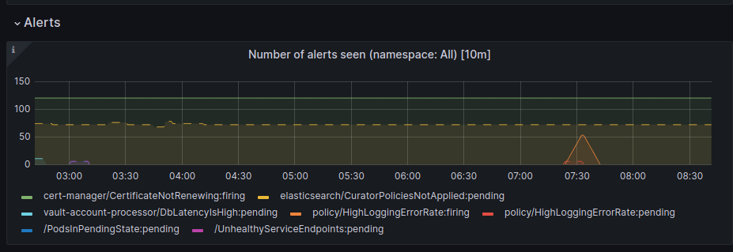

The Alerts panel also contains boards with related information under **Memory Reliability** and **CPU Reliability**:

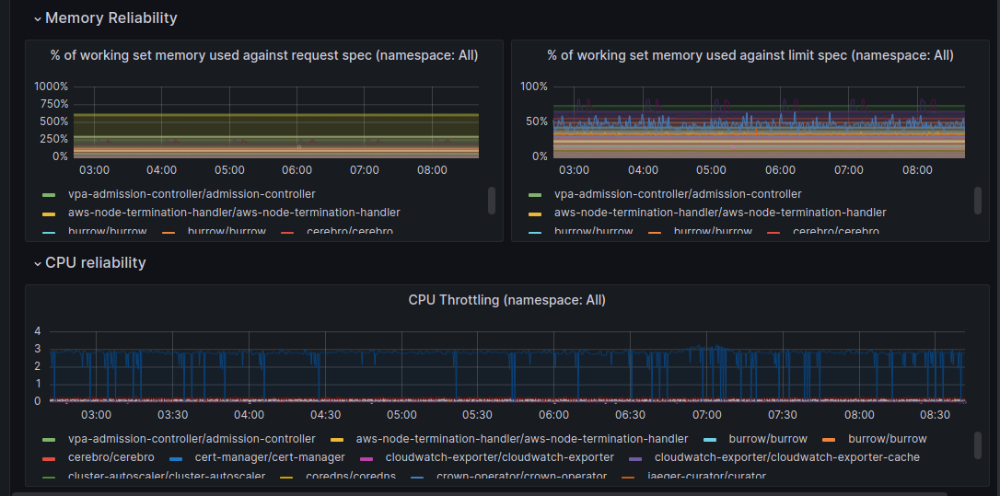

## Kafka dashboard

### Kafka Topics / Consumer Lag

This displays Kafka topic details independent of brokers. It provides an overview for seeing bottlenecks in applications, with information in the **Consumer Lag** panel.

chat\_bubble

In Vault Core 5.1+, only the **Consumer Lag** panel is available. Vault Core 5.0 and earlier displays panels for **Messages Inbound Rate**, **Bytes Inbound Rate**, **Bytes Out**, **Message count**, **Messages ever seen**, **Partitions**, **Read-only partitions**, **Under-replicated partitions**, and **Consumer-assigned partitions**. Most of these metrics are not available to clients with bank-hosted environments.

#### Consumer lag

The **Consumer lag** panel shows the number of messages in our Kafka topics against a period of time. You could use this to monitor the health of the Kafka topics and identify any lag. You should monitor and reflect it as an alert if the pattern is different from other days.

chat\_bubble

While the consumer lag metrics that Vault Core scrapes work on some managed Kafka providers, some are also known not to work.

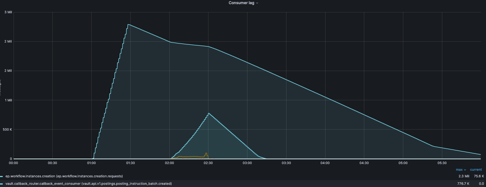

### Kafka Clients Producer

This displays statistics for applications producing messages into Kafka. Create an account based on the Smart Contract and then observe that a scheduled job request message is produced on the `vault.core.scheduler.job_outstanding.requests` topic on the board.

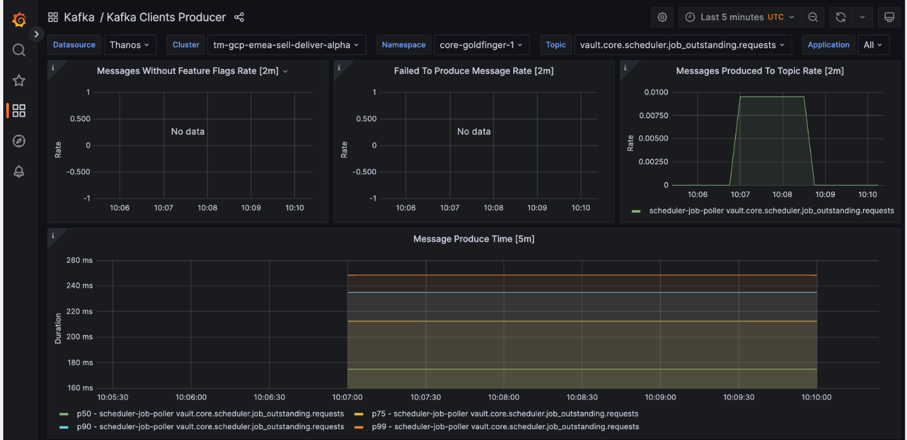

## Sync Comms dashboard

### gRPC Clients

This displays statistics about all gRPC calls made by an application. It allows you to see failing gRPC requests between services and failed requests, timeouts, and request times.

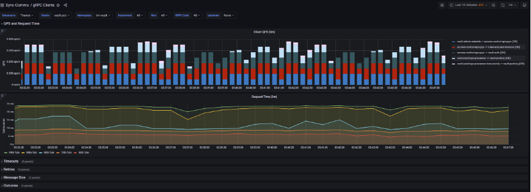

## Smart Contracts dashboard

chat\_bubble

Vault Core 5.0 introduces a new set of dashboards that relate to the **Ledger**. Among these are **End of Day Overview** and **Point in Time Overview**. These, along with the other journey dashboards and **Contract Platform Libraries**, replace the **Contract Engine Account Scheduling** and **Contract Engine** dashboards (available in earlier versions of Vault Core).

### Contract Platform Libraries

This displays metrics for the performance and health of the Contract Platform. These metrics are available across the following panels:

-   **Deployment Information**
    
-   **Contract Platform Resource Fetching**
    
-   **Contract Platform Requirements Fetching**
    
-   **Contract Platform Hook Execution**
    
-   **Directive Committing**
    

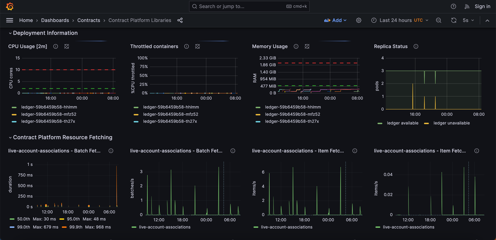

## Scheduler-related dashboards

### Schedule Manager Execution Processing

This dashboard provides high-level views on the execution processing component of the Schedule Manager, which interacts with Vault Jobs. It displays schedule execution information across the **Execution Processor** and **DB Overview** boards. For Vault Jobs, a Scheduled Job is a \`Schedule Execution' in Schedule Manager.

The **Overview - Postgres** dashboard in the **Database** folder provides further insights into the health of the database.

chat\_bubble

For more information about Vault Jobs, see the [**Vault Jobs** dashboard](/vault-core/5-8/EN/environment_and_installation/infrastructure_docs/observability_and_monitoring/using_the_observability_stack#vault_jobs) and [Vault Jobs](/vault-core/5-8/EN/reference/core_apps_and_operations_dashboard/vault_jobs) documentation.

#### Execution Processor

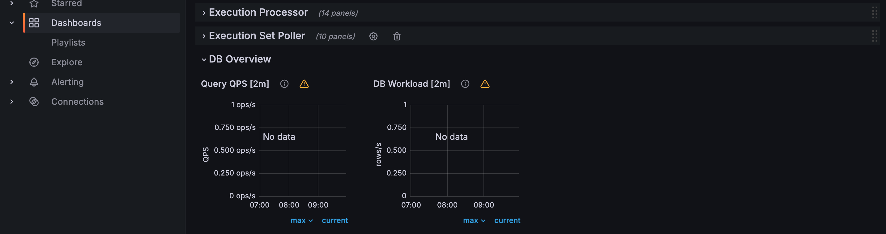

#### DB Overview

### Database / Overview - Postgres

The **Overview - Postgres** dashboard is part of the **Database** collection of dashboards. Use this dashboard to check the database load. A request might fail when the database connection has broken or the database is down.

Check the DB Management table on AWS/GCP; take note of Database health and also IOPS (I/O operations per second) usage.

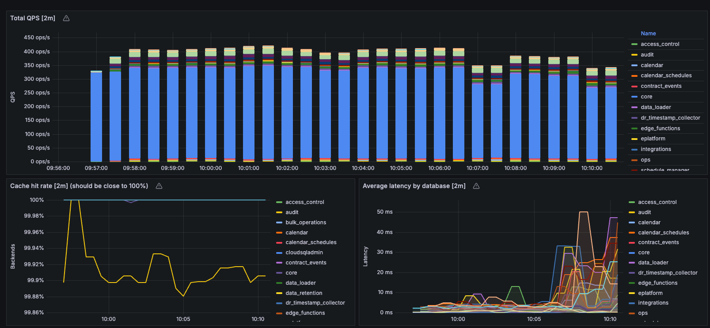

### Schedule Jobs Processing

The **Schedule Jobs Processing** dashboard provides insights into the processing of Schedule jobs within Scheduler services. This includes job dispatching and job outcome processing, but does not include job execution. For a more holistic view of jobs, refer to the [\[V5+\] End of Day dashboard](/vault-core/5-8/EN/environment_and_installation/infrastructure_docs/observability_and_monitoring/introduction_to_grafana_and_key_dashboards#end_of_day).

#### Job Poller - Application metrics

The Job Poller is responsible for finding jobs that are ready to be executed and sending them to the Job Dispatcher. The **Job Poller - Application metrics** section shows the rate of jobs that have been read from the database and processed, and the duration of time taken for the Job Poller service to process job batches.

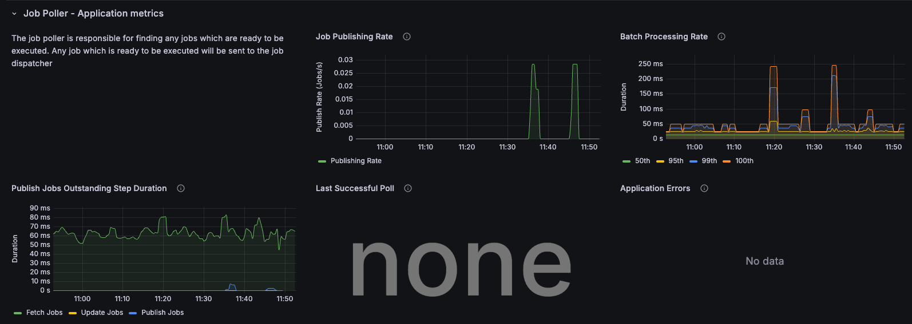

#### Job Poller - Deployment Info

The **Job Poller - Deployment Info** section shows data about the deployment, such as the CPU usage and memory usage of the Job Poller service, as well as the average CPU usage by node.

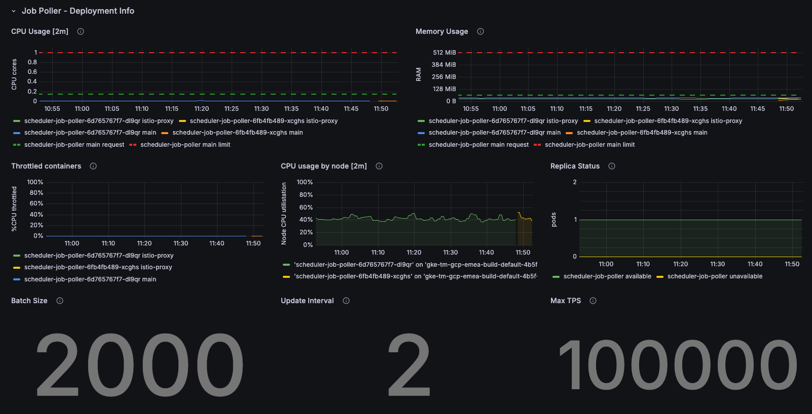

#### Job Dispatcher - Application metrics

The Job Dispatcher is responsible for sending jobs to the correct executor. The **Job Dispatcher - Application metrics** section shows the rate at which messages are published, the rate they are being processed, and the duration of time taken for the Job Dispatcher service to process job batches.

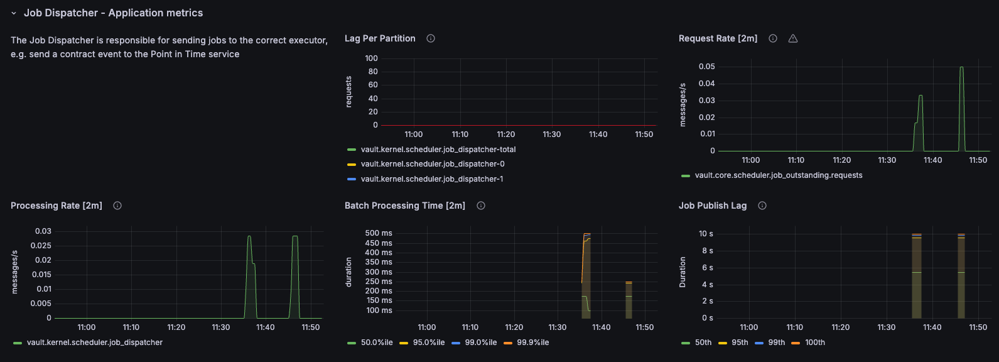

#### Job Dispatcher - Deployment Info

The **Job Dispatcher - Deployment Info** section shows data about the deployment, such as the CPU usage and memory usage of the Job Dispatcher service, as well as the average CPU usage by node.

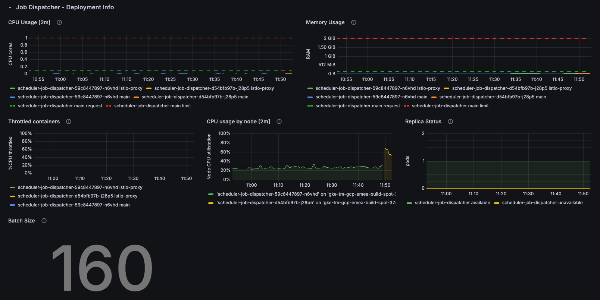

#### Outcome Processor - Application metrics

The Outcome Processor is responsible for handling job outcomes. The data in the **Outcome Processor - Application metrics** section is used to update the job, unblock future jobs, and send job outcomes to the Operation Processor for processing tag notifications.

The panels show the rate at which messages are published, the rate they are being processed, and the duration of time taken for the Outcome Processor service to process job batches. They also show the status of job outcomes and the time taken for a job to complete.

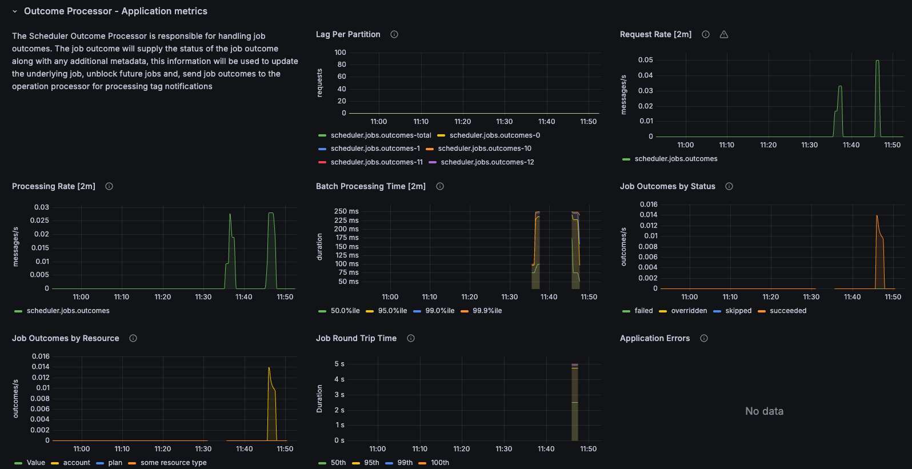

#### Outcome Processor - Deployment Info

The **Outcome Processor - Deployment Info** section shows data about the deployment, such as the CPU usage and memory usage of the Outcome Processor service, as well as the average CPU usage by node.

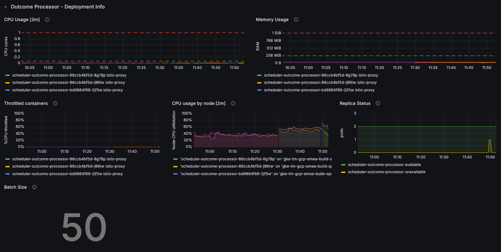

#### Operation Processor - Application metrics

The Operation Processor is responsible for consuming ScheduleExecutions from `scheduler.schedule_execution.events` and reporting operation events, which are then published for a tag once all jobs associated with the tag are completed.

The **Operation Processor - Application metrics** section shows the rate at which messages are published, the rate they are being processed, and the time taken to process individual messages.

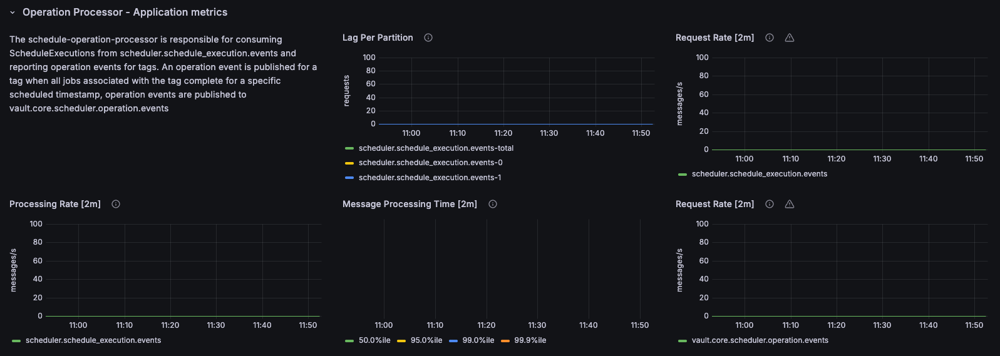

#### Operation Processor - Deployment Info

The **Operation Processor - Deployment Info** section shows data about the deployment, such as the CPU usage and memory usage of the Operation Processor service, as well as the average CPU usage by node.

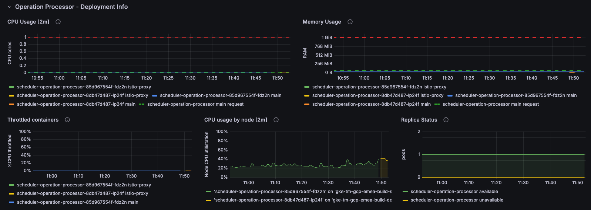

## Ledger dashboards

Vault Core 5 introduces the following set of **Ledger** dashboards. Here, you can also find a brief overview of the **End of Day** dashboard. To learn more about all Ledger and other Grafana dashboards, refer to the full list in the [Using the Observability Stack](/vault-core/5-8/EN/environment_and_installation/infrastructure_docs/observability_and_monitoring/using_the_observability_stack).

-   **\[V5+\] End of Day**
    
-   **\[V5+\] Postings Service**
    
-   **\[V5+\] Ledger Processor Breakdown**
    
-   **\[V5+\] Ledger Responder**
    
-   **\[V5+\] Point in Time Overview**
    
-   **V5 Ledger Migrator** (this dashboard concerns [migrating data to Vault Core](/vault-core/5-8/EN/environment_and_installation/infrastructure_docs/observability_and_monitoring/using_the_observability_stack#migrations))
    
-   **\[V5+\] Legacy Postings Service**
    

### End of Day

The **\[V5+\] End of Day** dashboard displays an overview of the End of Day journey, with all involved services. This includes the **End of Day Health** row, with metrics for **Processing Rates**, **Consumer Lags** and **Processing Durations**, and the **Point in Time** row.

A number of rows are available, which provide a detailed breakdown of other journey and Smart Contract metrics in individual panels, including the following:

-   **End of Day Health**
    
-   **Schedule Job Poller**
    
-   **Schedule Job Dispatcher**
    
-   **Point in Time Overview**
    
-   **Ledger Router**
    
-   **Contracts Outcome Processor**
    
-   **Scheduler Outcome Processor**
    
-   **Vault Jobs Events Processor**
    

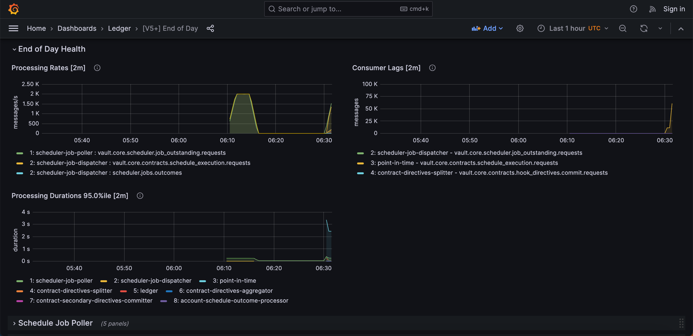

## Vault Jobs Overview dashboard

The **\[Vault Jobs\] Overview** dashboard provides information about the health of the Vault Jobs app. : If you experience any issues with the Vault Jobs app, you can use this dashboard and other observability areas to help you to investigate and remediate them. For example, checking Kafka topics for messages, [DLQ alerts](/vault-core/5-8/EN/environment_and_installation/infrastructure_docs/observability_and_monitoring/using_the_observability_stack#dlq_alerts) (`NewMessagesInVaultJobsOperationRequestsDLQ` and `NewMessagesInVaultJobsOperationEventsDLQ`), and the services and pods that concern the Vault Jobs app. For more information about Vault Jobs, see the [Vault Jobs](/vault-core/5-8/EN/reference/core_apps_and_operations_dashboard/vault_jobs) documentation. You may also find it helpful to check the [**Schedule Manager Execution Processing** dashboard](/vault-core/5-8/EN/environment_and_installation/infrastructure_docs/observability_and_monitoring/introduction_to_grafana_and_key_dashboards#schedule_manager_execution_processing).

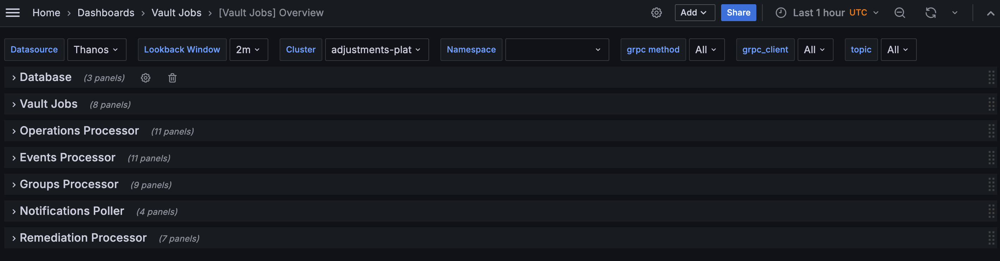

Some key areas to observe include the panels in the following rows.

### Database

The **Database** row shows `vault_jobs` database performance characteristics, such as queries latency, locks held and number of transaction retries.

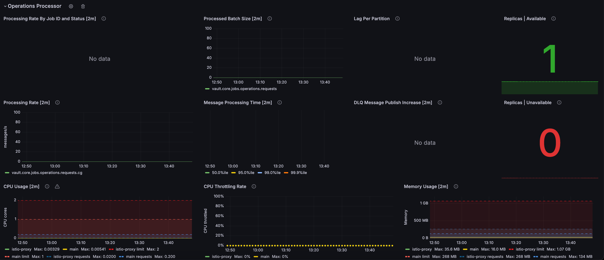

### Vault Jobs

The **Vault Jobs** row displays details about the performance of the Vault Jobs app, such as gRPC throughput, gRPC latency, gRPC request errors, replicas, and CPU usage, throttling and memory usage per pod.

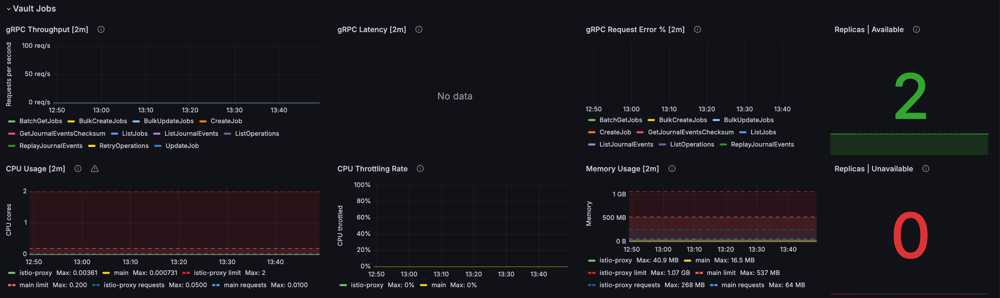

### Events Processor

The **Events Processor** row displays the health report of the Schedule Executions that the `events_processor` is processing in Vault Jobs.

chat\_bubble

The release of Vault Core 5.4 adds the Events Processor, the functionality of which replaces the Operations Processor; therefore, you should monitor the Events Processor instead. - DLQ topic: `vault.core.jobs.operation.events.dlq` - DLQ Alert: `NewMessagesInVaultJobsOperationEventsDLQ`

For Vault Jobs, a Schedule Execution in [Schedule Manager](/vault-core/5-8/EN/environment_and_installation/infrastructure_docs/observability_and_monitoring/introduction_to_grafana_and_key_dashboards#schedulerrelated_dashboards) is an Operation.

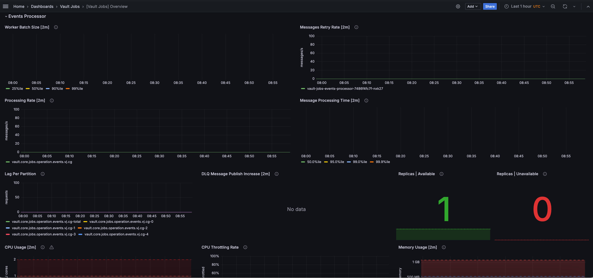

### Groups Processor

The **Groups Processor** row displays information about the consumption of JobEvents sent by the Notifications Poller and the creation of Vault Jobs Groups.

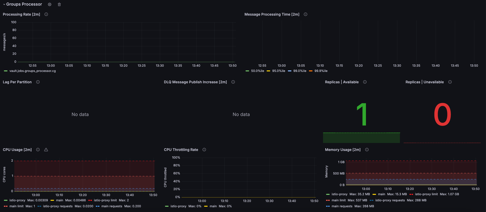

### Notifications Poller

The **Notifications Poller** sends JobEvents and GroupsEvents to the Vault Core Stream API, which then converts the JobEvents and GroupsEvents to the public representation for clients to consume.

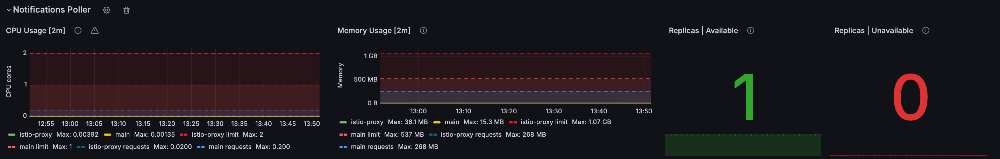

### Remediation Processor

The **Remediation Processor** row provides information about the `vault-jobs-remediation-processor` deployment. This service processes the retry actions that a user submits in the Vault Jobs App, when they select an errored operation and select **Retry selected**. To learn more about retrying errored jobs, see [What is Vault Jobs?](/vault-core/5-8/EN/reference/core_apps_and_operations_dashboard/vault_jobs#what_is_vault_jobs) in the Vault Jobs documentation.

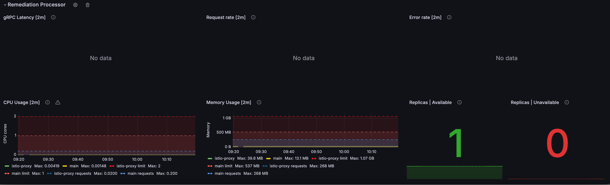