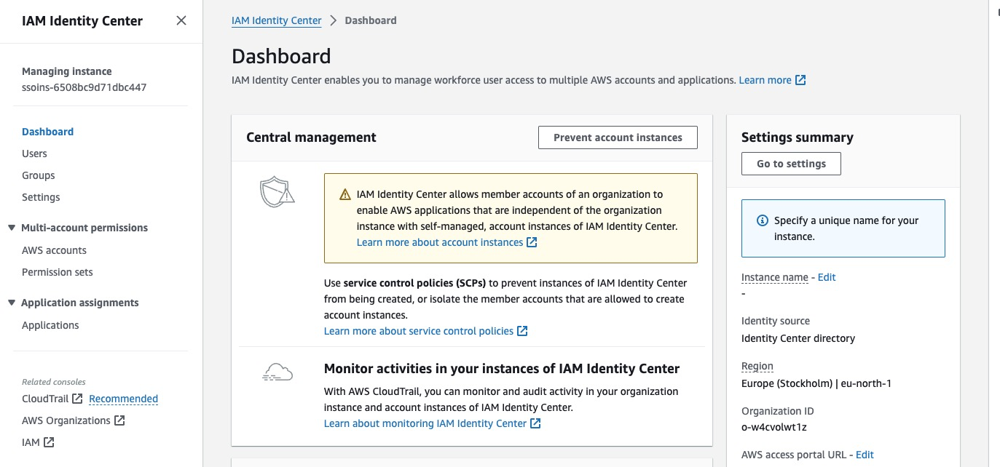
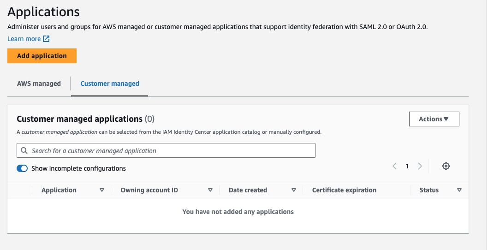
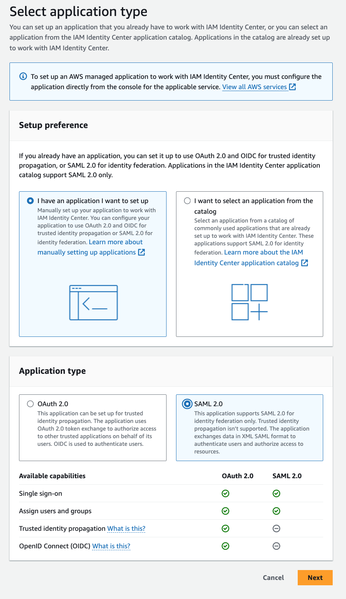
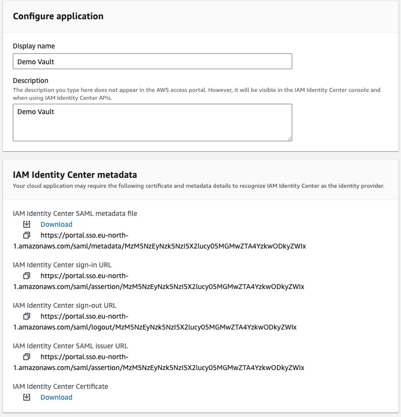
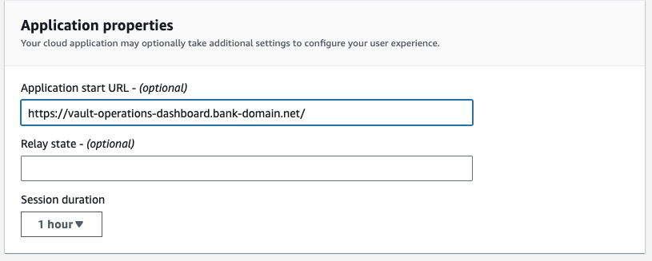
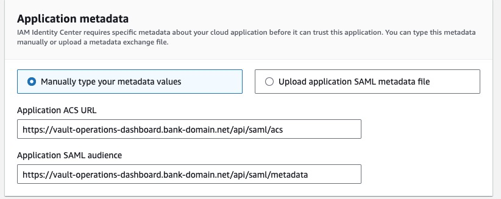
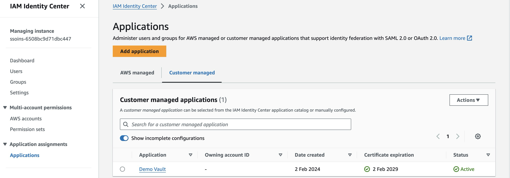
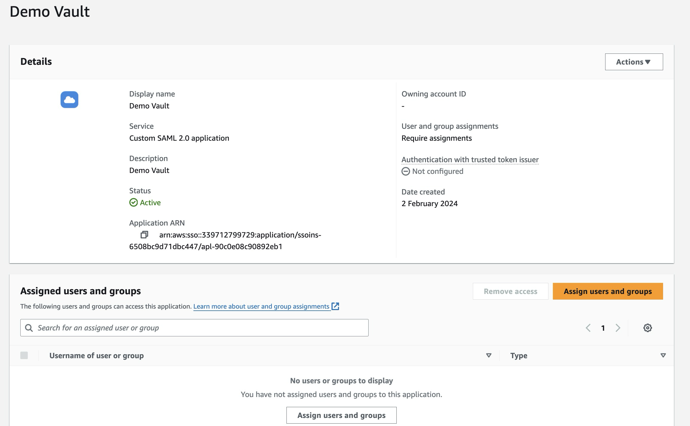
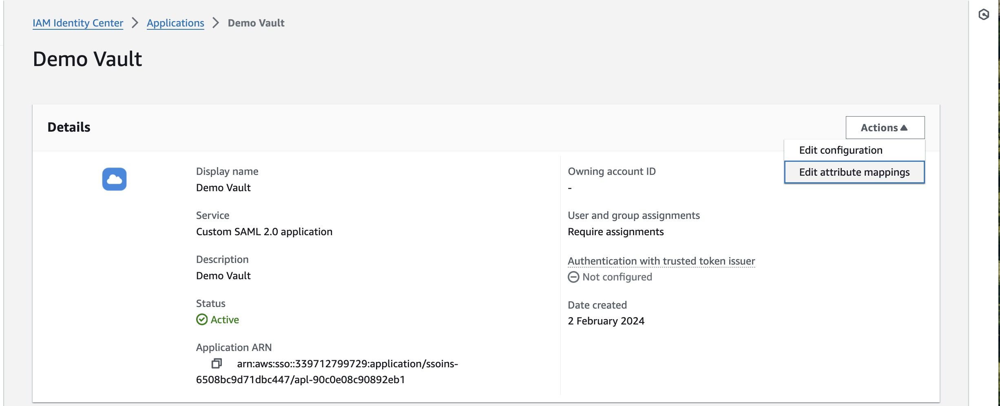
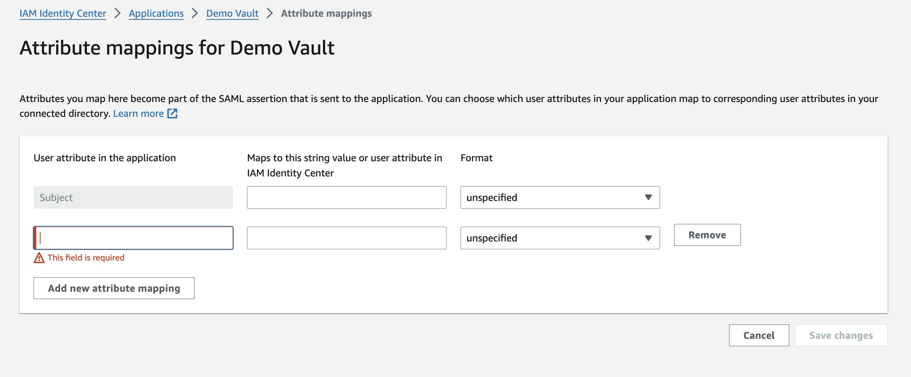

# Setting up AWS IAM Identity Center as your SAML IdP

The process to configure AWS itself to act as an IdP is covered in the [AWS official documentation](https://docs.aws.amazon.com/singlesignon/latest/userguide/what-is.html); the steps below are based on this process but tailored to a Vault Core-specific setup.

chat\_bubble

AWS IAM Identity Center was formerly known as AWS Single Sign-On. The service itself remains unchanged, and only the name has been updated.

chat\_bubble

The AWS IAM Identity Center user interface changes from time to time, so the location or wording of the options documented here may change. The interface documented here was current in February 2024.

1.  [Add and configure Vault Core for AWS IAM Identity Center](/vault-core/5-8/EN/environment_and_installation/infrastructure_docs/setting_up_and_configuring_vault_with_a_saml_idp/setting_up_aws_iam_as_your_saml_idp#adding_and_configuring_vault_for_aws_iam).
    
2.  [Assign users SSO access](/vault-core/5-8/EN/environment_and_installation/infrastructure_docs/setting_up_and_configuring_vault_with_a_saml_idp/setting_up_aws_iam_as_your_saml_idp#assigning_sso_access_to_users_or_groups).
    
3.  Set up your application or applications.
    

## Adding and configuring Vault for AWS IAM Identity Center

More information can be found on this page from AWS' [official documentation](https://docs.aws.amazon.com/singlesignon/latest/userguide/set-up-single-sign-on-access-to-applications.html)

1.  In the AWS IAM Identity Center console, choose **Applications** in the left navigation pane.
    
    
    
2.  Choose the **Customer managed** tab and then choose **Add application**
    
    
    
3.  In the **Select an application type** dialog box, select **I have an application I want to set up** and then select **Custom SAML 2.0 application**. Finally, choose **Next**.
    
    
    
4.  On the **Configure \\{Custom app name}** page, under **Details**, enter a Display name for the application, such as *Vault*.
    
    
    
5.  Under **IAM Identity Center metadata**, do the following:
    
    1.  Next to **IAM Identity Center SAML metadata**, choose **Download** to download the identity provider metadata. This file will contain the entityID in the second line. The entityID will have following format:
        
        `entityID="[REGION](https://portal.sso.).amazonaws.com/saml/logout/[DOMAIN_APP_ID]"`
        
        Keep track of the REGION and DOMAIN\_APP\_ID inferred by the entityID as they will also be necessary for the sso\_url which will be in this format:
        
        `sso_url: '[REGION](https://portal.sso.).amazonaws.com/saml/assertion/[DOMAIN_APP_ID]'`
        
    2.  Next to **IAM Identity Center certificate**, choose **Download certificate** to download the identity provider certificate.
        
        This downloads the relevant files for you. You will need these files later when you set up Vault Core.
        
    
6.  Under **Application properties**, provide the Application start URL, using the top-level URL used to visit the Operations Dashboard (for example `[https://vault-operations-dashboard.bank-domain.net/](https://vault-operations-dashboard.bank-domain.net/)`). You may optionally specify the Relay State and Session Duration. For more information, see the AWS documentation on [Application properties](https://docs.aws.amazon.com/singlesignon/latest/userguide/appproperties.html).
    
    
    
7.  Under Application metadata, provide the Application ACS URL and Application SAML audience values. The ACS URL has the form `[https://vault-operations-dashboard.bank-domain.net/api/saml/acs](https://vault-operations-dashboard.bank-domain.net/api/saml/acs)`, and the audience value has the form `[https://vault-operations-dashboard.bank-domain.net/api/saml/metadata](https://vault-operations-dashboard.bank-domain.net/api/saml/metadata)`.
    
    
    
8.  To save the configuration, choose **Submit**.
    

## Assigning SSO access to users or groups

1.  Open the AWS IAM Identity Center console, using the Region where your AWS Managed Microsoft AD directory is located.
    
2.  Choose **Applications**.
    
    
    
3.  In the list of applications, under **Customer managed** choose Vault.
    
    
    
4.  On the application details page, choose the **Assigned users** tab. Then choose Assign users.
    
    
    
5.  In the **Assign users** dialog box, enter a user or group name. Then choose **Search connected directory**. You can specify multiple users or groups by selecting the applicable accounts as they appear in search results.
    
6.  Choose **Assign users**.
    

## Mapping Vault attributes to AWS IAM attributes

1.  Open the AWS IAM Identity Center console.
    
2.  Choose **Applications**.
    
    
    
3.  In the list of applications, under **Customer managed**, choose Vault.
    
    
    
4.  On the application details page, from the **Actions** dropdown, select **Edit attribute mapping**.
    
    
    
5.  Choose **Add new attribute mapping**.
    
    
    
6.  In the first text box, enter the application Vault attribute.
    
7.  In the second text box, enter the attribute in AWS IAM Identity Center that you want to map to the Vault attribute. For example, you might want to map the Vault attribute **email** to the user attribute **$\\{user:email}**. To see the list of allowed user attributes in AWS IAM Identity Center, see the table in the AWS documentation [Attribute mappings](https://docs.aws.amazon.com/singlesignon/latest/userguide/attributemappingsconcept.html).
    
8.  Choose **Save changes**.