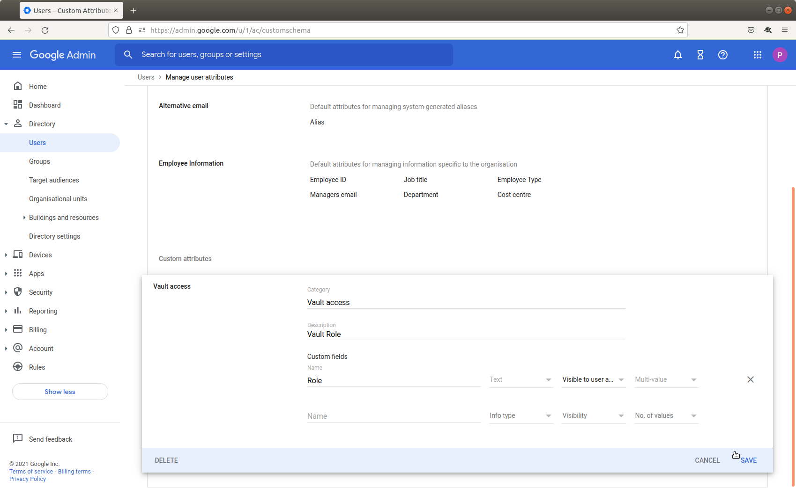
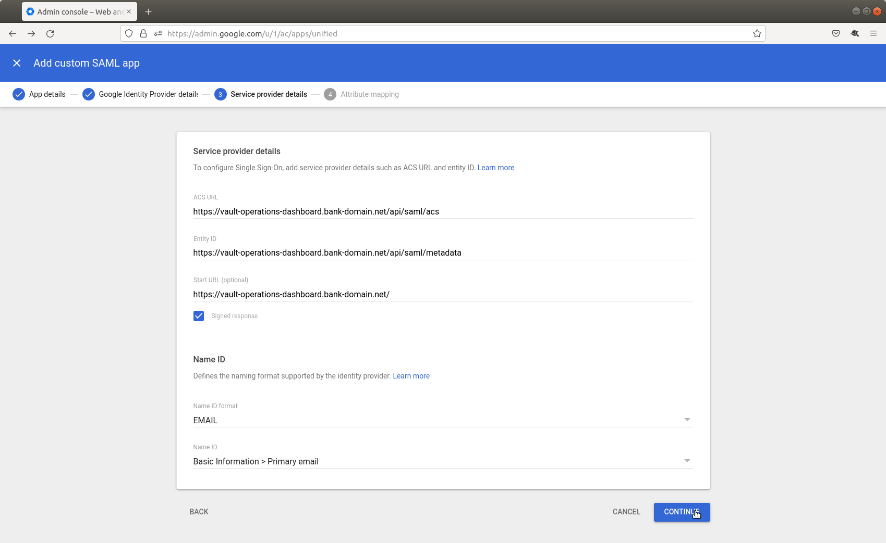
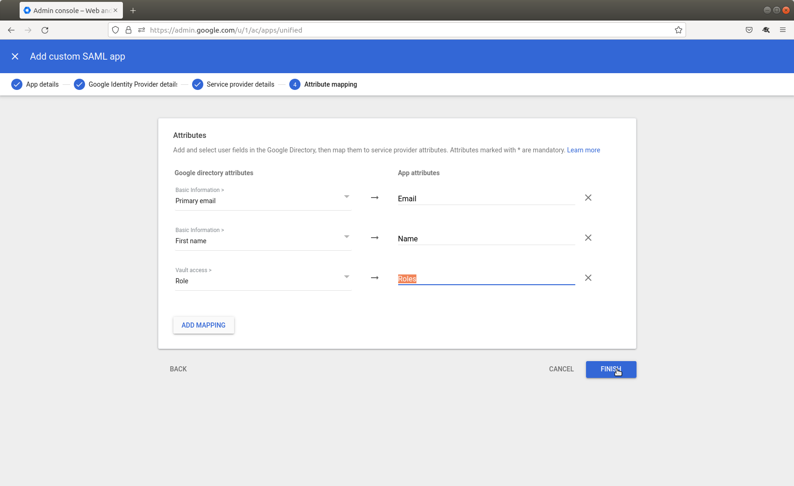
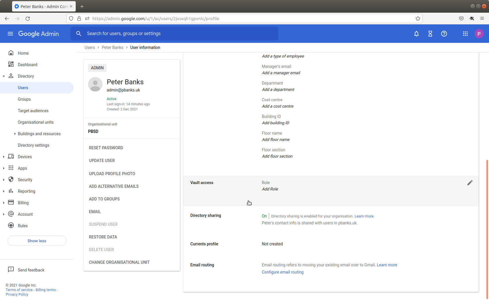

# Setting up Google Cloud Identity as your SAML ldP

chat\_bubble

Setting up Google Cloud Identity as a SAML IdP requires access to a super administrator account. No other accounts will be able to create the application (although they may be able to assist with assigning roles to users).

The process to configure Google Cloud itself to act as an IdP is covered in [Google’s official documentation](https://support.google.com/a/answer/6087519?hl=en); steps 1-3 below are based on this process but tailored to a Vault Core-specific setup.

1.  [Define custom attribute for roles](/vault-core/5-8/EN/environment_and_installation/infrastructure_docs/setting_up_and_configuring_vault_with_a_saml_idp/setting_up_google_cloud_identity_as_your_saml_ldp#define_custom_attribute_for_roles).
    
2.  [Create a new application](/vault-core/5-8/EN/environment_and_installation/infrastructure_docs/setting_up_and_configuring_vault_with_a_saml_idp/setting_up_google_cloud_identity_as_your_saml_ldp#create_a_new_application) for each environment you want to maintain (for example, preprod, prod).
    
3.  [Enable your applications](/vault-core/5-8/EN/environment_and_installation/infrastructure_docs/setting_up_and_configuring_vault_with_a_saml_idp/setting_up_google_cloud_identity_as_your_saml_ldp#enable_your_applications).
    
4.  [Configure the Vault admin website](/vault-core/5-8/EN/environment_and_installation/infrastructure_docs/setting_up_and_configuring_vault_with_a_saml_idp/setting_up_google_cloud_identity_as_your_saml_ldp#configure_the_vault_admin_website) using `values.yaml` to use Google Cloud Identity as your identity provider.
    
5.  [Assign roles to your users](/vault-core/5-8/EN/environment_and_installation/infrastructure_docs/setting_up_and_configuring_vault_with_a_saml_idp/setting_up_google_cloud_identity_as_your_saml_ldp#assign_roles_to_your_users).
    

## Define custom attribute for roles

To specify the Vault roles for each user in your application, you will need to create a custom attribute. This can then be set on a per-user basis to control their access to Vault Core (see [Assign roles to your users](/vault-core/5-8/EN/environment_and_installation/infrastructure_docs/setting_up_and_configuring_vault_with_a_saml_idp/setting_up_google_cloud_identity_as_your_saml_ldp#assign_roles_to_your_users) for more details on Vault roles).

1.  Log in to the Google Admin console ([https://admin.google.com](https://admin.google.com)).
    
2.  Navigate to **Directory, Users**.
    
3.  Click on **More, Manage custom attributes**.
    
4.  Click on **Add custom attribute**.
    
5.  Enter a category, description and name for the new attribute; these are all human-readable strings for organisational benefit:
    
    
    
    Set the input type as **Text**, the visibility as that you want to use, and the **No. of values** to multi-valued.
    
6.  Click **Save**.
    

When this attribute has been added, you can create your Vault Core application. User roles can also be assigned from this point onwards (see [Assign roles to your users](/vault-core/5-8/EN/environment_and_installation/infrastructure_docs/setting_up_and_configuring_vault_with_a_saml_idp/setting_up_google_cloud_identity_as_your_saml_ldp#assign_roles_to_your_users)).

## Create a new application

1.  Log in to the Google Admin console ([https://admin.google.com](https://admin.google.com)) as an organization super administrator.
    
2.  Navigate to **Apps, Web and mobile apps**
    
3.  Click on **Add app, Add custom SAML app**
    
4.  Enter a human-readable name and a description for your app, e.g. Vault preprod, then click **Continue.**
    
    
    
5.  Make a note of the SSO URL, entity ID and certificate (you will not need the SHA-256 fingerprint), then click **Continue.**
    
6.  In the Service provider details page, enter the ACS URL and entity ID for your admin website. For example, *[https://vault-operations-dashboard.bank-domain.net/api/saml/acs](https://vault-operations-dashboard.bank-domain.net/api/saml/acs)* and *[https://vault-operations-dashboard.bank-domain.net/api/saml/metadata](https://vault-operations-dashboard.bank-domain.net/api/saml/metadata)* respectively. Set the Start URL as the homepage of the admin website e.g. *[https://vault-operations-dashboard.bank-domain.net/](https://vault-operations-dashboard.bank-domain.net/).*
    
    Check the Signed response box. Set the **Name ID Format** to EMAIL and the **Name ID** as Basic Information > Primary email.
    
    
    
7.  Click **Continue.**
    
8.  Click **Add Mapping** three times, and configure the mappings as shown:
    
    -   Basic information/Primary email: Email
        
    -   Basic information/First name: Name
        
    -   Vault access/Roles: Roles
        
        
        
        chat\_bubble
        
        We recommend the above names for the attributes, but they can be customised. If you do customise, make a note of their names, as you will need the names to populate the name\_attribute, email\_attribute and roles\_attribute values in `values.yaml` later.
        
    
9.  Click **Finish**.
    

## Enable your applications

chat\_bubble

By default, user access to SAML is disabled. Once the applications have been configured as above, they can be enabled.

1.  Log in to the Google Admin console ([https://admin.google.com](https://admin.google.com)) as an organization super administrator.
    
2.  Navigate to **Apps, Web and mobile apps**
    
3.  Click on your application from the list of applications.
    
4.  Click on the **User access** panel.
    
5.  Select **ON for everyone**, then click **Save**.
    

## Configure the Vault admin website

As part of [creating a new application](/vault-core/5-8/EN/environment_and_installation/infrastructure_docs/setting_up_and_configuring_vault_with_a_saml_idp/setting_up_google_cloud_identity_as_your_saml_ldp#create_a_new_application), you need to have noted down all of the values needed to configure the Vault Core admin website. Google Cloud Identity does not provide a single logout service; the value for this setting should be the front page of your admin website. If you need to retrieve any of the values after the application has been created, you can find these values by navigating to **Apps, Web and mobile apps** , clicking on your application’s name and then clicking on **Download metadata** under the application name. If you are:

-   Bank-hosted, you need to add this data to the `values.yaml` file (see [Sample configuration for Google Cloud Identity](/vault-core/5-8/EN/environment_and_installation/infrastructure_docs/setting_up_and_configuring_vault_with_a_saml_idp/sample_configuration_for_google_cloud_identity)).
    
-   SaaS, you will need to populate the fields in your Client Environment Request form provided by your Client Delivery Manager.
    

## Assign roles to your users

Finally, you can assign any Vault roles that are needed to your users.

1.  Log in to the Google Admin console ([https://admin.google.com](https://admin.google.com)).
    
2.  Navigate to **Directory, Users**.
    
3.  Search for and click on the user to whom you wish to assign roles.
    
4.  Click on the **User information** panel.
    
5.  Scroll down to the custom attribute created (see [Define custom attribute](/vault-core/5-8/EN/environment_and_installation/infrastructure_docs/setting_up_and_configuring_vault_with_a_saml_idp/setting_up_google_cloud_identity_as_your_saml_ldp#define_custom_attribute_for_roles)).
    
    
    
    Click on the attribute, and enter the value of the role. For example, *AdminRole* for the default administrator role.