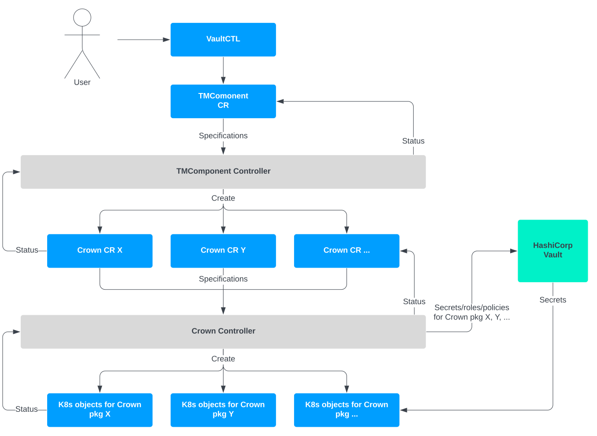

# Advanced installation options

## Pulling images from a private Docker registry

Image digests identify an image by its content. Unlike tags, they are immutable. This makes digests preferable to tags for referencing images in Kubernetes manifests. The value `k8s.pull_image_by_digest` is enabled by default from Vault Core version 3.3 onwards. This works on the assumption that digests are preserved when images are copied between registries. Tools such as [crane copy](https://github.com/google/go-containerregistry/blob/main/cmd/crane/doc/crane_copy.md) and [skopeo copy](https://github.com/containers/skopeo/blob/main/docs/skopeo-copy.1.md) will do this, but the Docker CLI does not necessarily preserve digests.

If digests cannot be preserved, disabling this value will make the installer use semantic tags on images, for example my/image:vault-1.2.3.

1.  Provide the `--image-pull-secrets-name` argument to `vaultctl init-operators` as the Kubernetes secret name containing the credentials to your private Docker registry.
    
2.  Ensure imagePullSecrets is set in the TMComponent operator and Istio ServiceAccount.
    
    chat\_bubble
    
    The secrets that are to be used by ImagePullSecrets are not created by the operator and must exist before Vault Core is installed.
    
    These namespaces include: \* TMComponent operator namespace (tm-system) \* Vault namespace (tm-vault) \* Istio namespace (istio-system) \* Webhook-Operator (webhook-operator) \* Observability namespaces (tm-monitoring)
    
3.  Create the secret in all namespaces to which Kubernetes objects are deployed by Vault installer. You can create this secret for each namespace (using the same name for the secret for all namespaces) by following the instructions on the [Kubernetes website](https://kubernetes.io/docs/tasks/configure-pod-container/pull-image-private-registry/#registry-secret-existing-credentials), for example:
    
4.  Install Vault Core.
    

## Deploying Usage Monitor

The [Usage Monitor](/vault-core/5-8/EN/reference/core_apps_and_operations_dashboard/usage_monitor/) requires the following configuration values to be set at deployment time (which may be at the point at which a contractual agreement comes into effect). This will require reinstallation or an upgrade of Vault Core.

error

To ensure that the **Committed accounts** column data is accurate from the beginning, we recommend reinstalling (or upgrading) Vault Core on the day that any contractual agreement comes into effect, with `usage.num_committed_accounts` populated with the number of agreed accounts.

  
| Configuration | Description | Recommended value |
| --- | --- | --- |
| 
`usage.committer.schedule`

 | 

[Crontab](https://en.wikipedia.org/wiki/Cron) expression which dictates when the usage should be measured. Defaults to midnight (UTC) on the 1st of every month.

 | 

\- Set a value which avoids the time window in which End-of-Day usually runs; we recommend setting the value to at least three hours before End-of-Day begins.- Set a day from 1-28 of each month to avoid missed measurements due to the inconsistencies in the Gregorian calendar.

 |
| 

`usage.num_committed_accounts`

 | 

Number of Accounts included in the fixed base price for this Vault Core instance, contractually agreed with Thought Machine.

 | 

Set this according to the legal contract between the bank and Thought Machine.

 |

## Deploying Data Deleter Job

The Data Deleter Job deletes unused internal data from Vault Core. It uses the following configuration values. If you make changes, you will need to reinstall or upgrade Vault Core.

  
| Configuration | Description | Recommended value |
| --- | --- | --- |
| 
`data_retention.deleter.schedule`

 | 

[Crontab](https://help.ubuntu.com/community/CronHowto) expression which dictates when the usage should be measured. Defaults to 4am (UTC) everyday.

 | 

Set a value which avoids the time window in which End-of-Day usually runs; we recommend setting the value to at least three hours after End-of-Day ends

 |

The job runs at the specified cron schedule and deletes unused internal data from Vault Core.

By default, the deleter only deletes Contract Executions. It will delete any Contract Executions older than 62 days.

You can optionally configure the Data Deleter Job to delete further unused internal data from Vault Core. Due to deleting data being a destructive process, Thought Machine encourages you to contact Thought Machine Support to discuss your requirements and learn how to enable deletion of these other types of unused internal data:

-   Temporary Internal Ledger Balances Data older than 90 days
    
-   Internal Idempotency Scheduler Data older than 90 days
    
-   Vault Jobs and associated Operations Data older than 90 days
    

## Custom Certificate Authority for database/Kafka access

Vault Core uses client-side verification when interacting with the database and/or Kafka (i.e. not mutual TLS); this means the server certificate used by the database/Kafka must be trusted by Vault Core. If your database and/or Kafka cluster uses a self-signed certificate, you must provide the Certificate Authority (CA) that signed the database and/or Kafka server certificate(s), so that Vault Core can add it to its trust chain.

### Configuring a custom Certificate Authority

1.  If you are using a firewall, ensure that the firewall between your cluster control plane and worker nodes allows access to the port 10000 of the ca-injector-webhook. This is a webhook that will add an init-container to the deployments of a namespace. The init-container will inject your CA certificates. See information on webhook ports in *Vault Cloud Infrastructure* for more details.
    
2.  Before installing Vault Core, label the Vault namespace to enable CA injection:
    
    error
    
    This webhook is deployed per namespace, so it is critical to label the namespace resource with the correct ca-injector label.
    
3.  Using a file with the suffix .pem (for example ca.pem) containing the PEM formatted CA data, run the following to create the ConfigMap, where `ca.pem` is the name of the `.pem` file you use.
    
    If you are injecting different CAs for the database and Kafka, concatenate both .pem files into a single .pem file before creating the ConfigMap.
    

## Component specifics

A summary of each installable component is given by the vaultctl components command.

This section contains steps required for installing Kafka and Istio with the TMComponent operator.

### Istio

chat\_bubble

You can also use your own Istio, providing that it is a supported version (refer to the [Certified Environment matrix](/vault-core/5-8/EN/environment_and_installation/installationupgrade_and_version_compatibility#certified_environment_matrix_for_vault)).

error

When upgrading from a version of Istio prior to 1.8, you must ensure that Vault Core is installed before migrating to the newer version of Istio.

1.  Configure your Istio `values.yaml` to exclude your database port.
    
    Services within Vault Core make use of Istio’s Sidecar custom resource definition to list the discoverable upstream resources within the service mesh and restrict traffic to resources outside of the mesh. The port on which Vault Core services will access the Vault Core database must be excluded from the service mesh. If this is not configured correctly, the database server will not be reachable from Vault Core services and functionality of Vault Core will be impaired. You can configure this using the `istio.proxy.exclude_outbound_ports` setting in the `values.yaml` file.
    
    Only exclude the database port in this setting.
    
2.  Check if Istio should be installed using the Vault installer provided by Thought Machine:
    
    -   If yes, proceed to step 3
        
    -   If no, ensure the prerequisites described in [Additional prerequisites for Istio support](/vault-core/5-8/EN/environment_and_installation/infrastructure_docs/tmcomponent_operator_user_guide/before_you_start#additional_prerequisites_for_istio_support) are met, then proceed to step 7
        
    
3.  The `./vaultctl` `init-operators` will deploy the RBAC needed for an Istio install, check that the `install-istio` `ServiceAccount`, `ClusterRole` and `ClusterRoleBinding` have been deployed. The names of these will match the flags given to `init-operators`, or the defaults if not given.
    
4.  Run `vaultctl install` to install the Istio component. If the current version of Istio is:
    
    -   Higher than the one about to be deployed, then it will not be deployed
        
    -   Lower than the one about to be deployed, then it will be upgraded
        
    -   The same, then it will be reinstalled and reconfigured
        
    
5.  To ensure that new configuration is applied to the Istio control plane, restart all pods within `istio-system`:
    
    chat\_bubble
    
    We recommend that you run the Istio installer each time a new Vault Core version is deployed, to ensure that any updates to Istio are deployed.
    
6.  Once the Istio installation has completed, we recommend that you delete the `ClusterRole` and `ClusterRoleBinding`.
    
7.  Label the Vault namespace to use `istio-annotation-tm-webhook`:
    
    chat\_bubble
    
    `VAULT_NAMESPACE` is Vault’s namespace and needs to be substituted into the above commands.
    
8.  Enable Istio injection for the Vault namespace.
    
9.  Remove any previous labels for Istio injection:
    
10.  If installing Istio with the TMComponent operator provided by Thought Machine, the Vault namespace should be labelled for injection by the appropriate version of Istio. The Istio version shipped with Vault Core makes use of the Istio CNI by default and should be enabled with the `istio.io/rev=canary-<version>` label:
     
11.  If installing Istio manually, without the TMComponent operator provided by Thought Machine, label the Vault Core namespace with one of the standard Istio injection labels - `istio.io/rev` or `istio-injection` - to match the version of Istio installed.
     
     chat\_bubble
     
     When running the installer, this annotation is used to determine whether Istio-specific components of Vault Core, such as `DestinationRules` and `Policies`, should be installed. Keep in mind that `VAULT_NAMESPACE` is Vault Core’s namespace and needs to be substituted into the above commands.
     
12.  If deploying Istio for the first time against a Vault Core instance, upgrading Istio for an existing Vault Core instance, or applying configuration changes to an existing Istio deployment, you must restart all pods within the service mesh that are required to use that version of Istio to ensure proper injection of the Istio proxy with the required configuration:
     

chat\_bubble

When installing a Vault Core instance for use with the Istio CNI, the secrets manager must be excluded from the service mesh using the `istio.proxy.exclude_cidr` option in the values file. Refer to the [Vault Cloud Infrastructure](/vault-core/5-8/EN/environment_and_installation/infrastructure_docs/vault_cloud_infrastructure) guidance for details on how to achieve this safely. If this is not configured correctly, the secrets manager will be unreachable from Vault Core services and pods will be unable to start up.

chat\_bubble

Thought Machine’s Istio does support deployment to a namespace other than the Istio system namespace. To enable this configuration, set the value: `istio.namespace` Use this configuration with care, and only if there is not a running Istio deployment in any other namespace on the cluster. If Istio is already deployed and running on the cluster, the namespace MUST be the same for all running versions of Istio. If Istio is already running in a different namespace, for example istio-system, and this value is used to deploy a new istio version to a custom namespace, there will be downtime and so this setup is not supported. The value, if set, will affect the monitoring stack; the requirements are as follows:

-   A service must exist in the `istio.namespace` namespace and must expose Istio metrics on a port named http-monitoring
    
-   Pods running in the service mesh must expose a container port named http-envoy-prom that exposes Envoy metrics
    

This configuration is generally not required for configuring Vault Core where the default of istio-system is sufficient.

#### Disable Istio strict mTLS

chat\_bubble

Vault Core is configured to use Istio’s `STRICT` mTLS mode by default. If using `STRICT` mode, you must include the ingress controller (if used) within the service mesh as a prerequisite to installing Vault Core. If not done, the ingress controller will not be able to connect to the Vault Core services and that will result in an outage. For more information see [Case Study: Using the Istio Ingress Gateway with Vault Core](/vault-core/5-8/EN/environment_and_installation/infrastructure_docs/vault_cloud_infrastructure/case_study_using_the_istio_ingress_gateway_with_vault_core).

To install Vault Core **without** enabling strict mTLS, edit the Istio section of the `values.yaml` to specify the mode as `PERMISSIVE`.

Verify that the default mTLS mode in the Vault Core namespace is set to `PERMISSIVE` by running the following command:

### Kafka

Kafka is a prerequisite for Vault Core and, just like the database, you are responsible for providing and operating it in all of your environments.

When using a Kafka cluster, either bank-hosted or managed, see the *[Configuring Kafka and Vault](/vault-core/5-8/EN/environment_and_installation/infrastructure_docs/vault_cloud_infrastructure/configuring_kafka_and_vault)* section within the *Vault Cloud Infrastructure* guidance for the required Kafka broker configuration and information about how to configure the values.yaml file for use with a Kafka cluster.

#### Overview of Vault Core and Kafka Init/Cleanup components and Kafka ACLs

chat\_bubble

Vault Core release 5.2 includes the addition of DENY ACLs for Vault Core principals, primarily to restrict access to Policy topics, as well as a new field, `permission_type` (value: `ALLOW`/`DENY`), in the release.json artefact. The Kafka Init/Cleanup components manage these ACLs automatically.

The TMComponent Operator supports automatic creation of Kafka Access Control Lists (ACLs) through the Kafka Init (`kafka-init`) TMComponent. This component will generate a list of coarse grained ACLs, as described in [Release JSON Artefact](/vault-core/5-8/EN/environment_and_installation/infrastructure_docs/tmcomponent_operator_user_guide/advanced_installation_options#release_json_artifact). It sets up the required permissions for all Vault Core services to access Kafka and, therefore, does not require the use of this artefact to create these ACLs manually.

You must use the Kafka Cleanup (`kafka-cleanup`) component in tandem with the Kafka Init component to remove ACLs that are no longer valid or required, for example for a Vault Core service being renamed or removed, or if the required permissions have changed for specific Vault Core services in subsequent releases. By using the Cleanup component, you do not need to keep track of changes to principals in the release.json artefact between releases and do not need to apply these changes manually.

You must install the components in the correct order. However, you must first create Cluster ACLs with the appropriate permissions for Kafka Init or Kafka Cleanup to work correctly. Refer to the following sections to set up Cluster ACLs, and then install the components:

-   [Creating Kafka Cluster ACLs before installing Kafka Init/Cleanup components](#creating_kafka_cluster_acls_before_installing_kafka_components)
    
-   [Installing the Kafka Init and Cleanup components](#installing_the_kafka_init_and_cleanup_components)
    

#### Creating Kafka Cluster ACLs before installing Kafka Init/Cleanup components

The Kafka Init and Cleanup components require Cluster ACLs (ACLs for the cluster resource type) with `DESCRIBE` and `ALTER` permissions. As a preliminary step to installing these components, you must create the ACLs in the Kafka cluster for the `vault-kafka-init` and `vault-kafka-acl-cleanup` principals.

Note that the principal format will differ depending on the client authentication mechanism used. You can use the Kafka CLI to create the ACLs, as we demonstrate in the following example commands:

Example 1: Command to create the Cluster ACLs if you use SASL-SCRAM for client authentication:

Example 2: Command to generate the Cluster ACLs if you use mTLS for client authentication:

chat\_bubble

If you are using an external tool to generate certificates (not via TMComponent Operator), then you must set the fields `OU,O,L,ST,C` to the appropriate values that match the SSL Subject that you used to generate that certificate.

Irrespective of the Kafka installation used, when the TMComponent Operator is not being used to generate the certificates required for Kafka authentication and the client authentication mechanism for Kafka is set to mTLS, you will need to set the field `kafka.client.ssl_subject` in values.yaml to the corresponding SSL Subject, excluding the Common Name (CN), before using the Kafka Init and Kafka Cleanup components.

#### Installing the Kafka Init and Cleanup components

Install the components in the following order:

1.  Kafka Init component
    
2.  Vault Core components
    
3.  Kafka Cleanup component
    
    -   Use `vaultctl install` to install the kafka-init component.
        
        chat\_bubble
        
        The Kafka Init component installation creates a Kubernetes job which will create required Kafka ACLs and complete, meaning that the Cluster ACLs (ACLs for the cluster resource type) required for the job will not be continuously in use.
        
    -   Use `--help` on vaultctl subcommands for full documentation.
        
    

The Kafka Cleanup component must only be installed after Vault Core installation has finished (with all pods rolled out and no previous pod versions running):

-   Use `vaultctl install` to install the kafka-cleanup component.
    
-   Use `--help` on vaultctl subcommands for full documentation.
    

#### Installing Vault Core with a managed Kafka cluster

Vault Core needs access to the Apache Kafka Admin API for managing resources in the Kafka cluster (such as ACLs or topics) and access to the `*consumer_offsets*` *topic for monitoring consumer groups lag. Apache Kafka as a Service provider often disables access to either one or both the Admin API and the* `consumer_offsets` topic. With disabled access, installation of some of the components against such clusters might fail.

In the case of disabled access to the Admin API, you must ensure that:

-   The Kafka Init and Kafka Cleanup components are not installed in the cluster
    
-   The `kafka.topics.disable_vault_topic_management` option in your values.yaml file is set to `true`
    

In the case of disabled access to the `__consumer_offsets` topic, you must ensure that the `kafka.monitoring.disable_consumer_lag_exporter` option in your values.yaml file is set to `true`.

#### Vault Core Topics Management

Vault Core supports automatic creation and management of topics required by Vault Core. This is performed as part of the vault-topic-manager deployment. Operations by the vault-topic-manager include:

-   Creating topics with the required number of partitions and retention periods.
    
-   Continuous reconciliation of topics:
    
    -   Deleting unused/deprecated topics automatically from the cluster.
        
    -   Reducing/Increasing the number of partitions for topics per release.
        
    -   Recreating any required topics that might have been deleted by accident or syncing any changes to topics that are undesirable.
        
    

To reduce or increase partitions for specific topics, the vault-topic-manager requires Cluster ACLs (ACLs for the cluster resource type) with `DESCRIBE` and `ALTER` permissions. As a preliminary step to installing the Vault Core component, you must create the ACLs in the Kafka cluster for the `vault-topic-manager` principal.

Note that the principal format will differ depending on the client authentication mechanism used. You can use the Kafka CLI to create the ACLs, as we demonstrate in the following example commands:

Example 1: Command to create the Cluster ACLs if you use SASL-SCRAM for client authentication:

Example 2: Command to generate the Cluster ACLs if you use mTLS for client authentication:

chat\_bubble

If you use an external tool to generate certificates (not via the TMComponent Operator), then you must set the fields `OU,O,L,ST,C` to the appropriate values that match the SSL Subject used for that certificate generation.

Thought Machine recommends that you enable Vault Core to manage topics, because this means that the number of topic partitions and retention period is optimised for each release. Using an optimised number of partitions per topic is highly likely to lead to lower costs for cloud infrastructure as it will reduce the overall number of topics in the cluster.

If you want to disable reconciliation done by the vault-topic-manager and not create the above ACLs, you can set the `kafka.topics.disable_topic_reconciliation` option in the values.yaml config to `true`.

## TMComponent Operator structure

When you run `vaultctl init-operators`, this deploys the TMComponent Operator and the Crown Operator. The Crown Operator is a lower-level Operator responsible for installing Vault Core microservices. The diagram below shows the relationship between a User, vaultctl, the TMComponent operator, the Crown operator, HashiCorp Vault, and native Kubernetes resources.

error

Vaultctl and the associated operators are versioned independently of Vault Core. To view this versioning, use vaultctl version. The Operator image versions are hardcoded into vaultctl and will be updated with vaultctl init-operators. Vaultctl is backwards-compatible with Vault Core releases and should not be downgraded. The lowest vaultctl version to be used with a Vault Core version is the one shipped with that Vault Core release, but you can use any subsequent version of vaultctl. Major, Minor and Patch releases will all include an appropriate version of vaultctl with the latest bug and security fixes applied.

 
| *Name* | *Description* |
| --- | --- |
| 
vaultctl

 | 

A command-line tool for Vault Core installation, upgrade, configuration and querying of Vault Core component statuses. It contains all artefacts required for deploying both TMComponent Operator and Crown Operator. It can also be used to export both the rendered artefacts for TMComponent Operator, giving you the option to deploy artefacts by other means or to run an audit before any installation. Do this by adding the `-export-dir` argument to init-operators and install commands.

 |
| 

TMComponent Operator

 | 

A Kubernetes deployment controller responsible for deploying Crown CRs and garbage collecting all Vault Core-related resources. The Controller subscribes to instances of the Custom Resource Definition tmcomponents.tmachine.io, which changes during Vault Core deployment, reconfiguration or upgrade.

 |
| 

Crown Operator

 | 

The Crown Operator is responsible for reconciling the state of Kubernetes resources with those defined by Crown packages. ("Crown" is a packaging utility created and used by Thought Machine to bundle and deploy the Kubernetes resources of Vault Core’s microservices.)The Crown Controller subscribes to instances of the Custom Resource Definition crowns.tmachine.io. These custom resources define the groups of native Kubernetes resources that should be installed and how. For Vault Core installation, users do not require direct interaction with any aspect of the Crown Operator.

 |

## Release JSON Artefact

The *release.json* artefact contains all component-scoped metadata about the release. Under `“metadata”` is a collection of fields; each field has a collection of items. Each item will always have a `“components”` list to allow the content to be filtered by component. All available components and fields are listed in the *release.json* for quick reference. See the *components\_guide.yaml* artefact to decide which components are relevant. There is an example script for copying images [below](/vault-core/5-8/EN/environment_and_installation/infrastructure_docs/tmcomponent_operator_user_guide/advanced_installation_options#example_script_for_using_the_releasejson_copying_images), but there is a variety of other metadata that can be parsed similarly.

The section below shows an example release.json including the most relevant image metadata fields. For example, the source, destination, and vulnerabilities. There is other metadata not included here:

### Example script for using the release.json (copying images)

#### Prerequisites

-   install python
    
-   install absl-py
    
-   either have docker or skopeo installed
    
-   ensure the release.json is in the same folder where the script is
    

#### Run it

In the components section of the `release.json`, choose which components you want to install the images (let’s suppose you want to install the images of "istio" and "vault-core"). Then from the command line:

-   If you want to use skopeo to copy the images:
    

-   If you want to use docker to copy the images:
    

### Extracting Kafka Principals from release.json

You can use release.json to aid with manually generating client certificates for mTLS, credentials for SASL-SCRAM, or client credentials for SASL-OAUTHBEARER for authenticating to a Kafka cluster, and/or coarse grained Kafka ACLs for authorising them. This is only required if not relying on the TMComponent Operator for generating certificates/credentials and/or the Kafka Init/Cleanup components for managing ACLs.

error

Do not diverge from the principal names, Common Names, usernames and Client IDs specified in the artefact, because we rely on these to properly provide support.

We recommend that you use this artefact as part of an automated Vault Core installation/upgrade pipeline, where it is parsed and the information fed into your usual tools for generating certificates, credentials and ACLs. Make sure that you run this prior to Vault Core installation; otherwise services will fail to start up, connect to Kafka and access the resources they require.

In addition, you need to manually configure supplementary ACLs for the Vault Core public Kafka topics for your services that integrate with them, such as the Postings API, Data Loader API and Stream API topics. These public topics are documented in the [kafka\_topics\_info.json artefact](/vault-core/5-8/EN/environment_and_installation/infrastructure_docs/tmcomponent_operator_user_guide/advanced_installation_options#kafka_topics_artifact) as topic entries with `"publicAPITopic": true`. It is your responsibility to ensure your integration services have ACLs set up for the principals they use, with appropriate permissions to access the public topic(s) and consumer groups they interact with.

error

ACLs for integration services MUST only allow access to Vault Core public Kafka topics (`kafka_topics_info.json` entry has `"publicAPITopic": true`). Access to internal topics (`"publicAPITopic": false`) is a security risk and Thought Machine does not support this.

Finally, we expect everything to match the artefact for that specific Vault Core version. Therefore, it is your responsibility to keep track of changes in the artefact between Vault Core versions, especially for a scenario where:

-   A principal entry was removed, as you may wish to delete related ACLs or explicitly deny access for services that no longer exist
    
-   A principal has changes in the resources or permissions it requires
    
-   A principal has changes to the permission type (`ALLOW`/`DENY`) given to it
    
-   A principal has changed the secret keys that it expects (for example, from PKCS12 to PEM)
    

chat\_bubble

If you are using mTLS, Kafka’s default behaviour is to use the certificate’s Subject name as the principal, of which the Common Name is only a part. This looks like `CN=user,OU=Unknown,O=Unknown,L=Unknown,ST=Unknown,C=Unknown` as per the [Confluent documentation](https://docs.confluent.io/platform/current/kafka/authorization.html#tls-ssl-principal-user-names). You must factor this into your ACL rules or use the [principal mapping rules feature](https://docs.confluent.io/platform/current/kafka/authorization.html#configuration-options-for-customizing-tls-ssl-user-name). If you opted to use the TMComponent Operator to generate client certificates for mTLS, then when creating ACL rules, the principal will become `CN={common_name},OU=vault,O=Thought Machine Ltd,L=London,ST=Greater London,C=GB`.

### JSON Schema

The Kafka principals section of the release.json artefact is contained within the *metadata* section, under *kafka\_principals*, as a map of principal name to principal information, corresponding to a Vault Core microservice. The schema of the value under *metadata.kafka\_principals.{principal}* is as follows:

-   *principal*: This is the name of the principal itself for use with Kafka ACLs
    
-   *resources*: The Kafka resources that this principal requires access to
    
    -   *topics*: A list of Topic resources, specified either as prefixes or names, and the permissions required, which correspond to Operations [in the Confluent docs](https://docs.confluent.io/platform/current/kafka/authorization.html#operations).
        
        -   *prefixes*: A list of topic prefixes. Note that the dot is part of the prefix
            
        -   *permissions*: A list of permissions required on the above topic prefixes
            
        -   *permission\_type*: Either `ALLOW` or `DENY` the above permissions
            
        -   *names*: A list of individual topic names
            
        -   *permissions*: A list of permissions required on the above topic names
            
        -   *permission\_type*: Either `ALLOW` or `DENY` the above permissions
            
        
    -   *groups*: A list of Group (consumer group) resources, specified either as prefixes or names, and the permissions required, which correspond to Operations [in the Confluent docs](https://docs.confluent.io/platform/current/kafka/authorization.html#operations).
        
        -   *prefixes*: A list of group prefixes. Note that the dot is part of the prefix
            
        -   *permissions*: A list of permissions required on the above group prefixes
            
        -   *permission\_type*: Either `ALLOW` or `DENY` the above permissions
            
        -   *names*: A list of individual group names
            
        -   *permissions*: A list of permissions required on the above group names
            
        -   *permission\_type*: Either `ALLOW` or `DENY` the above permissions
            
        
    
-   *authentication\_methods*: A list of supported authentication methods. Only parse the method that you require.
    
    -   *mtls*: Mutual TLS
        
        -   *common\_name*: The expected Common Name on the client certificate for this principal
            
        -   *kv\_secret\_path*: The path at which the CA chain and client certificate files should be stored in the HashiCorp Vault KV secrets engine
            
        -   *kv\_secret\_keys*: A list of keys expected within the secret at the above path. These keys correspond to filenames, where the file extension dictates what format the value should be. These will be either:
            
            -   ".pem": CA chain, client certificate chain and client key in PEM format
                
            -   ".p12\_b64" Base64 encoded PKCS12 format truststore and keystore
                
            
        
    -   *sasl\_scram*: SASL-SCRAM, applies to both SHA-256 and SHA-512
        
        -   *username*: The expected SASL-SCRAM username for this principal
            
        -   *kv\_secret\_path*: The path at which the username and password should be stored in the HashiCorp Vault KV secrets engine
            
        -   *kv\_secret\_keys*: A list of keys expected within the secret at the above path. These keys correspond to the SASL-SCRAM username and password, which must be saved as the respective values in plaintext.
            
        
    -   *sasl\_oauth*: SASL-OAUTHBEARER
        
        -   *client\_id*: The expected SASL-OAUTHBEARER client ID for this principal
            
        -   *kv\_secret\_path*: The path at which the client ID and secret should be stored in the HashiCorp Vault KV secrets engine
            
        -   *kv\_secret\_keys*: A list of keys expected within the secret at the above path. These keys correspond to the SASL-OAUTHBEARER client ID and secret, which must be saved as the respective values in plaintext.
            
        
    

### Example expected results

The [example JSON entry](/vault-core/5-8/EN/environment_and_installation/infrastructure_docs/tmcomponent_operator_user_guide/advanced_installation_options#example_releasejson_containing_kafka_principals) below is of one entry in the JSON artefact, corresponding to the Burrow consumer lag exporter service. The example requires both prefix and name based ACL rules, as it needs access to all Vault Core topics and consumer groups, as well as the `"__consumer_offsets"` topic using the `"burrow-vault"` consumer group. Additionally, it is denied access to write to the `"vault.core.policies.policy.event_journal_entry.created"` and `"vault.core.policies.policy.events"` topics, and topics prefixed with `"vault.core.policies.policy.events."`.

For authorisation, we would expect the following ACL rules for the [example](/vault-core/5-8/EN/environment_and_installation/infrastructure_docs/tmcomponent_operator_user_guide/advanced_installation_options#example_releasejson_containing_kafka_principals):

-   `"ALLOW" Principal "burrow" Operations "Read", "Write", "Describe", "DescribeConfigs" On Topics with prefix "vault.", "scheduler.", "ep.", "integration."`
    
-   `"DENY" Principal "burrow" Operations "Write" On Topics with name "vault.core.policies.policy.event_journal_entry.created", "vault.core.policies.policy.events"`
    
-   `"DENY" Principal "burrow" Operations "Write" On Topics with prefix "vault.core.policies.policy.events."`
    
-   `"ALLOW" Principal "burrow" Operations "Read", "Describe", "DescribeConfigs" On Topics with name "__consumer_offsets"`
    
-   `"ALLOW" Principal "burrow" Operations "Read", "Describe" On Groups with prefix "vault", "scheduler", "ep", "switchboard", "watermark-processor", "smart-contracts", "payments.hub", "CreditTransferServiceSchemeEvent"`
    
-   `"ALLOW" Principal "burrow" Operations "Read", "Describe" On Groups with name "burrow-vault”"`
    

chat\_bubble

The principal is a Subject name in the case of mTLS, such as `CN=burrow,OU=vault,O=Thought Machine Ltd,L=London,ST=Greater London,C=GB`.

As for authentication, we would expect a HashiCorp Vault KV secret at "secret/{path-to-secrets-for-Vault-Core}/burrow/kafka" to contain:

-   For mTLS:
    
    -   `cachain.pem={PEM format CA chain}`
        
    -   `client_chain.pem={PEM format client certificate chain with CN burrow}`
        
    -   `client_key.pem={PEM format client key}`;
        
    -   OR:
        
    -   `client.truststore.p12_b64={base64 encoded PKCS12 truststore}`
        
    -   `client.keystore.p12_b64={base64 encoded PKCS12 keystore>}`
        
        chat\_bubble
        
        For the PKCS12 stores, a password is needed when creating the bundle. Vault Core services expect the key `test1234` for both the PEM pass phrase and the pkcs12 bundle password.
        
    
-   For SASL-SCRAM:
    
    -   `sasl_scram_username=burrow`
        
    -   `sasl_scram_password={SASL-SCRAM password>}`
        
    
-   For SASL-OAUTHBEARER:
    
    -   `oauth_client_id=burrow`
        
    -   `oauth_client_secret={SASL-OAUTHBEARER client secret}`
        
    

### Example release.json containing Kafka principals

## Kafka topics artefact

You can use kafka\_topics\_info.json to aid with manually creating all Kafka topics required by the Vault Core services in case you do not intend to use the vault-topic-manager deployment or it is incompatible with the managed Kafka service you are using.

We recommend that you use this artefact as part of an automated Vault Core installation/upgrade pipeline, where it is parsed and the information fed into a tool that would manage the creation, update and deletion of topics. Ensure that this is run before the actual install/upgrade itself, as Vault Core itself requires the topics to be created in place in the Kafka cluster with the correct configuration, otherwise services will fail to consume from and produce to Kafka.

Finally, we expect everything to match the artefact for that specific Vault Core version and thus it is your responsibility to keep track of changes in the artefact between Vault Core versions, especially for the following scenarios:

-   A new topic has been added to the list - you must ensure the topic is created with the same configuration and details as existing in the artefact. A topic has been marked for deletion - you must ensure the topic is safely deleted if it exists in the cluster or not created at all in case it was already deleted/non-existent.
    
-   A topic’s configuration has been updated:
    
-   Retention period of retaining messages - you will need to ensure that retention period of each topic in the cluster is up-to-date with the state in the artefact.
    
-   A topic’s details have been updated:
    
    -   You must ensure that the number of partitions for each topic entry are up-to-date with the state in the artefact.
        
    -   Increasing number of partitions - Apache Kafka provides APIs that allow for increasing the number of partitions and this is in general a safe operation. However, for topics that rely on strict ordering, you must handle the increasing number of partitions in a safe way as this would result in messages being processed out-of-order.
        
    -   Decreasing number of partitions - Apache Kafka does not provide APIs for directly decreasing the number of partitions and you must handle this in a safe way.
        
    -   The possible repartitioning strategies are the following:
        
        -   ALWAYS - The topic partitions can be increased at all times using the Apache Kafka Admin API or alternative methods.
            
            info
            
            If you choose this repartitioning strategy, you must follow the steps below to increase the number of partitions.
            
            These steps are necessary because of this [known issue](https://issues.apache.org/jira/browse/KAFKA-12478) in Kafka. This issue can result in messages being skipped, and occurs when increasing the number of partitions of a topic that has consumers configured with the [auto.offset.reset=latest](https://kafka.apache.org/documentation/#consumerconfigs_auto.offset.reset) option.
            
            You must either apply Deny Read ACL’s or scale down the consumers to avoid a race between producers producing to the new partitions and consumers identifying that a repartition has occurred. Some consumer services in Vault Core use this configuration option, so you must increase the number of partitions to ensure no messages are skipped.
            
            Follow the steps below to increase the number of partitions:
            
            1.  Apply a Deny Read ACL to the topic (can use a wildcard user principal User:\* so that you don’t need any knowledge of every principal). Optionally, you can scale down consumers here instead of applying ACL’s in this step and in step 3
                
            2.  Apply the partition increase to the topic
                
            3.  For every consumer group that consumes from the topic, apply a Deny Read ACL to the group (once again, can use a wildcard user principal User:\*). If you scaled down consumers in step 1, you don’t need to apply the ACL’s here
                
            4.  For each of the consumer groups which consume from the topic, manually set the stored offset of each new partition to 0
                
            5.  Remove each of the Deny Read ACL’s you applied to the groups in step 3 or scale the consumers back up if they were scaled down in step 1
                
            6.  Remove the Deny Read ACL you applied to the topic in step 1. If you scaled down the consumers in step 1, you don’t need to do anything here
                
            
        -   IF\_EMPTY - The topic partitions can be increased/decreased only in the case of the topic being empty, i.e. all messages have been processed. The process of changing the number of partition is:
            
            1.  Check if all topic messages have been successfully processed by all consumer groups, i.e. there is no topic lag. This can be done by querying the end offsets and the current offset for each consumer group. If the offsets match, then the messages have been successfully processed. If there are unprocessed messages on the topic, skip the next steps and proceed to the next topic.
                
            2.  Apply write deny ACLs for all consumer groups for the given topic.
                
            3.  Repeat the optimistic lock check done from step 1 to avoid any race conditions. If there are unprocessed messages on the topic, then remove the write deny ACLs from step 2, skip the next steps and proceed to the next topic.
                
            4.  Remove the topic from the Kafka cluster.
                
            5.  Create a topic with the same name and the updated number of partitions.
                
            6.  Remove the write deny ACLs from step 2 and proceed to the next topic.
                
            
        -   DISABLED - The topic partitions must not be changed.
            
        
    

### JSON schema

A list containing entries corresponding to a topic used by Vault Core microservices:

-   `name` : This is the name of the topic itself to be created in the Kafka cluster
    
-   `configuration` : The parameters, which can be safely changed.
    
    -   `retentionPeriod` : The retention period in milliseconds for the topic.
        
    
-   `details` : The parameters, which would require additional logic for handling changes.
    
    -   `numPartitions` : The number of topic partitions, possible to change between Vault Core releases.
        
    
-   `dlqtopic` : Flags if a topic is used as a DLQ.
    
-   `publicAPITopic` : Flags if a topic is part of the Stream APIs.
    
-   `repartitioningStrategy` : The repartitioning strategy if the value of the number of partitions in the cluster is different from the value in the artefact.
    
-   `safeToDelete` : Flags if a topic is safe to delete.
    

#### Example - expected results

The example JSON entry below is of one entry in the JSON artefact, corresponding to the vault.workflows.tasks.task.events.