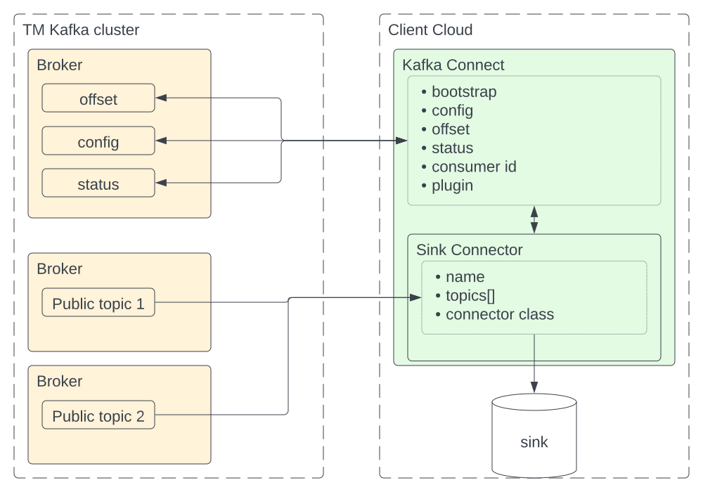

# Kafka Connect overview

SaaS

Here, you will learn how to adopt Thought Machine Kafka Connect (KC) features. Clients willing to use KC connectors can rely on the provided API to start consuming data from public topics.

## About this guide

Here, you will learn how to adopt Thought Machine’s Kafka Connect (KC) feature. Clients wishing to use KC connectors to consume data from public Kafka topics can rely on the API provided by this feature.

This guide serves as an overview that is suitable for new and existing SaaS clients who will use Kafka Connect to consume Thought Machine’s public topic messages. It is most relevant to those of the client’s engineers who will set up a client’s KC cluster.

## Design

In order to use KC functionality, clients must:

-   already have access to Thought Machine public Kafka topics - the KC solution relies on the same infrastructure and networking provided through the SaaS offering
    
-   provide a KC cluster in their infrastructure that is able to communicate with Thought Machine’s public Kafka topics
    
-   define a consumer group ID that will not clash with other consumer groups
    
-   configure their KC cluster with the mandatory topics as Thought Machine describes here, including the mandatory steps in the KC documentation
    

All communication is made through the additional topics and by implementing the KC API.

### Required client setup for KC implementation

The following diagram illustrates the required setup that you must deploy in order to use Kafka Connect (KC).

### Required and optional topics

The KC API is composed of a set of topics called KC internal topics which are required to run KC in distributed mode. KC internal topics are provided on Thought Machine’s Kafka cluster. Clients do not need to run their own Kafka cluster in order to run KC in distributed mode.

The following table outlines the internal KC topics that are exposed, and denotes whether a topic is required or optional for KC operability.

chat\_bubble

You must configure the KC cluster with those topics denoted as *Required*. You can use topics denoted as *Optional* at your discretion to monitor and handle errors or successfully processed messages.

  
| Topic | Functionality | KC cluster configuration requirement |
| --- | --- | --- |
| 
`vault.infra.external.kafka_connect.default.config`

 | 

Stores connector and task configuration

 | 

Required

 |
| 

`vault.infra.external.kafka_connect.default.offset`

 | 

Topic to store offsets

 | 

Required

 |
| 

`vault.infra.external.kafka_connect.default.status`

 | 

Topic to store statuses

 | 

Required

 |
| 

`vault.infra.external.kafka_connect.default.report.success_responses`

 | 

Topic to store successfully processed messages

 | 

Optional

 |
| 

`vault.infra.external.kafka_connect.default.report.error_responses`

 | 

Topic to store failed messages

 | 

Optional

 |

### Defining a consumer group ID

KC requires the definition of a consumer group ID that will not clash with other consumer groups that you will use. Thought Machine’s KC solution requires that you use the `external_kafka_connect` prefix in the consumer group ID. Currently, Thought Machine does not enforce the use of this prefix, but it will be mandatory in future releases.

### Configuring a Kafka Connect cluster

Since Kafka Connect (KC) clusters must be managed in a client’s infrastructure, Thought Machine’s KC offering is based on KC in distributed mode.

You must complete two key mandatory steps in order to set up the solution properly. Refer to the following configuration guidance and the [Apache Kafka Connect documentation](https://kafka.apache.org/documentation#connect).

#### Step one: Set up KC in your cluster

To set up KC in your cluster, provide a configuration file that contains the KC internal topics along with the Kafka bootstrap server, consumer group, and the classes of the connectors that will consume and process the messages.

error

You must make sure you maintain and monitor your KC cluster. Thought Machine is not responsible for the health of the KC cluster itself.

##### Example:

Here is an example of such a configuration file - this contains a placeholder for your `<client_codename>` and `<environment>` which you must replace with your own correct values as appropriate.

chat\_bubble

You should only use this configuration file as a reference and must not use it as given. You must provide the configuration that addresses your use case and observe the connection details that Thought Machine provides.

#### Step two: Configure KC connectors to consume from Thought Machine Kafka

You must provide appropriate connector configurations that address your requirements and ensure you conform to Thought Machine’s KC API.

chat\_bubble

The way that you will do this will depend on your particular setup; for example, through a UI or a POST to the `/connectors` endpoint.

For more information about KC, setting up connectors and processing messages, refer to the [Apache Kafka Connect documentation](https://kafka.apache.org/documentation#connect_configuring).

##### Example:

Here is an example of an HTTP POST request for creating a consumer connector.

chat\_bubble

It contains placeholders, in this case for your `<KC service address>` and `<port>`, which you must replace with your values as appropriate.

##### Connector configuration

Each connector requires a specific set of configurations - at a minimum this comprises:

-   connector name
    
-   public data topic to consume messages from
    
-   connector’s class - this must match one of the plugin.path values defined on KC
    

Thought Machine’s KC offering strictly supports sink (consumer) connectors, which extract data from Thought Machine’s public topics. It does not support source (producer) connectors, which ingest data into Thought Machine’s public topics.

##### Example:

Here is an example of a connector configuration (this contains a dummy topic name).

## Useful links

In addition to the information here, you may also wish to refer to the following sources:

-   [Apache Kafka Connect documentation](https://kafka.apache.org/documentation#connect)
    
-   [Baeldung Introduction to Kafka Connectors documentation](https://www.baeldung.com/kafka-connectors-guide)