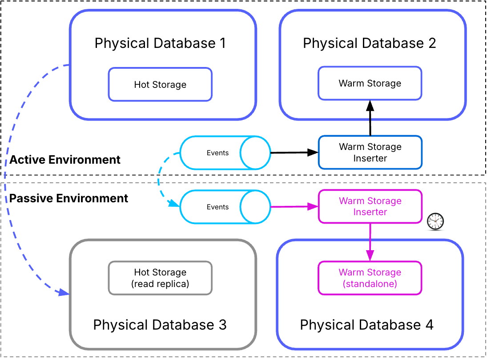

# Using multiple physical databases

## About this deployment mode

From Vault Core 5.5, clients can choose to distribute the logical databases required by the system across multiple physical database clusters.

This advanced deployment mode allows you to:

-   optimise your installation so that it can support a larger amount of data than you can currently store within a single database
    
-   gain additional performance benefits when compared with the use of an individual database
    

You can find information about setting up multiple physical databases for Vault Core in the [Configuring multiple databases](/vault-core/5-8/EN/environment_and_installation/infrastructure_docs/vault_cloud_infrastructure/configuring_multiple_databases).

### Disaster Recovery procedures when using multiple physical databases

Vault Core comprises a number of different logical databases which each contain data that is used by particular components. Specific relationships exist between the data in different logical databases such that the contents of one database are derived from actions that take place within a different database.

This is particularly relevant to certain calls against the Postings API, which may query either a warm (eventually consistent) or hot backend database.

### Background to the disaster recovery process for Vault Core with multiple physical databases

When all logical databases are hosted within the same physical database cluster, the relationship between the different databases is always guaranteed to follow an appropriate consistency pattern. This means that Ledger data that is stored in the warm database is up-to-date - or soon will be up-to-date - with the data that is stored in the primary (hot) Ledger database.

lightbulb

You can find information about the data ingestion delay between the Ledger and the warm database for your installation in the **Ledger** dashboards. You can find information about all of the dashboards available as part the [Observability Stack](/vault-core/5-8/EN/environment_and_installation/infrastructure_docs/observability_and_monitoring/using_the_observability_stack#core) in the [Grafana dashboards included in the Observability Stack](/vault-core/5-8/EN/environment_and_installation/infrastructure_docs/observability_and_monitoring/using_the_observability_stack#grafana_dashboards_included_in_the_observability_stack) guidance.

During normal operation of a multi-database cluster, these guarantees hold. The data stored within the warm database will always be at parity, or behind, the Ledger database, following an eventual consistency model. In the event of a disaster scenario, this does not necessarily hold true.

Consider the following scenario:

1.  Vault Core is operating normally.
    
2.  A Posting is created and sent to Vault Core, and Vault Core writes it to the Ledger database.
    
3.  Vault Core writes details of the Posting to the warm database at a later time.
    
4.  Corruption occurs to the Ledger database.
    
5.  The Database Administrator restores the Ledger Database to a point at or before stage 1 in this scenario.
    

At this point, the warm database contains data that is derived from transactions that no longer exist in the Ledger database. As a result, API calls that fetch data from the warm database may return incorrect results.

#### Alternative passive region operational mode

Vault Core offers a passive region operational mode that maintains Warm database parity or lag relative to the Hot database, ensuring data consistency and eliminating the requirement for Warm database snapshot restoration during failover.

This mode utilises a standalone Warm database within the passive region, which receives write operations via replicated Kafka topics (see the following diagram).

This mode requires Kafka replication between the active and passive environments; consult the [Active Passive: Considerations for standalone Kafka versus replicated Kafka](/vault-core/5-8/EN/environment_and_installation/infrastructure_docs/advanced_deployment_modes/active_passive#considerations_for_standalone_kafka_versus_replicated_kafka) section for more information on the implications of this configuration.

See: [Active Passive: Multiple database environments using the kafka-based derived database replication mode](/vault-core/5-8/EN/environment_and_installation/infrastructure_docs/advanced_deployment_modes/active_passive#multiple_database_environments_using_the_kafka_based_derived_database_replication_mode)

### Procedure to follow on recovery of the Hot Database

chat\_bubble

You should read these notes in conjunction with the instructions in the [Vault Disaster Recovery](/vault-core/5-8/EN/environment_and_installation/infrastructure_docs/vault_disaster_recovery) guidance.

Thought Machine strongly recommends that you take action to avoid a situation, as outlined in [Background to the disaster recovery process for Vault Core with multiple physical databases](/vault-core/5-8/EN/environment_and_installation/infrastructure_docs/advanced_deployment_modes/multiple_physical_databases#background_to_the_disaster_recovery_process_for_vault_core_with_multiple_physical_databases), whereby data stored in the warm database does not accurately reflect the records stored in the primary databases.

To do this, you must restore both the hot and warm databases to a point in time predating the onset of the data loss.

There are two ways to approach this. You should base your decision on which to use by thinking about your combined appetites for:

-   a low Recovery Point Objective (RPO)
    
-   the frequency of snapshots taken by your database and the specific PostgreSQL-compatible database that you are working with
    

#### Databases that support point-in-time recovery capabilities

Some managed database solutions, most notably AWS RDS and Aurora, GCP Cloud SQL and AlloyDB and Azure Database for PostgreSQL, allow restoration of a database to a specific point in time. These are referred to as Point-in-time recovery (PITR) capabilities. In these cases, it requires restoring the warm database to a point in time not greater than that which the hot database was restored to. Any missing data is repopulated, because any transactions that were missing from the hot database are replayed as part of normal Vault Core functionality.

#### Databases that support snapshot recovery

While PITR is the recommended solution for recovering normal operation as soon possible, this may not be possible due to either business-related or system constraints.

Under such circumstances, it is possible to instead restore functionality using a backup snapshot. You should elect to restore the warm database to the latest possible point that is earlier than the time to which the hot database has been restored. Given the likelihood of a much larger time difference between the restoration points of the hot and warm databases, it is likely to take significantly longer before the warm database is fully populated.

#### Active-Passive failover

The point-in-time method and snapshot recovery method are both methods that you would typically use to restore into a new database instance.

You should consider the following points when planning for the disaster recovery process:

-   restoration time
    
-   configuration changes
    
-   cross-region backups
    
-   operational mode
    

Cross-region backups is a key consideration in order to ensure that restoration capabilities are available in the event of a disaster. This is because it can impact the time that you require to restore using snapshots stored in different regions.

You should factor in these points for the Active-Passive [database failover action](/vault-core/5-8/EN/environment_and_installation/infrastructure_docs/advanced_deployment_modes/active_passive#3_database_failover).

#### Post-restoration

error

Running `ANALYZE` on each of the restored databases is recommended to update the `pg_statistics` system catalogue. PostgresSQL uses these statistics for query planning, and failing to update them may result in serious performance degradation. However, it can take time to complete the update for large datasets, and could impact subsequent use of Vault Core.

See [PostgreSQL: Run ANALYZE Afterwards](https://www.postgresql.org/docs/16/populate.html#POPULATE-ANALYZE)

You should continue to follow the existing [Disaster Recovery Operator](/vault-core/5-8/EN/environment_and_installation/infrastructure_docs/vault_disaster_recovery#disaster_recovery_operator_instructions) process, and rehydrate Core Kafka topics.

The Core Disaster Recovery Process Definitions (DRPD) include the steps to rehydrate topics consumed by Warm Storage.

warning

When recovering from a snapshot, make sure that the `from` timestamp is set before the Warm Storage image creation time.

For rehydrating only topics consumed by Warm Storage, see [Example Warm Storage DRPD](#example_warm_storage_drpd).

### Additional notes

#### Comparing databases

You can query `SELECT pg_last_xact_replay_timestamp()` to obtain the last replay timestamp for each database in the passive region.

#### Example Warm Storage DRPD

This example DRPD instructs journal bootstrappers to rehydrate topics consumed by Warm Storage.

chat\_bubble

The timestamps are assigned using the `vaultctl dr rehydrate` command - see: [Disaster Recovery Operator](/vault-core/5-8/EN/environment_and_installation/infrastructure_docs/vault_disaster_recovery#disaster_recovery_operator_instructions)