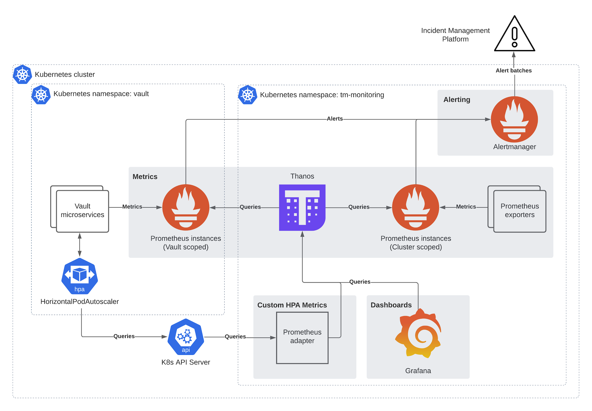

# Introduction to observability

Observability and monitoring are a key part of managing your Vault Core instance:

-   *Monitoring* allows you to monitor the state of your systems by tracking data points via predefined sets of metrics.
    
-   *Observability* allows you to troubleshoot any problems that may occur.
    

Together, they provide comprehensive insights into the performance, health, and behaviour of Vault Core.

## About the Observability Stack

Your Vault Core release comes with an *Observability Stack*, which provides observability and monitoring functionality specific to Vault Core. It does the following:

-   Collects and stores metrics
    
-   Provides [Grafana dashboards](/vault-core/5-8/EN/environment_and_installation/infrastructure_docs/observability_and_monitoring/introduction_to_grafana_and_key_dashboards) that let you observe the status of Vault Core
    
-   Provides alerts for predefined issues affecting Vault Core components
    
-   Provides tracing export functionality to help you troubleshoot Vault Core issues
    
-   Provides metrics export functionality to allow you to store metrics in your preferred metrics storage system
    

The Observability Stack is a [required component](/vault-core/5-8/EN/environment_and_installation/infrastructure_docs/getting_started_with_vault_core/requirements): as well as being a prerequisite to installing Vault Core, it is required for autoscaling workloads, and for Thought Machine to provide support if you need assistance.

See [Setting up the Observability Stack](/vault-core/5-8/EN/environment_and_installation/infrastructure_docs/observability_and_monitoring/setting_up_the_observability_stack) for instructions on how to install and configure the Observability Stack component.

## What’s included in the Observability Stack package?

Below is a high-level overview of the tooling provided with the Observability Stack - for more technical details on the contents, see [Observability Stack artefacts](/vault-core/5-8/EN/environment_and_installation/infrastructure_docs/observability_and_monitoring/using_the_observability_stack#observability_stack_artefacts).

 
| Functionality/Tool | Description |
| --- | --- |
| 
Alerting

 | 

Receives alerts from the metrics component and routes them to external notification systems.

 |
| 

Custom HPA metrics

 | 

Connects the metrics component as a data source for Kubernetes Horizontal Pod Autoscaling.

 |
| 

Dashboards

 | 

A dashboard platform that uses Grafana to visualise the running state of Vault Core.

 |
| 

Metrics

 | 

Information about Vault Core and its infrastructure that is collected, aggregated and stored in Time Series Databases.

Note: The Observability Stack does not retain long-term metrics. For information on how to write metrics to compatible storage, see [Writing metrics to external storage](/vault-core/5-8/EN/environment_and_installation/infrastructure_docs/observability_and_monitoring/using_the_observability_stack#writing_metrics_to_external_storage).

 |
| 

Tracing

 | 

Clients can optionally configure Vault Core to send traces to an endpoint that accepts traces in OpenTelemetry format via gRPC or HTTP. Thought Machine does not include distributed tracing storage infrastructure with Vault Core. See: [Using Tracing](/vault-core/5-8/EN/environment_and_installation/infrastructure_docs/observability_and_monitoring/using_the_observability_stack#using_tracing).

 |

## What’s not included in the Observability Stack package?

To make full use of the Observability Stack’s functionality, you need to provide your own additional tooling to complete your observability setup:

 
| Functionality/Tool | Description |
| --- | --- |
| 
Incident Management

 | 

You should have a third-party incident management or communication system in place, such as PagerDuty or Slack, if you want your support engineers to receive notifications of Vault Core alerts automatically.

 |
| 

Logging

 | 

You must provision a logging platform (for example, the Elastic Stack: Elasticsearch/Logstash/Kibana) for the collection and storage of Vault Core application logs; these logs help Thought Machine during any incidents that may occur.

 |
| 

Metrics storage and recovery

 | 

The Observability Stack does not retain long-term metrics. For information about available options, see [Writing metrics to external storage](/vault-core/5-8/EN/environment_and_installation/infrastructure_docs/observability_and_monitoring/using_the_observability_stack#writing_metrics_to_external_storage).

 |
| 

Kubernetes Metrics Server

 | 

As well as being a prerequisite to using Vault Core, the [Kubernetes Metrics Server](https://github.com/kubernetes-sigs/metrics-server) (`metrics-server`) is required to ensure that the Kubernetes Horizontal Pod Autoscaling (HPA) works correctly. The `metrics-server` fetches resource metrics and exposes them in Kubernetes API Server through the Metrics API.

Make sure the `metrics-server` is installed in your environment - your provider might not have included it by default. For information on how to check if it is present and to set it up, see [Configuring Kubernetes in Vault Core](/vault-core/5-8/EN/environment_and_installation/infrastructure_docs/vault_cloud_infrastructure/configuring_kubernetes_in_vault/).

Refer to the [Kubernetes Metrics Server](https://github.com/kubernetes-sigs/metrics-server) documentation to check for compatibility, incompatibility, and any known limitations with other components.

 |
| 

Kubernetes Vertical Pod Autoscaler

 | 

Thought Machine does not provide the Vertical Pod Autoscaling (VPA) component for Kubernetes, but provides support for certain VPA configurations, such as Prometheus. VPA support for Kubernetes is an optional platform feature that you can choose to enable yourself and requires that you install [Vertical Pod Autoscaler version 1.1](https://github.com/kubernetes/autoscaler/tree/master/vertical-pod-autoscaler#compatibility) or later on your cluster. For more information, see [Enabling Vertical Pod Autoscaling for observability workloads](/vault-core/5-8/EN/environment_and_installation/infrastructure_docs/observability_and_monitoring/using_the_observability_stack#enabling_vertical_pod_autoscaling_for_observability_workloads).

Refer to the [known limitations](https://github.com/kubernetes/autoscaler/tree/master/vertical-pod-autoscaler#known-limitations) in the Vertical Pod Autoscaler documentation to check for compatibility, incompatibility, and any known limitations with other components. For example, Kubernetes Horizontal Pod Autoscaler and Kubernetes Vertical Pod Autoscaler.

 |

## Observability Stack architecture

The Observability Stack uses open-source [Prometheus](https://prometheus.io/) to provide alerts and data about the run state of Vault Core microservices. Prometheus scrapes metrics from microservices using a pull-based mechanism, and works with other open-source software to enhance the Observability Stack’s functionality:

-   [Thanos](https://thanos.io/): allows you to query metrics data and visualise it in [Grafana](https://grafana.com/).
    
-   [Alertmanager](https://github.com/prometheus/alertmanager): raises alerts for any issues to your chosen incident management service.
    

The diagram depicts how these artefacts work together to create the observability and monitoring pipeline for Vault Core microservices:

## Observability Stack artefacts

The Observability Stack ships with core observability tools including Prometheus, Thanos, Alertmanager, and Grafana:

 
| Artefact | Description |
| --- | --- |
| 
Alertmanager

 | 

A highly-available platform that handles the aggregation and routing of alerts from Prometheus to external receivers such as Slack or PagerDuty. See: [Using Alertmanager](/vault-core/5-8/EN/environment_and_installation/infrastructure_docs/observability_and_monitoring/using_the_observability_stack#using_alertmanager).

 |
| 

Grafana

 | 

A dashboarding platform for time-series metrics. While Vault Core ships with Grafana dashboards, you may need to provide your own instance of the Grafana platform. See: [Using Grafana dashboards](/vault-core/5-8/EN/environment_and_installation/infrastructure_docs/observability_and_monitoring/using_the_observability_stack#using_grafana_dashboards).

 |
| 

Thanos

 | 

A highly available, scalable system for aggregating and querying metrics from multiple Prometheus instances across different environments.

 |
| 

Prometheus Operator

 | 

Orchestrates changes to Observability Stack Prometheus instances.

 |
| 

Prometheus instances (overview)

 | 

Collect and store metrics from Vault microservices and Prometheus exporters. The Prometheus instances are scoped either to the cluster or to the Vault namespace. This is to allow the Observability Stack to scale when multiple Vault Core instances are deployed on a single cluster.

 |
| 

Prometheus instances (cluster-scoped)

 | 

-   *Cloud*: Non-Vault Core cluster services, such as the webhook-operator
    
-   *Cardinality*: Provides information about Prometheus metric and label cardinality for debugging issues with Prometheus itself
    
-   *Istio*: Istio Control Plane metrics
    
-   *Kubernetes*: Kubernetes and other platform metrics for non-Vault Core workloads
    
-   *Kubelet*: Metrics from the kubelet component of Kubernetes
    

 |
| 

Prometheus instances (namespace)

 | 

-   *Kafka*: Kafka metrics
    
-   *Kubernetes*: Kubernetes and other platform metrics for Vault Core microservices
    
-   *Postgres*: Postgres database metrics collected by the postgres\_exporter
    
-   *Vault*: Metrics collected from instrumented Vault Core microservices
    
-   *Kubelet*: Metrics from the kubelet component of Kubernetes
    
-   *Redis*: Metrics from Redis services used in Vault Core
    
-   *db-queries*: Metrics related to database query performance
    

 |
| 

Prometheus exporters

 | 

The following exporters are used to collect cluster metrics:

-   node-exporter
    
-   kube-state-metrics
    
-   prometheus-cardinality-exporter
    

 |
| 

Prometheus service and pod monitors

 | 

PodMonitors and ServiceMonitors are Kubernetes resources that define the metrics collected by Prometheus. These monitors are associated with a Kubernetes service or pod and a Prometheus instance.

 |
| 

Prometheus adapter

 | 

Implements endpoints for the custom metrics APIs. This allows the Horizontal Pod Autoscalers of the Vault Core microservices to scale on Prometheus metrics.

 |