# Setting up Azure Active Directory as your SAML IdP

1.  Log in to Azure Active Directory.
    
2.  [Create a new Enterprise application](/vault-core/5-8/EN/environment_and_installation/infrastructure_docs/setting_up_and_configuring_vault_with_a_saml_idp/setting_up_azure_active_directory_as_your_saml_idp#create_a_new_enterprise_application) for each environment you want to maintain (e.g. preprod, prod).
    
3.  [Assign users](/vault-core/5-8/EN/environment_and_installation/infrastructure_docs/setting_up_and_configuring_vault_with_a_saml_idp/setting_up_azure_active_directory_as_your_saml_idp#assign_users_to_the_application) to the new application or applications.
    
4.  [Set up your application](/vault-core/5-8/EN/environment_and_installation/infrastructure_docs/setting_up_and_configuring_vault_with_a_saml_idp/setting_up_azure_active_directory_as_your_saml_idp#set_up_your_application) or applications.
    
5.  [Copy the SAML Service Provider configuration](/vault-core/5-8/EN/environment_and_installation/infrastructure_docs/setting_up_and_configuring_vault_with_a_saml_idp/setting_up_azure_active_directory_as_your_saml_idp#copy_the_saml_sp_configuration) (provided by the IdP) for each environment you want to maintain (e.g. preproduction, production).
    
    (This configuration provided by the IdP needs to be set on the Service Provider side.)
    
6.  [Create application roles and assign them to users.](/vault-core/5-8/EN/environment_and_installation/infrastructure_docs/setting_up_and_configuring_vault_with_a_saml_idp/setting_up_azure_active_directory_as_your_saml_idp#create_application_roles_and_assign_them_to_users)
    

## Create a new Enterprise application

1.  From the Azure Portal, at the top of the screen, use the search box to search for *Enterprise applications*.
    
2.  In the Enterprise applications overview, click **Create New application**.
    
3.  Use the search box within the **Browse Azure AD Gallery** page to search for **Azure AD SAML Toolkit**.
    
    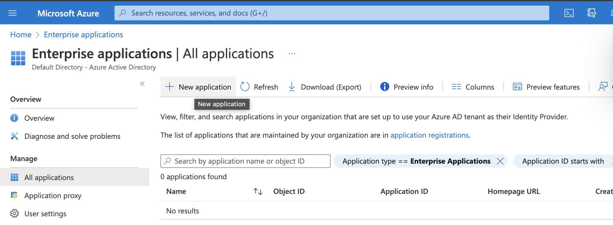
    
    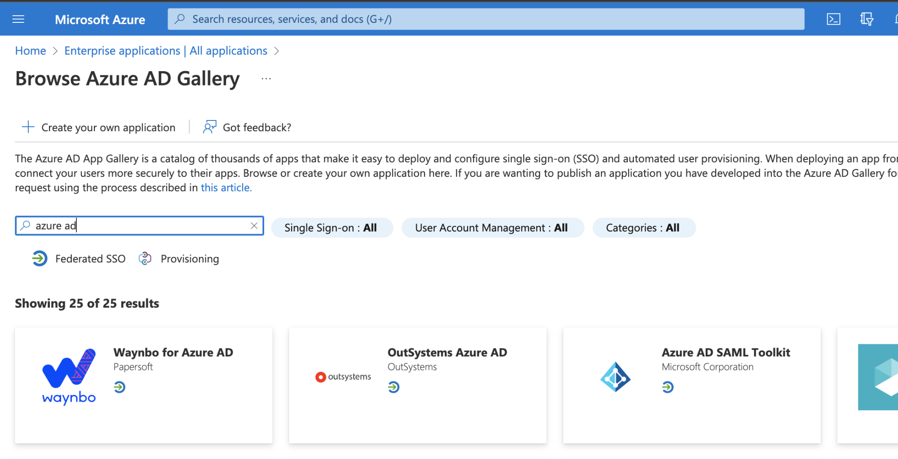
    
4.  In the **Name** field, give the new application a suitable name and click **Create**.
    
    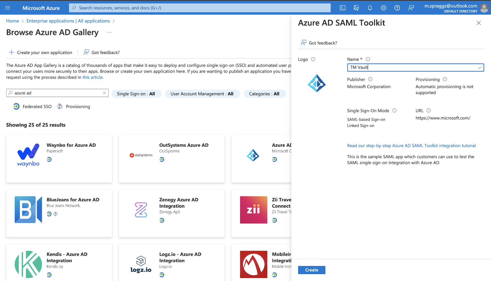
    

## Assign users to the application

1.  Within the overview page for the new application, click **1\. Assign users and groups**.
    
    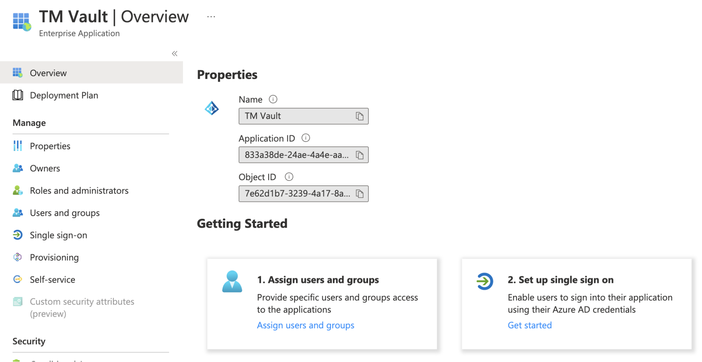
    
2.  In the **Users and groups** list, click **Add user/group**.
    
    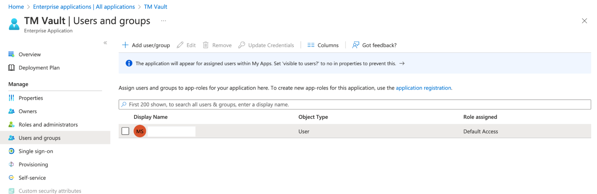
    
3.  Select the users and roles to be associated with the application, and click **Assign**.
    

## Set up your application

1.  From the overview page for the new application, select **2\. Set up single sign on.**
    
    
    
2.  Under **Select a single sign-on method**, click **SAML**.
    
    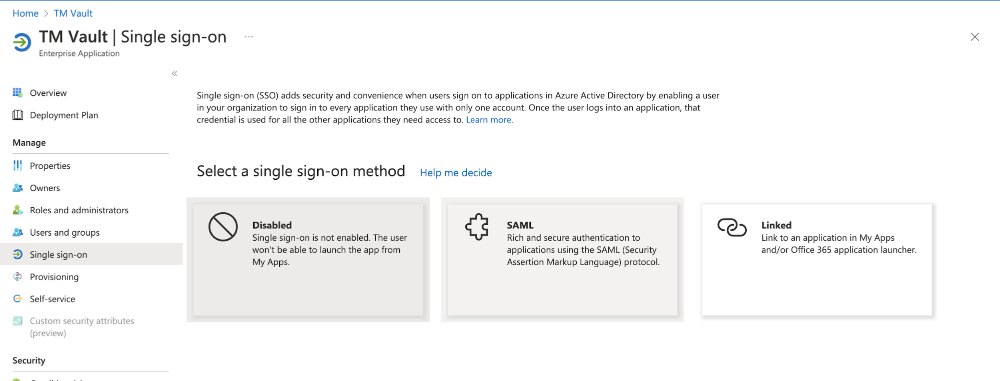
    
3.  In the top right of the **Basic SAML Configuration** box, click **Edit**.
    
    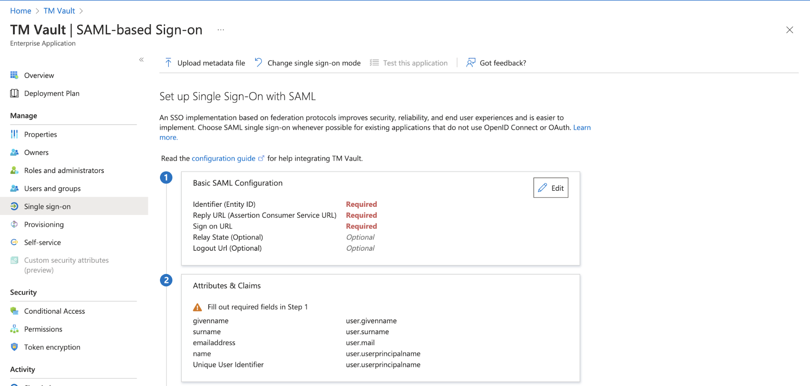
    
4.  In the edit menu that appears on the right of the screen, set the following attributes:
    
    -   *Identifier (Entity ID)* - [https://{ops\_dash\_domain}/api/saml/metadata](https://{ops_dash_domain}/api/saml/metadata)
        
    -   *Reply URL (Assertion Consumer Service URL)* - [https://{ops\_dash\_domain}/api/saml/acs](https://{ops_dash_domain}/api/saml/acs)
        
    -   \_Sign on URL \_- [https://{ops\_dash\_domain}/](https://{ops_dash_domain}/)
        
        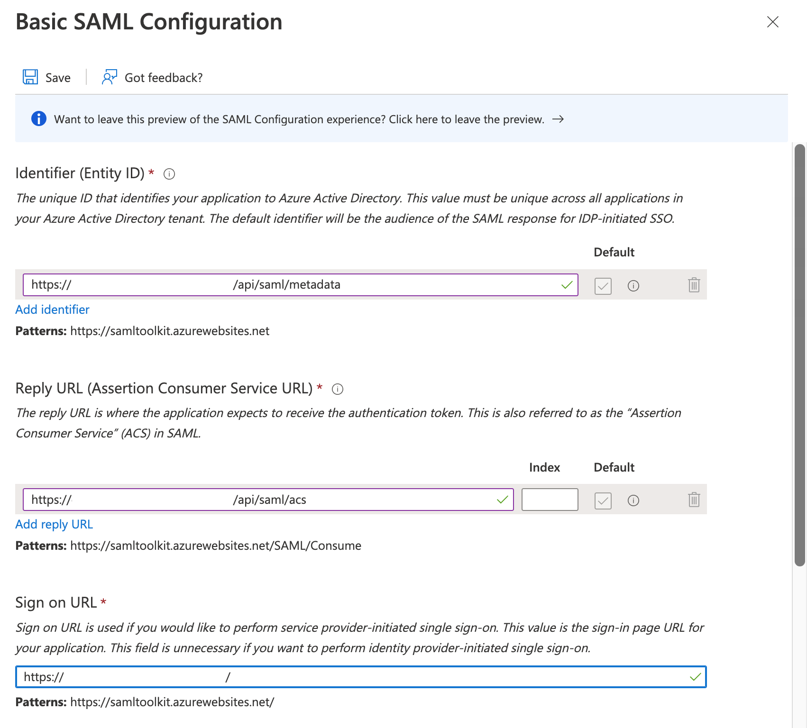
        
    
5.  Click **Save** in the top left of the edit dialog.
    
6.  Within the **SAML-based Sign-on** overview page, click the Edit button within the box labelled **Attributes & Claims**.
    
    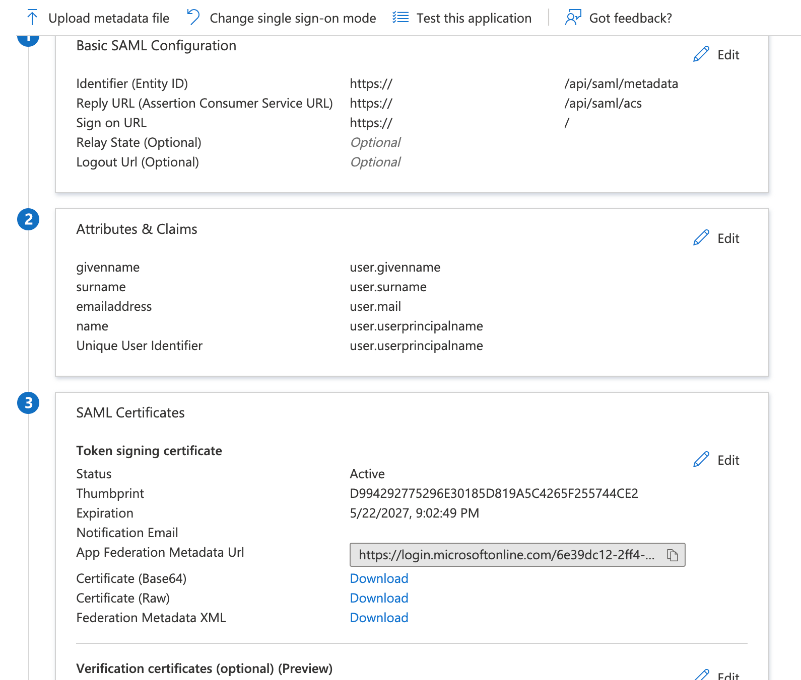
    
7.  Add a roles claim as shown below, and click **Save**.
    
    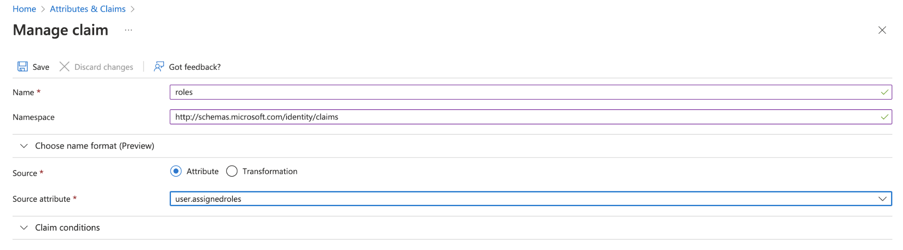
    

## Copy the SAML SP configuration

chat\_bubble

For bank-hosted Vault Core customers, copy this data for use in the *values.yaml* file. For SaaS clients, copy this information to populate the fields in the Client Environment Request form provided by your Client Delivery Manager.

1.  From the **SAML-based Sign-on** page, under **SAML Certificates**, click the Download link next to **Certificate (Base64)**.
    
    For on-premise hosted clients, the contents of this file will be used to populate the .saml\_idp.certificate variable in the values.yaml file.
    
2.  Under **Set up \\{application name}**, copy the **Login URL**, the **Azure AD Identifier** and the **Logout URL**. These correspond to the SSO URL, the entity ID and the SLO URL, respectively, used to configure Vault Core.
    
3.  Populate the saml\_sp section of the values.yaml file with the configuration as previously defined in '**Advanced Settings** of the **Configure SAML** tab in your application.
    

## Create application roles and assign them to users

1.  From the menu on the left of the **Overview** page of the SAML Enterprise Application, select **Users and groups**.
    
    
    
2.  Click the **application registration** link above the table of users assigned to the application.
    
    
    
3.  Click **Create app role**.
    
    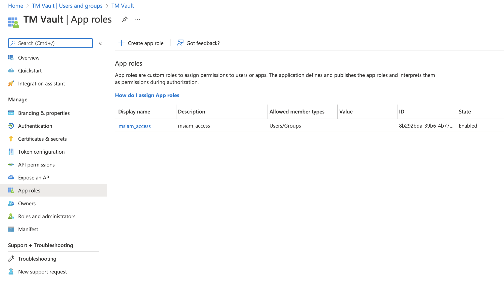
    
4.  In the dialog that appears on the right of the screen, provide values for the **Display Name**, **Value** and **Description** fields. Leave the value of **Allowed member types** set to **Users/Groups** and click **Apply**.
    
    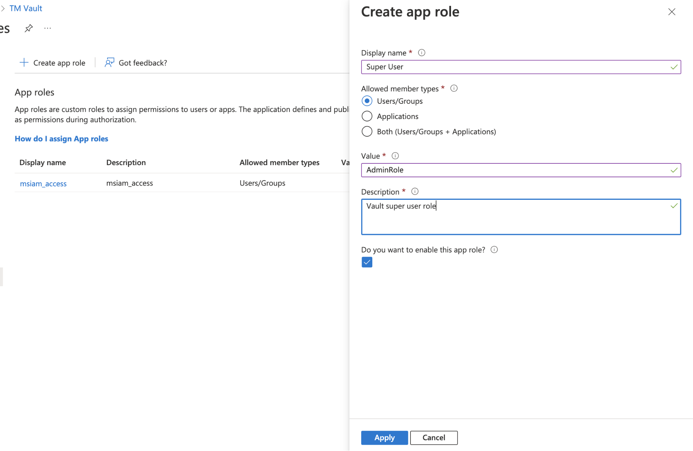
    
    Repeat this process for each role to which the SAML application needs access.
    
5.  Return to the **Users and groups** page, select a user or group to which a role should be associated, then click **Edit**.
    
    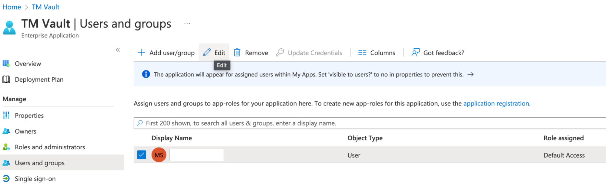
    
6.  Click on **None Selected**, select a role from the dialog that appears on the right, click **Select**, then click **Assign**.
    
    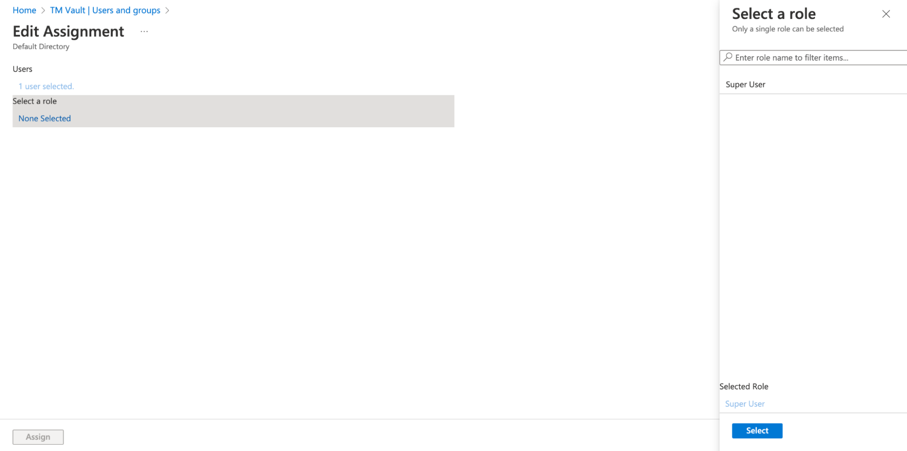