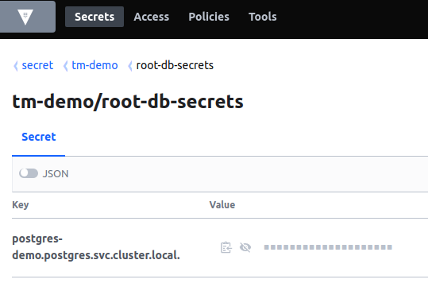

# Tools and artefacts provided

## Operator release artefacts

  
| *Artefact name* | *Description* | *Type* |
| --- | --- | --- |
| 
vaultctl

 | 

TMComponent Operator command line tool. Used for installation, configuration or export of TMComponent Operator artefacts. For more information, see [TMComponent Operator structure.](/vault-core/5-8/EN/environment_and_installation/infrastructure_docs/tmcomponent_operator_user_guide/advanced_installation_options#tmcomponent_operator_structure)

 | 

Binary (Unix Executable)

 |
| 

components\_guide.yaml

 | 

Outlines the components that can be installed using a given release file. Equivalent to running `vaultctl components` on the release file.

 | 

YAML

 |
| 

kafka\_topics\_info.json

 | 

Aids with manually creating all Kafka topics required by the Vault Core services if you do not intend to use the vault-topic-manager deployment, or it is incompatible with the managed Kafka service you are using. kafka\_topics\_info.json contains all required details and configuration settings information for creating the topics. For more details, along with the schema, see [Kafka topics artefact](/vault-core/5-8/EN/environment_and_installation/infrastructure_docs/tmcomponent_operator_user_guide/advanced_installation_options#kafka_topics_artifact).

 | 

JSON

 |
| 

release.json

 | 

Release metadata file. Metadata such as images, vulnerabilities, service accounts, and third-party libraries is scoped by component. See [Release JSON artefact.](/vault-core/5-8/EN/environment_and_installation/infrastructure_docs/tmcomponent_operator_user_guide/advanced_installation_options#release_json_artifact)

 |  |
| 

vault-installer-hashicorp-vault-policy.hcl

 | 

HashiCorp Vault policy, required to be associated with the TMComponent Operator HashiCorp Vault role (where HashiCorp Vault is your chosen secrets manager).

 | 

HashiCorp Configuration Language

 |
| 

vault-n.n.n.release

 | 

The release file to be used as input to vaultctl. This contains information that vaultctl needs to install components for a particular release. Vaultctl is backwards compatible so the latest vaultctl can always install release files from previous releases, however an older vaultctl should not be used with a more recent release.

 | 

release

 |

## HashiCorp Vault configuration

### Service accounts and roles

As part of the Vault Core installation, secrets, policies and roles are pushed to HashiCorp Vault. The Kubernetes auth backend in HashiCorp Vault should be configured to bind the Vault installer Kubernetes service account to a role with permissions to push secrets, policies and roles. This ensures the Crown Operator has permission to push these.

### Required secrets

chat\_bubble

This is a mandatory step.

Using the HashiCorp Vault web UI, install the root user or admin user password in a secret called root-db-secrets, with the DB host name as the key and the password as the value. This should be underneath the HashiCorp Vault path used for storing secrets for the Vault Core instance.

To install Vault Core with a database admin user instead of a root user, see the section *Installing Vault with a Database Admin User* in the [Vault Cloud Infrastructure](/vault-core/5-8/EN/environment_and_installation/infrastructure_docs/vault_cloud_infrastructure) guidance.

If the Vault Core installation spreads the databases across more than one host, include an entry in root-db-secrets for each host.

chat\_bubble

-   DB host must be an endpoint accessible to Thought Machine Vault Core cluster.
    
-   The content of the database password must be URL safe, otherwise a database connection error will occur during installation.
    

You may also need to provision additional secrets before the deployment, depending on which components of Vault Core are deployed. Details of any additional credential requirements will be provided before the installation.

## Vault Ingress secrets

Each Kubernetes Ingress object deployed for Vault Core has a unique secretName. The certificate or certificates used for these Ingress objects must be stored in Kubernetes secrets with the same names that are specified in the Vault Ingress objects.