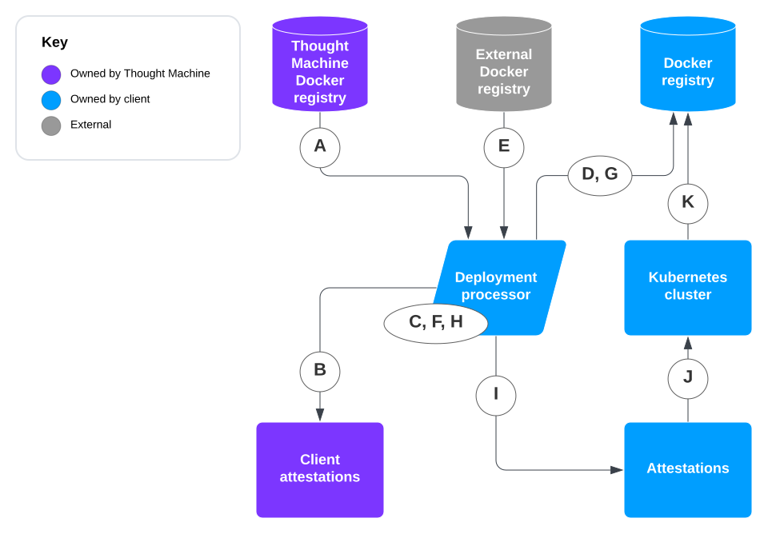
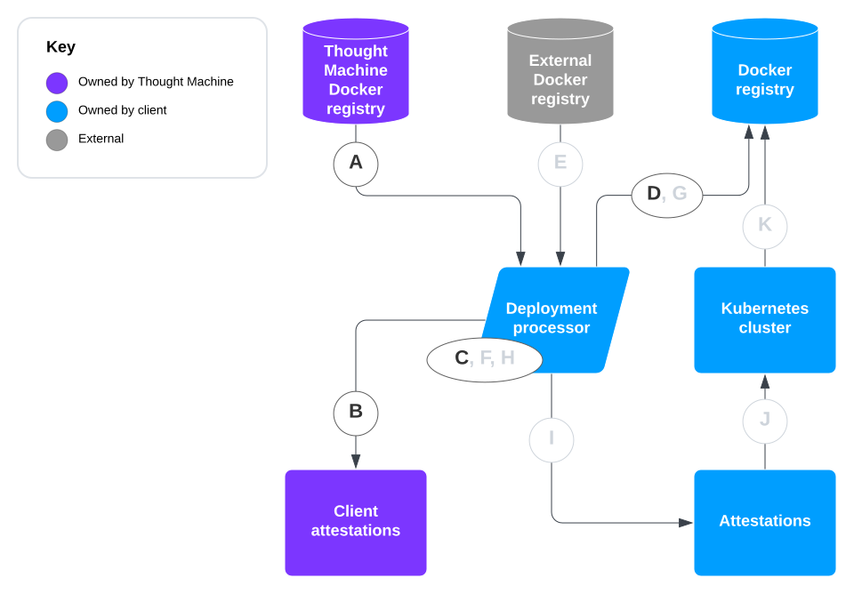

# Using Binary Authorisation and Docker Images

## About this guide

### Purpose

This document:

-   Explains what Binary Authorisation is and outlines its benefits to you
    
-   Instructs you how to implement Binary Authorisation in the client deployment process
    
-   Outlines the benefits of pulling Docker images from Thought Machine
    
-   Instructs you how to pull Docker images from Thought Machine as part of your deployment process
    

### Scope

This document covers:

-   The process for using Binary Authorisation in your deployment (providing an example client release script)
    
-   A break-glass procedure should Binary Authorisation need to be overridden
    
-   Example policies that can be used with Binary Authorisation
    
-   The process for pulling, verifying and mirroring Thought Machine Docker images to your Docker registry (providing an example client release script)
    
-   Working with Thought Machine’s Pretty Good Privacy (PGP) key during the process
    

### Out of scope

This document does not cover setting up your Docker registry for Thought Machine Docker images.

### Audience

You should follow the guidance in this document if you are a client engineer involved in deploying Vault to your environment. We recommend using Binary Authorisation as a method of securing the deployment supply chain to your Kubernetes cluster.

### Review and approval

This document is owned by Security Engineering. It is reviewed at least annually by a Cloud Security Engineer and approved by the Security Engineering Technical Lead.

### Further reading

See also:

-   [https://cloud.google.com/binary-authorization/docs/](https://cloud.google.com/binary-authorization/docs/)
    
-   [https://cloud.google.com/binary-authorization/docs/multi-project-setup-cli](https://cloud.google.com/binary-authorization/docs/multi-project-setup-cli)
    
-   [https://github.com/grafeas/grafeas](https://github.com/grafeas/grafeas)
    
-   [https://github.com/grafeas/kritis](https://github.com/grafeas/kritis)
    
-   [https://github.com/grafeas/grafeas/blob/master/docs/create\_notes\_occurrences.md](https://github.com/grafeas/grafeas/blob/master/docs/create_notes_occurrences.md)
    

### Disclaimer

Thought Machine makes no claims, promises or guarantees about the accuracy, completeness or adequacy of this document. All information, content and materials are provided \`as is' and without any representation or warranty of any kind, express or implied, including (but not limited to) the implied warranties of merchantability, fitness for a particular purposes, title, or non-infringement. To the extent permitted by applicable law, Thought Machine does not accept liability for any direct, indirect, special, consequential, exemplary, punitive, or any other losses or damages of any kind, including (but not limited to) any loss of profits, business interruption, loss of data or otherwise, even if expressly advised of the possibility of such damages.

## Binary Authorisation overview

### What is Binary authorisation?

Binary Authorisation is a deploy-time security control, ensuring only trusted container images can be deployed to Kubernetes.

The process requires signatures for Docker images from trusted authorities during development and then enforces signature verification when deploying.

This lets you have firmer control over your container environment by making sure only verified images can be integrated.

### Benefits of using Binary Authorisation

It provides your deployment team with:

-   Confidence that only definitively authorised container images will be deployed to Kubernetes
    
-   A reduced risk of any inadvertent or malicious code being used in your environment
    

### Deploying Binary Authorisation

The deployment process relies on the image digest produced by the Docker registry. As your registry and Thought Machine’s are separate, the digests will differ. This means you will need to re-attest the images to support Binary Authorisation.

Thought Machine provides you with a token and endpoint so you can pull images and attestations from our infrastructure.

## Deployment process

### Deployment prerequisites

These APIs must be enabled in your Google Cloud Platform (GCP) project:

-   Binary Authorisation API
    
-   Container Analysis API
    

Follow the [Google Cloud Binary Authorisation setup guidelines](https://cloud.google.com/binary-authorization/docs/setting-up) ([https://cloud.google.com/binary-authorization/docs/setting-up](https://cloud.google.com/binary-authorization/docs/setting-up)).

### Process overview

 
| Step | What happens |
| --- | --- |
| 
A

 | 

Your deployment process authenticates to the Thought Machine external Docker registry and pulls a list of Docker images from the Thought Machine external Docker registry.

 |
| 

B

 | 

Your deployment process verifies the attestation from the Thought Machine client attestations store.

 |
| 

C

 | 

Your deployment process retags the image with your Docker registry.

 |
| 

D

 | 

Your deployment process pushes the image to your Docker registry, and the new digest is reserved for step H.

 |
| 

E

 | 

Your deployment process pulls images from the external registry.

 |
| 

F

 | 

Your deployment process retags the images with Thought Machine tags.

 |
| 

G

 | 

Your deployment process pushes the image to your Docker registry, and a new digest is reserved for step H.

 |
| 

H

 | 

Your deployment process attests the pushed image with your attestor.

 |
| 

I

 | 

The attestation is pushed to your attestation project.

 |
| 

J

 | 

Your Kubernetes cluster verifies the image by checking attestations for it from your attestation project.

 |
| 

K

 | 

If the image clears verification, the cluster pulls the image from your registry to the start pod.

 |

### Example client release process

If you would like to use Binary Authorisation in your own release processes, and with your own attestors and attestations, we recommend that you follow these steps for each Docker image:

1.  Pull the image from your Docker registry.
    
2.  Verify that the image is attested with Thought Machine’s public GPG key (see [Pulling Docker images overview](/vault-core/5-8/EN/environment_and_installation/infrastructure_docs/using_binary_authorisation_and_docker_images#pulling_docker_images_overview)).
    
3.  Retag the image with your Docker registry.
    
4.  Push the image to your Docker registry.
    
5.  Reattest the destination image with your own attestor.
    

## Break-glass procedure

You can add this annotation to a Kubernetes resource that needs to run unsigned images after you have received authorisation from your security team:

In this example, the annotation is applied for a pod with an unsigned nginx image:

## Example policies

### Overview

These are two example policies that can be used with Binary Authorisation. We have allowlisted the containers used by Google Kubernetes Engine (GKE) so nodes can be started.

### Using Google Cloud

This can be applied with the [Google Cloud instructions](https://cloud.google.com/sdk/gcloud/reference/container/binauthz/policy/import) ([https://cloud.google.com/sdk/gcloud/reference/container/binauthz/policy/import](https://cloud.google.com/sdk/gcloud/reference/container/binauthz/policy/import)).

### Using Terraform

## Troubleshooting Binary Authorisation

If you experience any unexpected behaviour or would like to debug Binary Authorisation, set the `enforcement_mode` to `DRYRUN_AUDIT_LOG_ONLY`.

## Overview of providing Docker images

### Why use Docker images?

Using Docker images from the Thought Machine Docker registry gives your deployment team:

-   Greater autonomy in release processes
    
-   The ability to apply supply chain security on artefacts received from Thought Machine via Binary Authorisation.
    

### Benefits of signing our Docker images

Docker images released from Thought Machine are signed using the *tm-release-attestor*. This provides assurance in the supply chain that the images were built and verified by Thought Machine.

The *tm-release-attestor* is used to sign images which have been built, tested, security-verified and quality assured.

## Process for providing Thought Machine Docker images

You need:

-   A Docker registry set up for Vault images. See the [Vault Cloud Infrastructure](/vault-core/5-8/EN/environment_and_installation/infrastructure_docs/vault_cloud_infrastructure) guide for information about setting this up
    
-   Credentials to authenticate to the Thought Machine Docker registry and client attestations store
    
    chat\_bubble
    
    If you have not been provided with authentication credentials, email your Thought Machine Client Delivery Manager or representative to request access to our Docker registry and client attestations. Your request will be forwarded to the Thought Machine security team.
    

### Process overview for providing Thought Machine Docker images

 
| Step | What happens |
| --- | --- |
| 
A

 | 

Your deployment process authenticates to the Thought Machine external Docker registry and pulls a list of Docker images from the Thought Machine external Docker registry.

 |
| 

B

 | 

Your deployment process verifies the attestation from the Thought Machine client attestations store with Thought Machine’s public PGP key.

 |
| 

C

 | 

Your deployment process retags the image with your Docker registry.

 |
| 

D

 | 

Your deployment process pushes the image to your Docker registry to mirror it.

 |

### Example client release process

These steps provide an example process for pulling, verifying and mirroring a Thought Machine Docker image to your Docker registry (`vault.client.docker-registry.io`).

chat\_bubble

This is an example only which specifies the image `docker.external.thoughtmachine.io/third_party/library/alpine:3.10.2`.

1.  Run to authenticate with the Thought Machine Docker registry:
    
2.  Run to pull an image from the Thought Machine Docker registry:
    
3.  Run to check and verify the attestation for an image:
    
4.  Run to tag the image against your Docker registry after the image attestation is verified:
    
5.  Run to push the image to your Docker registry:
    

chat\_bubble

An example client release script supporting multiple images and programmatic verification is provided in *[Example client release script for supporting multiple images](/vault-core/5-8/EN/environment_and_installation/infrastructure_docs/using_binary_authorisation_and_docker_images#example_client_release_script_for_supporting_multiple_images)*.

## Process for providing external Docker images

### Prerequisites

You need:

-   A Docker registry set up for Vault images. See the [Vault Cloud Infrastructure](/vault-core/5-8/EN/environment_and_installation/infrastructure_docs/vault_cloud_infrastructure) guide for information about setting this up
    
-   Credentials to authenticate to the external Docker registry (if needed)
    

### Process overview for providing external Docker images

 
| Step | What happens |
| --- | --- |
| 
E

 | 

Your deployment process pulls images from the external registry.

 |
| 

F

 | 

Your deployment process retags the image with the Thought Machine tag and your Docker registry.

 |
| 

G

 | 

Your deployment process pushes the image to your Docker registry to mirror it.

 |

### Example client release process

The byo\_images.txt contains images that cannot be sourced from the Thought Machine Registry, but which a Vault installation relies on.

The format of the file is space-delimited records, separated by new lines. The first field is the Thought Machine tag, which the Kubernetes packages expect. The second field is the external registry location of the image where the image can be pulled from.

The high level flow is pulling from the external registry, re-tagging with the expected Thought Machine tag, then pushing to the client registry. This is done for each pair of records in the byo\_image.txt file.

These steps provide an example process for pulling, verifying and mirroring an external Docker image from [Example byo\_images.txt](/vault-core/5-8/EN/environment_and_installation/infrastructure_docs/using_binary_authorisation_and_docker_images#example_byo_imagestxt)

1.  Run to pull an image from the external Docker registry:
    
2.  Run to tag the image against your Docker registry:
    
    chat\_bubble
    
    This example includes a reference to a version of Vault Core. Make sure that the reference that you use matches the version of Vault Core that you are using.
    
3.  Run to push the image to your Docker registry:
    
    chat\_bubble
    
    This example includes a reference to a version of Vault Core. Make sure that the reference that you use matches the version of Vault Core that you are using.
    

## Working with the Thought Machine public PGP key

### Verifying the Thought Machine public PGP key

This section provides instructions on how to work with the key.

1.  Run:
    
2.  Copy and paste the key from *[Thought Machine public PGP key](/vault-core/5-8/EN/environment_and_installation/infrastructure_docs/using_binary_authorisation_and_docker_images#thought_machine_public_pgp_key)* into the terminal and press Ctrl+D or use the file release-attestor-public-key.asc in the *Additional setup files* folder with the documentation in the Release pack.
    
3.  You should see this output:
    

### Importing the Thought Machine public PGP key

1.  Run:
    
2.  Copy and paste the key from *[Thought Machine public PGP key](/vault-core/5-8/EN/environment_and_installation/infrastructure_docs/using_binary_authorisation_and_docker_images#thought_machine_public_pgp_key)* into the terminal and press Ctrl+D, or use the file release-attestor-public-key.asc in the Additional setup files folder with the documentation in the Release pack.
    
3.  You should see this output:
    
4.  Run to ultimately trust the key:
    

## Thought Machine public PGP key

This is also supplied as the file release-attestor-public-key.asc in the *Additional setup files* folder with the documentation in the Release pack.

## Example client release script for supporting multiple images

This script requires as input a file containing the list of images to copy (it is shipped with a release and it is called `operator_tm_registry_images.txt` or `tm_registry_images.txt`). Alternatively, you can generate it extracting the images from the `release.json`. One way of doing it is using bash and `jq`:

## Docker images in Vault

## Example byo\_images.txt

chat\_bubble

The following is an example of the format of byo\_images.txt. It must be a single line of text.

## Example client script for pulling and re-tagging external images

with an expected usage of: