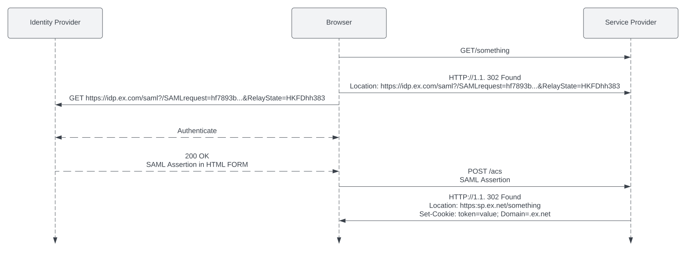

# SAML Authentication overview

## Authentication parties

   
| SaaS client requirement | Bank-hosted client requirement | Authentication party | Description |
| --- | --- | --- | --- |
| 
✔︎

 | 

✔︎

 | 

SAML Service Provider (SP)

 | 

The application the user is trying to log in to. This could be, for example, Vault Core’s Operations Dashboard.

 |
| 

✔︎

 | 

✔︎

 | 

SAML Identity Provider (IdP)

 | 

A separate service that is trusted by the SP to provide details of the user’s identity. In principle, Vault Core supports the use of any SAML 2.0-based IdP, including Azure Active Directory, Google Cloud Identity, Okta, AWS IAM Identity Center, OneLogin.

 |
|  | 

✔︎

 | 

values.yaml

 | 

An example `values.yaml` file is provided with each deployment of Vault Core; you need access to this file to populate your own *saml\_idp* values.

 |
|  | 

✔︎

 | 

Access to *TMComponent Operator Guide* or *Vault Installation Tools*, which are provided in the Vault release pack

 | 

Provides information on the Vault Installer. You use the Vault Installer as part of the configuration of the SAML IdP.

 |

## SAML 2.0 protocol

chat\_bubble

The SAML SP and the SAML IdP do not directly speak to each other during the authentication process. As shown in the diagram below, the user is forwarded from one to the other at the beginning and end of the exchange. Both need to be accessible from the user’s browser. For more information on Security Assertion Markup Language (SAML) V2.0 click [here](http://docs.oasis-open.org/security/saml/Post2.0/sstc-saml-tech-overview-2.0.html).

This flow diagram is described in further detail in the section below.

## SAML protocol overview in Vault

1.  The user logs in to Vault Core’s Operations Dashboard by clicking the **Log in with SSO** link.
    
2.  Vault Core redirects the user to the SAML IdP.
    
3.  The user logs in to the SAML IdP.
    
4.  The SAML IdP verifies the user’s identity.
    
5.  The SAML IdP redirects the user back to Vault Core with a profile containing the user’s details, such as an email address and any roles the user holds.
    
    chat\_bubble
    
    This profile is cryptographically-signed with a certificate so Vault Core can verify its authenticity.
    
6.  The SAML SP (Vault Core) verifies this response and if found valid, it responds with an access token, granting the user permissions to access the resource, Vault Core.
    
7.  The SAML SP makes a request with the access token to Vault Core.