# Setting up Okta as your SAML ldP

## Overview

chat\_bubble

The Okta user interface changes from time to time, so the location of the options documented here may change. The interface documented here was current in March 2021.

1.  Log in to Okta.
    
2.  [Create a new application](/vault-core/5-8/EN/environment_and_installation/infrastructure_docs/setting_up_and_configuring_vault_with_a_saml_idp/setting_up_okta_as_your_saml_ldp#create_a_new_application) for each environment you want to maintain (for example, preprod, prod).
    
3.  [Create assertion attributes](/vault-core/5-8/EN/environment_and_installation/infrastructure_docs/setting_up_and_configuring_vault_with_a_saml_idp/setting_up_okta_as_your_saml_ldp#create_assertion_attributes) for each application.
    
4.  [Set up your application](/vault-core/5-8/EN/environment_and_installation/infrastructure_docs/setting_up_and_configuring_vault_with_a_saml_idp/setting_up_okta_as_your_saml_ldp#set_up_your_application)/s.
    
5.  [Copy the SAML Service Provider configuration](/vault-core/5-8/EN/environment_and_installation/infrastructure_docs/setting_up_and_configuring_vault_with_a_saml_idp/setting_up_okta_as_your_saml_ldp#copy_the_saml_sp_configuration) for each environment you want to maintain (for example, preprod, prod).
    
    (This configuration is provided by the IdP and should be set on the Service Provider side.)
    
6.  [Assign users to your application](/vault-core/5-8/EN/environment_and_installation/infrastructure_docs/setting_up_and_configuring_vault_with_a_saml_idp/setting_up_okta_as_your_saml_ldp#assign_users_to_your_application)/s.
    

## Create a new application

1.  From the Okta Developer Console, on the top left of the screen, select **Classic UI**.
    
2.  Navigate to **Applications, Add Application** and click **Create New App**.
    
3.  Under **Platform**, select **Web** and then click **Sign on method**, select **SAML 2.0**.
    
4.  Click **Create** to create a new application integration.
    
5.  Under **General Settings**, define the **App name** in Okta by entering the name you want to use for this app.
    
6.  Click **Next**, skipping the **Settings** page, leaving it as it is.
    
7.  Click **Next**, then select **I’m an Okta customer adding an internal app:**
    
    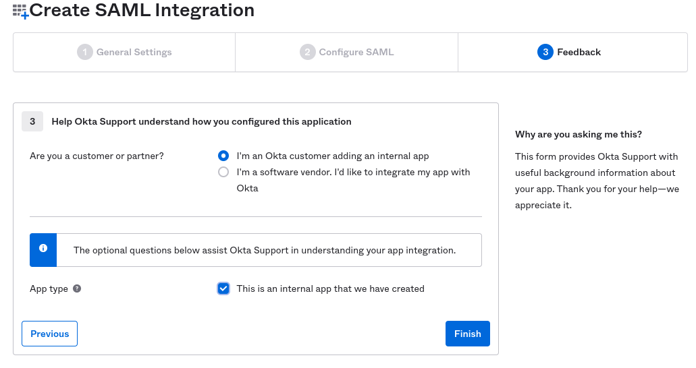
    
8.  Tick **This is an internal app that we have created.**
    
9.  Click **Finish** and the following page will display:
    
    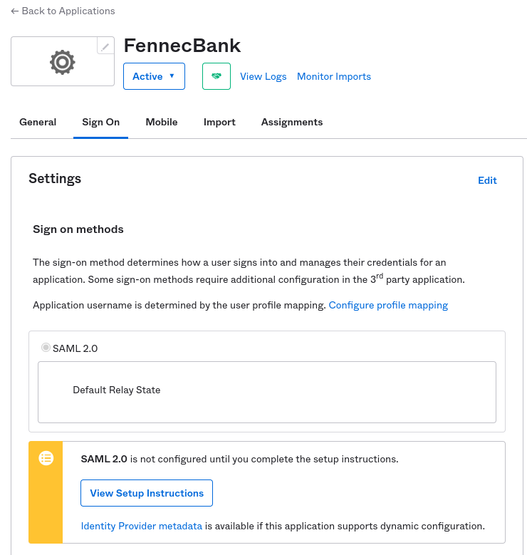
    

## Create assertion attributes

1.  Navigate to the menu to the left of the screen and select, **Directory, Profile Editor**:
    
    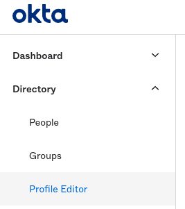
    
    chat\_bubble
    
    The exact position within the Okta UI of the Directory of Applications may vary and not exactly match the image above.
    
2.  Under **Profile Editor**, select **Profile** for the application you have just created:
    
    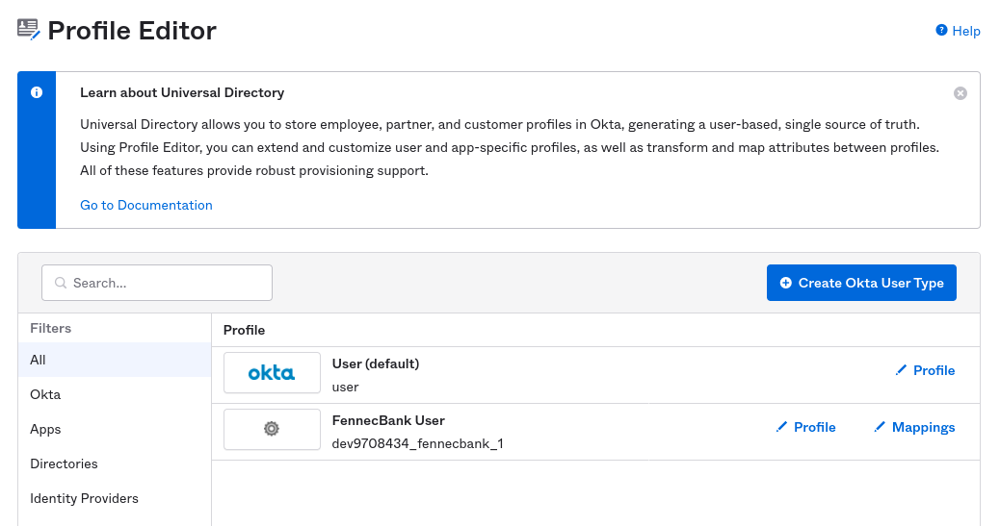
    
3.  Click **Profile, Add Attribute** and define each of the assertion attributes for Email, Name and Roles as shown below, marking the attribute as required.
    
    chat\_bubble
    
    Only the Email and Roles are required attributes.
    
    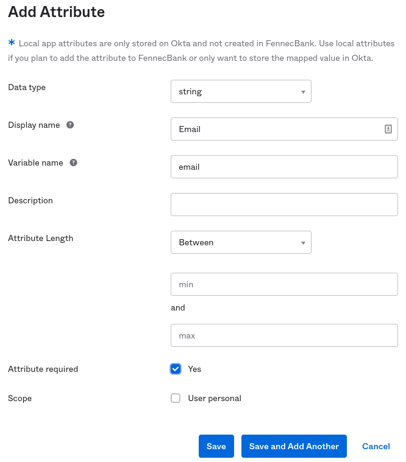
    
4.  Check that you have **Attributes** defined as below:
    
    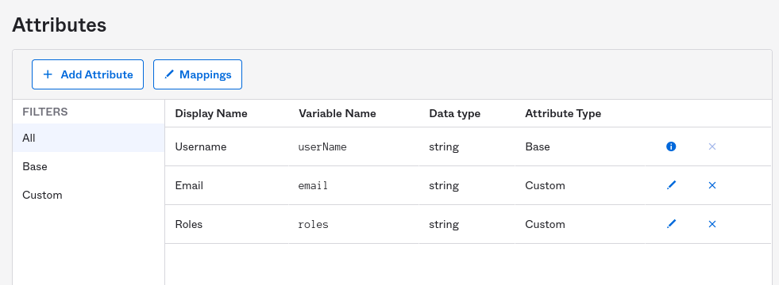
    

## Set up your application

1.  Open the application and click **Edit**. Click **Next** to display the **SAML Settings** page.
    
2.  In **Create SAML Integration**, leave the box stating **Use this for Recipient URL and Destination URL** selected and define the **Name ID** format to be **EmailAddress**:
    
    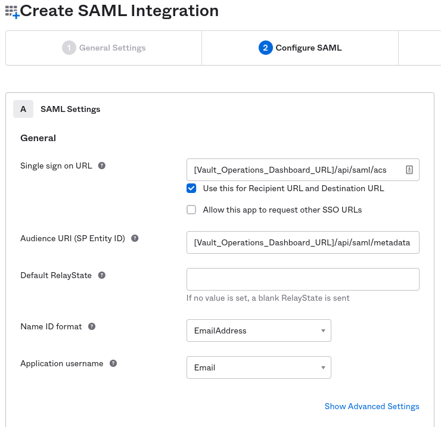
    
3.  Under **Application username**, select **Email**.
    
4.  Under the **Show Advanced Settings** section, configure the encryption and security settings to be used. It is advised to use signing and encryption wherever possible as these will add an additional layer of security when using SAML. If you are bank-hosted, make a note of the configuration used here, as it will be used to populate the *values.yaml* file later.
    
5.  In the **Attribute Statements** use the assertion attributes defined for your application in Okta, such as **Email** and **Roles**.
    
    chat\_bubble
    
    Make sure you use the format *appuser.valueName* when referencing user attributes, otherwise the values will not be recognised.
    
    For example: \* for the Email attribute set the value **appuser.email** \* for the Roles attribute set the value **appuser.roles**
    
    \+ 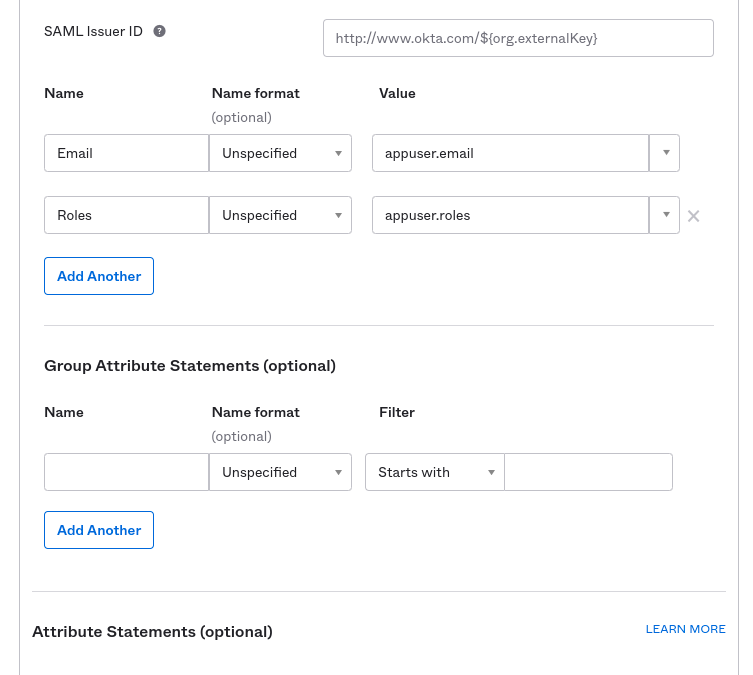
    
6.  Leave **Group Attribute Statements** blank.
    
7.  Click **Next** until you finish the setup, landing on this page:
    
    
    

## Copy the SAML SP configuration

chat\_bubble

Bank-hosted Vault Core customers will need to copy this data to use it in the *values.yaml* file. Saas clients will need to copy this information in order to populate the fields in your Client Environment Request form provided by your Client Delivery Manager.

1.  From the **Sign On** tab, under **Settings**, click the **Identity Provider metadata** link.
    
2.  From the **Identity Provider metadata** link, copy the public X.509 certificate and format it in order to eliminate any whitespaces and newlines.
    
3.  From the **Identity Provider metadata** link, copy the **entityID** value.
    
    For example: `[ORG_EXTERNAL_KEY](http://www.okta.com/)`
    
4.  In the Okta setup, navigate to **General,** scroll down to **App Embed Link**:
    
    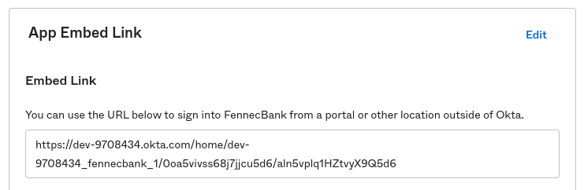
    
5.  Copy the link in step 4 and identify the `BANK_DOMAIN_NAME` and `DOMAIN_APP_ID` for your setup.
    
    In the example in step 4, the `BANK_DOMAIN_NAME` is *dev-9708434.okta.com* and `DOMAIN_APP_ID` is *dev-9708434\_fennecbank\_1*.
    
6.  Use the two values you have identified and the *ORG\_EXTERNAL\_KEY* (defined in step 3), to help create *Single Sign-On (SSO)* and *Single Log-Out (SLO)* URLs. For example:
    
    -   SLO URL: `https://[BANK_DOMAIN_NAME].okta.com/app/[DOMAIN_APP_ID]/[ORG_EXTERNAL_KEY]/slo/saml`
        
    -   SSO URL: `https://[BANK_DOMAIN_NAME].okta.com/app/[DOMAIN_APP_ID]/[ORG_EXTERNAL_KEY]/sso/saml`
        
    
7.  Check that you have copied all the details for the preceding steps and navigate to the **Assignments** tab.
    

## Assign users to your application

1.  In the **Assignments** tab, click **Assign, Assign to People** and select the Okta user that you created:
    
    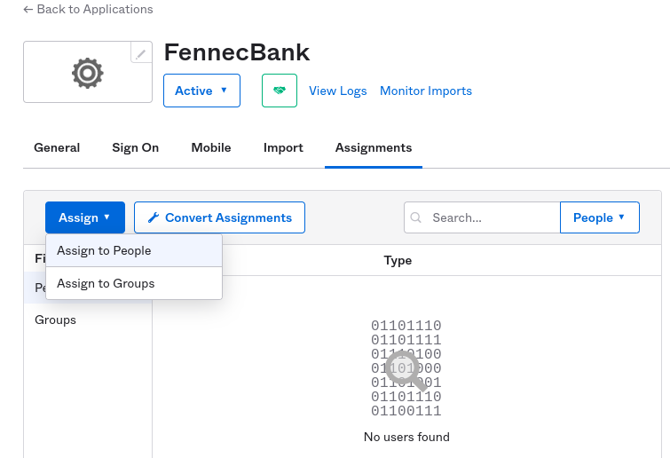
    
2.  Assign a **User** Name, **Email** and **Roles** values for each user. See the example below:
    
    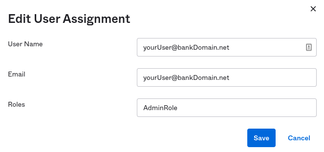
    
    chat\_bubble
    
    For any other users assigned to your application, the Roles' values must be populated to the ones defined within Vault Core (the external role reference name).
    
3.  To enable users to log in directly to your application from Okta, you need to set up a **Bookmark App** by following [the steps provided by Okta](https://support.okta.com/help/s/article/How-do-you-create-a-bookmark-app?language=en_US).