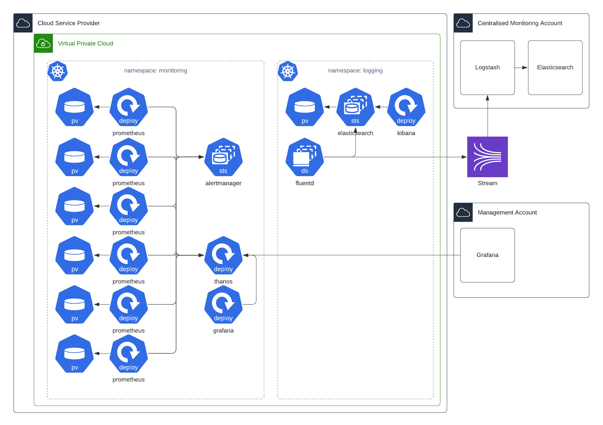

# Observability architecture

SaaS

Thought Machine monitors services in Vault Core SaaS through alerts and metrics, and uses logs to further investigate issues that are identified through metrics. Here, we describe the architecture and components Thought Machine uses to observe Vault Core SaaS.

## Observability architecture

Here, we describe the architecture and components Thought Machine uses to observe Vault Core SaaS.

Thought Machine monitors services in Vault Core SaaS through alerts and metrics, and uses logs to further investigate issues that are identified through metrics. Every service exposes metrics to an isolated metrics aggregator and pushes logs to an isolated log collector. Logs contain no personal data. Metrics are anonymised and aggregated in order to perform holistic monitoring across the platform.

## Architecture

## Observability components

The Vault Core SaaS Observability Stack consists of monitoring and logging systems.

### Monitoring components

The monitoring components are used to store, visualise and alert on time-series data collected from Vault services.

 
| Name | Description |
| --- | --- |
| 
Prometheus

 | 

A monitoring system to collect, store and alert on metrics. Multiple instances of Prometheus are deployed within the Vault Core SaaS environment, collecting metrics from Vault Core, cloud platforms and infrastructure.Alerts are defined in each Prometheus instance to provide notifications of critical events within the environment. These are sent to Alertmanager for routing. Prometheus provides a query interface and language, PromQL, which Grafana uses as a data source.

 |
| 

Grafana

 | 

A tool used to visualise metric data collected by Prometheus instances. It contains dashboards that a customer can use to determine the health of their Vault Core SaaS environment.

 |
| 

Alertmanager

 | 

Receives alerts from Prometheus instances and handles their deduplication, grouping and routing to a receiver integration such as Slack or PagerDuty. The Alertmanager web interface shows information about alert status and allows for temporary suppression of alerts by creating silences.

 |

### Logging components

The logging components are used to collect application, system, security and audit logs, and store, search, analyse, audit, visualise and alert on logs.

 
| Name | Description |
| --- | --- |
| 
Fluentd

 | 

The log collector which is scheduled on all Vault Core SaaS cluster nodes.Application logs are collected from containers scheduled on nodes, and system logs are collected from the nodes themselves. These logs are formatted and sent to the environment’s dedicated logging cluster.Security and audit logs are collected from the host and sent to a centralised security logging cluster via an event stream for threat analysis, compliance and forensics when required.

 |
| 

Elasticsearch

 | 

A Highly-Available full-text search and analysis engine which is used to store, search and analyse application logs written by Vault Core workloads. Each environment has a dedicated cluster for application logs. A centralised cluster is used to collect audit and security events for all SaaS environments.

 |
| 

Kibana

 | 

The user interface used to visualise log data stored in Elasticsearch.

 |

## Tracing

### Trace context propagation

Vault services are instrumented for tracing within the OpenTelemetry framework. As part of this, services recognise W3C TraceContext propagation headers that are passed in as gRPC metadata, HTTP headers or Kafka Headers. These headers are then propagated across Vault services.

### Jaeger

Jaeger is a distributed tracing platform used to store and visualise requests made to Vault Core SaaS. Each environment has a dedicated Jaeger instance to store traces.

## Collected metrics

There are a number of Prometheus instances and exporter/service metrics that are collected within Vault Core SaaS environments.

### Metric types

 
| Name | Description |
| --- | --- |
| 
Logging metrics

 | 

Elasticsearch: elasticsearch-exporter, fluentd-exporter.

 |
| 

Service mesh metrics

 | 

Istio: citadel, envoy, galley, mesh, mixer, pilot, telemetry.

 |
| 

Application infrastructure metrics

 | 

Kafka: kafka, burrowPostgres: postgres-exporter

 |
| 

Cluster infrastructure metrics

 | 

Availability and reliability: cadvisor, apiserver, kubelet, kube-state-metrics, node-exporter.Throughput and latency: ingress controller

 |
| 

Vault

 | 

All instrumented Vault Core pods.

 |

## Isolation

All monitoring and application logging components, including volumes where logging and time-series data is stored, are tenanted in the same Kubernetes cluster as the Vault Core SaaS environment and isolated per client.

Specific security and audit logs are sent by Fluentd to a centralised security cluster for the purpose of threat analysis.

Metrics in each Vault Core SaaS environment are accessible by Thought Machine engineers from a centralised Grafana instance in order to monitor the health of all Vault Core SaaS environments.