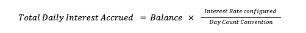
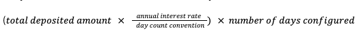

# Product features

The following business features are available with this Product.

## Account Opening

The account application process is unique to each bank. Upon requesting an account to be created in Vault, a number of Parameters are set or inherited. The following lists those parameters and any orchestration that needs to be considered when creating an account in Vault with this product.

For the complete description, configuration options and behaviour of this business feature, see [Account Opening](/vault-core/5-8/EN/product_library/common_business_features/account#open_account_cpp_1811).

### Orchestration

Maturity type related information needs to be stored externally to the contract.

Refer to the Time Deposit Integration Guide for further details.

### Product Parameters

These are set when the product is loaded onto Vault, and are inherited by all accounts upon creation.

chat\_bubble

The schedules for the product have been grouped and configured to run in the following order. This is just an example and can be amended, however please remember any changes could impact the logic of the contract: 1. Deposit period end 2. Grace period end 3. Interest accrual 4. Interest application 5. Maturity notification 6. Maturity event

   
| Name | Parameter Name | Description | Optional |
| --- | --- | --- | --- |
| 
Number Of Days Of Interest To Be Charged As An Early Withdrawal Fee

 | 

`number_of_interest_days_early_withdrawal_fee`

 | 

The number of days of interest to be charged as a fee when making an early withdrawal. If this is configured, the Early Withdrawal Percentage Fee is ignored.

 | 

Yes

 |
| 

Denomination

 | 

`denomination`

 | 

Currency in which the product operates.

 | 

No

 |
| 

Term Unit (days or months)

 | 

`term_unit`

 | 

The unit at which the term is applied.

 | 

No

 |
| 

Cooling-off Period Length (days)

 | 

`cooling_off_period`

 | 

The number of days from the account creation datetime when a user can make a full withdrawal without penalties.

 | 

No

 |
| 

Maturity Notification Days

 | 

`maturity_notice_period`

 | 

The number of days prior to the account maturing to send a notification regarding upcoming maturity.

 | 

No

 |
| 

Deposit Period Length (days)

 | 

`deposit_period`

 | 

The number of calendar days from account creation to allow depositing funds

 | 

No

 |
| 

Number Of Deposits

 | 

`number_of_permitted_deposits`

 | 

Number of deposits allowed during the deposit period. This can be single or unlimited.

 | 

No

 |
| 

Accrued Interest Payable Account

 | 

`accrued_interest_payable_account`

 | 

Internal account for accrued interest payable balance.

 | 

No

 |
| 

Accrued Interest Receivable Account

 | 

`accrued_interest_receivable_account`

 | 

Internal account for accrued interest receivable balance.

 | 

No

 |
| 

Interest Accrual Days In Year

 | 

`days_in_year`

 | 

The days in the year for interest accrual calculation. Valid values are “actual”, “366”, “365”, “360”

 | 

No

 |
| 

Interest Accrual Precision

 | 

`accrual_precision`

 | 

Precision needed for interest accruals.

 | 

No

 |
| 

Interest Accrual Hour

 | 

`interest_accrual_hour`

 | 

The hour of the day at which interest is accrued.

 | 

No

 |
| 

Interest Accrual Minute

 | 

`interest_accrual_minute`

 | 

The minute of the hour at which interest is accrued.

 | 

No

 |
| 

Interest Accrual Second

 | 

`interest_accrual_second`

 | 

The second of the minute at which interest is accrued.

 | 

No

 |
| 

Grace Period Length (days)

 | 

`grace_period`

 | 

The number of days from the account creation datetime when a user can make amendments to a deposit account without incurring any fees or penalties.

 | 

No

 |
| 

Interest Application Precision

 | 

`application_precision`

 | 

Precision needed for interest applications.

 | 

No

 |
| 

Interest Paid Account

 | 

`interest_paid_account`

 | 

Internal account for interest paid.

 | 

No

 |
| 

Interest Received Account

 | 

`interest_received_account`

 | 

Internal account for interest received.

 | 

No

 |
| 

Interest Application Frequency

 | 

`interest_application_frequency`

 | 

The frequency at which interest is applied.

 | 

No

 |
| 

Interest Application Hour

 | 

`interest_application_hour`

 | 

The hour of the day at which interest is applied.

 | 

No

 |
| 

Interest Application Minute

 | 

`interest_application_minute`

 | 

The minute of the hour at which interest is applied.

 | 

No

 |
| 

Interest Application Second

 | 

`interest_application_second`

 | 

The second of the minute at which interest is applied.

 | 

No

 |
| 

Maximum Balance Amount

 | 

`maximum_balance`

 | 

The maximum deposited balance amount for the account. Deposits that breach this amount are rejected

 | 

No

 |
| 

Minimum Initial Deposit

 | 

`minimum_initial_deposit`

 | 

The minimum amount for the first deposit to the account

 | 

No

 |
| 

Early Withdrawal Flat Fee

 | 

`early_withdrawal_flat_fee`

 | 

A flat fee applied when making an early withdrawal.

 | 

No

 |
| 

Early Withdrawal Percentage Fee

 | 

`early_withdrawal_percentage_fee`

 | 

A percentage fee applied when making an early withdrawal.

 | 

No

 |
| 

Maximum Withdrawal Percentage Limit

 | 

`maximum_withdrawal_percentage_limit`

 | 

The percentage of the total funds deposited by the customer that can be withdrawn.

 | 

No

 |

### Account Parameters

These are set at the point of account creation.

   
| Name | Parameter Name | Description | Optional |
| --- | --- | --- | --- |
| 
Term

 | 

`term`

 | 

The term length of the product.

 | 

No

 |
| 

Account Maturity Date

 | 

`desired_maturity_date`

 | 

Optional override for the account maturity datetime. If not set, the maturity datetime is derived from the term and term unit. If set, the account matures at 00:00:00 on the next day of this parameter value.

 | 

Yes

 |
| 

Fixed Interest Rate

 | 

`fixed_interest_rate`

 | 

The fixed annual rate of the product

 | 

No

 |
| 

Interest Application Day

 | 

`interest_application_day`

 | 

The day of the month on which interest is applied. If day does not exist in application month, applies on last day of month.

 | 

No

 |
| 

Fee Free Withdrawal Percentage Limit

 | 

fee\_free\_withdrawal\_percentage\_limit

 | 

The percentage of the total funds deposited by the customer which can be withdrawn without incurring fees.

 | 

No

 |

### Derived Parameters

These are set by the product - specifically logic within the Smart Contract and are determined when requested. They cannot be directly updated.

   
| Name | Parameter Name | Description | Optional |
| --- | --- | --- | --- |
| 
Cooling Off Period End Date

 | 

`cooling_off_period_end_date`

 | 

The cooling-off period will end at 23:59:59.999999 on this day. If 0001-01-01 is returned, this parameter is not valid for this account.

 | 

No

 |
| 

Deposit Period End Date

 | 

`deposit_period_end_date`

 | 

The deposit period will end at 23:59:59.999999 on this day. If 0001-01-01 is returned, this parameter is not valid for this account.

 | 

No

 |
| 

Grace Period End Date

 | 

`grace_period_end_date`

 | 

The grace period will end at 23:59:59.999999 (inclusive) on this day. If 0001-01-01 is returned, this parameter is not valid for this account.

 | 

No

 |
| 

Maximum Withdrawal Limit

 | 

`maximum_withdrawal_limit`

 | 

The total sum of withdrawals cannot exceed this limit.

 | 

No

 |
| 

Fee Free Withdrawal Limit

 | 

`fee_free_withdrawal_limit`

 | 

The amount which can be withdrawn without incurring fees.

 | 

No

 |

## Permitted Primary Denomination (CPP-1908)

Configuring the primary denomination in which the product can transact. Transactions which are not denominated in the primary denomination are rejected if the product only supports a single currency.

For the complete description, configuration options and behaviour of this feature, see [Permitted Primary Denomination](/vault-core/5-8/EN/product_library/common_business_features/currency_and_denomination#permitted_primary_denomination_cpp_1908).

## Maximum Balance Limit (CPP-1986)

Maximum balance limit on the account in the primary denomination, where credits that would breach this limit are rejected. This feature is applicable to funds denominated in the Primary Denomination of the account.

For the complete description, configuration options and behaviour of this feature, see [Maximum Balance Limit](/vault-core/5-8/EN/product_library/common_business_features/limits#maximum_balance_limit_cpp_1986).

## Deposit Maturity (CPP-2077)

### Description

The maturity date is set based on the term of the deposit and the term unit chosen by the customer.

When a deposit product reaches its maturity, activity will halt on the account. Inbound or outbound transactions will not be permitted on the account.

When the maturity date falls on a day that is defined as a holiday, then the maturity date is automatically postponed to the next non-holiday date.

### Configuration Options

-   The term length and unit of the deposit product
    
-   Maturity date of deposit product where the:
    
    -   Maturity date is calculated based on the term length and unit, or
        
    -   Maturity date is explicitly defined thus overriding the date calculated based on term (this is optional)
        
    
-   Maturity notice period: a configurable period before the maturity date which defines when a notification should be sent to the bank of an upcoming maturing of an account
    
-   Define holiday date: ability to define the maturity date when it falls on a day that is defined as a holiday, then the maturity date iswill be automatically postponed to the next non-holiday date
    

### Business Feature Behaviour

  
| ID | Title | Behaviour |
| --- | --- | --- |
| 
01

 | 

Configuring term for the deposit product

 | 

**GIVEN** a bank offers a deposit product **WHEN** configuring the product **THEN** the bank can define the term of the product

 |
| 

02

 | 

Setting the term on the deposit account

 | 

**GIVEN** a bank offers a deposit product **AND** the bank has configured the term of the product **WHEN** an account is opened **THEN** the term of the account is set

 |
| 

03

 | 

Calculating maturity date of deposit account

 | 

**GIVEN** a bank offers a deposit product **AND** an account is opened **WHEN** the term of the account is set **THEN** he maturity date of the deposit account is calculated

 |
| 

04

 | 

Configuring maturity notice period for the deposit product

 | 

**GIVEN** a bank offers a deposit product **WHEN** configuring the product **THEN** the bank can define the maturity notice period of the product

 |
| 

05

 | 

Overriding maturity date of deposit account

 | 

**GIVEN** a bank offers a deposit product **AND** an account is opened **WHEN** the maturity date is set **THEN** it overrides the maturity date calculated using the term of the deposit product and the account opening date

 |
| 

06

 | 

Stopping activity when deposit product matures

 | 

**GIVEN** an account is open **WHEN** it is 00:00:00 on the day after the maturity date **THEN** no inbound/outbound transactions are permitted

 |
| 

07

 | 

Sending a notification to the bank when deposit product matures

 | 

**GIVEN** an account is open **WHEN** it is 00:00:00 on the day after the maturity date **THEN** a notification is provided that includes:Maturity dateAccount ID

 |
| 

08

 | 

Sending advanced notification to the bank when deposit product is due to mature

 | 

**GIVEN** there is a deposit account with a set maturity date **AND** the maturity notice period has been set to n days **WHEN** it is n days prior to the maturity date **THEN** a notification is provided that includes:Maturity dateAccount ID

 |
| 

09

 | 

Postponing account maturity when the maturity date falls on a holiday

 | 

**GIVEN** an account is open **WHEN** the maturity date falls on a defined holiday date **THEN** the maturity date must be postponed automatically to the next non-holiday date

 |

## Minimum Initial Deposit Amount (CPP-2086)

### Description

The minimum amount that is required to deposit to the account when transferring the initial deposit.

### Configuration Options

-   Minimum initial deposit amount: the minimum value required for the initial deposit made into the deposit account
    

### Business Feature Behaviour

  
| ID | Title | Behaviour |
| --- | --- | --- |
| 
01

 | 

Configuring the minimum initial deposit amount for the deposit product

 | 

**GIVEN** a bank offers a deposit product **WHEN** configuring the product **THEN** the bank can define the minimum initial deposit amount

 |
| 

02

 | 

Setting the minimum initial deposit amount on the deposit account

 | 

**GIVEN** a bank offers a deposit product with a minimum initial deposit **WHEN** an account is opened **THEN** the minimum initial deposit is set for the account

 |
| 

03

 | 

Initial deposit is equal to or more than minimum initial deposit amount

 | 

**GIVEN** a bank offers a deposit product **AND** minimum initial deposit amount is set **WHEN** an initial deposit is made equal to or more than the minimum initial deposit amount **THEN** the deposit is accepted

 |
| 

04

 | 

Initial deposit is below minimum initial deposit amount

 | 

**GIVEN** a bank offers a deposit product **AND** minimum initial deposit amount is set **WHEN** a initial deposit is made that is less than the minimum initial deposit amount **THEN** the deposit is rejected

 |

## Deposit Period and Number of Permitted Deposits (CPP-2082)

### Description

The deposit period is a length of time during which deposits are permitted on the account. No deposits are possible once this period has passed.

### Configuration Options

-   Deposit period length (in days): Starts on the day the account is opened
    
-   Number of permitted deposits: The number of deposits permitted during the Deposit Period:
    
    -   Single (only one deposit is permitted)
        
    -   Unlimited (no limit on the number of permitted deposits)
        
    
-   Deposit Period Override: Enable/disable override to allow deposits after the deposit period has elapsed
    

### Business Feature Behaviour

  
| ID | Title | Behaviour |
| --- | --- | --- |
| 
01

 | 

Configuring the deposit period and number of permitted deposits for the deposit product

 | 

**GIVEN** a bank offers a deposit product **WHEN** configuring the product **THEN** the bank can define both the deposit period and the number of permitted deposits

 |
| 

02

 | 

Setting the deposit period and number of permitted deposits on the deposit account

 | 

**GIVEN**a bank has configured a deposit product with a deposit period **AND** has configured the number of permitted deposits **WHEN** an account is opened **THEN** both the deposit period and number of permitted deposits are set

 |
| 

03

 | 

Setting the deposit period end date and time on the deposit account

 | 

**GIVEN** a bank has configured a deposit product with a deposit period **WHEN** an account is opened **THEN** the deposit period cut-off is set to 00:00:00 on the day after the calculated end date, which is based on the configured deposit period

 |
| 

04

 | 

Deposit made within the set deposit period

 | 

**GIVEN** there is a deposit account with a deposit period **WHEN** a new deposit is made **AND** it is before the deposit period cut-off **THEN** the account is linked to the new account

 |
| 

05

 | 

Deposit made outside the set deposit period

 | 

**GIVEN** there is a deposit account with a deposit period **WHEN** a new deposit is made **AND** it is on or after the deposit period cut-off **THEN** the deposit is rejected

 |
| 

06

 | 

Only one deposit permitted during the deposit period

 | 

**GIVEN** there is a deposit account with a deposit period **AND** the number of permitted deposits is set to single **WHEN** the customer makes one deposit during the deposit period **THEN** the deposit is accepted

 |
| 

07

 | 

Subsequent deposits when only one deposit is permitted during the deposit period

 | 

**GIVEN** there is a deposit account with a deposit period **AND** the number of permitted deposits is set to single **AND** there is a deposit during the deposit period **WHEN** a second deposit is attempted during the deposit period **THEN** the second deposit is rejected

 |
| 

08

 | 

Unlimited deposits permitted during the deposit period

 | 

**GIVEN** there is a deposit account with a deposit period **AND** the number of permitted deposits is set to unlimited **WHEN** multiple deposits are made during the deposit period **THEN** the deposits are accepted

 |
| 

09

 | 

No deposits made during deposit period

 | 

**GIVEN** an account is opened **AND** the deposit period is set **WHEN** the deposit balance is zero at the end of the deposit period **THEN** a notification is provided that includes: Reason for notification: Close account due to lack of funds at the end of deposit period Account ID Deposit Period End Date

 |
| 

10

 | 

Enabling override to allow deposits

 | 

**GIVEN** there is a deposit account with a deposit period set **AND** it is after the deposit period cut-off **AND** the number of deposits limit has not been reached **WHEN** a deposit is made **THEN** there is the ability to accept the deposit post cut-off **AND** the deposit is accepted

 |

## Cooling-Off Period (CPP-2084)

### Description

The cooling-off period allows a customer to cancel and fully close their newly opened deposit account without any penalties applied.

### Configuration Options

-   Cooling-off period length (in days): Starts on the day the account is opened
    

### Business Feature Behaviour

  
| ID | Title | Behaviour |
| --- | --- | --- |
| 
01

 | 

Configuring the cooling-off period for the deposit product

 | 

**GIVEN** a bank offers a deposit product **WHEN** configuring the product **THEN** the bank can define the cooling-off period

 |
| 

02

 | 

Setting the cooling-off period on the deposit account

 | 

**GIVEN** a bank offers a deposit product **AND** the cooling-off period has been configured **WHEN** an account is opened **THEN** the cooling-off period is set on the account

 |
| 

03

 | 

Setting the cooling-off period end date and time on the deposit account

 | 

**GIVEN** a bank has configured a deposit product with a cooling-off period **WHEN** an account is opened **THEN** the cooling-off period cut-off is set to 00:00:00 on the day after the calculated end \`date, which is based on the configured cooling-off period

 |
| 

04

 | 

Initiating account closure during the cooling-off period

 | 

**GIVEN** an account is open **AND** the cooling-off period is set **AND** it is before the cooling-off period cut-off **WHEN** deposited funds are fully withdrawn **THEN** no fees are incurred

 |

## Deposit Grace Period (CPP-2083)

### Description

The grace period is a length of time during which amendments can be made to a deposit account without incurring any fees or penalties.

### Configuration Options

-   Grace period length (in days): Starts on the day the account is opened.
    
-   The following changes can be made during the grace period:
    
    -   Deposit more funds
        
    -   Make full or partial withdrawal  
        
    -   Change term
        
    

### Business Feature Behaviour

  
| ID | Title | Behaviour |
| --- | --- | --- |
| 
01

 | 

Configuring the grace period for the deposit product

 | 

**GIVEN** a bank offers a deposit product **WHEN** configuring the product **THEN** the bank can define the grace period

 |
| 

02

 | 

Setting the grace period on the deposit account

 | 

**GIVEN** a bank offers a deposit product where the grace period is configured **WHEN** an account is opened **THEN** the grace period is set

 |
| 

03

 | 

Setting the grace period end date and time on the deposit account

 | 

**GIVEN** a bank has configured a deposit product with a grace period **WHEN** an account is opened **THEN** the grace period cut-off is set to 00:00:00 on the day after the calculated end date, which is based on the configured grace period

 |
| 

04

 | 

Making additional deposits into account during grace period

 | 

**GIVEN** a deposit account is open **AND** the grace period is set **AND** it is before the grace period cut-off **WHEN** an additional deposit is made into the account **THEN** the deposit is accepted

 |
| 

05

 | 

Making additional deposits into account outside grace period

 | 

**GIVEN** a deposit account is open **AND** the grace period is set **AND** it is on or after the grace period cut-off **WHEN** an additional deposit is made into the account **THEN** the deposit is rejected

 |
| 

06

 | 

Making a full withdrawal during grace period

 | 

**GIVEN** a deposit account is open **AND** the grace period is set **AND** it is before the grace period cut-off **WHEN** deposited funds are fully withdrawn **THEN** no fees are incurred

 |
| 

07

 | 

Making a partial withdrawal during grace period

 | 

**GIVEN** a deposit account is open **AND** the grace period is set **AND** it is before the grace period cut-off **WHEN** a partial withdrawal is made **THEN** the partial funds are transferred **AND** no fees are incurred

 |
| 

08

 | 

Changing term during grace period

 | 

**GIVEN** a deposit account is open **AND** the grace period is set **AND** it is before the grace period cut-off **WHEN** a change to the term of the deposit is made **THEN** the maturity date is recalculated based on the new term

 |
| 

09

 | 

Changing term outside grace period

 | 

**GIVEN** a deposit account is open **AND** the grace period is set **AND** it is after the grace period cut-off **WHEN** a change to the term of the deposit is requested **THEN** the request is rejected

 |
| 

10

 | 

No funds at the end of the grace period

 | 

**GIVEN** an account is opened **AND** the grace period is set **WHEN** the deposit balance is zero at the end of the grace period **THEN** a notification is provided that includes: Reason for notification: Close account due to lack of funds at the end of grace period Account ID Grace Period End Date

 |

## Withdrawals and Withdrawal Fees (CPP-2092)

### Description

Allows full, partial or early withdrawals during the term of deposit and incurring fees, depending on the stage of the account in the product term.

### Configuration Options

-   Early withdrawal fees. These are applied to each withdrawal. These can individually be set to zero.
    
    -   Early withdrawal flat fee: a flat fee amount deducted from the withdrawal amount at the point of withdrawal
        
    -   Early withdrawal percentage (%) fee: calculation based on the withdrawal amount (Withdrawal Amount x Withdrawal Fee Percentage), calculated at the point of withdrawal
        
    
-   Withdrawal amount limit: The total amount of withdrawals cannot exceed the limit. This is a percentage amount of the amount deposited
    
-   Fee Free Withdrawal Limit - The total amount of withdrawals which can be withdrawn prior to maturity without incurring fees. This is a percentage of the amount deposited
    
-   Withdrawal override: ability to allow/block early withdrawals on public holidays
    

### Business Feature Behaviour

  
| ID | Title | Behaviour |
| --- | --- | --- |
| 
01

 | 

Configuring the early withdrawal fees for the deposit product

 | 

**GIVEN** a bank offers a deposit product **WHEN** configuring the product **THEN** the bank can define the early withdrawal fees Early withdrawal flat fee: Early withdrawal percentage (%) fee

 |
| 

02

 | 

Setting the early withdrawal fees on the deposit account

 | 

**GIVEN** a bank offers a deposit product where early withdrawal fees have been configured **WHEN** an account is opened **THEN** the early withdrawal fees are set as per the configuration set for the product

 |
| 

03

 | 

Configuring the withdrawal amount limit for the deposit product

 | 

**GIVEN** a bank offers a deposit product **WHEN** configuring the product **THEN** the bank can define the withdrawal amount limit

 |
| 

04

 | 

Setting the withdrawal amount limit on the deposit account

 | 

**GIVEN** a bank offers a deposit product where a withdrawal amount limit has been configured **WHEN** an account is opened **THEN** the withdrawal amount limit is set as per the configuration set for the product

 |
| 

05

 | 

Configuring the fee free withdrawal limit for the deposit product

 | 

**GIVEN** a bank offers a deposit product **WHEN** configuring the product **THEN** the bank can define the fee free withdrawal limit

 |
| 

06

 | 

Setting the fee free withdrawal limit on the deposit account

 | 

**GIVEN** a bank offers a deposit product **AND** the bank has configured the product **AND** the bank can specify the fee free withdrawal limit **WHEN** an account is opened **THEN** the fee free withdrawal limit is set

 |
| 

07

 | 

Making a full early withdrawal

 | 

**GIVEN** an account is open **AND** the bank has specified early withdrawal fees **WHEN** deposited funds are fully withdrawn early **THEN** early withdrawal fees are deducted from the withdrawn amount

 |
| 

08

 | 

Making a partial early withdrawal

 | 

**GIVEN** an account is open **AND** the bank has specified early withdrawal fees **WHEN** a partial early withdrawal is made **THEN** early withdrawal fees is deducted from the withdrawn amount

 |
| 

09

 | 

Withdrawal amount is less than fee amount

 | 

**GIVEN** a bank has a product with defined early withdrawal fees **AND** a partial early withdrawal is made **WHEN** the withdrawal amount is less than the fee amount **THEN** the withdrawal is rejected

 |
| 

10

 | 

Withdrawal amount exceeds balance amount

 | 

**GIVEN** an account is open **AND** an early withdrawal is made **WHEN** the withdrawal amount exceeds the balance amount **THEN** the withdrawal is rejected

 |
| 

11

 | 

Making a partial withdrawal below the withdrawal amount limit

 | 

**GIVEN** a bank has a product with defined withdrawal amount limit **WHEN** a partial withdrawal is requested that results in the total amount of withdrawals being below the limit **THEN** the withdrawal is accepted

 |
| 

12

 | 

Making a partial withdrawal equal to or above the withdrawal amount limit

 | 

**GIVEN** a bank has a product with defined withdrawal amount limit **WHEN** a partial withdrawal is requested that results in the total amount of withdrawals exceeding the limit **THEN** the withdrawal is rejected

 |
| 

13

 | 

Making a withdrawal below or equal to the fee free withdrawal limit

 | 

**GIVEN** an account is open **AND** the bank has specified a fee free withdrawal limit **WHEN** a withdrawal results in the total withdrawals being below or equal limit **THEN** the withdrawal is accepted **AND** no fees are incurred

 |
| 

14

 | 

Making a withdrawal equal to or above the fee free withdrawal limit

 | 

**GIVEN** an account is open **AND** the bank has specified a fee free withdrawal limit **WHEN** the withdrawal results in the total withdrawals going above limit **THEN** the withdrawal is accepted **AND** early withdrawal fees is deducted from the withdrawn amount

 |
| 

15

 | 

Block early withdrawals from the account on holiday dates

 | 

**GIVEN** a customer wants to make an early withdrawal on a public holiday **AND** the product does not allow withdrawals on a public holiday **WHEN** an early withdrawal is made which falls on the holiday date **THEN** the transaction is rejected

 |
| 

16

 | 

Allow early withdrawals from the account on holidays

 | 

**GIVEN** a customer wants to make an early withdrawal on a public holiday **AND** the product allows withdrawals on a public holiday **WHEN** an early withdrawal is made which falls on the holiday date **THEN** the transaction is accepted

 |

### Supplemental Information

**Example 1**: Partial withdrawal within the free withdrawal limit

Deposit account is opened on 1 May 2023 with a principal of 10,000 and penalty free withdrawal limit is set as 25% ( 10000 X 25% = 2500). Customer makes a partial early withdrawal of 2000.

Withdrawal fees are set as follows: - Percentage fee = 2% - Flat fee = 0

The net amount credited to the customer must be 2000.

Where no penalty is charged as the withdrawal is within the free withdrawal limit

**Example 2**: Partial withdrawal over the free withdrawal limit

Deposit account is opened on 1 May 2023 with a principal of 10,000 and penalty free withdrawal limit is set as 25% ( 10000 X 25% = 2500). Customer makes a partial early withdrawal of 3000.

Withdrawal fees are set as follows: - Percentage fee = 2% - Flat fee = 0

The penalty fee = (3000 - 2500) X 2% = 10

The net amount credited to the customer = 2990 (3000 - 10)

**Example 3**: Full withdrawal subject to withdrawal penalty basis percentage fee

Deposit account is opened on 1 May 2023 with a principal of 10,000 and partial withdrawals are not allowed. The penalty for full withdrawal is a percentage of deposit amount

Withdrawal fees are set as follows: - Percentage fee = 2% - Flat fee = NA

The penalty fee = 200

The net amount credited to the customer = 9800 (10000 - 200)

**Example 4**: Full withdrawal subject to flat fee

Deposit account is opened on 1 May 2023 with a principal of 10,000 and partial withdrawals are not allowed.

Withdrawal fees are set as follows: - Percentage fee = NA - Flat fee = 100

The net amount credit to customer after penalty = 9900 (10000 -100)

**Example 5**: Full withdrawal subject to flat fee and % penalty

Deposit account is opened on 1 May 2023 with a principal of 10,000 Withdrawal fees are set as follows: - Percentage fee = 2% - Flat fee = 100

The net amount credit to customer after penalty = 9700 (10000 -100-200)

## Fixed Deposit Interest Accrual (CPP-2347)

### Description

Daily interest accrual model for deposit balances using a flat interest rate. This feature is applicable to funds denominated in the Primary Denomination of the account.

The following formula is used to calculate the total daily interest accrued:

### Configuration Options

-   Interest rate: Configuration of the interest rate
    
-   Day count convention: The day count convention used in the calculation of interest.
    
-   Interest accrual time: The time at which the interest is calculated and accrued on a daily basis.
    
-   Interest accrual precision: The number of decimal places at which interest is accrued.
    

### Business Feature Behaviour

  
| ID | Title | Behaviour |
| --- | --- | --- |
| 
01

 | 

Configuring the interest rate for a product

 | 

**GIVEN** a bank offers a product **WHEN** configuring the product **THEN** the bank can configure the interest rate

 |
| 

02

 | 

Configurable interest accrual time

 | 

**GIVEN** the product has been configured to accrue interest daily at HH:MM:SS **WHEN** it is HH:MM:SS **THEN** the interest is accrued

 |
| 

03

 | 

Configuring interest accrual precision

 | 

**GIVEN** a bank offers a product that accrues deposit interest **WHEN** configuring the interest accrual precision\*THEN\* the bank can set the decimal places at which interest is accrued.

 |
| 

04

 | 

Configuring the Day Count Convention

 | 

**GIVEN** a bank offers a product **WHEN** configuring the product **THEN** the bank can define the day count convention that is used to calculate the interest that is accrued.

 |
| 

05

 | 

Interest accrual with a positive interest rate

 | 

**GIVEN** an account has a balance of 10,000 **AND** the interest rate is configured as 0.25% **AND** a day count convention of 365 **WHEN** the daily interest rate is calculated on the deposit balance **THEN** the interest accrued is: = 10,000\*(0.0025/365) = 0.06849

 |
| 

06

 | 

Interest accrual with a negative interest rate

 | 

**GIVEN** an account has a balance of 10,000 **AND** the interest is configured as -0.25% **AND** a day count convention of 365 **WHEN** the daily interest rate is calculated on the deposit balance **THEN** the interest accrued is (using the partial balance method): = 10,000\*(-0.0025/365) = -0.06849

 |
| 

07

 | 

No interest accrued for a 0 GBP or negative deposit account balance

 | 

**GIVEN** an account has configured to accrue interest **AND** a it has a deposit balance of zero or less **WHEN** the deposit interest accrual is calculated **THEN** there will be zero interest accrued.

 |

## Scheduled Deposit Interest Application (CPP-1913)

Any accrued interest balance on an account is re-booked to the deposit balance on a periodic basis. The frequency at which interest is applied is configurable. This feature is applicable to funds denominated in the Primary Denomination of the account.

For the complete description, configuration options and behaviour of this feature, see [Scheduled Deposit Interest Application](/vault-core/5-8/EN/product_library/common_business_features/interest_and_amortisation#scheduled_deposit_interest_application_cpp_1913).

## Time Deposit CBF Associations

Aim of this section is to specify the associations across Common Business Features in the Time Deposit.

### 1 Grace Period and Cool-Off Period CBF associations

-   Deposit Grace Period (CPP-2083)
    
-   Cooling-Off Period (CPP-2084)
    

#### Description

The grace period will take precedence over the cool-off period in the event that both periods are enabled. It is worth noting that the set periods cannot be longer than the deposit term.

#### Business Feature Behaviour

  
| ID | Title | Behaviour |
| --- | --- | --- |
| 
01

 | 

Cool-off period and grace period are both enabled

 | 

**GIVEN** there is a deposit account **WHEN** both deposit period and grace period are enabled **THEN** the grace period takes precedence over the cool-off period **AND** both deposit period and grace period cannot exceed the term of the deposit.

 |

### 2 Deposit Period and Interest Accrual CBF associations

-   Deposit Period and Number of Permitted Deposits (CPP-2082)
    
-   Fixed Deposit Interest Rate (CPP-2347)
    

#### Descriptiion

Allows a customer to make deposits during the deposit period without incurring a fee. Interest is accrued depending on the stage at which the account is at through the deposit period of the product.

#### Business Feature Behaviour

  
| ID | Title | Behaviour |
| --- | --- | --- |
| 
01

 | 

Deposit account is within the set deposit period

 | 

**GIVEN** there is a deposit account with a deposit period **WHEN** it is before the deposit period cut-off **THEN** no interest is applied.

 |
| 

02

 | 

No deposits made during deposit period

 | 

**GIVEN** an account is opened **AND** the deposit period is set **WHEN** the deposit balance is zero at the end of the deposit period **THEN** no fees are applied **AND** all accrued interest is forfeited.

 |

### 3 Cooling-Off Period and Interest Accrual CBF associations

-   Cooling-Off Period (CPP-2084)
    
-   Fixed Deposit Interest Rate (CPP-2347)
    

#### Description

Allows a customer to withdraw the full balance of the account balance during the grace period and forfeit the interest accrued, depending on the stage of the account in the product term.

#### Business Feature Behaviour

  
| ID | Title | Behaviour |
| --- | --- | --- |
| 
01

 | 

Deposit account is within the set cooling-off period

 | 

**GIVEN** there is a deposit account with a cooling-off period **WHEN** it is before the cooling-off period cut-off **THEN** no interest is applied.

 |
| 

02

 | 

Initiating account closure during the cooling-off period

 | 

**GIVEN** an account is open **AND** the cooling-off period is set **AND** it is before the cooling-off period cut-off. **WHEN** deposited funds are fully withdrawn **THEN** all accrued interest is forfeited.

 |

### 4 Grace Period and Interest Accrual CBF associations

-   Deposit Grace Period (CPP-2083)
    
-   Fixed Deposit Interest Rate (CPP-2347)
    

#### Description

Allows a customer to withdraw the full or partial amount of the account balance during the grace period and forfeit the interest accrued, depending on the stage of the account in the product term

#### Business Feature Behaviour

  
| ID | Title | Behaviour |
| --- | --- | --- |
| 
01

 | 

Deposit account is within the set grace period

 | 

**GIVEN** there is a deposit account with a grace period **WHEN** it is before the grace period cut-off **THEN** no interest is applied.

 |
| 

02

 | 

Making a full withdrawal during grace period

 | 

**GIVEN** a deposit account is open **AND** the grace period is set **AND** it is before the grace period cut-off **WHEN** deposited funds are fully withdrawn **THEN** all accrued interest is forfeited.

 |
| 

03

 | 

Making a partial withdrawal during grace period

 | 

**GIVEN** a deposit account is open **AND** the grace period is set **AND** it is before the grace period cut-off **WHEN** the customer withdraws a partial amount of the account balance **THEN** the customer forfeits any interest accrued on the amount for partial withdrawal.

 |

### 5 Withdrawal Fees and Interest Accrual CBF associations

-   Withdrawals and Withdrawal Fees (CPP-2092)
    
-   Fixed Deposit Interest Rate (CPP-2347)
    

#### Description

Allows a customer to make an early withdrawal, of a partial or the full amount of the balance, from the account during the grace period and forfeit interest accrued, depending on the stage of the account in the product term.

#### Business Feature Behaviour

  
| ID | Title | Behaviour |
| --- | --- | --- |
| 
01

 | 

Making a full early withdrawal

 | 

**GIVEN** an account is open **AND** the bank has specified early withdrawal fees **WHEN** deposited funds are fully withdrawn early **THEN** all accrued interest is forfeited.

 |
| 

02

 | 

Making a partial early withdrawal

 | 

**GIVEN** an account is open **AND** the bank has specified early withdrawal fees **WHEN** a partial early withdrawal is made **THEN** interest accrued on the partial withdrawal is forfeited.

 |

### 6 Deposit Maturity and Interest Accrual/Application CBF associations

-   Deposit Maturity (CPP-2077)
    
-   Fixed Deposit Interest Rate (CPP-2347)
    
-   Scheduled Deposit Interest Application (CPP-1913)
    

#### Description

When a deposit product reaches its maturity, activity will halt on the account. Interest accrual and application is not permitted on the account.

#### Business Feature Behaviour

  
| ID | Title | Behaviour |
| --- | --- | --- |
| 
01

 | 

Stopping activity when deposit product matures

 | 

**GIVEN** an account is open **WHEN** it is 00:00:00 on the day after the maturity date **THEN** interest is no longer accrued or applied.

 |
| 

02

 | 

Interest application at maturity

 | 

**GIVEN** an account is open **WHEN** account reaches maturity **THEN** interest is applied.

 |
| 

03

 | 

Initiating early closure of account

 | 

**GIVEN** an account is open **WHEN** early closure of account is initiated **THEN** all accrued interest is forfeited.

 |

## Time Deposit Specific Requirements (CPP-2366)

### Purpose

Aim of this section is to specify the acceptance criteria for the Time Deposit product.

### 1 Early Withdrawal Fee Based on Number of Days of Interest

#### Description

Early withdrawal fee based on number of days of interest

**Example**: Full withdrawal subject to withdrawal penalty basis number of days of interest

Deposit account is opened on 1 May 2023 with a principal of 10,000 GBP. The penalty for full withdrawal is a fee basis the number of the days of interest.

Withdrawal fees are set as follows: - Percentage fee = NA - Days of interest fee = 90 days - Interest rate = 2%

The following formula is used to calculate the total daily interest accrued:

Interest for one day = Interest rate configured and Day Count Convention = (2/100)/365 = 0.548

Penalty = 90 days interest = 90 X 0.548 = 49.315

The net amount credited to the customer = 9950.685 (10000 - 49.315)

#### Business Feature Behaviour

  
| ID | Title | Behaviour |
| --- | --- | --- |
| 
01

 | 

Configuring the early withdrawal fees for the deposit product

 | 

**GIVEN** a bank offers a deposit product **WHEN** configuring the product **THEN** the bank can configure the early withdrawal fee based on the number of days of interest.

 |
| 

02

 | 

Setting the early withdrawal fees on the deposit account

 | 

**GIVEN** a bank offers a deposit product where the early withdrawal fee based on number of days of interest has been configured **WHEN** an account is opened **THEN** the early withdrawal fee based on the number of days of interest that is set.

 |
| 

03

 | 

Making a full early withdrawal when both percentage fee and fee based on number of days of interest are set

 | 

**GIVEN** the bank has specified early withdrawal fees **AND** both early withdrawal percentage (%) fee and early withdrawal fee based on number of days of interest are set **WHEN** deposited funds are fully withdrawn early **THEN** early withdrawal percentage (%) fee is ignored **AND** early withdrawal fee based on number of days of interest is deducted from the withdrawn amount **AND** any other applicable fees are also deducted from the withdrawal amount.

 |
| 

04

 | 

Making a partial early withdrawal when both percentage fee and fee based on number of days of interest are set

 | 

**GIVEN** the bank has specified early withdrawal fees **AND** both early withdrawal percentage (%) fee and early withdrawal fee based on number of days of interest are set **WHEN** deposited funds are partially withdrawn early **THEN** early withdrawal percentage (%) fee is ignored **AND** early withdrawal fee based on number of days of interest is deducted from the withdrawn amount **AND** any other applicable fees are also deducted from the withdrawal amount.

 |

### 2 Notification of Full Withdrawal

#### Descriptiion

When all funds are fully withdrawn from the account, the account should be closed. To enable this, a notification must be sent to notify the bank that an account has been fully withdrawn.

#### Business Feature Behaviour

  
| ID | Title | Behaviour |
| --- | --- | --- |
| 
01

 | 

Sending a notification when a full withdrawal occurs

 | 

**GIVEN** there is a deposit account **WHEN** a withdrawal results in the account being fully withdrawn **THEN** a notification is provided that includes: Reason for notification: Close account due to full withdrawal occurring Account ID

 |

### 3 Apply Accrued Interest at Maturity

#### Description

At maturity of the Time Deposit, any accrued but not applied interest will be applied.

#### Business Feature Behaviour

  
| ID | Title | Behaviour |
| --- | --- | --- |
| 
01

 | 

Apply accrued interest at maturity

 | 

**GIVEN** There is an open Time Deposit account\*WHEN\* the account matures\*THEN\* any accrued but not yet applied interest is applied

 |