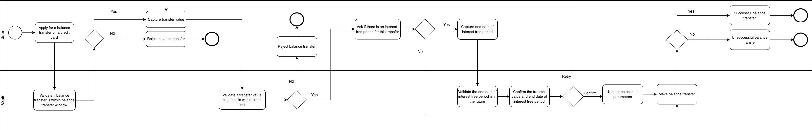

# Process diagrams

Learn about the product specification in relation to business processes and workflows, and the interaction between a customer, the bank (or a user on behalf of the bank), and the Product and Vault Core for each of the following:

-   Credit Card balance transfer - when a customer requests a balance transfer on their Credit Card account
    

chat\_bubble

Click on the image to enlarge it.

## Credit Card balance transfer

For more information about this feature, see [Balance transfers](/vault-core/5-8/EN/product_library/product_specifications/credit_card/features#8_balance_transfers).

