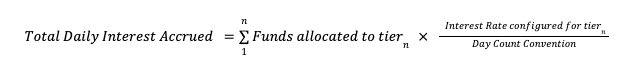

# Interest and amortisation

See also:

-   [Overdraft](/vault-core/5-8/EN/product_library/common_business_features/overdraft)
    

## Deposit Interest Application upon Account Closure (CPP-1967)

This is a business feature of the following products:

-   [Current Account](/vault-core/5-8/EN/product_library/product_specifications/current_account/)
    
-   [Savings Account](/vault-core/5-8/EN/product_library/product_specifications/savings_account/)
    
-   [US Checking Account](/vault-core/5-8/EN/product_library/product_specifications/us_checking/)
    
-   [US Savings Account](/vault-core/5-8/EN/product_library/product_specifications/us_savings/)
    

### Description

The account closure process is initiated and managed by the bank. This feature supports this process by applying any interest that has been accrued when the Vault account status is set to \`pending closure'.

### Configuration Options

Accrued interest application methods: Forfeiture

### Business Feature Behaviour

  
| ID | Title | Behaviour |
| --- | --- | --- |
| 
01

 | 

Configurable behaviour for deposit interest application

 | 

**GIVEN** that the bank offers a product that accrues interest **WHEN** the bank configures how the interest can be applied by the bank at upon account closure **THEN** the bank is able to opt for one of the following interest application methods: Forfeiture, which applies the accrued interest to an internal account

 |
| 

02

 | 

Deposit interest application when the method is set to forfeiture

 | 

**GIVEN** there is a deposit account with accrued interest **AND** the interest application method is set to 'forfeiture' **WHEN** the account is set to pending closure **THEN** the accrued interest is applied to an internal account

 |

## Scheduled Deposit Interest Accrual (CPP-1912)

This is a business feature of the following products:

-   [Current Account](/vault-core/5-8/EN/product_library/product_specifications/current_account/)
    
-   [Savings Account](/vault-core/5-8/EN/product_library/product_specifications/savings_account/)
    
-   [US Checking Account](/vault-core/5-8/EN/product_library/product_specifications/us_checking/)
    
-   [US Savings Account](/vault-core/5-8/EN/product_library/product_specifications/us_savings/)
    

### Description

Daily interest accrual model for deposit balances using the partial balance method, where portions of the balance accrue interest at different interest rates, based on the configured interest rate tier.

Note that this feature is applicable to funds denominated in the **Primary Denomination** of the account.

The following formula is used to calculate the total daily interest accrued:

The table below provides an example interest tier and account balance configuration, with a daily interest calculation for a deposit balance of 200,000 and a day count convention of 365 days:

      
| Tier (n) | From | To | Range Size | Interest Rate | Daily Interest Calculation | Daily Interest |
| --- | --- | --- | --- | --- | --- | --- |
| 
1

 | 

\>=0

 | 

<10,000

 | 

<10,000

 | 

0.25%

 | 

10,000 x (0.25%/365)

 | 

0.06849

 |
| 

2

 | 

\>=10,000

 | 

<25,000

 | 

<15,000

 | 

0.75%

 | 

15,000 x (0.75%/365)

 | 

0.30822

 |
| 

3

 | 

\>=25,000

 | 

<50,000

 | 

<25,000

 | 

1.50%

 | 

25,000 x (1.50%/365)

 | 

1.02740

 |
| 

4

 | 

\>=50,000

 | 

<100,000

 | 

<50,000

 | 

2.00%

 | 

50,000 x (2.00%/365)

 | 

2.73973

 |
| 

5

 | 

\>=100,000

 | 

<200,000

 | 

<100,000

 | 

2.50%

 | 

100,000 x (2.50%/365)

 | 

6.84932

 |
|  |  |  |  |  | 

**Total Daily Interest**

 | 

**10.99315**

 |

### Configuration Options

-   Interest rate tiers: Configuration of the interest rate tiers by name, balance range and interest rates. The number of tiers is configurable.
    
-   Interest rate tiers: Configuration of the interest rate tiers by name, balance range and interest rates. The number of tiers is configurable.
    
-   Day count convention: The day count convention used in the calculation of interest.
    
-   Interest accrual time: The time at which the interest is calculated and accrued on a daily basis.
    
-   Interest accrual precision: The number of decimal places at which interest will be accrued.
    

### Business Feature Behaviour

  
| ID | Title | Behaviour |
| --- | --- | --- |
| 
01

 | 

Configuring the interest rate tiers for a product

 | 

**GIVEN** a bank offers a product **WHEN** configuring the product **THEN** the bank is able to configure any number of interest rate tiers by defining the tier name, balance range, and the corresponding interest rates (Refer to the table for an example interest rate tier structure)

 |
| 

02

 | 

Configurable interest accrual time

 | 

**GIVEN** the product has been configured to accrue interest daily at HH:MM:SS **WHEN** it is HH:MM:SS **THEN** interest will be accrued

 |
| 

03

 | 

Configuring interest accrual precision

 | 

**GIVEN** a bank offers a product that accrues deposit interest **WHEN** configuring the interest accrual precision **THEN** the bank is able to set the decimal places at which interest is accrued

 |
| 

04

 | 

Configuring the Day Count Convention

 | 

**GIVEN** a bank offers a product **WHEN** configuring the product **THEN** the bank is able to define the day count convention that is used to calculate the interest that is accrued (Refer to the table for the interest accrual calculation)

 |
| 

05

 | 

Interest accrual with a positive interest rate

 | 

**GIVEN** an account has a balance of 50,000 **AND** the following deposit interest rate tiers: Tier 1: 0 to 10,000 accrues interest at 0.25% Tier 2: 10,000 to 25,000 accrues interest at 0.75% Tier 3: 25,000 to 50,000 accrues interest at 1.5% **AND** a day count convention of 365 **WHEN** the daily interest rate is calculated on the deposit balance **THEN** the interest accrued is (using the partial balance method): = (10,000*(0.0025/365)) + (15,000*(0.0075/365)) + (25,000\*(0.015/365)) = 1.40410 (Refer to the table for an example interest rate tier structure)

 |
| 

06

 | 

Interest accrual with a negative interest rate

 | 

**GIVEN** an account has a balance of 50,000 **AND** the following deposit interest rate tiers: Tier 1: 0 to 10,000 accrues interest at -0.25% Tier 2: 10,000 to 25,000 accrues interest at -0.75% Tier 3: 25,000 to 50,000 accrues interest at -1.5% **AND** a day count convention of 365 **WHEN** the daily interest rate is calculated on the deposit balance **THEN** the interest accrued is (using the partial balance method): = (10,000*(-0.0025/365)) + (15,000*(-0.0075/365)) + (25,000\*(-0.015/365)) = -1.40410 (Refer to the table for an example interest rate tier structure)

 |
| 

07

 | 

No interest accrued for a zero or negative deposit account balance

 | 

**GIVEN** an account has configured to accrue interest **AND** a it has a deposit balance of zero or less **WHEN** the deposit interest accrual is calculated **THEN** there will be zero interest accrued

 |

## Scheduled Deposit Interest Application (CPP-1913)

This is a business feature of the following products:

-   [Current Account](/vault-core/5-8/EN/product_library/product_specifications/current_account/)
    
-   [Savings Account](/vault-core/5-8/EN/product_library/product_specifications/savings_account/)
    
-   [Time Deposit](/vault-core/5-8/EN/product_library/product_specifications/time_deposit/)
    
-   [US Checking Account](/vault-core/5-8/EN/product_library/product_specifications/us_checking/)
    
-   [US Savings Account](/vault-core/5-8/EN/product_library/product_specifications/us_savings/)
    

### Description

Any accrued interest balance on an account is rebooked to the deposit balance on a periodic basis. The frequency at which interest is applied is configurable. Note that this feature is applicable to funds denominated in the **Primary Denomination** of the account.

### Configuration Options

-   Interest application frequency (monthly, quarterly, annually)
    
-   Interest application day: The day of the month, on which interest is rebooked to the deposit balance whether the interest application frequency is set to monthly, quarterly, or annually. If the scheduled day falls on a date that doesn’t exist (e.g. 30th Feb) then it will be rescheduled to the previous day.
    
-   Interest application time: The time at which the interest is applied on the interest application day.
    
-   Interest application precision: The number of decimal places at which interest will be applied.
    

### Business Feature Behaviour

  
| ID | Title | Behaviour |
| --- | --- | --- |
| 
01

 | 

Configuring the interest application precision for the product

 | 

**GIVEN** a bank offers a product that applies deposit interest **WHEN** configuring the interest application precision **THEN** the bank is able to set the decimal places at which accrued interest is applied

 |
| 

02

 | 

Configuring interest application frequency for the product

 | 

**GIVEN** a bank offers a product that applies deposit interest **WHEN** configuring the application schedule **THEN** the bank can configure the frequency of deposit interest application as monthly, quarterly, or annually

 |
| 

03

 | 

Interest application with a monthly interval

 | 

**GIVEN** a bank opens a new account on 15 January **AND** a monthly interval is set **AND** the interest application day is set to be the 28th day of the month **WHEN** it is HH:MM:SS on the 28th January **THEN** any accrued interest will be applied to the deposit balance

 |
| 

04

 | 

Interest application with a quarterly interval

 | 

**GIVEN** a bank opens a new account on 15 January **AND** a quarterly interval is set **AND** the interest application day is set to be the 28th day of the month **WHEN** it is HH:MM:SS on the 28th April **THEN** any accrued interest will be applied to the deposit balance

 |
| 

05

 | 

Interest application with an annual interval

 | 

**GIVEN** a bank opens a new account on 1 January **AND** an annual interval is set **AND** the interest application day is set to be the 5th day of the month **WHEN** it is HH:MM:SS on the 5th January of the following year **THEN** any accrued interest will be applied to the deposit balance

 |
| 

06

 | 

Configuring the Interest Application Day

 | 

**GIVEN** the product has been configured to apply interest **WHEN** an account is opened, **THEN** the bank is able to define the day of the month on which interest is applied for that account

 |
| 

07

 | 

Scheduled Application falls on day 29-31 of the month

 | 

**GIVEN** any accrued interest is due to be applied on day 29, 30, or 31 of the month **WHEN** the day does not exist **THEN** the interest is applied on the previous day

 |
| 

08

 | 

Configurable interest application time for the product

 | 

**GIVEN** the product has been configured to apply interest at HH:MM:SS **WHEN** it is HH:MM:SS on the interest application day **THEN** any accrued interest will be applied to the deposit balance

 |

### Supplemental Information

Interest Application Day changes are not supported as part of the Deposit Product Library.