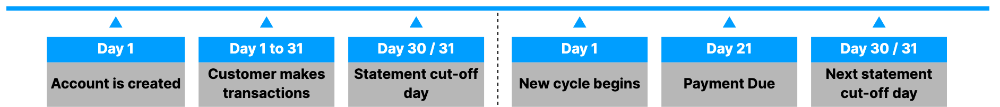
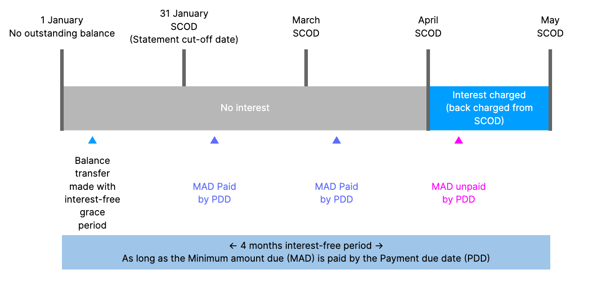
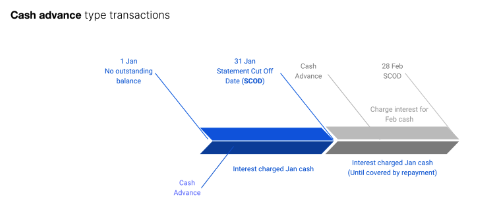
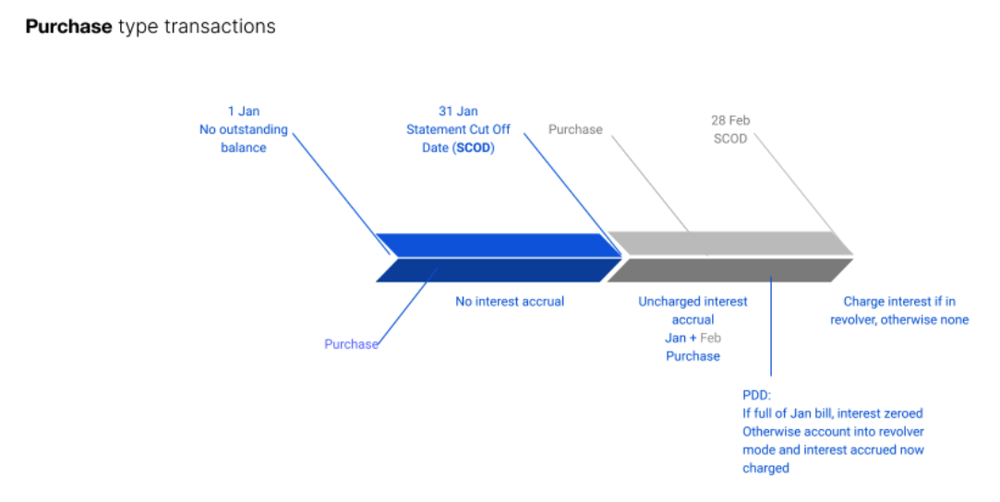

# Product features

The Credit Card product supports configuring [statement cycles](/vault-core/5-8/EN/product_library/product_specifications/credit_card/features#1_statement_cycles_and_payment_due_date), [payment due dates](/vault-core/5-8/EN/product_library/product_specifications/credit_card/features#1_2_payment_due_date), and different [transaction types](/vault-core/5-8/EN/product_library/product_specifications/credit_card/features#2_configurable_transaction_types). Banks can also configure specific behaviour for each transaction type (purchases, cash advances, transfers, and balance transfers) and each of their own features. These include:

-   [credit limits](/vault-core/5-8/EN/product_library/product_specifications/credit_card/features#2_1_limits_per_transaction_type)
    
-   [interest rates](/vault-core/5-8/EN/product_library/product_specifications/credit_card/features#2_2_interest_rates_and_accrualcharging_behaviour_per_transaction_type)
    
-   [minimum percentages due for customer payments](/vault-core/5-8/EN/product_library/product_specifications/credit_card/features#2_3_minimum_percentage_due_per_transaction_type)
    
-   [fees](/vault-core/5-8/EN/product_library/product_specifications/credit_card/features#2_4_fees_per_transaction_type)
    
-   [interest-free periods](/vault-core/5-8/EN/product_library/product_specifications/credit_card/features#2_5_interestfree_periods_per_transaction_type)
    

## [](#1_statement_cycles_and_payment_due_date "Copy link to heading")1\. Statement cycles and payment due date

### [](#1_1_statement_cycles "Copy link to heading")1.1 Statement cycles

The statement cycle - also known as the billing cycle - is an interval of time between one statement and the next statement. Transactions completed within the statement cycle are included in the statement issued to customers at the end of it.

The first statement cycle runs from the account creation date up to the same day of the following month. If the account is opened on a day with no equivalent day in the following month, the product automatically falls back to the next day prior to the date. For example, if the account opens on 31 March, the first statement cut-off date is 30 April.

Transactions completed prior to the most recent statement cycle are included in the statement, but any corresponding balances from prior statement cycles are carried forward and reflected in the statement balance. Therefore, the statement balance reflects the state of the full credit card balance on the statement cut-off date (SCOD).

#### [](#statement_cycle_example "Copy link to heading")Statement cycle example



##### [](#example_cycle_cycle_1 "Copy link to heading")Example cycle (cycle 1)

  
| Day | Event | Description |
| --- | --- | --- |
| 
Day 1

 | 

Account is created

 | 

Cycle runs from the creation date of the account up to the same day of the following month.

 |
| 

Day 1 to 31

 | 

Customer makes transactions

 | 

The credit card statement references transactions completed up to and inclusive of the last day of the SCOD.

 |
| 

Day 30/31

 | 

Statement cut-off day (SCOD)

 | 

The first statement cycle runs up to the same or a day before the following month. For example: Account opens on 31 March = first SCOD is 30 AprilThe first statement does not include transactions completed after the most recent SCOD.

 |

##### [](#example_subsequent_cycle_cycle_2 "Copy link to heading")Example subsequent cycle (cycle 2)

  
| Day | Event | Description |
| --- | --- | --- |
| 
Day 1

 | 

New cycle begins

 | 

Following the first monthly cycle, a new cycle begins with Day 1.The next credit card statement reflects transactions made after the previous SCOD.

 |
| 

Day 21

 | 

Payment due date (PDD)

 | 

Our product configuration sets the first payment due date 21 days from the SCOD.The customer can pay the due balance in full in the period between the SCOD and PDD in order to avoid interest and late payment charges.

 |
| 

Day 30/31

 | 

Next statement cut-off day

 | 

Any remaining balances from the first statement are carried forward and reflected in the new statement balance. It reflects any interest and any late payment charges for the previous statement.The statement balance reflects the state of the full credit card balance on the SCOD.

 |

### [](#1_2_payment_due_date "Copy link to heading")1.2 Payment due date

In the period between the statement cut-off date (SCOD) and payment due date (PDD) - also known as the grace period - the customer can make payments into the account that:

-   pay-off the due balance in full in order to avoid interest and late payment charges
    
-   pay-off the minimum amount due (MAD) but not enough to cover the due balance in full
    
-   are at anytime they want prior to the payment due date
    
-   exceed the balance to cover future transactions
    

chat\_bubble

If the customer has not paid the MAD by the PDD then the account becomes 'delinquent', at which point the product might charge late fees and terminate any eligible \`interest-free' periods.

The payment due date for the statement cycle is a configurable value as the number of days from the statement cut-off date. By default, the first payment due date is 21 days after the statement cut-off date. After the first payment due date, the product will preserve the same day of the month for the customer to make payments. For example, if the first payment due date occurs on day 15 of the month then each following payment due date occurs on day 15 of a month. This is regardless of the number of actual days from the statement cut-off date.

In the event that the customer fails to make the full expected monthly payment by the due date, the account moves into 'revolver' mode, which means that it incurs daily accrued interest as a direct charge. The customer must pay off the full outstanding balance in order to move the account out of 'revolver' mode and into 'transactor' mode where they do not pay interest on normal transactions.

The contract uses the abbreviations SCOD and PDD throughout and parameters for Statement Cut-Off Date and Payment Due Date respectively. SCOD represents Statement Cut-Off Date, and PDD represents Payment Due Date.

## [](#2_configurable_transaction_types "Copy link to heading")2\. Configurable transaction types

Banks can also configure specific behaviour for each transaction type and its features. The supplied configuration includes four transaction types:

-   Purchase
    
-   Cash advance
    
-   Transfer
    
-   Balance transfer
    

Each transaction type can have its own features, including [credit limits](/vault-core/5-8/EN/product_library/product_specifications/credit_card/features#2_1_limits_per_transaction_type), [interest rates](/vault-core/5-8/EN/product_library/product_specifications/credit_card/features#2_2_interest_rates_and_accrualcharging_behaviour_per_transaction_type) [minimum percentages due for customer payments](/vault-core/5-8/EN/product_library/product_specifications/credit_card/features#2_3_minimum_percentage_due_per_transaction_type), [fees](/vault-core/5-8/EN/product_library/product_specifications/credit_card/features#2_4_fees_per_transaction_type) and [interest-free periods](/vault-core/5-8/EN/product_library/product_specifications/credit_card/features#2_5_interest_free_periods_per_transaction_type).

Banks can configure transaction references within defined transaction types in order to differentiate behaviour for different transactions within a transaction type. The default configuration on this product includes two separate transaction references `'REF1'`, `'REF2'` within the balance transfer transaction type. You can configure transaction references using the `'TXN_REFS'` parameter.

For example, `{"balance_transfer": {"REF1": "0.022", "REF2": "0.035"}}` defines the per annum gross interest rate per transaction reference for 'REF1' and 'REF2' balance transfers.

### [](#2_1_limits_per_transaction_type "Copy link to heading")2.1 Limits per transaction type

Banks can configure the following limits and the specific transaction types to set them against:

-   a flat amount per transaction
    
-   a percentage (%) amount of the overall credit limit
    
-   a time limit, as the number of days since account opening
    

For each type, it is possible to set either or both a flat and/or percentage amount of the overall credit limit. When both options are set, the product uses the lowest limit amount for a given transaction.

When the product receives a transaction, it checks if a limit is set for that transaction type.

-   If there is a credit limit defined for the transaction type, it checks the transaction amount against the available credit limit for the specific transaction type.
    
-   If there is no credit limit, it checks the transaction against the overall account credit limit.
    
-   If there is a time limit defined for the transaction type, it checks the number of days against the account opening date.
    

The product rejects any transaction with a value that is in excess of the relevant available limit. For more information, refer to [Transaction type limits](/vault-core/5-8/EN/product_library/product_specifications/credit_card/features#6_3_transaction_type_limits).

### [](#2_2_interest_rates_and_accrualcharging_behaviour_per_transaction_type "Copy link to heading")2.2 Interest rates and accrual/charging behaviour per transaction type

Banks can configure interest rates for specific transaction types, enabling them to charge lower rates for everyday borrowing and higher rates for premium rate services, such as a Cash Advance.

The product’s configurability is showcased through the specific behaviour settings we have implemented.

    
| Transaction Type | Base Interest Rate | Accrue Daily | Immediate Charge | Description |
| --- | --- | --- | --- | --- |
| 
Purchase

 | 

.01 or 1%

 | 

Yes

 | 

No

 | 

Interest is only charged if the full outstanding amount is not paid during the grace period.

 |
| 

Cash Advance

 | 

.02 or 2%

 | 

Yes

 | 

Yes

 | 

Interest accrued and charged immediately.

 |
| 

Transfer

 | 

.03 or 3%

 | 

Yes

 | 

No

 | 

Interest is only charged if the full outstanding amount is not paid during the grace period.

 |
| 

Balance Transfer

 | 

.03 or 3%

 | 

Yes

 | 

Yes

 | 

Interest accrued and charged immediately.

 |

-   Accrues interest at 1% for Purchase balances, 2% for Cash Advance balances and 3% on Transfer balances.
    
-   Cash Advances and Balance Transfers start to accrue and charge interest from the day the transaction is made.
    
-   Other transaction types only accrue interest from the statement cut-off date.
    
-   Other transaction types only charge interest on the principal balances if the principal balances are not paid in full by the payment due date.
    

To see a list of parameters you can use to configure transaction type specific interest rates, see: [Interest parameters](/vault-core/5-8/EN/product_library/product_specifications/credit_card/product_configurability_credit_card#interest_parameters)

### [](#2_3_minimum_percentage_due_per_transaction_type "Copy link to heading")2.3 Minimum percentage due per transaction type

The product offers a feature to configure a minimum percentage of the account balance per transaction type that a customer must pay each month to avoid incurring late payment fees. This optional feature is in addition to setting a flat, fixed minimum monthly payment amount.

It uses the percentage set against each transaction type to calculate the minimum amount due (MAD).

The default configuration sets the per-transaction type MAD to 1% of each balance for principal types, and 100% of the interest and fee balances. The customer must pay the greater of the summed percentage amounts or a flat minimum amount.

### [](#2_4_fees_per_transaction_type "Copy link to heading")2.4 Fees per transaction type

Banks can configure the following fee types and per transaction type:

-   a flat, fixed fee amount
    
-   an amount as a percentage value of the transaction amount. per transaction type as described in the section on [transaction type fees](/vault-core/5-8/EN/product_library/product_specifications/credit_card/features#7_4_transaction_type_fees)
    

### [](#2_5_interest_free_periods_per_transaction_type "Copy link to heading")2.5 Interest-free periods per transaction type

Our product enables a bank to configure if and when interest-free periods should apply for each transaction type, through a workflow or the Core API.

Parameters:

-   `interest_free_expiry` for standard transaction types
    
-   `transaction_interest_free_expiry` for transaction types that use transaction references
    
-   `charge_interest_from_txn_date` the date from which to start charging interest on transactions (see: [Interest-free period expiration and statement cycles](#interestfree_period_expiration_and_statement_cycles))
    

The `interest_free_expiry` parameter enables the bank to offer customers an interest-free period on their credit card. This privilege is revoked when the customer fails to pay or settle the MAD during the grace period.

An example use case is when a bank wants to offer an interest-free (0%) balance transfer for 12 months to new customers. Setting an active interest-free period enables a bank to time-bound the period that the product does not charge interest on a specific transaction type or reference.

To enable this behaviour, the product accrues interest daily from the transaction date and shows the accrued interest on the `INTEREST_FREE_PERIOD_INTEREST_UNCHARGED` address.

When a customer makes the MAD payment before PDD:

-   The accrued interest is zeroed out.
    
-   The customer does not incur any interest fee/charge.
    

When the customer fails to pay the MAD before PDD for this statement:

-   The customer loses the interest-free period offer for all transaction types.
    
-   Interest moves from the `INTEREST_FREE_PERIOD_INTEREST_UNCHARGED` address to the `INTEREST_CHARGED` address when the PDD schedule is run.
    
-   Interest becomes `INTEREST_BILLED` interest on the following SCOD. The interest-free balance transfer process flow illustrates this.
    

There is no limitation that stops the bank from offering the customer another chance at interest-free transactions. The bank can update the `charge_interest_from_txn_date` parameter with a new interest-free expiry date for the transaction type or reference.

For example, if a customer has not fulfilled their MAD payments in the past and the bank wants to give them another opportunity to benefit from 0% transactions, then it may do so.



-   MAD = Minimum Amount Due
    
-   PDD = Payment Due Date
    
-   SCOD = statement cut-off date
    

#### [](#interest_free_period_expiration_and_statement_cycles "Copy link to heading")Interest-free period expiration and statement cycles

The way that interest is accrued if the interest-free period expires in the middle of the current statement cycle depends on another parameter: `charge_interest_from_txn_date`

This parameter is responsible for determining the date to start charging and billing interest on new transactions.

chat\_bubble

If the account is already in a revolver mode, interest is charged daily regardless of the parameter configuration.

Parameter values and behaviour:

-   `charge_interest_from_txn_date=True` means charging interest from the transaction day. This is the default configuration for Cash Advances and Balance Transfers.
    
-   `charge_interest_from_txn_date=False` means accruing uncharged interest from the SCOD day (which is charged on PDD given there is an unpaid balance). This is the default configuration for Purchases and Transfers.
    

For Cash Advances and Balance Transfers, when this parameter is set to its default behaviour (`charge_interest_from_txn_date=True`), then the interest charging behaviour depends on whether a bank applies an interest-free period on the transaction type or reference.

-   When a bank does not apply an interest-free period both Cash Advances and Balance Transfers charge and bill interest starting from the transaction date.
    
-   When a bank does apply an interest-free period, then this supersedes normal interest charging for Cash Advances and Balance Transfers. The product does not charge interest on the configured transaction types if they meet the MAD obligations. Charging reverts to normal when this period expires.
    

#### [](#use_cases "Copy link to heading")Use cases

For more related use cases, see: [Interest-free period - Additional use cases](/vault-core/5-8/EN/product_library/product_specifications/credit_card/appendix#interest_free_period_additional_use_cases)

##### [](#implement_interest_free_periods_for_transaction_types_that_are_not_referenced_based_purchase_cash_advance_transfer "Copy link to heading")Implement interest-free periods for transaction types that are not referenced-based (Purchase, Cash Advance, Transfer)

-   *Given* a bank is offering a credit card product
    
-   *When* the bank wants to implement interest-free periods for transaction types that are not reference-based
    
-   *Then* the bank can use the Core API to alter the `interest_free_expiry` instance parameter, mapping the transaction type to one timestamp string.
    

##### [](#implement_interest_free_periods_for_reference_based_transaction_types_balance_transfer "Copy link to heading")Implement interest-free periods for reference-based transaction types (Balance Transfer)

-   *Given* a bank is offering a credit card product
    
-   *When* the bank wants to implement interest-free periods for transaction types that are reference-based
    
-   *Then* the bank can use the Core API to alter the `transaction_interest_free_expiry` instance parameter, mapping the transaction type to Reference→timestamp string. For example: `{"balance_transfer: ["REF1":"2020-02-13 10:00:00"]}`
    

##### [](#multiple_active_interest_free_periods_for_reference_based_transaction_types_balance_transfers "Copy link to heading")Multiple active interest-free periods for reference-based transaction types (Balance Transfers)

-   *Given* the bank offers an interest-free period
    
-   *When* there are multiple balance transfers on an account
    
-   *Then* the bank can configure individual interest-free periods for each of the balance transfers.
    

##### [](#remove_active_interest_free_period_for_transaction_types_that_are_reference_based_and_not_reference_based_purchase_cash_advance_transfer_balance_transfer "Copy link to heading")Remove active interest-free period for transaction types that are reference-based and not reference-based (Purchase, Cash Advance, Transfer, Balance Transfer)

-   *Given* a bank is offering a credit card product
    
-   *When* the bank no longer wants to offer an interest-free period
    
-   *Then* the bank can remove any active interest-free expiry parameters for transaction types that are reference-based and not reference-based. For example, it can use either the Core API or Workflows.
    

##### [](#verify_the_balance_address_behaviour_before_pdd_in_the_statement_cycle_reference_based_transaction_types "Copy link to heading")Verify the balance address behaviour before PDD in the statement cycle (Reference-based transaction types)

-   *Given* a bank is offering an interest-free period
    
-   *When* there is an active interest-free period and we are between SCOD and PDD in the current statement
    
-   *Then* verify on every interest accrual event, there is an accrual of interest in a specific balance address named: `{TXN_TYPE}_{REF}_{INTEREST_FREE_PERIOD_INTEREST_UNCHARGED}`
    

### [](#2_6_how_transaction_types_are_defined_in_the_product "Copy link to heading")2.6 How transaction types are defined in the product

The transaction type is determined by mapping a code provided in the instruction details using the `transaction_code` key.

Transaction codes can be populated at any time and are required for debit transactions, such as purchases. They are not needed for inbound hard settlements or credit transfer instructions, such as repayments.

A transfer may debit one credit card account and credit another. In this case, it requires a transaction code; otherwise, it is not considered as a repayment for the credited account.

chat\_bubble

The transaction type should be consistent across the life cycle of a transaction. Changing the transaction type between an authorisation and a settlement leads to inconsistent balances.

A posting includes the following instruction details:

It also includes the `transaction_code` mapping parameter with the following value:

As a result, the posting is treated as a transaction type `purchase` and external fees take precedence.

### [](#2_7_consistency_in_transaction_type_parameters "Copy link to heading")2.7 Consistency in transaction type parameters

When the account is opened a check is made for consistency in the parameters that relate to behaviour based on transaction type and transaction references. If the check fails an exception is raised in the Smart Contract which is visible in the account update streaming event.

```
"01T10:12:21.694921Z","account\_update\_batch\_id":"","failure\_reason":"hook raised invalid contract parameter: Types in transaction\_type\_limits = {'cash\_advance'} are not present in {'balance\_transfer', 'purchase', 'transfer'}."
```

chat\_bubble

Make sure that the parameters are consistent after changing the configuration.

There are two kinds of transaction types:

-   "standard transaction types", which are not reference-based, where all transactions of that type share the same configuration
    
-   "reference-based transaction types" where each transaction can have specific behaviours for some parameters, such as interest rate
    

Every transaction of a reference-based type must have a unique reference associated with key `transaction_ref` in the `posting.instruction_details` field. Before posting, it is necessary to update the account instance parameters to include the reference.

It is necessary to update `"balance_transfer"` with a unique reference before checking the result, and then applying a transaction. This is because it is a reference-based transaction type.

There is also the option to associate a transaction reference with an interest-free period.

The parameter consistency checking performs these checks:

-   All transaction types are listed in `transaction_types`
    
-   All transaction types have a code associated in `transaction_code_to_type_map`
    
-   All transaction types are configured with `minimum_percentage_due`, `interest` and `fees`
    
-   All reference-based types listed in `transaction_references` are also included in `transaction_types`, `transaction_annual_percentage_rates` and `transaction_base_interest_rates`
    
-   The `annual_percentage_rates` and `base_interest rates`:
    
    -   Do not include reference-based types
        
    -   Do include all the other transaction types
        
    -   Do include fees if `accrue_interest_on_unpaid_fees` is enabled
        
    
-   All transaction types have an entry in `transaction_type_interest_internal_accounts_map`
    
-   All types present in `transaction_type_limits` are also in `transaction_types`
    
-   All types present in `transaction_type_fees` are also in `transaction_types` and `transaction_type_fees_internal_accounts_map`
    

In order to ensure that the configuration is explicit on opening an account, `transaction_references` must have an empty entry for all reference-based types.

## [](#3_interest "Copy link to heading")3\. Interest

Our product accrues interest daily on an outstanding balance. It only applies the interest to the account balance at the end of each statement cycle if the customer does not clear their due balance.

It is possible to configure how the product accrues and applies interest in general and for different transaction types by using [interest parameters](/vault-core/5-8/EN/product_library/product_specifications/credit_card/product_configurability_credit_card#interest_parameters).

### [](#3_1_interest_accrual "Copy link to heading")3.1 Interest accrual

From the day that the account opens, interest accrues daily on an outstanding balance. The default configuration is to charge interest on balances from the transaction date. However, it is possible to change this and configure our credit card to start accruing interest from the statement cut-off date, instead of the transaction date.

The product also allows configuring per annum interest rates for specific transaction types. This enables banks to charge lower rates for everyday borrowing and higher rates for premium rate services, such as a Cash Advance.

For more details please refer to [Product Configurability](/vault-core/5-8/EN/product_library/product_specifications/credit_card/product_configurability_credit_card)

#### [](#interest_accrual_from_transaction_date_default "Copy link to heading")Interest accrual from transaction date (default)

With this configuration, the product can charge interest from the transaction date depending on the transaction type.

-   For transaction types configured to charge interest from transaction day, chargeable interest accrues on the balance for an eligible transaction type from the day that the customer makes the transaction. This is the default behaviour for Cash Advance and Balance transfer transaction types.
    
-   For all other transaction types, the default configuration is to accrue interest on the balances of those transaction types from the transaction date. However, there is only a charge if the customer fails to repay the full principal by the payment due date.
    

##### [](#example_interest_accrual_and_charging_chargeable_interest_accrues_from_transaction_date "Copy link to heading")Example: Interest accrual and charging - chargeable interest accrues from transaction date



#### [](#interest_accrual_from_statement_cut_off_date_scod "Copy link to heading")Interest accrual from statement cut-off date (SCOD)

With this configuration, the product accrues interest on outstanding balances from the statement cut-off date and follows statement cycles, instead of the transaction date.

-   For the first statement cycle, the outstanding balance relates to transactions completed within that cycle only.
    
-   For subsequent statement cycles (after the first), the outstanding balance includes transactions completed within the given cycle and any overdue balances that are carried forward from previous billing cycles.
    
-   All overdue balances incur a daily interest charge, including balances relating to transactions completed in the current statement cycle. This continues until a customer clears the full outstanding balance.
    

##### [](#example_interest_accrual_and_charging_chargeable_interest_accrues_from_statement_cut_off_date "Copy link to heading")Example: Interest accrual and charging - chargeable interest accrues from statement cut-off date



#### [](#financial_calculations "Copy link to heading")Financial calculations

For a given a transaction type, the daily accrual amount is calculated using the following formula:

-   *Daily accrual account formula*: Accrued interest = balance \* daily interest rate
    

The daily interest rate is calculated using the per annum gross interest rate specified for the given transaction type and a day count of 365 days (or 366 on leap years):

-   *Daily interest rate formula*: Daily interest rate = per annum gross interest rate / 365
    

The accrued interest is rounded half up to two decimal places and added to the accrual pot for the duration of the interest accrual period.

#### [](#use_cases_2 "Copy link to heading")Use cases

##### [](#customer_pays_the_minimum_amount_due_mad_paid_and_goes_into_revolver "Copy link to heading")Customer pays the Minimum Amount Due (MAD) paid and goes into revolver

-   *Given* a bank has a credit card proposition
    
-   *When* the customer pays only the minimum amount due
    
-   *Then* the product charges interest from the date of the transaction for all transactions
    
    -   and charges interest on the remaining balance and on all the new transactions until the customer pays the previous balance in full.
        
    

##### [](#customer_makes_a_payment_that_is_lower_than_the_mad "Copy link to heading")Customer makes a payment that is lower than the MAD

-   *Given* a bank has a credit card proposition
    
-   *When* the customer pays less than the minimum amount due
    
-   *Then* the product charges interest from the date of the transaction for all transactions
    
    -   and the entire outstanding amount attracts finance charges along with all the new transactions, until the customer pays the previous balance in full.
        
    

##### [](#customer_does_not_make_a_repayment_by_the_payment_due_date_pdd "Copy link to heading")Customer does not make a repayment by the Payment Due Date (PDD)

-   *Given* a bank has a credit card proposition
    
-   *When* the customer does not make a repayment by the PDD
    
-   *Then* the product charges interest from the dates of all transactions on the total outstanding balance, including new statement transactions.
    

##### [](#customer_pays_off_the_total_statement_balance_and_goes_out_of_revolver "Copy link to heading")Customer pays off the total statement balance and goes out of revolver

-   *Given* a bank has a credit card proposition
    
-   *When* the customer repays the whole outstanding statement balance
    
-   *Then* the product ensures that interest accrued from transaction days is zeroed out and it does not charge interest to the customer
    
    -   and new transactions accrue interest until the following statement PDD.
        
    

##### [](#customer_pays_the_mad_during_an_active_interest_free_period "Copy link to heading")Customer pays the MAD during an active interest-free period

-   *Given* a bank has a credit card proposition
    
-   *When* the customer has an active interest-free period on one of the transaction types, such as a Balance Transfer, and pays the MAD
    
-   *Then* the product ensures that interest accrued for the Balance Transfer is zeroed out
    
    -   and charges interest accrued for other transaction types to the next statement cycle.
        
    

### [](#3_2_interest_application "Copy link to heading")3.2 Interest application

The product offers configuration options for interest application based on transaction type, whether a customer makes a full, partial or no payment of the outstanding balance, MAD and PDD.

For example, a bank can configure the product to charge interest on unpaid interest and unpaid fees when a customer does not pay the MAD and the balance becomes unpaid.

The product calculates any [accrued interest](/vault-core/5-8/EN/product_library/product_specifications/credit_card/features#3_1_interest_accrual) and due payments according to its standard configuration, any exemptions and additional settings, and:

-   applies accrued interest when the customer does not pay the outstanding balance by the payment due date (PDD) for eligible transaction types
    
-   ensures that any interest accrued up to the PDD is zeroed out when a customer payment clears the due balance in full for eligible transaction types
    
-   charges interest on the balances of qualifying transaction types from the day that a customer makes a qualifying transaction, as specified by the bank (for example, Cash Advance)
    
-   enters \`revolver mode' when the customer makes a partial repayment that meets the monthly MAD but not the full due balance
    
-   in \`revolver mode', accrues chargeable interest daily on principal balances until it receives payment for the full outstanding balance, and rounds half up the accrued interest pot to two decimal places
    

This means that customers who always pay off the full due balance on their statement every month never incur chargeable interest, subject to any exceptions.

### [](#3_3_interest_on_unpaid_interest "Copy link to heading")3.3 Interest on unpaid interest

The product uses the percentage value set in the interest charged (I) component within the Minimum Amount Due (MAD) calculation to determine the proportion of the overall interest to include with the MAD. This value is set to 100% within the default configuration, but is configurable to a value lower than 100%.

Changing this to a lower value allows customers to pay a smaller portion of the overall interest with MAD payments; however, the remaining portion is treated as unpaid interest.

Example: If the interest charged component for MAD is set to 80%, then 80% of the overall chargeable interest is linked to the MAD and the remaining 20% is treated as unpaid interest.

The percentage of interest charged on unpaid interest is the same as the base interest rate configured for the transaction types.

#### [](#interest_application_when_the_interest_charged_component_is_set_at_100 "Copy link to heading")Interest application when the interest charged component is set at 100%

All (100%) of the total interest charged is included with the MAD.

-   When a customer pays the MAD in full, the product does not charge any additional interest because there is no unpaid interest.
    
-   When a customer fails to pay the MAD, the product charges daily interest on the unpaid interest and adds it to the outstanding balance in the next statement cycle.
    
-   When a customer makes a partial payment of the MAD, the payment value might cover the total of unpaid interest on the account.
    

#### [](#interest_application_when_the_interest_charged_component_is_set_lower_than_100 "Copy link to heading")Interest application when the interest charged component is set lower than 100%

The total interest charged is split; only the specified % portion is included with the MAD.

-   The specified percentage value of interest is included with the MAD and the remaining percentage value of interest is treated as unpaid.
    
-   When a customer pays the MAD in full, the product clears the outstanding balance (minimum payment amount including interest) and applies interest to the outstanding unpaid interest, if configured.
    

#### [](#use_cases_3 "Copy link to heading")Use cases

##### [](#accrue_interest_on_interest "Copy link to heading")Accrue interest on interest

-   *Given* a bank is defining a credit card product
    
-   *When* it specifies the product features
    
-   *Then* it can specify that there is an interest charge on overdue interest.
    

##### [](#do_not_accrue_interest_on_interest "Copy link to heading")Do not accrue interest on interest

-   *Given* a bank is defining a credit card product
    
-   *When* the bank specifies the product features
    
-   *Then* it can specify that there is no interest charge on overdue interest
    
    -   and it can see this reflected on the Operations Dashboard.
        
    

### [](#3_4_interest_on_unpaid_fees "Copy link to heading")3.4 Interest on unpaid fees

The product uses the percentage value set in the Fees (F) component within the Minimum Amount Due (MAD) calculation to determine the proportion of the overall fees to include with the MAD. This value is set to 100% within the default configuration, but is configurable to a value lower than 100%.

Changing this to a lower value allows customers to pay a smaller portion of the overall fees with MAD payments; however, the remaining portion is treated as unpaid. Unpaid fees accrue daily interest if configured.

The percentage of interest charged on unpaid fees is configurable for each transaction type. For example:

-   *If* the fees component for MAD is set to 80%
    
-   *Then* 80% of the overall chargeable fees is linked to the MAD
    
    -   and the remaining 20% is treated as unpaid fees.
        
    

#### [](#interest_application_when_the_fees_component_for_mad_is_set_at_100 "Copy link to heading")Interest application when the Fees component for MAD is set at 100%

All (100%) of the total fees is included with the MAD.

-   When a customer pays the MAD in full, the product does not charge any additional interest because there are no unpaid fees.
    
-   When a customer fails to pay the MAD, the product charges daily interest on the unpaid fees and adds it to the outstanding balance in the next statement cycle.
    
-   When a customer makes a partial payment of the MAD, the payment value might cover the total of unpaid fees on the account.
    

#### [](#interest_application_when_the_fees_component_for_mad_is_set_at_lower_than_100 "Copy link to heading")Interest application when the Fees component for MAD is set at lower than 100%

The total of fees charged is split; only the specified % portion is included with the MAD.

-   The specified percentage value of fees is included with the MAD.
    
-   The remaining percentage value of fees is treated as unpaid.
    

When a customer pays the MAD in full, the product clears the outstanding balance (including fees) and applies interest to the outstanding unpaid fees, if configured.

#### [](#use_cases_4 "Copy link to heading")Use cases

##### [](#accrue_interest_on_fees "Copy link to heading")Accrue interest on fees

-   *Given* a bank is defining a credit card product
    
-   *When* it specifies the product features
    
-   *Then* it can specify that interest is charged on unpaid fees.
    

##### [](#do_not_accrue_interest_on_fees "Copy link to heading")Do not accrue interest on fees

-   *Given* a bank is defining a credit card product
    
-   *When* it specifies the product features
    
-   *Then* it can specify that there is no interest charge on unpaid fees.
    

##### [](#specify_interest_rate_for_interest_to_charge_on_fees "Copy link to heading")Specify interest rate for interest to charge on fees

-   *Given* a bank is defining credit card product
    
-   *When* it specifies to accrue interest on unpaid fees
    
-   *Then* it can specify the interest rate to use
    
    -   and it can see the specified interest rate on the Operations Dashboard.
        
    

##### [](#interest_on_fees_uses_separate_pots "Copy link to heading")Interest on fees uses separate pots

-   *Given* a bank has specified to accrue interest on fees
    
-   *When* a customer does not pay off all due fees by the end of the payment due period
    
-   *Then* interest is accrued on the unpaid fees as per the defined rate
    
    -   and the interest is reflected in separate pots to any other interest that has accrued.
        
    

## [](#4_monthly_repayments "Copy link to heading")4\. Monthly repayments

Our product calculates the monthly full and minimum amounts due, inclusive of any fees and interest, that a customer must pay to clear or reduce their outstanding balance.

It offers configuration options for components that affect monthly repayments, the [repayment amount](/vault-core/5-8/EN/product_library/product_specifications/credit_card/features#4_1_repayment_amount) and [repayment hierarchy](/vault-core/5-8/EN/product_library/product_specifications/credit_card/features#4_2_repayment_hierarchy), including:

-   Payment due date (PDD) as number of days (the default is 21 days from the SCOD)
    
-   Statement cut-off date (SCOD)
    
-   Interest, fees and limits, including per transaction type
    
-   Percentage (%) of billed or unpaid interest, % of billed or unpaid fees, % of principal amount by transaction type, to include in the minimum amount due (MAD)
    
-   Repayment holidays
    

The customer can make payments into the account any time they want prior to the payment due date. The total amount can also exceed the balance to cover future transactions.

### [](#4_1_repayment_amount "Copy link to heading")4.1 Repayment amount

The repayment amount for a given month is the sum of all chargeable interest, fees and transactions completed in the most recently completed statement cycle, plus any outstanding balances carried forward from previous cycles.

The product calculates the repayment amount, and:

-   applies accrued interest when the customer does not pay the outstanding balance by the payment due date (PDD) for eligible transaction types
    
-   ensures that any non-chargeable interest accruing on principal balances is zeroed out when a customer payment clears the due balance in full for eligible transaction types by the PDD
    
-   charges interest on the balances of qualifying transaction types from the day that a customer makes a qualifying transaction, as specified by the bank (for example, Cash Advance)
    
-   enters \`revolver mode' when the customer makes a partial repayment that meets the monthly MAD but not the full due balance
    
-   in \`revolver mode', accrues chargeable interest daily on principal balances until it receives payment for the full outstanding balance; the accrued interest pot is rounded half up to two decimal places
    
-   applies a configurable late payment fee (default is 100 GBP) if the customer fails to meet the minimum monthly due (MAD).
    

chat\_bubble

Interest continues to accrue and is applied to the balance in this way until the customer clears the overdue balance in full

This means that customers who always pay off the full due balance on their statement every month never incur chargeable interest, subject to any exceptions.

#### [](#financial_calculations_2 "Copy link to heading")Financial calculations

Our product calculates the minimum amount due as the greater of either:

-   100% of fees and interest plus 100% of the greater of the overdue or overlimit amount plus a configurable percentage of each transaction type
    
-   The defined minimum amount due for the product
    

The minimum amount due is zero when the customer does not owe any money; for example, if they have repaid more than the account balance.

To calculate a minimum amount due, the product requires the following data items:

-   100% of total Overdue or Overlimit amount, whichever is greater
    
-   Configurable % of Billed or Unpaid Interest
    
-   Configurable % of Billed or Unpaid Fees
    
-   Configurable % of principal amount by transaction type (`minimum_percentage_due`)
    

If the result of this calculation is smaller than the fixed `minimum_percentage_due` parameterised amount, it uses the fixed amount. The minimum amount due is always capped so that it is no more than the statement balance.

##### [](#example_data_items_and_values "Copy link to heading")Example data items and values

   
| *Reference* | *Description* | *Amount* | *Minimum percentage due* |
| --- | --- | --- | --- |
| 
F

 | 

Fees

 | 

10

 | 

100%

 |
| 

I

 | 

Charged interest

 | 

15

 | 

100%

 |
| 

P

 | 

Purchases balance

 | 

500

 | 

1%

 |
| 

CA

 | 

Cash Advance balance

 | 

100

 | 

1%

 |
| 

T

 | 

Transfer balance

 | 

100

 | 

1%

 |
| 

BT

 | 

Balance transfers balance

 | 

50

 | 

1%

 |
| 

MAD

 | 

Minimum amount due

 | 

100

 | 

\-

 |

##### [](#example_formula_and_calculation "Copy link to heading")Example formula and calculation

-   Combined minimum percentage due (MPD) = F + I + 0.01 P + 0.01 CA + 0.01 T + 0.01 BT = 32.5 GBP
    
-   Minimum repayment = Max (minimum percentage due, MAD)
    
-   Minimum repayment = Max (32.5 GBP, 100 GBP)
    
-   Minimum repayment = 100 GBP
    

#### [](#use_cases_5 "Copy link to heading")Use cases

##### [](#specify_the_percentage_of_billed_or_unpaid_interest_to_include_in_the_minimum_amount_due "Copy link to heading")Specify the percentage (%) of billed or unpaid interest to include in the minimum amount due

-   *Given* a bank is defining a credit card product
    
-   *When* it specifies how to calculate the minimum amount due
    
-   *Then* it can provide the percentage of billed or unpaid interest to include in the minimum amount due (minimum 0, maximum 100).
    

##### [](#specify_the_percentage_of_billed_or_unpaid_fees_to_include_in_the_minimum_amount_due "Copy link to heading")Specify the percentage (%) of billed or unpaid fees to include in the minimum amount due

-   *Given* a bank is defining a credit card product
    
-   *When* it specifies how to calculate the minimum amount due
    
-   *Then* it can provide the percentage of billed or unpaid fees to include in the minimum amount due (minimum 0, maximum 100).
    

##### [](#the_minimum_amount_due_mad_calculation_includes_the_specified_percentage_for_interest_and_fees "Copy link to heading")The minimum amount due (MAD) calculation includes the specified percentage for interest and fees

-   *Given* a bank has defined a credit card product and specified how the minimum amount due is calculated
    
-   *When* the product calculates the minimum amount due
    
-   *Then* the MAD includes the correct percentages that a bank defines for interest and fees.
    

##### [](#the_minimum_amount_due_mad_is_5_across_all_debt "Copy link to heading")The minimum amount due (MAD) is 5% across all debt

-   *Given* a bank wants to have the minimum amount due as 5% across all debt
    
-   *When* the bank defines the credit card product
    
-   *Then* it individually defines interest, fees and all transaction types as 5%
    
    -   and when the minimum amount due calculation happens it includes 5% of each.
        
    

### [](#4_2_repayment_hierarchy "Copy link to heading")4.2 Repayment hierarchy

The product offers a configurable repayment hierarchy which dictates the order that it receives and applies repayments to clear the customer’s debt across its different pots.

When a customer repayment arrives, the product distributes it across these different pots using the repayment hierarchy, repaying specific balances first and then the due amount.

-   It must pay the entirety of the balance (zero out) for a given entry in the hierarchy before moving to the next entry. In the case of interest and principal, this could correspond to more than one balance. Interest is split into transaction types
    
-   Repayments follow a descending APR order
    
-   APR per transaction type is configurable using the following parameters to calculate interest, with either the same as the transaction type `base_interest_rates` or different values. For example, if there is a business need for controlling the repayment hierarchy:
    
    -   `annual_percentage_rate` (for transaction types that do not use references)
        
    -   `transaction_annual_percentage_rate` (for transaction types that use references)
        
    

The following example is a common approach; however, clients can specify a different repayment hierarchy to suit their requirements.

#### [](#example_repayment_hierarchy_order "Copy link to heading")Example repayment hierarchy order

1.  Unpaid Interest
    
2.  Billed Interest
    
3.  Unpaid Fees
    
4.  Billed Fees
    
5.  Unpaid Principal - by transaction type, in descending order based on APR
    
6.  Billed Principal - by transaction type, in descending order based on APR
    
7.  Charged Principal - by transaction type, in descending order based on APR
    
8.  Charged Interest
    
9.  Charged Fees
    

## [](#5_configurable_timezone "Copy link to heading")5\. Configurable timezone

Our products only support UTC timezone and this is not a configurable option.

## [](#6_account_limits "Copy link to heading")6\. Account limits

Our product enables a bank to configure and modify the following types of limits on a customer account, and configure [fees](/vault-core/5-8/EN/product_library/product_specifications/credit_card/features#7_fees) to charge when an associated limit is breached.

### [](#6_1_credit_limit "Copy link to heading")6.1 Credit limit

The credit limit is the maximum amount that a customer can borrow at one time.

### [](#6_2_overlimit "Copy link to heading")6.2 Overlimit

An optional, additional amount that enables a customer to borrow above the credit limit for a configurable fee if they opt-in. Once the overlimit amount is in use, the customer must make a repayment to reduce the balance below the agreed credit limit before the credit card can process any further outgoing transactions.

### [](#6_3_transaction_type_limits "Copy link to heading")6.3 Transaction type limits

Banks can specify further limits for specific transaction types. The product checks all incoming transactions against these limits and rejects any it considers to breach them. Transactions are limited to the configured denomination. The default setting is GBP.

Example transaction type limit configuration:

-   A 250 GBP limit on transactions of type \`Cash Advance', or 1% of the overall credit limit, whichever is lower
    
-   Allow transactions of type \`Balance Transfer' only within 14 days of account opening
    

## [](#7_fees "Copy link to heading")7\. Fees

Our product charges several different types of fee and allows banks to make changes to the default configuration using the [fee parameters](/vault-core/5-8/EN/product_library/product_specifications/credit_card/product_configurability_credit_card#fee_parameters).

### [](#7_1_overlimit_fee "Copy link to heading")7.1 Overlimit fee

Banks can configure an overlimit fee to charge to a customer who borrows an amount greater than the credit line agreed with the bank.

A customer incurs an overlimit fee once at the end of each statement cut-off date if they meet the following criteria:

-   The outstanding principal amount exceeds the credit limit.
    
-   The customer has opted-in to the overlimit facility (`overlimit_opt_in`).
    

### [](#7_2_annual_credit_card_fee "Copy link to heading")7.2 Annual credit card fee

The account is subject to an annual credit card fee one year from the account creation day. The default configuration on the contract is 100 GBP per annum. Banks can change the fee value using the `ANNUAL_FEE_PARAM` parameter.

### [](#7_3_late_repayment_fee "Copy link to heading")7.3 Late repayment fee

Customers incur a late repayment fee when they fail to repay at least the minimum amount due for a given month. Banks can configure the minimum amount due and the resulting late payment fee.

### [](#7_4_transaction_type_fees "Copy link to heading")7.4 Transaction type fees

Banks can configure fees for specific transaction types using the `transaction_type_fees` parameter. Transactions and fees are evaluated when a transaction is settled, based on the settled amount.

Available transaction type fees:

-   flat/fixed fee - a fixed fee value, irrespective of transaction amount
    
-   percentage fee
    
-   combined fee - comprises the flat fee and percentage fee (set `"combine"` to `"True"`)
    

Additional fee application configuration options:

-   Apply a fee cap - specify a value as the cap that constrains the fee charged per transaction
    
-   Apply a fee on all settled transactions
    
-   Apply a fee only on transactions where the amount is greater than the deposit at the time of the transaction
    
-   Apply the transaction type fee that results in the greater fee amount when a bank specifies both a flat and percentage fees (when `"combine"` is set to `"False"`)
    

In the example configuration:

-   Cash Advance has a fee, which is the greater of 1% of the transaction amount of 10 GBP
    
-   Balance Transfer and Transfer have a combined fee of 25 GBP plus 2.5% of the transaction amount that is subject to a cap (maximum) of 100 GBP
    

### [](#7_5_external_fees "Copy link to heading")7.5 External fees

Banks can apply external fees, such as dispute fees and cash withdrawal fees, to the account at their discretion.

The amount and trigger for external fees are kept outside of the Smart Contract.

Our product facilitates external fees through a combination of:

-   The Postings API - banks can charge external fees through the API when the instruction details contain the `fee_type` key-value pair
    
-   Smart Contract support - contains a list of external fees that we recognise and their Income and Loan GL accounts
    

## [](#8_balance_transfers "Copy link to heading")8\. Balance transfers

Our product offers a Balance Transfer facility which allows customers to transfer balances between Credit Cards. This helps customers to take control of their debt and take a break from paying a higher interest rate.

Balance transfers are a transaction type; therefore, a bank can choose to [configure the transaction behaviour](/vault-core/5-8/EN/product_library/product_specifications/credit_card/features#2_configurable_transaction_types) and charge customers fees.

The interest rate is set on a per-transaction basis, by tagging a balance transfer with a unique reference to specify the interest rate. The transaction type is not included in the account-level `annual_percentage_rate` and `base_interest_rate` parameters.

Available balance transfer transaction type fees:

-   flat/fixed fee - a fixed fee value, irrespective of transfer amount (25 GBP by default)
    
-   percentage fee - a variable fee, as a % value of the transfer amount (2.5% by default)
    
-   combined fee - comprises the flat fee and percentage fee (set `"combine"` to `"True"`)
    

Additional configuration options:

-   Apply a fee cap - specify a value as the cap that constrains the fee charged per transfer (100 GBP by default)
    
-   Apply the transfer transaction type fee that results in the greater fee amount when a bank specifies both a flat and percentage fees (when `"combine"` is set to `"False"`)
    
-   Balance transfer window - the number of days since account creation date that new customers can apply for a balance transfer (14 days by default)
    

### [](#related_vault_objects "Copy link to heading")Related Vault objects

Instantiating the `CREDIT_CARD_BALANCE_TRANSFER` Workflow on the Credit Card allows banks to make balance transfers and configure interest-free periods.

Instantiating interest-free periods is possible from within the Balance Transfer Workflow. Each balance transfer can have its own individual interest-free period, linked to its transaction reference. However, the interest-free period ends on all Balance Transfers for any customer that does not meet their Minimum Amount Due obligation.

On instantiating the balance transfer Workflow:

1.  It starts and checks if there is a balance transfer window on the account.
    
2.  It checks the value of the `allowed_days_after_opening` key in transaction\_type\_limits against the current day and account opening date.
    
    -   It either completes if it is within the balance transfer window or finishes the Workflow with an error message if this allowed period has ended.
        
    

chat\_bubble

For demonstration purposes, the `CREDIT_CARD_BALANCE_TRANSFER` Workflow makes a transfer into an internal account. The expectation is that banks configure the product to use an external payments system to transfer the funds to an account at a different institution.

### [](#use_cases_6 "Copy link to heading")Use cases

#### [](#defining_a_balance_transfer_window "Copy link to heading")Defining a balance transfer window

-   *Given* a bank has a credit card proposition
    
-   *When* it is defining a Credit Card product
    
-   *Then* the bank is able to specify the balance transfer window as a number of days in the Balance Transfer Workflow.
    

#### [](#initiating_a_balance_transfer_within_the_balance_transfer_window "Copy link to heading")Initiating a balance transfer within the balance transfer window

-   *Given* a bank instantiates a balance transfer through the balance transfer Workflow
    
-   *When* the date/time that the bank instantiates the Workflow is during the balance transfer window
    
-   *Then* the Workflow runs to completion.
    

#### [](#initiating_a_balance_transfer_outside_of_the_balance_transfer_window "Copy link to heading")Initiating a balance transfer outside of the balance transfer window

-   *Given* a bank instantiates a balance transfer through the balance transfer Workflow
    
-   *When* the date/time of instantiating the Workflow is beyond the end of the balance transfer window (exceeds the value for `allowed_days_after_opening`)
    
-   *Then* the workflow terminates in a Failed state with an error message.
    

#### [](#defining_a_transfer_fee_percentage_andor_amount "Copy link to heading")Defining a transfer fee percentage (%) and/or amount

-   *Given* a bank has a credit card proposition
    
-   *When* it is defining a Credit Card product
    
-   *Then* the bank is able to specify the transfer fee percentage (%) and/or amount.
    

#### [](#setting_a_transfer_fee_percentage_andor_amount "Copy link to heading")Setting a transfer fee percentage (%) and/or amount

-   *Given* a bank defines a Credit Card with transfer fee product
    
-   *When* it opens a customer account for this product
    
-   *Then* the transfer fee (% and/or amount) is set and the Operations Dashboard (Ops Dash) displays the parameter.
    

#### [](#setting_a_cap_on_a_transfer_fee "Copy link to heading")Setting a cap on a transfer fee

-   *Given* a bank defines a Credit Card with transfer fee product
    
-   *When* it opens a customer account for this product
    
-   *Then* the maximum amount is set on the transfer fee and the Operations Dashboard (Ops Dash) displays the parameter.
    

#### [](#defining_a_transfer_fee_without_a_cap "Copy link to heading")Defining a transfer fee without a cap

-   *Given* a bank defines a Credit Card with transfer fee product
    
-   *When* it opens a customer account for this product
    
-   *Then* the bank does not specify a value for the maximum amount and the Operations Dashboard (Ops Dash) does not display a parameter.
    

#### [](#applying_a_capped_transfer_fee_to_a_credit_card_account "Copy link to heading")Applying a capped transfer fee to a credit card account

-   *Given* a bank defines a Credit Card with transfer fees (% and amount) product
    
-   *When* it initiates a balance transfer for this Credit Card product
    
-   *Then* the `CREDIT_CARD_BALANCE_TRANSFER` workflow applies the maximum transfer fee to the balance transfer transaction on the credit card account.
    

#### [](#applying_the_greater_transfer_fee_or_amount_to_a_credit_card_account "Copy link to heading")Applying the greater transfer fee (% or amount) to a credit card account

-   *Given* a bank defines a Credit Card product with transfer fees (% and amount)
    
-   *When* it initiates a balance transfer for this Credit Card product
    
-   *Then* the `CREDIT_CARD_BALANCE_TRANSFER` workflow applies the greatest transfer fee (% or amount) to the balance transfer transaction on the credit card account.
    

#### [](#not_applying_a_transfer_fee_to_a_credit_card_account "Copy link to heading")Not applying a transfer fee to a credit card account

-   *Given* a bank defines a Credit Card product that does not have a transfer fee
    
-   *When* it initiates a balance transfer for this Credit Card product
    
-   *Then* the `CREDIT_CARD_BALANCE_TRANSFER` workflow does not apply a transfer fee to the balance transfer on the credit card account.
    

## [](#9_offline_transactions "Copy link to heading")9\. Offline transactions

Our product enables points of sale to accept offline transactions without real-time connections to merchants.

Transactions are treated as being offline if it has the `"advice"` field set to `"True"`. In this scenario, the credit card bypasses validation checks, such as an insufficient balance check.

chat\_bubble

These checks might reject an entire batch of Posting Instructions if it contains both offline (`"advice"="True"`) and online (`"advice"="False"`) transactions. This is due to the checks on the online transactions (for example, insufficient balance).

## [](#10_delinquency_handling "Copy link to heading")10\. Delinquency handling

We have designed our product to handle delinquency by tracking it through the following:

-   Overdue balances
    
-   Payment Due Date (PDD)
    
-   Repayments
    
-   Days Past Due (DPD) calculations
    
-   Delinquency-related behaviours
    

### [](#10_1_overdue_balances "Copy link to heading")10.1 Overdue balances

The contract uses overdue balances to track the amounts that the customer has failed to repay and their corresponding statement cycle age.

Overdue Balance addresses use the format `OVERDUE_<STATEMENT CYCLE AGE>`

Example: `OVERDUE_1`

-   `OVERDUE_1` stores the overdue amount for the most recent statement cycle. It is the proportion of the minimum amount due (MAD) that does not correspond to existing overdue amounts.
    
-   Non-zero balances at `OVERDUE_<#>` addresses (`<#>` represents a number) are aged - for example, the contents of `OVERDUE_1` move to `OVERDUE_2`, and the contents of `OVERDUE_2` move to `OVERDUE_3`.
    

### [](#10_2_payment_due_date_pdd "Copy link to heading")10.2 Payment Due Date (PDD)

At the end of a given PDD, the contract determines whether a customer’s repayments meet or exceed the minimum amount due (MAD) for its associated statement cycle.

### [](#10_3_repayments "Copy link to heading")10.3 Repayments

When a credit card account receives a repayment, the contract:

-   distributes the repayment amount to the relevant real-money balances according to the repayment hierarchy.
    
-   removes the repayment amount from the overdue balances, starting with the overdue balance that has the oldest cycle age.
    

### [](#10_4_days_past_due_dpd_calculations "Copy link to heading")10.4 Days Past Due (DPD) calculations

DPD is the inherent metric used to drive numerous delinquency-related processes, including but not limited to:

-   Blocks on spend for the credit card account
    
-   Blocks on spend for associated debit accounts
    
-   Notification to credit agencies
    
-   Write-off of outstanding balances
    

Banks can calculate the DPD for a given account by using API calls to access account balances. Example steps:

1.  Check if the account has any non-zero overdue balances.
    
2.  If there are entries, identify the oldest by locating the entry with the highest numerical suffix. If there are none, the customer is not delinquent and the DPD is 0/Undefined.
    
3.  Find the corresponding payment due date (PDD).
    
4.  Subtract the current date from the PDD to find the number of days past due (DPD).
    

### [](#10_5_delinquency_related_behaviours "Copy link to heading")10.5 Delinquency-related behaviours

Based on the number of days past due threshold that a bank sets in the product configuration, the bank can flag an account as delinquent by making a suitable API call to Vault. A bank must include the flag definition ID or IDs that represent delinquency in one or more lists in the contract, to determine the behaviour of the account while delinquent.

Calls can include the following parameters:

 
| Parameter | Description |
| --- | --- |
| 
`accrual_blocking_flags`

 | 

Populate with all the flags needed to block the daily accrual and charge of interest. This should block accrual for a given day if the customer/account has any unexpired flags as of the accrual cut-off date.

 |
| 

`account_closure_flags`

 | 

Populate with all the flags needed to signal that the bank or customer is initiating an account closure request.

 |
| 

`mad_as_full_statement_flags`

 | 

List of flags applied to customer or account which, when applied will set MAD equal to statement balance (for example, delinquency, account closure).

 |

## [](#11_disputes "Copy link to heading")11\. Disputes

Our product supports disputes on transactions and associated fees. Disputes are treated as a standard repayment and follow the repayment processing logic, therefore the bank should only allow a dispute on settled transactions.

It is also possible to reinstate an unsuccessful dispute by creating a new transaction, with additional transactions for interest or fees if they apply. This allows you to target specific balances in the account, such as interest for cash advance.

The default configuration of the product does not prevent account closure while a dispute is ongoing; however, you can configure this by applying the restriction type `RESTRICTION_TYPE_PREVENT_CLOSURE` at the `RESTRICTION_LEVEL_ACCOUNT` level.

As the dispute process is limited to making new transactions, any other stages or events in the bank’s dispute process are external to the Smart Contract.

## [](#12_write_off_requests "Copy link to heading")12\. Write-off requests

The product can accommodate write-off requests when there is an outstanding balance on account at the time that a customer or bank initiates an account closure. Banks can populate the `account_write_off_flags` parameter with a flag definition ID and apply the relevant flag to the account.

### [](#12_1_transferring_the_written_off_balance "Copy link to heading")12.1 Transferring the written-off balance

In order to write-off the balance, it is necessary to transfer it to the internal accounts by populating the following internal parameters to make the write-off postings later:

-   `principal_write_off_internal_account`
    
-   `interest_write_off_internal_account`
    

Updating `PENDING_CLOSURE` triggers two repayments from these accounts to cover the full outstanding balance.

As with a normal account closure, the final statement is generated. At this point, a prerequisite is that the full outstanding balance is zero (0); therefore, the minimum amount due and statement balances are also zero (0).

## [](#13_repayment_holidays "Copy link to heading")13\. Repayment holidays

The product allows a bank to apply repayment holiday at an individual account level by configuring the relevant [event-blocking flag parameters](/vault-core/5-8/EN/product_library/product_specifications/credit_card/product_configurability_credit_card#eventblocking_flag_parameters). Repayment holidays provide the customer a break in monthly payment event-blocking flag parameters commitments.

Use cases include:

-   Customer circumstances change due to any reason, such as a. loss of earnings
    
-   Covid-19
    
-   Offering promotions - for example, a bank could offer customers the option to delay the start of monthly payments, as is common with personal loans
    

Features available during a repayment holiday:

-   Interest on the main balance accrues using the default annual interest rate
    
-   Repayments are not mandatory and customers are not subject to late fees and penalty interest rates
    
-   Customers can continue to use their credit card and make repayments to maintain the balance below the credit limit
    
-   Balance transfers and their pre-set promotional terms do not change, and the balance transfer instalments are recalculated at the end of the repayment holiday
    
-   Active interest-free period offers take priority, with no interest charge for the remaining duration of the interest-free period and repayment holiday
    

chat\_bubble

Schedules that involve the Smart Contract checking whether there is an active repayment holiday run at midnight of the event day (SCOD or PDD). These checks show repayment holidays that are active at the given time. Where a repayment holiday is configured to finish at the end of the day of the SCOD (for example, the time of 23:59:59) then if these schedules run at or after the time of 00:00:00 on the next day, it does not show an active repayment holiday. This means there is the potential that the contract does not apply the expected behaviour for that statement period.

### [](#use_cases_7 "Copy link to heading")Use cases

#### [](#apply_a_repayment_holiday_on_an_account "Copy link to heading")Apply a repayment holiday on an account

-   *Given* a customer requests a repayment holiday for their account
    
-   *When* the bank approves the repayment holiday period
    
-   *Then* the bank applies an active repayment holiday period for the required dates to the customer’s account by using the `REPAYMENT_HOLIDAY` flag.
    

#### [](#pause_minimum_monthly_amount_repayments_mad_on_an_account "Copy link to heading")Pause minimum monthly amount repayments (MAD) on an account

-   *Given* a customer has an open credit card account
    
-   *When* a repayment holiday period is active on the account
    
-   *Then* the contract pauses the minimum monthly repayment
    
    -   and it does not automatically take a payment.
        
    

#### [](#keep_accruing_interest_on_an_outstanding_balance "Copy link to heading")Keep accruing interest on an outstanding balance

-   *Given* a customer has an open credit card account
    
-   *When* a repayment holiday period is active on the account
    
-   *Then* interest still accrues on the outstanding balance of the account.
    

#### [](#charge_interest_on_any_outstanding_amount_and_unpaid_interest_and_fees_on_an_account_in_revolver_mode "Copy link to heading")Charge interest on any outstanding amount and unpaid interest and fees on an account in revolver mode

-   *Given* a customer has an open credit card account
    
-   *When* a repayment holiday period is active on the account
    
    -   and the account is already in a revolver mode
        
    
-   *Then* the product continues to charge interest on the outstanding amount
    
    -   and on any unpaid interest and fees.
        
    

#### [](#freeze_charging_of_any_penalties_for_non_payment "Copy link to heading")Freeze charging of any penalties for non-payment

-   *Given* a customer has an open credit card account
    
-   *When* a repayment holiday period is active on the account,
    
    -   and the customer has not paid a due MAD payment
        
    
-   *Then* the bank does not charge the customer any late repayment fees.
    

#### [](#prevent_the_account_from_going_delinquent_prevent_ageing_of_overdue_balances "Copy link to heading")Prevent the account from going delinquent (prevent ageing of OVERDUE balances)

-   *Given* a customer has an open credit card account
    
-   *When* a repayment holiday period is active on the account
    
-   *Then* the product prevents the customer account from going delinquent by suspending the movement of balances from BILLED to UNPAID, which suspends the OVERDUE buckets from ageing.
    

#### [](#configure_the_repayment_holiday_period_for_which_the_product_does_not_collect_the_minimum_monthly_payment "Copy link to heading")Configure the repayment holiday period for which the product does not collect the minimum monthly payment

-   *Given* a customer requests a repayment holiday for their account
    
-   *When* the repayment holiday period is active on the account
    
-   *Then* the bank can configure the repayment holiday period.