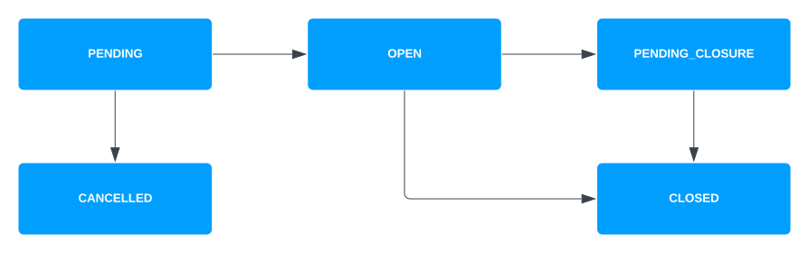

# Accounts version 1

lightbulb

This section refers to information about the Accounts version 1 API. To learn about the Accounts version 2 API (introduced in Vault Core 5), see [Accounts version 2](/vault-core/5-8/EN/reference/accounts/accounts_version_2).

## Managing Accounts

### Before you start

This section contains tutorials on how to perform some of the common tasks with Accounts. It includes example API requests and responses, and the Streaming events you can expect as a result of mutations.

chat\_bubble

These tutorials assume that you:

-   Are using `v1/accounts` and the associated [Account Events](/vault-core/5-8/EN/api/core_api#account_events) topics
    
-   Have uploaded a [Contracts Language V4](/vault-core/5-8/EN/reference/contracts/contracts_api_4xx/) Smart Contract containing `parameters` syntax
    
-   Have the customer ID of a customer with the status CUSTOMER\_STATUS\_ACTIVE to associate with the Account you want to create
    

### Creating an Account

#### Creating an Internal Account

Internal Accounts are always OPEN (and therefore cannot be CLOSED). To create an Internal Account via the legacy Core API, call [POST /v1/internal-accounts](/vault-core/5-8/EN/api/core_api#_core_api_v1_internal_accounts_InternalAccount_CreateInternalAccount).

##### Example create Internal Account request

##### Example create Internal Account response

##### Event streams

  
| Description | Event triggered | Streaming topic |
| --- | --- | --- |
| 
The Internal Account has been created.

 | 

[AccountEvent](/vault-core/5-8/EN/api/core_api#accountevent)(AccountCreatedEvent)

 | 

`vault.core_api.v1.accounts.account.events`

 |

#### Creating a Customer Account

You create a Customer Account by requesting a PENDING state. When creating an account in PENDING state, no Smart Contract code will be executed.

To create a Customer Account in `PENDING` status, call [POST /v1/accounts](/vault-core/5-8/EN/api/core_api#_core_api_v1_accounts_Account_CreateAccount), providing the:

-   `account.status` of `ACCOUNT_STATUS_PENDING`
    
-   `account.stakeholder_ids` of at least one customer using the account (with a status of `CUSTOMER_STATUS_ACTIVE`)
    
-   `account.product_id` or `account.product_version_id` of the Smart Contract backing this Account
    

You can also:

-   Provide the instance-level parameter name(s) and value(s) for the associated product via `account.instance_param_vals`
    
-   Add account-specific details via `account.details`
    

chat\_bubble

Permitted denominations for an account must be a subset of the product’s `supported_denominations`; this defaults to `supported_denominations` if not specified at creation.

##### Example create Customer Account request

The following example is a request to create a Customer Account (by setting it to PENDING status), backed by a product version "12345":

##### Example create Customer Account response

The response confirms the Account status transition to `ACCOUNT_STATUS_PENDING`:

#### Event streams

  
| Description | Event triggered | Streaming topic |
| --- | --- | --- |
| 
The Customer Account has been created in PENDING status.

 | 

[AccountEvent](/vault-core/5-8/EN/api/core_api#accountevent)(AccountCreatedEvent)

 | 

`vault.core_api.v1.accounts.account.events`

 |

chat\_bubble

-   For more information about Account statuses and lifecycles, see the [Account statuses](/vault-core/5-8/EN/reference/accounts/accounts_version_1#account_statuses) section.
    
-   For more field-level information about Accounts, see the Core API [Accounts version 1](/vault-core/5-8/EN/api/core_api#accounts_version_1) resource.
    

### Opening an Account

#### Opening a Customer Account created in Pending status

chat\_bubble

This tutorial assumes that you are aware of the [prerequisites](/vault-core/5-8/EN/reference/accounts/accounts_version_1#before_you_start).

To open a Customer Account you created in the `ACCOUNT_STATUS_PENDING` status, call [PUT /v1/accounts/{account.id}](/vault-core/5-8/EN/api/core_api#_core_api_v1_accounts_Account_UpdateAccount), providing the account.status of `ACCOUNT_STATUS_OPEN` and `status` as a value in `update_mask.paths[]`.

##### Example open pending Account request

##### Example open pending Account response

The response confirms the Account status transition to `ACCOUNT_STATUS_OPEN`, which starts the Account opening process.

chat\_bubble

Thought Machine recommends listening for the associated Core Streaming API events (such as AccountCreatedEvent) to confirm that the Account opening process is complete.

##### Event streams

  
| Description | Triggered event | Streaming topic |
| --- | --- | --- |
| 
The `activation_hook` has run, and the Account has been opened.

 | 

[AccountEvent](/vault-core/5-8/EN/api/core_api#accountevent) (AccountCreatedEvent)

 | 

`vault.core_api.v1.accounts.account.events`

 |
| 

Posting instruction directives have been committed (if any).

 | 

[PostingInstructionBatchCreatedEvent](/vault-core/5-8/EN/api/core_api#posting_events)

 | 

`vault.api.v1.postings.posting_instruction_batch.created`

 |
| 

The balance has been updated (if applicable).

 | 

Balance event ([AccountBalanceEvent](/vault-core/5-8/EN/api/core_api#accountbalanceevent))

As of Vault Core 5.7, you can receive streamed events whenever a Customer Account’s live value balance or booking balance changes, via [BalanceEvent](/vault-core/5-8/EN/api/core_api#balanceevent)

 | 

`vault.core_api.v1.balances.account_balance.events`, `vault.core_api.v2.balances.balance.events`

 |
| 

Contract notification directives have been processed (if any).

 | 

[ContractNotificationEvent](/vault-core/5-8/EN/api/core_api#contract_notification_events)

 | 

`vault.core_api.v1.contracts.contract_notification.events`

 |

chat\_bubble

-   For more information about Account statuses and lifecycles, see the [Account statuses](/vault-core/5-8/EN/reference/accounts/accounts_version_1#account_statuses) section.
    
-   For more field-level information about Accounts, see the Core API [Accounts version 1](/vault-core/5-8/EN/api/core_api#accounts_version_1) resource.
    

#### Opening a Customer Account on creation

chat\_bubble

This tutorial assumes that you are aware of the [prerequisites](/vault-core/5-8/EN/reference/accounts/accounts_version_1#before_you_start).

You can create and open a Customer Account in OPEN state. A request to transition the account into OPEN state will trigger the Smart Contract’s `activation_hook`.

To create and open an Account, call [POST /v1/accounts](/vault-core/5-8/EN/api/core_api#_core_api_v1_accounts_Account_CreateAccount), providing the:

-   `account.status` of `ACCOUNT_STATUS_OPEN`
    
-   `account.stakeholder_ids` of at least one customer using the account (with a status of `CUSTOMER_STATUS_ACTIVE`)
    
-   `account.product_version_id` (or `product_id`) of the Smart Contract backing this Account
    

You can also:

-   Backdate the opening of the Account using the `opening_timestamp`
    
-   Provide Instance Parameter names and values for the associated product (as defined in the Smart Contract code) in `instance_param_vals`
    
    chat\_bubble
    
    Any `default_value` of Instance Parameters specified in the Smart Contract is *not* used on Account creation requests; it is only used for Account conversions performed via v1/account-migrations.
    

##### Example open Account request

The following example is a request to backdate the opening of a Customer Account, backed by a Smart Contract version (`product_version_id`) "12345":

##### Example open Account response

The response confirms the Account status transition to `ACCOUNT_STATUS_OPEN`, which starts the Account opening process.

chat\_bubble

Thought Machine recommends listening for the associated Core Streaming API events (such as AccountCreatedEvent) to confirm that the Account opening process is complete.

##### Event streams

  
| Description | Triggered event | Streaming topic |
| --- | --- | --- |
| 
The `activation_hook` has run, and the Account has been opened.

 | 

[AccountEvent](/vault-core/5-8/EN/api/core_api#accountevent) (AccountCreatedEvent)

 | 

`vault.core_api.v1.accounts.account.events`

 |
| 

Posting instruction directives have been committed (if any).

 | 

[PostingInstructionBatchCreatedEvent](/vault-core/5-8/EN/api/core_api#posting_events)

 | 

`vault.api.v1.postings.posting_instruction_batch.created`

 |
| 

The balance has been updated (if applicable).

 | 

Balance event ([AccountBalanceEvent](/vault-core/5-8/EN/api/core_api#accountbalanceevent))

As of Vault Core 5.7, you can receive streamed events whenever a Customer Account’s live value balance or booking balance changes, via [BalanceEvent](/vault-core/5-8/EN/api/core_api#balanceevent)

 | 

`vault.core_api.v1.balances.account_balance.events`, `vault.core_api.v2.balances.balance.events`

 |
| 

Contract notification directives have been processed (if any).

 | 

[ContractNotificationEvent](/vault-core/5-8/EN/api/core_api#contract_notification_events)

 | 

`vault.core_api.v1.contracts.contract_notification.events`

 |

chat\_bubble

-   For more information about Account statuses and lifecycles, see the [Account statuses](/vault-core/5-8/EN/reference/accounts/accounts_version_1#account_statuses) section.
    
-   For more field-level information about Accounts, see the Core API [Accounts version 1](/vault-core/5-8/EN/api/core_api#accounts_version_1) resource.
    

### Retrieving an account’s balance

This process is detailed in the [Balances](/vault-core/5-8/EN/reference/balances#retrieving_balances) documentation.

### Updating Account stakeholders

To update the stakeholders (customers) associated with an Account, call [PUT v1/accounts/{account.id}](/vault-core/5-8/EN/api/core_api#_core_api_v1_accounts_Account_UpdateAccount), providing the:

-   Customer ID(s) in `account.stakeholder_ids[]`
    
-   `stakeholder_ids` as a value in `update_mask.paths[]`
    

#### Example Account stakeholder update request

The following example request adds a new stakeholder to an Account, adding to the original `ee48f1f0-d1de-4591-a4c1-4889be830dec` stakeholder:

#### Example Account stakeholder update response

The response confirms the addition of the new stakeholder `2413ab25-7c25-4ef6-8ab7-a07b2cd7a0ab`:

#### Event streams

  
| Description | Event triggered | Streaming topic |
| --- | --- | --- |
| 
The stakeholder IDs have been updated.

 | 

[AccountEvent](/vault-core/5-8/EN/api/core_api#account_events_v2_topic)(AccountUpdatedEvent)

 | 

`vault.core_api.v1.accounts.account.events`

 |

### Updating Account Instance Parameters

Update the Instance Parameter values applied to a Customer Account by calling [POST v1/account-updates](/vault-core/5-8/EN/api/core_api#_core_api_v1_accounts_AccountUpdate_CreateAccountUpdate), providing the new `instance_param_vals` to apply to the Account.

#### Example request to update Instance Parameters

#### Example response to update Instance Parameter request

#### Event streams

  
| Description | Event triggered | Streaming topic |
| --- | --- | --- |
| 
The Account update has been created, and is in progress.

 | 

[AccountUpdateEvent](/vault-core/5-8/EN/api/core_api#accountupdateevent)(AccountUpdateCreatedEvent)

 | 

`vault.core_api.v1.accounts.account_update.events`

 |
| 

The Account update has been updated - this is likely a status change; for example to ACCOUNT\_UPDATE\_STATUS\_COMPLETED.

 | 

[AccountUpdateEvent](/vault-core/5-8/EN/api/core_api#accountupdateevent)(AccountUpdateUpdatedEvent)

 | 

`vault.core_api.v1.accounts.account_update.events`

 |
| 

The Account’s instance parameter values have been updated.

 | 

[AccountEvent](/vault-core/5-8/EN/api/core_api#accountevent)(AccountUpdatedEvent)

 | 

`vault.core_api.v1.accounts.account.events`

 |

### Using Restrictions and Flags

You can drive customer Account behaviour with Restrictions and Flags.

#### Restrictions

Restriction Sets and the status of the account can be used to control or limit the behaviour of the account to enforce operational controls.

You can use Restrictions to prevent actions; for example:

-   A customer with the restriction `RESTRICTION_TYPE_PREVENT_ACCOUNT_CREATION` cannot apply for any account and cannot be added as a new stakeholder when an account is updated. They can, however, still be removed from a stakeholder list.
    
-   An account with the restriction `RESTRICTION_TYPE_PREVENT_UPDATES` prevents account updates via `PUT /v1/accounts/{account.id}` or `PUT /v2/accounts/{account.id}`; it does not prevent account updates via `POST /v1/account-updates`.
    
-   A customer with the restriction PREVENT\_DEBITS.
    

Combining these and other restrictions into a restriction set lets the interactions between accounts and customers be customised.

For more information, see the Core API [Restrictions](/vault-core/5-8/EN/api/core_api#restrictions) resource.

#### Flags

Flags are binary markers that can be used to store information about an account or a customer. Flags can be [accessed](/vault-core/5-8/EN/reference/contracts/contracts_api_4xx/smart_contracts_api_reference4xx/vault#get_flags_timeseries) from Smart Contracts, where they can be used to modify product behaviour.

For more information, see the Core API [Flags](/vault-core/5-8/EN/api/core_api#flags) resource and the [Flags](/vault-core/5-8/EN/reference/flags) reference section.

### Account conversions

Account conversions (formerly known as Account migrations) involve changing the Smart Contract version (product version) backing one or more Customer Accounts.

warning

-   Converting a v1 Customer Account to a new product version will mean that the Account can only retrieve the Template Parameter history of the *new* product version.
    
-   Ensure that any active conversion has finished before attempting another. Do not attempt to run two concurrent conversions from the same Accounts or Plans; for example Smart Contract version X to Y, and concurrently X to Z. This is because there are various race conditions that can affect the final state of the conversion.
    

You can convert either:

-   [A single Account from one product version to another](/vault-core/5-8/EN/reference/accounts/accounts_version_1#converting_a_single_account_to_a_new_product_version); or
    
-   [Accounts from multiple product versions to a single destination product version](/vault-core/5-8/EN/reference/accounts/accounts_version_1#converting_multiple_accounts_to_a_new_product_version); or
    
-   [Accounts from any specified product version to any other destination product version](/vault-core/5-8/EN/reference/accounts/accounts_version_1#converting_multiple_accounts_to_multiple_new_product_versions)
    

#### Converting a single Account to a new product version

To convert one Customer Account to a new product version, call [POST /v1/account-updates](/vault-core/5-8/EN/api/core_api#_core_api_v1_accounts_AccountUpdate_CreateAccountUpdate), providing the:

-   `account_id` of the Account you want to convert
    
-   `product_version_id` of the product version you want to convert the account over to
    
-   Strategy for how existing schedules should be migrated in `schedule_migration_type`
    

warning

-   Product version account updates via v1/account-updates are non-atomic.
    
-   Any `default_value` for Instance Parameters specified in the Smart Contract will only be used in Account conversions performed via [POST /v1/account-migrations](/vault-core/5-8/EN/api/core_api#_core_api_v1_accounts_AccountMigration_CreateAccountMigration)
    

##### Example single Account conversion request

##### Example response to single Account conversion request

During a product version update, if the account has `PENDING` status:

-   The schedules defined in the Smart Contract are not created until the account status is updated to `OPEN`
    
-   The `conversion_hook` is not called
    
-   The `post_parameter_change` hook is not called, even if the Smart Contract introduces new parameters
    

chat\_bubble

Unlike Vault Core 4, if a product version account update from a product version on Contracts Language API Version 3 (CLv3) to a product version on Contracts Language API Version 4 (CLv4) is unsuccessful, the account will remain on CLv3. A subsequent CLv3 to CLv4 product version account update must be created successfully to define schedules, and move the account to CLv4.

##### Event streams

  
| Description | Event triggered | Streaming topic |
| --- | --- | --- |
| 
The Account update has been created, and is in progress.

 | 

[AccountUpdateEvent](/vault-core/5-8/EN/api/core_api#accountupdateevent)(AccountUpdateCreatedEvent)

 | 

`vault.core_api.v1.accounts.account_update.events`

 |
| 

The Account update has been updated - this is likely a status change; for example to ACCOUNT\_UPDATE\_STATUS\_COMPLETED.

 | 

[AccountUpdateEvent](/vault-core/5-8/EN/api/core_api#accountupdateevent)(AccountUpdateUpdatedEvent)

 | 

`vault.core_api.v1.accounts.account_update.events`

 |
| 

The Account has been updated.

 | 

[AccountEvent](/vault-core/5-8/EN/api/core_api#accountevent)(AccountUpdatedEvent)

 | 

`vault.core_api.v1.accounts.account.events`

 |

chat\_bubble

Depending on the behaviour of the new product version, there may be other event streams (such as Account [Balance events](/vault-core/5-8/EN/api/core_api#balance_events))

#### Converting multiple Accounts to a new product version

To convert several Customer Accounts to a new product version, call [POST v1/account-migrations](/vault-core/5-8/EN/api/core_api#_core_api_v1_accounts_AccountMigration_CreateAccountMigration), providing the:

-   Product version ID(s) that you want to convert Accounts from in `from_product_version_ids`
    
-   The destination product version ID for these Accounts in `to_product_version_id`
    

##### Example create Account conversion request

The following example is a request to convert Customer Accounts from product versions "ExampleCurrentAccount1" and "ExampleCurrentAccount2" to "ExampleCurrentAccount3":

##### Example create Account conversion response

The response confirms the initial status of "ACCOUNT\_MIGRATION\_STATUS\_PENDING\_EXECUTION":

Vault Core then performs the Account conversions in batches, with each conversion having one or more associated account update batches. An Account conversion will have the status `ACCOUNT_MIGRATION_STATUS_COMPLETED` when all associated account update batches have the status `ACCOUNT_UPDATE_BATCH_STATUS_COMPLETED`.

An Account update batch will have the status `ACCOUNT_UPDATE_BATCH_STATUS_COMPLETED` when all the associated Account updates in the batch have the status `ACCOUNT_UPDATE_STATUS_COMPLETED`, `ACCOUNT_UPDATE_STATUS_ERRORED` or `ACCOUNT_UPDATE_STATUS_REJECTED` where [invalid\_account\_update\_handling\_type](/vault-core/5-8/EN/api/core_api#accountupdatebatch) is set to one of `INVALID_ACCOUNT_UPDATE_HANDLING_TYPE_FAIL_INVALID_UPDATES_ONLY` or `INVALID_ACCOUNT_UPDATE_HANDLING_TYPE_IGNORE_INVALID_UPDATES`.

chat\_bubble

If `invalid_account_update_handling_type` is set to `INVALID_ACCOUNT_UPDATE_HANDLING_TYPE_FAIL_BATCH` on the original API call, and one of the account updates is invalid, then an error is raised and the account update batch will not get created.

Depending on the value of `invalid_account_update_handling_type` provided, an account update batch can complete without all the constituent account updates being processed successfully.

You can call:

-   [GET /v1/account-migrations](/vault-core/5-8/EN/api/core_api#_core_api_v1_accounts_ListAccountMigrationsResponse_ListAccountMigrations) to check the status of the conversions
    
-   [GET v1/account-update-batches](/vault-core/5-8/EN/api/core_api#_core_api_v1_accounts_ListAccountUpdateBatchesResponse_ListAccountUpdateBatches) endpoint using the `account_migration_ids` to retrieve the associated account update batches
    
-   [account update](/vault-core/5-8/EN/api/core_api#accountupdate) to iterate through each account update in the associated account update batch to check whether or not the product version account update was successfully executed for each account
    

##### Event streams

  
| Description | Event triggered | Streaming topic |
| --- | --- | --- |
| 
The Account update batch has been created in `PENDING_EXECUTION` status.

 | 

[AccountUpdateBatchEvent](/vault-core/5-8/EN/api/core_api#accountupdatebatchevent)(AccountUpdateBatchCreatedEvent)

 | 

`vault.core_api.v1.accounts.account_update_batch.events`

 |
| 

The Account update batch status has been updated.

 | 

[AccountUpdateBatchEvent](/vault-core/5-8/EN/api/core_api#accountupdatebatchevent)(AccountUpdateBatchUpdatedEvent)

 | 

`vault.core_api.v1.accounts.account_update_batch.events`

 |
| 

For each Account, the Account update has been created, and is in progress.

 | 

[AccountUpdateEvent](/vault-core/5-8/EN/api/core_api#accountupdateevent)(AccountUpdateCreatedEvent)

 | 

`vault.core_api.v1.accounts.account_update.events`

 |
| 

For each Account, the Account update has been updated - this is likely a status change; for example to ACCOUNT\_UPDATE\_STATUS\_COMPLETED.

 | 

[AccountUpdateEvent](/vault-core/5-8/EN/api/core_api#accountupdateevent)(AccountUpdateUpdatedEvent)

 | 

`vault.core_api.v1.accounts.account_update.events`

 |
| 

For each Account, the Account has been updated.

 | 

[AccountEvent](/vault-core/5-8/EN/api/core_api#accountevent)(AccountUpdatedEvent)

 | 

`vault.core_api.v1.accounts.account.events`

 |

chat\_bubble

Depending on the behaviour of the new product version, there may be other event streams (such as Account [Balance events](/vault-core/5-8/EN/api/core_api#balance_events))

#### Converting multiple Accounts to multiple new product versions

For more granular orchestrations converting multiple Customer Accounts to multiple product versions, the process is as follows:

1.  Retrieve the first page of the list of Accounts to be converted.
    
2.  If there are any Accounts to convert, call [POST v1/account-update-batches](/vault-core/5-8/EN/api/core_api#_core_api_v1_accounts_AccountUpdateBatch_CreateAccountUpdateBatch) to queue multiple [Account conversion](/vault-core/5-8/EN/reference/accounts/accounts_version_1#converting_a_single_account_to_a_new_product_version) requests
    
    chat\_bubble
    
    Each account update in the account update batch must be associated with an account ID. To construct each batch, callers should iterate through the list of retrieved accounts and assign each account ID to one account update batch.
    
3.  Wait for the account update batches to complete. You can listen to the [AccountUpdateBatchEvent](/vault-core/5-8/EN/api/core_api#accountupdatebatchevent) stream or call [GET v1/account-update-batches](/vault-core/5-8/EN/api/core_api#_core_api_v1_accounts_ListAccountUpdateBatchesResponse_ListAccountUpdateBatches) to check the status of Account update batches.
    
4.  Repeat step 1.
    

lightbulb

-   Waiting and repeatedly checking the first page of the list of accounts ensures all results are captured as the accounts are converted
    
-   To retrieve all of the accounts associated with a given product version ID, use the Core API GET v1/accounts endpoint with the product\_version\_ids filter applied
    

An account update batch will have the status `ACCOUNT_UPDATE_BATCH_COMPLETED` when all the associated account updates in the batch have the status `ACCOUNT_UPDATE_STATUS_COMPLETED`, `ACCOUNT_UPDATE_STATUS_ERRORED` or `ACCOUNT_UPDATE_STATUS_REJECTED`. Callers can iterate through each [account update](/vault-core/5-8/EN/api/core_api#accountupdate) in the retrieved account update batches to check whether or not the product version update was executed successfully for each account.

For each of the account updates in the account update batch, the:

-   `product_version_id` field must be populated with one destination product version ID
    
-   product version ID specified in `product_version_id` must exist
    
-   product version ID specified in `product_version_id` must match the `current_version_id` of its associated product
    

chat\_bubble

Accounts can be converted from a product version that is not of the same product class as the destination product version.

#### Converting accounts associated with plans

If any accounts being converted are associated with a [Plan](/vault-core/5-8/EN/reference/plans), the plan may need to be converted too. This process is detailed in the [Converting accounts associated with plans](/vault-core/5-8/EN/reference/plans#converting_accounts_associated_with_plans) section of the Plans documentation.

#### Behaviour of Instance Parameter values

When an account is converted from one original product version to a destination product version, the Instance Parameter values are processed. If the destination Instance Parameter is:

-   Not optional and has a value in the original account, the original Instance Parameter will be used
    
-   Not optional and does not have a value in the original product version, the default value from the product’s Smart Contract code will be used
    
-   Optional, it will be populated with an empty value
    

chat\_bubble

Product version parameters are not affected during an account conversion. Converting an account to a new product version will mean that the account can only retrieve the product version parameter history of the new product version.

### Closing an Account

To close a Customer Account, call [POST /v1/accounts/{account.id}](/vault-core/5-8/EN/api/core_api#_core_api_v1_accounts_Account_UpdateAccount), providing the:

-   `account_id` of the Account to close
    
-   `status` of `ACCOUNT_STATUS_PENDING_CLOSURE`
    
-   `status` as a value in `update_mask.paths`
    

#### Example Account closure request

#### Example response to Account closure request

The response confirms the intent to close the Account:

This account update executes the `deactivation_hook` of the Smart Contract that is powering the account. When the `closure_update` for the account has the status `ACCOUNT_UPDATE_STATUS_COMPLETED`, you can send another API call to set the status to `ACCOUNT_STATUS_CLOSED`.

When the status is updated to `ACCOUNT_STATUS_CLOSED`, Schedules are disabled. No account updates are queued and no Smart Contract hooks are executed. This is an end status and cannot be updated.

#### Event streams

  
| Description | Event triggered | Streaming topic |
| --- | --- | --- |
| 
The Customer Account has been updated to in PENDING\_CLOSURE status.

 | 

[AccountEvent](/vault-core/5-8/EN/api/core_api#accountevent)(AccountUpdatedEvent)

 | 

`vault.core_api.v1.accounts.account.events`

 |
| 

If a subsequent API call has been made to request a CLOSED status, this confirms that the Customer Account status has been updated to CLOSED.

 | 

[AccountEvent](/vault-core/5-8/EN/api/core_api#accountevent)(AccountUpdatedEvent)

 | 

`vault.core_api.v1.accounts.account.events`

 |

chat\_bubble

-   For more information about Account statuses and lifecycles, see the [Account statuses](/vault-core/5-8/EN/reference/accounts/accounts_version_1#account_statuses) section.
    
-   For more field-level information about Accounts, see the Core API [Accounts version 1](/vault-core/5-8/EN/api/core_api#accounts_version_1) resource.
    

## Account statuses

chat\_bubble

This section refers to information about the Accounts version 1 API. To learn about the Accounts version 2 API (introduced in Vault Core 5), see [Accounts version 2](/vault-core/5-8/EN/reference/accounts/accounts_version_2).

Account statuses play a key role in determining what operations can or cannot be performed on behalf of a Customer Account.

lightbulb

Internal Accounts do not have a lifecycle like Customer Accounts; they are always in the OPEN status, they cannot be updated to the CLOSED status, and are essentially destinations for the institution’s funds.

### Account lifecycle statuses

The following diagram illustrates the account status lifecycle, where arrows indicate the permitted direction of transitions. The prefix `ACCOUNT_STATUS_`…has been omitted for brevity:

chat\_bubble

The `OPEN` > `CLOSED` pathway can be used if the account can be immediately closed (it meets the criteria required by [ACCOUNT\_STATUS\_CLOSED](/vault-core/5-8/EN/reference/accounts/accounts_version_1#account_status_closed)); however we recommend updating from `OPEN` > `PENDING_CLOSURE`, because this allows certain activities to continue on the account, such as Postings.

### Account status descriptions

#### ACCOUNT\_STATUS\_PENDING

Accounts created via the Core API POST [v1/accounts](/vault-core/5-8/EN/api/core_api#account) endpoint default to the `ACCOUNT_STATUS_PENDING` status. From this status, an account status can either be updated to `ACCOUNT_STATUS_OPEN` or `ACCOUNT_STATUS_CANCELLED`.

#### ACCOUNT\_STATUS\_CANCELLED

To transition to `ACCOUNT_STATUS_CANCELLED`, the:

-   Account must have the status `ACCOUNT_STATUS_PENDING`
    
-   Account must not have the [account restriction](/vault-core/5-8/EN/api/core_api#restriction) `RESTRICTION_TYPE_PREVENT_CLOSURE` applied
    

When the status is updated, no account updates are queued and no Smart Contract hooks are executed. This is an end status and cannot be updated.

#### ACCOUNT\_STATUS\_OPEN

Accounts created via the Core API POST [v1/accounts](/vault-core/5-8/EN/api/core_api#account) endpoint can be created with the `ACCOUNT_STATUS_OPEN` status. To transition to `ACCOUNT_STATUS_OPEN`, the:

-   Account must have the status `ACCOUNT_STATUS_PENDING`
    
-   Account must not have the [account restriction](/vault-core/5-8/EN/api/core_api#restriction) `RESTRICTION_TYPE_PREVENT_OPENING` applied
    

When the status is updated, an activation account update is automatically queued. This executes the `activation_hook` of the Smart Contract code that is powering the account and sets up Schedules. From this status, an account status can be updated to `ACCOUNT_STATUS_PENDING_CLOSURE` or `ACCOUNT_STATUS_CLOSED`.

#### ACCOUNT\_STATUS\_PENDING\_CLOSURE

To transition to `ACCOUNT_STATUS_PENDING_CLOSURE`, the:

-   Account must have the status `ACCOUNT_STATUS_OPEN`
    
-   Account must not have the [account restriction](/vault-core/5-8/EN/api/core_api#restriction) `RESTRICTION_TYPE_PREVENT_CLOSURE` applied
    

error

You cannot change an account’s status from ACCOUNT\_STATUS\_PENDING\_CLOSURE to ACCOUNT\_STATUS\_OPEN. You should therefore only switch an account to ACCOUNT\_STATUS\_PENDING\_CLOSURE when you are ready to close the account.

When the status is updated, a closure account update is automatically queued. This executes the `deactivation_hook` of the Smart Contract code that is powering the account. From this status, an account status can only be updated to `ACCOUNT_STATUS_CLOSED`.

#### ACCOUNT\_STATUS\_CLOSED

To transition to `ACCOUNT_STATUS_CLOSED`, the Account must have the status `ACCOUNT_STATUS_PENDING_CLOSURE` or `ACCOUNT_STATUS_OPEN`.

For `ACCOUNT_STATUS_PENDING_CLOSURE`, the:

-   Account must not have the [account restriction](/vault-core/5-8/EN/api/core_api#restriction) `RESTRICTION_TYPE_PREVENT_CLOSURE` applied
    
-   Closure account update for the account must have the status `ACCOUNT_UPDATE_STATUS_COMPLETED`
    
-   Account balance (including all accepted future-dated postings) must be zero
    

For `ACCOUNT_STATUS_OPEN`, the:

-   Account must not have the [account restriction](/vault-core/5-8/EN/api/core_api#restriction) `RESTRICTION_TYPE_PREVENT_CLOSURE` applied
    
-   Account balance (including all accepted future-dated postings) must be zero
    

When the status is updated to `ACCOUNT_STATUS_CLOSED`, Schedules are disabled. No account updates are queued and no Smart Contract hooks are executed. This is an end status and cannot be updated.

### Permitted operations

The following table provides a summary of the operations that are permitted for accounts for each status.

chat\_bubble

The `ACCOUNT_STATUS_` prefix has been removed for brevity.

    
| *Operation* | PENDING | OPEN | PENDING\_CLOSURE | CANCELLED/CLOSED |
| --- | --- | --- | --- | --- |
| 
Instance param vals (account update)

 | 

Yes

 | 

Yes

 | 

Yes

 | 

No

 |
| 

Product version (account update)

 | 

Yes

 | 

Yes

 | 

Yes

 | 

No

 |
| 

Closure update (account update)

 | 

No

 | 

No

 | 

Yes

(Use the [POST v1/account-updates](/vault-core/5-8/EN/api/core_api#_core_api_v1_accounts_AccountUpdate_CreateAccountUpdate) endpoint)

 | 

No

 |
| 

Stakeholder update

 | 

Yes

 | 

Yes

 | 

No

 | 

No

 |
| 

Postings

 | 

No

 | 

Yes

 | 

Yes

 | 

No

 |