# Adjustments

## What are Adjustments?

chat\_bubble

-   The Adjustments feature is only available as an Extension. Contact your Thought Machine representative for more information.
    
-   This section assumes that you are familiar with several key Vault Core concepts, such as [Postings](/vault-core/5-8/EN/reference/postings), [Balances](/vault-core/5-8/EN/reference/balances), [Parameters](/vault-core/5-8/EN/reference/parameters), and [Flags](/vault-core/5-8/EN/reference/flags).
    

### Purpose of Adjustments

Adjustments retroactively correct an Account’s balances in response to backdated events.

For example, a payment processing delay causes a credit to be backdated, which leads to a growing discrepancy between the interest that *was* accrued, and the interest that *should have been* accrued:

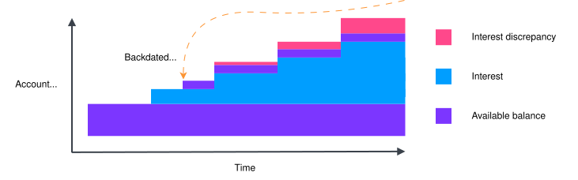

With Adjustments, Vault Core can detect and calculate the discrepancy, applying postings to correct the Account’s balance position.

### Conceptual model

Backdated events expose an alternative sequence of events, ordered by their effective time (when they should have occurred) rather than their insertion time (when they originally occurred). In this alternative sequence, events may observe different data compared to their original handling, which can result in different outcomes.

In the following example, if B was an interest accrual, and C was a posting, then B may have acted differently if it had knowledge of C at the time:

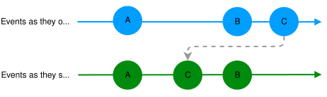

Therefore, any retroactively corrected sequence of events can lead to an Account’s balances also requiring correction.

## How Adjustments work

### How the Adjustment process is invoked

The Adjustment process is invoked at recurring points in time known as [Adjustment points](/vault-core/5-8/EN/reference/adjustments#adjustment_points).

To create Adjustment points, you declare Smart Contract schedules ([SmartContractEventType](/vault-core/5-8/EN/reference/contracts/contracts_api_4xx/common_types_4xx/classes#smartcontracteventtype)) as Adjustment-enabled, as described in the [Enabling Adjustments](/vault-core/5-8/EN/reference/adjustments#step_1_set_up_the_smart_contract) section.

The Adjustment process then begins on each Customer Account whenever these Adjustment points are reached.

### Overview of the Adjustment process

Once the Adjustment process is invoked, it involves three stages:

1.  [Detect](/vault-core/5-8/EN/reference/adjustments#adjustment_detection): Vault Core scans for any backdated events which could affect historic decisions made by the Account’s Smart Contract. If no events are detected, the process completes here.
    
    lightbulb
    
    Vault Core optimises the detection process to avoid too many false positives.
    
2.  [Compute](/vault-core/5-8/EN/reference/adjustments#adjustment_computation): Vault Core computes any impact on the Account’s balances, calculating the difference between the current balance time series and the adjusted balance time series. If there is no impact on balances, the process completes here.
    
3.  [Correct](/vault-core/5-8/EN/reference/adjustments#adjustment_correction): Vault Core applies a correction posting to each affected Adjustment point, correcting the Account’s balance position at these points.
    

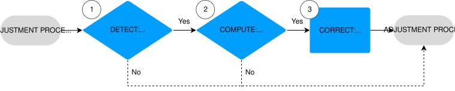

Once the Adjustment process is complete, the scheduled hook for the event is then invoked, acting upon the adjusted state of the account.

### Adjustment points

Adjustment points are scheduled points in time which trigger the Adjustment process, and are also the points at which the targeted Customer Account’s balance is corrected.

For example, the following product has a daily interest accrual schedule (which is not Adjustment-enabled) and a monthly interest application schedule (which is Adjustment-enabled).

In this example, a posting event is received within February (the current month) but valued one month earlier, in January. This invalidates:

-   All daily interest accruals from the value time onwards; and
    
-   The interest payout at the January Adjustment point
    

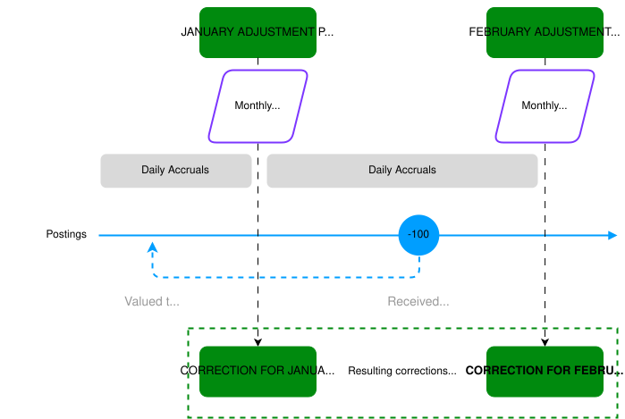

At the February Adjustment point, Vault Core detects the backdated posting and:

1.  Calculates the desired interest accrual and application amounts over the affected period as a result of the backdated posting.
    
2.  Applies a correction posting to correct the balance position at both Adjustment points.
    
3.  Runs the interest application schedule at the February Adjustment point.
    

This allows the product to correct all accruals and applications that should have been aware of the backdated event, but would not have been aware of it at the time.

### Adjustment detection

Upon reaching an Adjustment point, Vault Core queries for any of the following events that affected the Customer Account since the previous Adjustment:

-   Any inserted *Posting Instruction Batch* with a `value_timestamp` set to a point before any [supported Smart Contract hook](/vault-core/5-8/EN/reference/adjustments#supported_hooks) executions took place
    
-   Any inserted *Flag* with an `effective_timestamp` set to a point before any [supported Smart Contract hook](/vault-core/5-8/EN/reference/adjustments#supported_hooks) executions took place
    
-   Any inserted Core API *Parameter value* with an `effective_from_timestamp` that was backdated, irrespective of Smart Contract hook executions
    

If at least one of these events is detected, an Adjustment computation runs.

### Adjustment computation

#### Setting the Adjustment timeline

When any events requiring Adjustment computation are detected, Vault Core sets:

-   The beginning of the Adjustment timeline (`timeline_start_timestamp`), using the event with the earliest value/effective timestamp
    
-   The end of the Adjustment timeline (`timeline_end_timestamp`) to match the triggering schedule’s effective time
    

chat\_bubble

If no events are detected, then Vault Core sets the `timeline_start_timestamp` to "null", but still sets the `timeline_end_timestamp` to match the triggering schedule’s effective time.

In the following example, three backdated events were detected, the earliest of which is a posting’s `value_timestamp`:

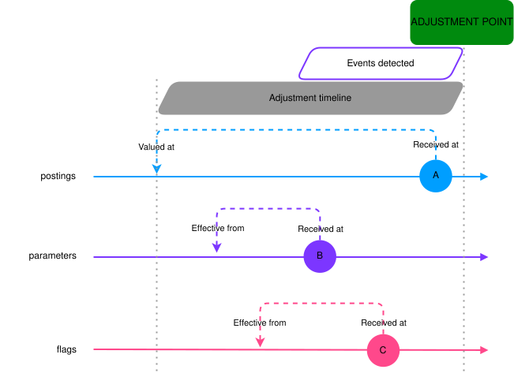

In this example, Vault Core uses the posting (A) to set the beginning of the Adjustment timeline, because it is the earliest event (by value/effective time) which affects Adjustment computations.

#### Rerunning hooks

With the new timeline of events, Vault Core simulates each Smart Contract hook execution (including any previously ran Adjustment schedule hooks) and hook results.

#### Adjustment timelines spanning previously made Adjustments

A detected backdate can cross the boundaries of previously made Adjustments, as shown in the following example:

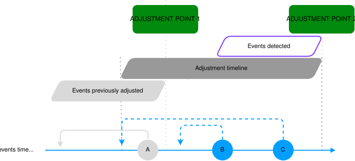

In this example, event A led to an Adjustment correction at the previous Adjustment point 1, and event C has since been backdated to before this point. When an Adjustment is triggered at Adjustment point 2, Vault Core will recalculate the new chain of events (A > C > B), running the schedule at Adjustment point 1 again.

#### Events during the Adjustment computation time

When the current Adjustment point is reached (after the `timeline_end_timestamp`) and an Adjustment computation runs, any subsequent events inserted and/or backdated will not be factored into this computation (since it cannot yet see them), and will instead be picked up at the next Adjustment point. This is represented in the following diagram by events B and C:

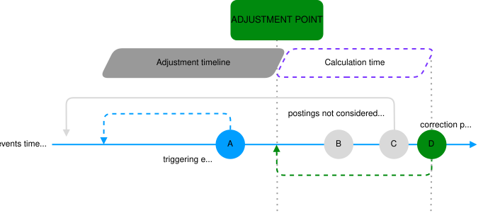

### Adjustment correction

The completed Adjustment computation provides the Account’s desired balance time series. Vault Core then compares the delta between the current balance state and the adjusted balance state at each Adjustment point, then applies correction Postings to correct the Account’s balance position at each affected Adjustment point:

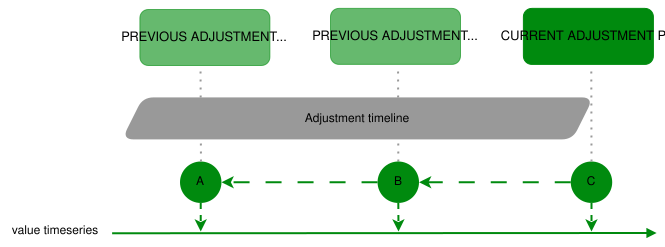

Vault Core will then run the schedule at the current Adjustment point.

warning

**Adjustments correct only the balance position, and only at Adjustment points**. There are a number of important considerations as a result of this. For more information, see [Adjustment correction constraints](/vault-core/5-8/EN/reference/adjustments#adjustment_correction_constraints).

## Hook behaviour in Adjustment computations

### Supported hooks

Vault Core can use the following hooks in Adjustments:

 
| Hook | Use in Adjustments |
| --- | --- |
| 
`post_posting_hook`

 | 

Reruns the original `post_posting_hook` executions, and includes the detected backdates.

 |
| 

`post_posting_adjustment_hook`

 | 

Overrides the Business As Usual (BAU) logic on the `post_posting_hook` executions. Optional.

 |
| 

`post_parameter_change_hook`

 | 

Reruns the original `post_parameter_change_hook` executions, and adds new hook executions for any detected Parameter value backdates, because these hooks would not have run at the time.

 |
| 

`post_parameter_change_adjustment_hook`

 | 

Overrides the Business As Usual (BAU) logic on the `post_parameter_change_hook` executions. Optional.

 |
| 

`scheduled_event_hook`

 | 

Reruns the original `scheduled_event_hook` executions, and includes the detected backdates.

 |
| 

`scheduled_event_adjustment_hook`

 | 

Overrides the Business As Usual (BAU) logic on the `scheduled_event_hook` executions. Optional.

 |

Adjustment hooks should not define their own decorators; these will be inherited from the corresponding BAU hook.

### The Adjustment hook arguments

By default, the Adjustment computation reruns the regular hooks using data fetches with a snapshot set to the end of the Adjustment timeline. This snapshot is known as the *adjusted vault*.

You can optionally use the Adjustment hooks (the `…adjustment_hook` variants) to override the logic applied to the original hook execution; for example to implement rules which favour the customer when reasoning about interest computations.

These Adjustment hooks return both `snapshot_vault` and `adjusted_vault` arguments:

 
| Hook argument | Description |
| --- | --- |
| 
`snapshot_vault`

 | 

Contains the state of Vault Core as it was when the hook was originally executed.

The snapshot on this data is set as close as possible to each original hook’s execution time.

 |
| 

`adjusted_vault`

 | 

Contains the state of Vault Core as it is proposed when the hook is executed during the Adjustment run.

The snapshot on this data is set to the end of the Adjustment timeline (the Adjustment’s `timeline_end_timestamp`), allowing it to include backdates. The data also includes any changes to previous hook outcomes calculated as part of the Adjustment.

 |

### Example use of Adjustment hook arguments

The following is an example of how a defined `scheduled_event_adjustment_hook` can be used to provide rules which favour the customer on interest accruals:

### Data returned by snapshot\_vault

When evaluating Adjustment hook executions, Vault Core determines the data that would have been fetched by the original hook executions.

 
| Hook | Data fetched based on |
| --- | --- |
| 
`post_posting_hook`

 | 

The Posting Instruction Batch (PIB) `insertion_timestamp`.

 |
| 

`post_parameter_change_hook`

 | 

Either the `effective_from_timestamp` of the Parameter value, or the time at which a Customer Account’s association with a node in the Parameter Value Hierarchy changed.

 |
| 

`scheduled_event_hook`

 | 

Either the schedule job’s `schedule_timestamp` or the `minimum_observation_timestamp` set via a Schedule Group or Processing Group, whichever is higher.

 |

## Sequence of events in Adjustment computations

When Vault Core runs an Adjustment computation, it constructs the alternate sequence of events, consisting of:

-   *Original* events that occurred between the start and end of the Adjustment timeline
    
-   *Additional* events that have been backdated into the Adjustment timeline (both events which triggered the current Adjustment, and previously backdated events)
    

The sequence of events is ordered according to the **Ordered By** column in the following table. The corresponding hook executions, if applicable, will have an effective time matching the **Hook Effective Time** column:

  
| Event | Ordered by | Hook effective time |
| --- | --- | --- |
| 
Flag

 | 

`effective_timestamp`

 | 

N/A

 |
| 

Parameter value

 | 

`effective_from_timestamp`

 | 

`effective_from_timestamp`

 |
| 

Posting Instruction Batch

 | 

`value_timestamp`

 | 

`value_timestamp`

 |
| 

Schedule job

 | 

The highest of the job’s `schedule_timestamp` or the `minimum_observation_timestamp` set via a Schedule Group or Processing Group

 | 

`schedule_timestamp`

 |

## Enabling Adjustments

### Before you start

These tutorials assume that you are:

-   Aware that Adjustments are not compatible with High-volume Accounts or Supervisor Contracts
    
-   Aware of the additional [Constraints when using Adjustments](/vault-core/5-8/EN/reference/adjustments#constraints_when_using_adjustments)
    
-   Using v2/accounts and the associated `vault.core_api.v2.accounts.account.events` topic (whether you have integrated anew with these, or have completed [switching from v1 to v2 Accounts API](/vault-core/5-8/EN/reference/accounts/switching_from_v1_to_v2_accounts_api))
    
-   Using Contracts Language version 4 (CLv4) Smart Contracts
    
-   Only using Core API [Parameters](/vault-core/5-8/EN/reference/parameters) and the accompanying `expected_parameters` syntax in your Smart Contract
    
    chat\_bubble
    
    Legacy INSTANCE, TEMPLATE or GLOBAL Parameters do not work with Adjustments.
    

### Step 1 - Set up the Smart Contract

1.  Enable Adjustments in the Smart Contract:
    
2.  Create Adjustment points:
    
3.  If you require Adjustment-specific logic to override the behaviour of the BAU hooks, add the adjustment hooks:
    

chat\_bubble

For more complete examples, see the [Latest Product Library release package](/vault-core/5-8/EN/product_library/release_information/downloads).

### Step 2 - Convert Accounts over to the Smart Contract version

Call [PUT /v2/accounts/{account.id}](/vault-core/5-8/EN/api/core_api#_core_api_v2_accounts_Account_UpdateAccount) to convert your Customer Accounts to the new Smart Contract version. From this point forwards, the initial Adjustment timeline will begin when the first Adjustment is triggered.

### Examples of Adjustment-enabled products

The following examples illustrate how a simple interest-bearing product can be made adjustable, with and without Adjustment-specific logic. The Smart Contracts are also included in the examples folder of the latest [Product Library release](/vault-core/latest-5-x/EN/product_library/release_information/downloads) and ship with end-to-end tests. This allows you to run the tests and observe the behaviours and REST/Streaming API resources in your own testing environments.

#### Example 1: Interest-bearing without Adjustment-specific logic

This example has enabled Adjustments for the product by setting the `adjustment_strategy` metadata and making the interest accrual event type an Adjustment point. The event type’s schedule is configured to run daily at midnight, so Vault Core will check if an Adjustment is required daily at midnight, prior to that day’s interest accrual running:

Example 1 Smart Contract

#### Example 2: Interest-bearing with Adjustment-specific logic

This example ensures that customers are never disadvantaged in the event of a backdated decrease to their interest rate.

This is achieved by implementing the `scheduled_event_adjustment_hook`, and using the `snapshot_vault` and `adjusted_vault` hook arguments. As a reminder, `snapshot_vault` will *exclude* backdates while `adjusted_vault` will *include* them, so the Smart Contract can extract the interest parameter value from each and use the highest of the two. This is done inside `get_maximum_yearly_rate()`:

Example 2 Smart Contract

## Testing Adjustments

chat\_bubble

Adjustments reuse existing [Smart Contract testing](/vault-core/5-8/EN/reference/contracts/contracts_api_4xx/development_and_testing) approaches, with the exception of Simulation, which is not currently supported.

### Tooling

The latest [Product Library release](/vault-core/latest-5-x/EN/product_library/release_information/downloads) includes Inception SDK enhancements to facilitate Adjustments testing, such as dedicated helpers to interact with REST and Streaming APIs, and example end-to-end tests to demonstrate their intended use.

### Unit testing

Unit tests focus on the behaviour of individual hooks, which allow you to test:

-   *Regular hooks*: For testing the impact of presenting the hook with additional data, as could be the case in an Adjustment.
    
-   *Adjustment hooks*: For testing adjustment-specific logic that relies on data from both `snapshot_vault` and `adjusted_vault` arguments.
    

As `vault`, `snapshot_vault` and `adjusted_vault` are all instances of the [Vault object](/vault-core/5-8/EN/reference/contracts/contracts_api_4xx/smart_contracts_api_reference4xx/vault) class, there are no special helpers for unit testing Adjustment scenarios. Instead you need to consider what data should be available and where. For example, if you are testing the `scheduled_event_adjustment_hook` in a scenario where there is a backdated inbound hard settlement to the account, you would mock:

-   `snapshot_vault` to *exclude* the inbound hard settlement from posting and balance fetchers
    
-   `adjusted_vault` to *include* the inbound hard settlement in posting and balance fetchers
    

### Simulation testing

As explained in the Smart Contract constraints, the [Simulation endpoint ignores any Adjustments functionality](/vault-core/5-8/EN/reference/adjustments#smart_contract_simulation_does_not_support_adjustments), so it cannot be used to test Adjustments.

### End-to-end testing

As Adjustments are triggered by schedules, you can use Vault Core’s [Accelerated Testing](/vault-core/5-8/EN/reference/contracts/contracts_api_4xx/development_and_testing#accelerated_testing) approach to test Adjustments in an end-to-end manner. Thought Machine recommends familiarising yourself with the overall concept before reading on.

#### Test setup

Accelerated Testing requires all events to be backdated, including account creation. Providing that the events are processed in the intended order, none of them will overlap with existing hook executions, and thus none will lead to [detected events](/vault-core/5-8/EN/reference/adjustments#adjustment_detection). This allows you to perform a backdated test setup without accidentally requiring Adjustments.

In the following diagram, the insertion time corresponds to the time that a test event is executed, and the effective time corresponds to the time that the test event is backdated to. Although all the events' insertion and effective times are different (since they are all backdated), they take place in the same relative order (A to D) in both insertion and effective time:

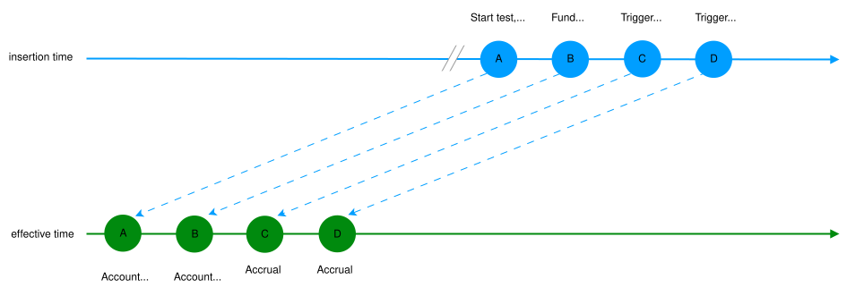

#### Adjustment

In order to trigger an Adjustment in a test, at least one event will need to be backdated prior to the events that have already occurred, such that the order of events by insertion and effective time is different. In the following diagram, the additional **Backdate funding** step means the insertion time order is <A, B, C, **D**, E>, whereas the effective time order is <A, B, **D**, C, E>. As a result, the Adjustment triggered by the second accrual (E) will recompute the first accrual (C) to account for the new balance:

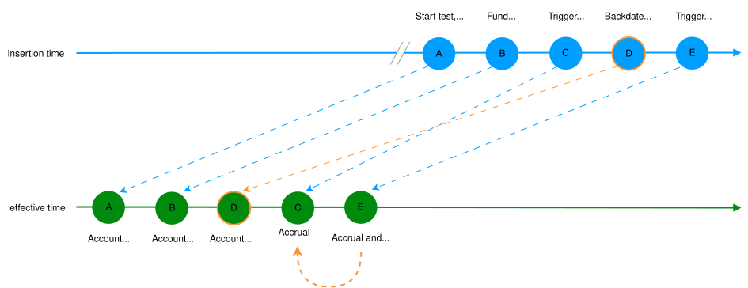

#### Caveats

This approach introduces some caveats to the accuracy of the following Adjustment fields:

-   `timeline_end_timestamp`: Adjustments set the `timeline_end_timestamp` to the highest of the triggering schedule job’s `schedule_timestamp` or the relevant Processing Group’s `minimum_observation_timestamp`.
    
    While this is desirable behaviour outside of testing, the use of the Processing Group in Accelerated Testing means that in tests the `timeline_end_timestamp` is always set to the `minimum_observation_timestamp`, which is less realistic.
    
    In practice, this should not impact the accuracy of the Adjustment computation, since no events should be present beyond the schedule job’s `schedule_timestamp` in the effective timeline. In the example below, the `timeline_end_timestamp` would, in production, correspond to the second accrual’s effective time, but instead corresponds to the insertion time at which the test triggered the second accrual.
    
-   `previous_watermark_timestamp`: Since the `previous_watermark_timestamp` is equal to the Account’s previous Adjustment’s `timeline_end_timestamp`, this field is also affected.
    
    This means that the Adjustment is detecting backdates inserted between the time at which the test triggered the first and second accrual. In the example below, you might expect the Adjustment triggered by the second accrual to have `previous_watermark_timestamp` equal to the first accrual’s effective time, whereas instead you see the insertion time at which the test triggered the first accrual.
    

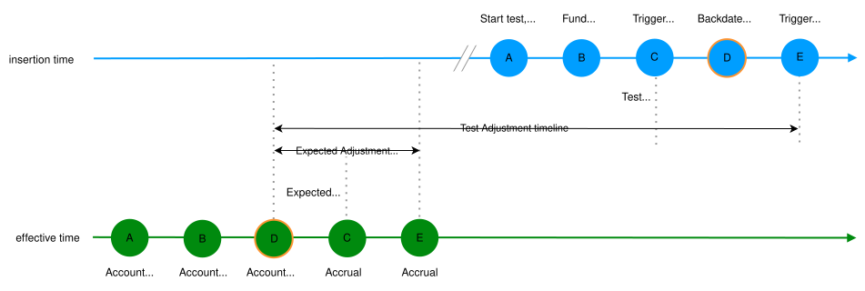

Despite these caveats, Thought Machine recommends this type of testing compared to alternative approaches, because it does not require test-specific Smart Contracts with unrealistic schedules.

## Managing Adjustments

### Monitoring Adjustment progress

The [Vault Jobs](/vault-core/5-8/EN/reference/core_apps_and_operations_dashboard/vault_jobs) App provides insight into Adjustments progress via the schedule that triggered the Adjustment:

-   Successfully completed operations within a Vault Job imply a successfully completed Adjustment and corresponding schedule.
    
-   In-progress operations within a Vault Job can correspond to either **In progress** (STATUS\_PENDING or STATUS\_RUNNING) or **Succeeded** (STATUS\_COMPLETED or STATUS\_NO\_ADJUSTMENT\_REQUIRED) Adjustments. Adjustment operations cannot be explicitly distinguished from in progress schedules because the underlying schedule is still in progress.
    
-   Failed operations within a Vault Job as a result of errored (STATUS\_ERROR) Adjustments are explicitly identified as such.
    

Similarly, Account Schedule Tags that are configured to produce operation events will only do so once all the relevant schedules have completed. If these schedules are Adjustment points, this will require the corresponding Adjustments to succeed first.

As a result, it is difficult to determine how many accounts have specifically completed Adjustments, or the remaining number of Adjustments to process, because this requires querying for all the accounts' Adjustments and checking their status. This will be addressed by the introduction of Adjustment Reviews, which will:

-   Allow Smart Contracts to create separate Adjustment-only schedules.
    
-   Allow Clients to specifically and separately monitor Adjustment progress via Vault Jobs, rather than through the BAU schedule that triggered it.
    

lightbulb

Refer to the [Vault Core roadmap](/vault-core/latest/EN/product_documents/product_roadmaps) for more details on improvement IMP-1782.

### Adjustment explainability

Vault Core provides the following data to explain an Adjustment:

-   The `timeline_start_timestamp` and `timeline_end_timestamp` to identify the timeline being adjusted
    
-   The `previous_watermark_timestamp` to identify the range of new backdates being considered by the Adjustment
    
-   The `correction_posting_instruction_batch_ids` to identify the corrections made by the Adjustment
    

Vault Core does not provide more detailed breakdowns of the computations beyond these data points.

lightbulb

The Adjustments Explainability feature aims to provide:

-   Original and proposed balances across the Adjustment timeline
    
-   Events across the Adjustment timeline
    
-   Business rules evaluated during the Adjustment timeline, as logged by the Smart Contract
    
-   Data provided to individual hook executions for events, if applicable, across the Adjustment timeline.
    

Refer to the [Vault Core roadmap](/vault-core/latest/EN/product_documents/product_roadmaps) for more details on improvement IMP-1773.

### Manual corrections

Manual correction postings help restore account balances to the desired state, particularly if a Smart Contract execution did not produce the expected outcome (for example, a missing or incorrect interest accrual due to a Smart Contract bug or wrong Parameter Value), or did not occur at all (for example, incorrect schedule definition leading to a missing interest accrual).

These postings may not behave as expected with Adjustments:

-   Postings submitted via the Postings APIs are fixed in value. This can affect the accuracy of subsequent Adjustments whose timelines include the manual correction postings. For example, consider a manual correction for a $0.10 interest accrual due to a missing schedule execution. A subsequent backdated deposit could mean that the accrual should have been $0.15, but the manual correction amount is fixed in value at $0.10.
    
-   If you retrospectively address the root cause of the incorrect Smart Contract execution outcome (a Smart Contract upgrade, or a backdated Parameter Value), the manual correction postings will still be present and could end up being duplicated by a subsequent Adjustment. For example, consider an interest accrual that was $0.10 lower than expected due to a Smart Contract bug, and remediated via a manual correction posting. If this bug is then fixed, a subsequent Adjustment over the same period would produce an accrual that includes the missing $0.10 but also includes the manual correction posting for $0.10, resulting in an over-correction.
    
-   If the manual correction postings are backdated in order to remediate an account’s balance timeseries, they can result in Adjustment corrections themselves. You must consider these Adjustments' impact carefully. For example, an interest accrual that was $0.10 lower than expected could result in an interest application being $0.10 lower too. Correcting the accrual manually, backdated to the relevant accrual effective time, will result in an Adjustment that will correct the interest application. If your manual correction postings correct both the accrual and the application, this will trigger an Adjustment that will still try to correct the interest application, resulting in an overcorrection.
    

## Troubleshooting Adjustments

When an Adjustment is in `STATUS_ERROR`, you can retry it via the [/v1/adjustments:bulkRetry](/vault-core/5-8/EN/api/core_api#_core_api_v1_adjustments_BulkRetryAdjustmentsResponse_BulkRetryAdjustments) endpoint.

chat\_bubble

Republishing a failed job via [/v1/jobs:batchRepublish](/vault-core/5-8/EN/api/core_api#_google_protobuf_Empty_BatchRepublishJobs) when the associated Adjustment is in `STATUS_ERROR` will not cause the Adjustment to be retried.

While the Adjustment is in `STATUS_ERROR`, the associated schedule will be stuck. As schedules on Adjustment-enabled Smart Contracts [must all be in the same group](/vault-core/5-8/EN/reference/adjustments#schedules_must_be_in_a_single_schedule_group), this means all affected accounts' schedules will be stuck. If the root cause of the error is not transient in nature (retries do not resolve the error), the following approaches can help address this:

1.  If the Adjustments error is caused by a Smart Contract bug, you can fix the bug, update the affected accounts' Smart Contract version and retry the errored Adjustments. This is because Adjustments use the latest Smart Contract version.
    
2.  If the Adjustments error is caused by a data issue (such as a missing Parameter Value), deterministic fetching prevents republishing jobs from fetching different data.
    
    chat\_bubble
    
    If the error cannot be addressed, contact your Thought Machine representative for assistance with the errored Adjustment, because it will cause subsequent Adjustments to error too.
    
3.  Republishing via [/v1/jobs:batchRepublish](/vault-core/5-8/EN/api/core_api#_google_protobuf_Empty_BatchRepublishJobs) with status `JOB_STATUS_OVERRIDDEN` will unblock subsequent schedules, however:
    
    1.  As per point 2, any corresponding Adjustments will error until the original errored Adjustment is addressed.
        
    2.  If the job and Adjustment were expected to produce directives, see [Manual Corrections](/vault-core/5-8/EN/reference/adjustments#manual_corrections) for guidance on submitting these postings manually.
        
    3.  Overriding the job will not prevent subsequent Adjustments from re-evaluating the schedule, so the underlying root cause still needs addressing. However, unlike point 2, backdating missing data can be effective since the subsequent Adjustments will by definition consider new backdates.
        
    

lightbulb

The introduction of Adjustment Reviews aims to:

-   Allow clients to override Adjustment outcomes via the Core API for errored Adjustments, removing the potential need to override the job altogether.
    
-   Allow Smart Contracts to create separate Adjustment-only schedules, decoupling them from regular BAU schedules. This will allow any remediation effort to focus solely on the Adjustment or BAU schedule, rather than both.
    

Refer to the [Vault Core roadmap](/vault-core/latest/EN/product_documents/product_roadmaps) for more details on improvement IMP-1782.

### Postings are not balanced error

If you receive an INVALID\_ARGUMENT error code, with the message "custom\_instruction’s postings credits and debits balanced check: postings are not balanced", this is caused by asymmetric Posting Instructions being created by the Smart Contract or a prior Adjustment. [Avoid asymmetric Postings if your Smart Contract posts to Internal Accounts](/vault-core/5-8/EN/reference/adjustments#avoid_asymmetric_postings_if_your_smart_contract_posts_to_internal_accounts).

## Constraints when using Adjustments

This section describes the limitations when using Adjustments.

### Integration constraints

Constraints when using other Vault Core API resources in conjunction with Adjustments.

#### Posting Instruction level timestamps are not supported

From Vault Core 5.5 onwards, the value and booking timestamps of Posting Instruction Batches (PIBs) can be set at Posting Instruction (PI)-level (as opposed to PIB-level).

You should only use PIB-level value and booking timestamps for Adjustments. This is because when timestamps are set at PI-level, Vault Core will consider only the PIB’s `insertion_timestamp`, which means that:

-   Backdating a Posting at PI-level will not trigger Adjustment computations
    
-   For the purpose of Adjustment computations, all PIs in a PIB will be considered as valued and booked at the PIB’s `insertion_timestamp`
    

#### Custom Posting Instruction types are not supported

Adjustments do not currently support the use of [Custom](/vault-core/5-8/EN/reference/postings#custom_chainable_but_only_to_other_custom_types) Posting Instructions sent by client integrations. Adjustments only supports the use of these Posting Instruction types within Smart Contracts.

#### Back-booking in isolation is not detected

Adjustments do not detect solely back-booked PIBs. Unless the PIB is also back-valued, it will not be detected as requiring Adjustment.

chat\_bubble

There are also constraints around the booking timestamps of Adjustment correction Postings. For more information, see [Correction Posting timestamps](/vault-core/5-8/EN/reference/adjustments#correction_posting_timestamps).

#### Restrictions are not considered in Adjustments

Restrictions are not factored into Adjustments. This does not affect previous decisions on Postings because `pre_posting_hook` decisions are not re-evaluated, but it can affect contract-generated Postings that were originally rejected by a restriction and will not be rejected in Adjustments. For this reason we recommend always using `override_all_restrictions=True` on Smart Contract Posting Instructions.

#### Balances should only be queried at Adjustment point times

Due to the fact that balance corrections are only made at Adjustment points, Thought Machine advises that you only query balances valued at the Adjustment point effective times.

This includes [Account Attributes](/vault-core/5-8/EN/reference/accounts/account_attributes) and derived parameter values that depend on balances; you should only request these using the Adjustment point effective times as the `effective_timestamps` values for [GET /v1/account-attribute-values](/vault-core/5-8/EN/api/core_api#_core_api_v1_account_attributes_ListAccountAttributeValuesResponse_ListAccountAttributeValues) (or `instance_param_vals_effective_timestamp` value for [GET /v1/accounts/{id}](/vault-core/5-8/EN/api/core_api#_core_api_v1_accounts_Account_GetAccount)) as each relevant Adjustment’s `timeline_end_timestamp`.

However, querying outside of Adjustment point times can be acceptable if any of the following apply:

-   You know that the relevant balances *cannot* be corrected as the result of an Adjustment (for example, the Smart Contract never generates Postings to the balance); or
    
-   The relevant balances will only be posted to *inside* of an Adjustment point schedule (for example, querying interest only when application and accrual have both completed); or
    
-   You are willing to accept the inaccuracy
    

### Smart Contract constraints

Constraints in Smart Contract and product logic behaviour.

#### Not all hooks are re-evaluated

The Smart Contract hooks re-evaluated by Adjustments are the `post_posting_hook`, `post_parameter_change_hook` and `scheduled_event_hook`. The following hooks are *not* re-evaluated by Vault Core when performing an Adjustment:

-   `pre_posting_hook` and `pre_parameter_change_hook`: These are not re-evaluated because their outcomes are considered immutable; for example a permitted Posting must always be permitted
    
-   `activation_hook`: This cannot be included in the Adjustment timeline, because it completes prior to Customer Account creation
    
-   `conversion_hook`: This is not re-evaluated because the Adjustment mechanism currently only uses the latest Smart Contract version (even if the Adjustment timeline spans a conversion from a previous Adjustment-enabled Smart Contract version) - therefore Adjustments over a timeline where a conversion made Postings will not be able to re-evaluate these Postings
    

#### Only PostingInstructionsDirectives are factored in

For the purpose of Adjustments, Vault Core only factors in `PostingInstructionsDirective` s. It does not factor in any Contract Notifications (`AccountNotificationDirective` s) or Schedule Updates (`UpdateAccountEventTypeDirective` s).

This means that Vault Core:

-   Will ignore Schedule Updates when calculating an Adjustment (instead Vault Core will re-run schedules as they ran in BAU)
    
-   Will not send notifications or update schedules when applying corrections
    

Since Schedule Updates (`UpdateAccountEventTypeDirective` s) are not factored in when performing Adjustments, this means that Adjustments for Smart Contracts relying on amending schedules will not behave as expected, because Vault Core will ignore Schedule Updates when calculating an Adjustment and when applying any corrections.

This includes contracts that:

-   Enable/disable one-off schedules (such as for delinquency)
    
-   Manage schedules that cannot be expressed in a single cron or schedule method
    

#### Smart Contract requirement fetching constraints

When using any of the [supported hooks](/vault-core/5-8/EN/reference/adjustments#supported_hooks), Smart Contracts enabling Adjustments *must not*:

-   Use the `@requires` decorator (instead, use `@fetch_account_data`)
    
-   Fetch using `DefinedDateTime.LIVE`
    
-   Fetch later than the hook’s `effective_datetime`, with the exception of calendars
    
-   Fetch booking balances (via `BalancesIntervalFetcher`, `BalancesDiscreteIntervalFetcher` or `BalancesObservationFetcher` with `datetime_view` set to `DateTimeView.BOOKING_DATETIME`)
    

info

Existing Customer Accounts cannot be converted to a Smart Contract with [LastScheduledEventDateTimesObservationFetcher](/vault-core/5-8/EN/reference/contracts/contracts_api_4xx/common_types_4xx/classes#lastscheduledeventdatetimesobservationfetcher), if their current Smart Contract is not already using it, due to data access limitations. Future Vault Core improvements aim to address these limitations.

#### Balances should only be fetched at Adjustment point times

As per the [integration constraint](/vault-core/5-8/EN/reference/adjustments#balances_should_only_be_queried_at_adjustment_point_times), Smart Contract [Account data fetchers](/vault-core/5-8/EN/reference/contracts/contracts_api_4xx/concepts#account_data_fetchers) should only fetch balances using the Adjustment point effective times.

#### Smart Contract Simulation does not support Adjustments

Smart Contract Simulation does not support Adjustments functionality. Adjustment-enabled Smart Contracts will be able to run BAU functionality in Simulation, but any Adjustments functionality will be ignored. For more information, see [Unsupported features](/vault-core/5-8/EN/reference/contracts/contract_simulation#unsupported_features).

#### Only the most recent Smart Contract version is used

Adjustments are calculated using only the most recent version of the Adjustments-enabled Smart Contract. When using Adjustments, it is therefore important to maintain compatibility across any Adjustments-enabled Smart Contract versions backing a Customer Account for the adjustable period.

For example:

-   If you remove the `post_posting_hook` in the latest Smart Contract version, this will prevent Adjustments from re-evaluating `post_posting_hook` executions
    
-   If you remove an `expected_parameter` and associated logic from the latest Smart Contract version, this will prevent Adjustments from using this logic when re-evaluating any hook executions
    

#### Posting Instruction enrichments are not re-evaluated

[PostingInstructionEnrichment](/vault-core/5-8/EN/reference/contracts/contracts_api_4xx/common_types_4xx/classes#postinginstructionenrichment) objects are defined in the `pre_posting_hook` - therefore they are not re-evaluated during Adjustments and should not be relied upon.

#### Avoid using Posting Instruction level timestamps

As stated in [Integration constraints](/vault-core/5-8/EN/reference/adjustments#integration_constraints), you should only use PIB-level value and booking timestamps for Adjustments. This guidance also applies to Smart Contracts.

#### Schedules must be in a single Schedule Group

To ensure that Adjustments do not race with other schedules, Adjustment-enabled Smart Contracts may only use a single schedule group, which must contain all schedules (Adjustment and non-Adjustment). As schedule job events in the Adjustment timeline are sequenced by the highest of the job’s `schedule_timestamp` or `minimum_observation_timestamp`, the BAU order is replicated in Adjustments.

#### Constraints when Posting from Smart Contracts

Adjustment-enabled Smart Contracts must only generate Postings between a balance on the Customer Account backed by the Smart Contract and:

-   A balance on the same Customer Account; and/or
    
-   A balance on an Internal Account
    

chat\_bubble

There are also constraints as a result of Smart Contracts that initiate Postings to Internal Accounts, as described [below](/vault-core/5-8/EN/reference/adjustments#avoid_asymmetric_postings_if_your_smart_contract_posts_to_internal_accounts).

Smart Contracts that initiate Postings to other Customer Accounts, or between any Accounts that are not being adjusted, are not supported because they will lead Adjustments to behave erroneously regarding corrections.

These kinds of Postings lead to Vault Core:

-   Sending required correction Postings, but for the wrong amount
    
-   Sending correction Postings when no corrections were required
    
-   Not sending correction Postings when they were required
    

Smart Contract workarounds cannot compensate for such mistakes.

warning

To avoid extremely complex situations to remediate, ensure that any Adjustment-enabled Smart Contracts therefore:

-   [Do not instruct Postings to other Customer Accounts](/vault-core/5-8/EN/reference/adjustments#do_not_instruct_postings_to_other_customer_accounts)
    
-   [Do not instruct Postings between Accounts that are not being adjusted](/vault-core/5-8/EN/reference/adjustments#do_not_instruct_postings_between_accounts_that_are_not_being_adjusted)
    
-   [Avoid asymmetric Postings if your Smart Contract posts to Internal Accounts](/vault-core/5-8/EN/reference/adjustments#avoid_asymmetric_postings_if_your_smart_contract_posts_to_internal_accounts)
    

##### Do not instruct Postings to other Customer Accounts

Smart Contracts that instruct Postings targeting other Customer Accounts are not supported by Adjustments, because these scenarios can lead to incorrect or missing correction Postings.

Features that often instruct Postings to other Customer Accounts include:

-   *Sweeping excess Current Account balances to a nominated Savings Account*: The Smart Contract debits the Account backed by the Smart Contract and credits the nominated Customer Account
    
-   *Topping up a Wallet product from a nominated Current Account*: The Smart Contract credits the Account backed by the Smart Contract and debits the nominated Customer Account
    

##### Do not instruct Postings between Accounts that are not being adjusted

Adjustments does not support Smart Contracts that instruct Postings between any Accounts that are not the Customer Account being adjusted (any Accounts that do not correspond to the `vault.account_id` the Smart Contract is executing against). This includes Postings:

-   From one Internal Account to another; or
    
-   From one Customer Account to another, where both Accounts are not the one being adjusted
    

These scenarios are not supported by Adjustments, because they can lead to incorrect or missing correction Postings.

Features that instruct Postings between Internal Accounts include the following:

  
| Feature | Example | Recommendation |
| --- | --- | --- |
| 
Off-balance sheet accounting

 | 

A Smart Contract which recognises changes to Revocable Commitment by debiting/crediting a REVOCABLE\_COMMITMENT Internal Account and crediting/debiting an OFF\_BALANCE\_SHEET Internal Account.

 | 

Not recommended for Smart Contracts in general.

 |
| 

Non-standard accrual accounting

 | 

A Smart Contract that accrues payable interest by crediting the ACCRUED\_INTEREST\_PAYABLE address on the Customer Account, and debiting the ACCRUED\_INTEREST\_PAYABLE Internal Account. It later applies interest by debiting the ACCRUED\_INTEREST address on the Customer Account, and crediting the DEFAULT address on the Customer Account, and also crediting the ACCRUED\_INTEREST\_PAYABLE Internal Account and debiting the INTEREST\_PAID Internal Account.

 | 

The Smart Contract should apply interest by debiting the INTEREST\_PAID Internal Account and crediting the DEFAULT address on the Customer Account, and crediting the ACCRUED\_INTEREST\_PAYABLE Internal Account and debiting the ACCRUED\_INTEREST address on the Customer Account. This achieves the same balances across all accounts and avoids the Postings between Internal Accounts.

 |

##### Avoid asymmetric Postings if your Smart Contract posts to Internal Accounts

lightbulb

The resolution of TM-119190, as summarised in the [Vault Core 5.8 known issues](/vault-core/5-8/EN/vault_release_information/technical_details_of_this_release#adjustments_2), aims to remove the limitations described in this section.

**If, and only if, your Smart Contract initiates any Postings to Internal Accounts**, there are two causes of asymmetric Posting Instructions you must avoid:

1.  Posting Instructions that do not have matching credit/debit pairs for a given combination of balance coordinates
    
2.  Posting Instructions that share a balance coordinate across otherwise varied pairs (for example, a pair that posts between balance coordinate A and B, and another between A and C)
    

###### Do not instruct unmatched credit/debit Posting pairs

If your Smart Contract initiates any Postings to Internal Accounts, avoid instructing any credit/debit Posting pairs that do not match (for any given combination of balance coordinates). Common use cases that result in this include:

-   Netting individual Postings to reduce their number
    
-   Modelling complex financial movements that debit and/or credit multiple accounts
    

The following example is of a Posting pair (with the same balance coordinates) which matches, because the credit Posting has a single debit with equal amount:

  
| Credit | Amount | Account |
| --- | --- | --- |
| 
True

 | 

10

 | 

A

 |
| 

False

 | 

10

 | 

B

 |

The following example is of Posting pairs (with the same balance coordinates) which do not match, because the credit Posting does not have a single debit with equal amount:

  
| Credit | Amount | Account |
| --- | --- | --- |
| 
True

 | 

10

 | 

A

 |
| 

False

 | 

4

 | 

B

 |
| 

False

 | 

2

 | 

B

 |
| 

False

 | 

4

 | 

B

 |

###### Do not reuse balance coordinates

If your Smart Contract initiates any Postings to Internal Accounts, avoid reusing the same balance coordinates in different Posting pairs. For example, if your Smart Contract posts between a balance coordinate A and B, it should never post between A and C. Common use cases that result in this include:

-   Charging fees to different Customer Account addresses but recognising the income on a single Internal Account. For example, crediting the DEFAULT address on the FEE\_INCOME internal account debiting either ATM\_FEE or MAINTENANCE\_FEE addresses on the Customer Account.
    
-   Charging fees to the same Customer Account address but recognising the income on separate Internal Accounts. For example, debiting the DEFAULT address on the Customer Account for all fees, but crediting the DEFAULT address on separate ATM\_FEE\_INCOME and MAINTENANCE\_FEE\_INCOME Internal Accounts.
    

lightbulb

You can, however, reuse balance coordinates across pairs if you ensure that the different pairs exclusively occur in different Adjustment point schedules. For example, you can reuse an Internal Account for two fees if, and only if, those fees are charged in two separate Adjustment point schedules.

#### Avoid Posting Instruction based logic

Logic based on Posting Instructions cannot always be corrected. For example, if a Smart Contract fetches Postings to check if a rolling limit is not exceeded - while Vault Core can 'reverse' a debit transaction with an equivalent credit at the same value time, the original transaction will always be present and could be fetched again.

#### Avoid debit and credit based logic

Logic based on the raw debit and credit values of a balance may not be corrected because the correction Postings can only add to debit or credit. For example, a Smart Contract may check a fee balance’s debit and credit to see how many fees have ever been charged and repaid, respectively.

Any outstanding fees can be corrected, as they are typically the net balance; however, the debit and credit cannot reflect the fact that a fee should not have been charged.

#### Avoid non-commutative logic

Non-commutative logic applies when the processing order of a sequence of events affects the outcome; for example 2-3 is not equal to 3-2, and is therefore non-commutative.

Since Adjustments only correct the balance at specific Adjustment points, a Smart Contract with non-commutative features (such as a repayment hierarchy, or cumulative balance thresholds) that run outside of Adjustment point schedules may therefore receive incorrect balances between these points.

For example, if an Adjustment-enabled Smart Contract uses [Account Attribute](/vault-core/5-8/EN/reference/accounts/account_attributes) calculations for a non-commutative product feature, and `GET /v1/account-attribute-values` is called with `effective_timestamps` between two Adjustment points, this may return incorrect balances.

lightbulb

Thought Machine recommends running Account Attribute (or derived parameter) calculations using the same timestamp value as each relevant Adjustment’s `timeline_end_timestamp`, as explained [here](/vault-core/5-8/EN/reference/adjustments#balances_should_only_be_queried_at_adjustment_point_times).

#### Avoid asymmetric transaction logic

Transaction handling logic is asymmetric if it does not apply an equal and opposite net balance change for a credit versus a debit of the same amount. For example:

-   *A Smart Contract with a universal transaction fee of £5*: For a liability account, a £100 debit would have -£105 net balance change, whereas a £100 credit would have a +£95 balance change. -105 is not equal and opposite to +95; this is asymmetric handling logic
    
-   *A Smart Contract with a zero minimum balance and interest accrual on positive balances*: For a liability account, a £100 debit has a -£100 net balance change, a £100 credit has a +£100 net balance change. -100 is the opposite of +100; this is symmetric handling logic
    

In the case of asymmetric transaction logic, 'reversing' a transaction by backdating a Posting to mirror the original transaction may not fully reverse the side-effects, because the Adjustment will only calculate the effect of the backdated Posting itself.

chat\_bubble

An incorrect correction may be also calculated if the Account has Postings that are not exactly balanced against an Internal Account; for example, Custom Instructions where the debits and credits are equal overall, but across an odd number of total Postings.

### Adjustment correction constraints

Adjustment correction Postings are derived from the differences between current and adjusted balances, so they differ in key ways compared to normal Postings produced by Smart Contracts outside of Adjustments.

#### Correction Posting granularity

Since a Smart Contract can produce many Postings between two Adjustment points, a single correction Posting can effectively represent the differences caused by multiple Postings. As such, there is no one-to-one mapping. For example, consider an account that has the following sequence of events:

1.  T1 - Accept a transaction and charge a fee
    
2.  T3 (Adjustment Point) - Accrue interest
    

In BAU the fee and accrual would have been two separate Postings, but in an Adjustment, the single correction Posting for the Adjustment point at T3 could be correcting for differences to both the fee and the accrual.

#### Correction Posting timestamps

All correction Postings made as a result of Adjustments will have their:

-   Value timestamps set to each applicable Adjustment point
    
-   Booking timestamps set to the *latest* Adjustment point (the current Adjustment’s `timeline_end_timestamp`), even if any hook directives produced during the Adjustment computation are back-booked
    

As a result, the timestamps on correction Postings may be in the future with respect to the timestamps on the Postings produced by the Smart Contract.

For example, consider a contract with a post-posting hook that produces a Posting valued to the hook effective time, and an Adjustment point schedule that runs at midnight daily. If a post-posting hook execution at 2024-01-02T22:00:00 produces a different outcome during an Adjustment’s timeline, this would only be corrected at 2024-01-03T00:00, the next Adjustment point.

lightbulb

While Adjustment corrections are currently coupled to schedules' effective times, support for flexible Adjustment corrections aims to address this. For more information, refer to IMP-1774 on the [Vault Core roadmap](/vault-core/latest/EN/product_documents/product_roadmaps).

#### Correction Posting metadata

Correction Postings do not include any metadata the Smart Contract would normally produce:

-   The metadata produced by the contract relates to individual Postings, but as explained correction Postings relate to the *differences between balances*.
    
    For example, if an original end-of-day schedule resulted in an $0.03 accrual, and a subsequent Adjustment calculates that a backdated Posting means this should have resulted in an $0.10 accrual, Vault Core must correct for the $0.07 difference. However, the metadata would relate to the $0.10 accrual which does not align to the $0.07 correction.
    
-   As explained above, the correcting Postings could be the result of multiple contract Postings, and metadata cannot usually be merged.
    

To understand more about a given Adjustment’s outcomes, see [Adjustment explainability](/vault-core/5-8/EN/reference/adjustments#adjustment_explainability).

#### Correction timing constraints

It is quite common for scheduled processes to decouple the point in time at which they run (operational time), and the point in time from which they use data (business time). For example, an End of Day process might run a schedule at 02:00am, but use account balances as at midnight.

Vault Core triggers an Adjustment (and makes resulting correction Postings) at the Adjustment point(s), and before the `scheduled_event_hook` for the Adjustment-enabled schedule runs. Therefore, if the schedule itself uses a balance cut-off time prior to the Adjustment point, the schedule will not factor in the correction Posting. This is illustrated with an End-of-Day (EoD) example in the following diagram:

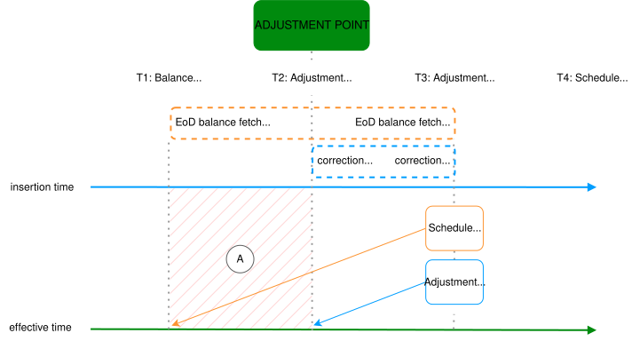

-   The Adjustment, triggered at T2, completes at T3, sending a correction Posting valued at T2
    
-   Shortly after this, the Adjustment-enabled schedule runs at T3, fetching the balances at T1, which is before the correction Posting is applied
    

As indicated by (A) in the diagram, there is a time gap between the schedule’s balance fetch, and the Adjustment correction Posting.

lightbulb

While Adjustment corrections are currently coupled to schedules' effective times, support for flexible Adjustment corrections aims to address this. For more information, refer to IMP-1774 on the [Vault Core roadmap](/vault-core/latest/EN/product_documents/product_roadmaps).

#### Corrections to other Customer Accounts

As per the [Smart Contract constraint](/vault-core/5-8/EN/reference/adjustments#do_not_instruct_postings_to_other_customer_accounts), Adjustments does not support correction Postings to other Customer Accounts.