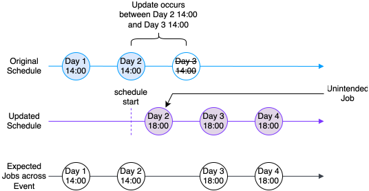

# Best practice guidelines

We encourage you to follow these best practice guidelines when writing Smart Contracts to help ensure your code is consistent, coherent and optimal.

## Python best practices

### Python

chat\_bubble

Check the [Contracts Language version 4 Release Notes](/vault-core/5-8/EN/reference/contracts/contracts_api_4xx/version_notes#release_notes) to confirm and install the version of Python compatible with your version of Vault Core.

Smart Contracts are valid Python modules, and so we recommend you follow the common guidelines for writing Python so that your Smart Contracts express their intent clearly.

We recommend reading and following the [Code Style](https://docs.python-guide.org/writing/style/) section from the Hitchhiker’s Guide to Python when writing Smart Contracts. You should also be familiar with and following the style guidelines in the [Pep8 style guide](https://www.python.org/dev/peps/pep-0008/) when writing Python code in Smart Contracts.

lightbulb

Develop and [unit test Smart Contracts](/vault-core/5-8/EN/reference/contracts/contracts_api_4xx/development_and_testing#unit_testing_contracts) using the `contracts_api` package available as part of the [Contracts SDK](/vault-core/5-8/EN/reference/contracts/contracts_api_4xx/development_and_testing#contracts_sdk).

### Imports

Do not use wildcard imports as it pollutes the namespace and can make it difficult to debug your code, and will affect code validators and other tools you may use to help development.

### Linters and Type Checking

We recommend you always use linters when writing Smart Contracts.

Linters are tools that analyse your code to detect various categories of logical and stylistic errors. All good Python IDEs have one or more incorporated Python code linters. If you don’t use an IDE and your editor does not support plugins, there are standalone code linters available.

-   logical linters help identify code errors, risky code patterns, and potentially unexpected results
    
-   stylistic linters identify code that does not conform to specified conventions
    

For linting your code style, we recommend using [Flake8](https://flake8.pycqa.org/en/latest/), which is a package that incorporates PyFlakes, pycodestyle/pep8, and McCabe.

For logical linting, we recommend you add type hints/annotations to your code and use [mypy](https://mypy.readthedocs.io/en/stable/).

These tools are available to execute automatically as you type or when you save your changes in most Python IDEs (VSCode, PyCharm, etc) and code editors (Vim, Emacs, Sublime, etc). The documentation for your editor should have instructions for downloading, installing, and running these.

chat\_bubble

The `contracts_api` module includes type annotations to support mypy, and will enable IDEs and editors to provide autocompletion.

### Code Comments

Your Smart Contracts are likely to be developed over a long period of time and by different contributors so good documentation is key. Thought Machine follows the [Pep8 style guide](https://www.python.org/dev/peps/pep-0008/#comments) for writing comments in Python code.

For each function you should comment:

-   What the function does, rather than the technical details of what happens within the function
    
-   A brief description of each parameter
    
-   A description of the value returned by the function, if appropriate
    

chat\_bubble

Comments are not required for hooks as they are generic across Smart Contracts and are already documented.

## Idempotency

### Postings

A posting instruction is one of the main integration points for a Smart Contract so ensure that each instruction is unique, traceable and has enough information for integrations. In Contracts Language API 4, the `client_transaction_id` is auto-generated to a unique string for each [CustomInstruction](/vault-core/5-8/EN/reference/contracts/contracts_api_4xx/common_types_4xx/classes#custominstruction) returned from a hook within the [PostingInstructionsDirectives](/vault-core/5-8/EN/reference/contracts/contracts_api_4xx/common_types_4xx/classes#postinginstructionsdirective).

chat\_bubble

Add any custom metadata to the `instruction_details` mapping on the `CustomInstruction` as required for integrations.

### Effective Datetime

If a Smart Contract relies on the date/time of the event, then use `hook_arguments.effective_datetime`.

Do *not* use `datetime.now()` or similar as the value will vary depending on when the hook is executed, meaning each hook execution will not be deterministic, breaking idempotency. There are circumstances when hook execution will be retried, and the system requires that the outcome will be the same no matter when that happens.

## Writing helper functions

### Using underscores in helper function names

When you write a helper function, follow the Python naming convention that signifies a private function and begin the helper function name with `_`. This helps you:

-   Find and identify helper functions easily
    
-   Ensure that your helper functions will never clash with any current or future hook names
    

### Naming your helper functions

We recommend you name your helper functions so their purpose is clear. Anyone reading the code in future should be able to understand what the function is used for by reading its name.

### Only pass required variables into helper functions

Instead of writing your helper function to take the entire `vault` object, limit the variables you pass into your helper function to required parameters only, because this:

-   Reduces the logic in your helper functions as you no longer need to retrieve the parameter
    
-   Ensures you reuse the variables you have already declared in your hook
    
-   Makes your helper function easier to test using the unit test framework
    
-   Locks the exact arguments of the helper function, making it less error-prone and more reusable
    

### Use Type Hints when writing helper functions

Type Hints improve the comprehensibility of helper functions, as well as enhancing the control and predictability of your code, particularly when working on larger Smart Contracts. We recommend using Type Hints wherever possible when writing helper functions so that tools such as [mypy](https://mypy.readthedocs.io/en/stable/) can help identify logical errors in your code.

## Defining parameters and shapes

### Defining parameters

Make sure parameters have explicit and meaningful names. Anyone reading the contract in the future should be able to understand what the parameter is used for by reading the parameter name.

A good pattern to follow is `[[adjective]](#adjective)_[[noun]](#noun)`:

-   *Adjective*: Defines if this is a max/min or upper/lower
    
-   *Noun*: The actual focus of the parameter name
    

For example: `max_deposit`, `daily_withdrawal_limit`

Consider the following when defining parameters:

-   *Order of parameters:* Order parameters alphabetically, with instance parameters above template parameters.
    
-   *Description and display name:* Use the description and display name to convey the purpose of the parameter. Phrase these as statements rather than questions. The parameter description field only has a full stop (.) if it contains more than one complete sentence.
    
-   *Default value:* Set this to the value you want to give to the parameter after an Account has been converted to a Smart Contract that introduces this parameter via an [AccountUpdate](/vault-core/5-8/EN/api/core_api#accountupdate) or [AccountMigration](/vault-core/5-8/EN/api/core_api#accountmigration).
    

The following is an example of a well-defined parameter:

## Defining Account Attributes

### Naming Account Attributes

Account Attribute names need only be unique per Smart Contract. This means that from the point of view of the API call, a given Account Attribute may behave differently depending on the Smart Contract that contains it. This is deliberate to allow flexibility, but should be taken into consideration when defining a given Attribute differently in different Smart Contracts.

It can be useful to annotate any Smart Contract specifics regarding an Account Attribute, as per the following section.

### Annotating Account Attributes

Due to the fact that Attribute value calculations are likely to be used by other systems (such as customer applications), we recommend annotating each Attribute in the Smart Contract to caution against changing or removing them without considering downstream impacts. For example:

### Optimising performance

To optimise performance, ensure that downstream systems only request values for the specific attributes that they require. This ensures that any extra unused data is not fetched during execution which in some cases could greatly impact performance (such as fetching a large range of postings or balances when they are not required).

### Catering for None return values

`None` is a valid return value for all Attributes, and so integrating systems should be able to handle this. This should be obvious for strings where the empty value is "", but the empty value for Decimal is "" and datetime is `null` when returning `None` from the [attribute\_hook](/vault-core/5-8/EN/reference/contracts/contracts_api_4xx/smart_contracts_api_reference4xx/hooks#attribute_hook).

## Objects in global scope

error

Thought Machine strongly recommends that Smart Contract writers only use variables at the global scope to store read-only constants.

For performance reasons, Contract Execution evaluates the values of global variables only once, when a hook is run for a new Smart Contract version. These values are stored in a cache, and shared across multiple hook executions. Smart Contracts must therefore avoid performing any of the operations described in the following sections.

### Avoid storing values returned from non-deterministic functions at the global scope.

Example:

### Avoid updating the values of global variables using the global keyword.

Example:

### Avoid updating any mutable objects when stored in global variables.

Example:

## Using global constants

If your Smart Contract reuses a piece of information, such as a custom fee address, declare it as a global constant and use it throughout instead of relying on string literals.

chat\_bubble

The data fetching decorators do not support variables for the fetcher ids as they are removed from the Smart Contract before execution.

## Version numbers

The Contracts Language API requires semantic versioning on Smart Contracts to facilitate version management on a per-product level. You can set the semantic version by using the [version](/vault-core/5-8/EN/reference/contracts/contracts_api_4xx/smart_contracts_api_reference4xx/metadata#version) metadata field on a Smart Contract.

chat\_bubble

Contract version numbers must be unique across the same product ID when uploaded to Vault.

This semantic versioning follows the [Backus-Naur Form Grammar](https://semver.org/) in the form of `[major].[minor].[patch]-[pre-release]+[build]`, with recommended usage:

-   *Major*: Incremented for a release that changes the functionality of the contract such as a new feature or hook
    
-   *Minor*: Incremented for a release that includes changes to logic but not functionality or features
    
-   *Patch*: Incremented for a minor change such as a small refactor or bug fix where there are no changes to the logic
    
-   *Pre-Release*: (Optional) Indicates a version is still under development/ not stable for a production release yet
    
-   *Build*: (Optional) A freeform metadata field to show information on the build itself, such as commit hash/ build time
    

The minor and patch version are reset when there is a new major release. So, 1.1.1 becomes 2.0.0 rather than 2.1.1.

## Schedule Management

On-demand/one-off schedules are not currently natively supported by Vault Core as a first class feature. If you want to have a single schedule that is executed in the future, refer to the [common example of skipping schedules](/vault-core/5-8/EN/reference/contracts/contracts_api_4xx/common_examples#creating_skipped_schedules).

Because on-demand schedules are not currently natively supported, there are some important considerations with handling schedules to be aware of.

### Reducing a schedule start time

#### Caveat

You cannot update a schedule’s start time, including from within the `conversion_hook`, if the schedule being modified is an existing schedule. All modifications to a schedule, including that within the `conversion_hook`, or returned via `UpdateAccountEventTypeDirective`, will be effective as of the last run time of the schedule. You cannot specify a new schedule `start_datetime` before the account creation date (for account activation) or the account conversion date (for product upgrade/account conversion).

#### Recommendation

If you want to modify the schedule with a different start time, we recommend you convert to a new contract with a different schedule (with a different `event_type` name), where the new intended `start_datetime` can be used. Note that this is still limited by the fact that start datetime cannot be before the account conversion datetime.

### Additional Jobs when updating schedules

#### Caveat

The system applies Schedule updates based on the last run time of the original schedule. This behaviour can result in additional Job executions.

Consider the following example:

-   On day 1, you create a schedule which is set to run daily at 14:00
    
-   On Day 2, you update the schedule with a new expression so that the schedule runs daily at 18:00
    

If the request to update the Schedule occurs between 14:00 on day 2 and 14:00 on day 3, vault will trigger an additional job at 18:00 on day 2. This means two jobs are triggered on day 2, one at 14:00 and another at 18:00.

#### Recommendation

When updating a Schedule, add a skip to the Schedule with the `skip_end_time` set to the next desired run time according to the updated schedule. You can do this using `skip=ScheduleSkip(end=expected_next_run_time_minus_1_second)`, where `expected_next_run_time_minus_1_second` is one second before the next desired run. This will prevent any additional Jobs from being executed.

For example: if you update a daily schedule from 14:00 to 18:00 at 16:00, you would set `skip=ScheduleSkip(end=datetime.datetime(YEAR, MONTH, 3, 17, 59))` to prevent the Job from running twice.

chat\_bubble

Additional Jobs are not necessarily backdated Jobs, and not all backdated Jobs are undesirable. Therefore, using `skip=ScheduleSkip(end=hook_arguments.effective_datetime)` is not advised, as it may skip intended backdated Jobs.

## Financial Consistency

### Ordering of pre and post-posting hooks

Vault Core guarantees that the order of `post_posting_hook` executions will follow the same order as the corresponding `pre_posting_hook` executions. However:

-   A given `post_posting_hook` execution is not guaranteed to happen **immediately** after the corresponding `pre_posting_hook` execution
    
-   Pre and post-posting executions are not guaranteed to happen in sequence with each other.
    

For example, the sequence of executions for two batches of posting instructions **A** and **B** may be in the order of either:

1.  `pre_posting_hook` **A**
    
2.  `post_posting_hook` **A**
    
3.  `pre_posting_hook` **B**
    
4.  `post_posting_hook` **B**
    

or:

1.  `pre_posting_hook` **A**
    
2.  `pre_posting_hook` **B**
    
3.  `post_posting_hook` **A**
    
4.  `post_posting_hook` **B**
    

#### Caveat

If an integration with Vault Core assumes a sequence of pre → post → pre posting executions, but does not explicitly enforce it, there may be unexpected consequences, notably around:

-   Hook Directive postings from `post_posting_hook` being committed out of sync with the externally initiated postings.
    
-   Postings data fetching including postings that logically should not exist at the time of the first post-posting.
    

#### Recommendation

To guarantee ordering, you can adjust the integration to wait for a corresponding event from the `post_posting_hook` to complete before initiating a new batch of posting instructions. You can implement this by waiting for a contract notification event with an appropriate ID to complete from the `post_posting_hook`. See [Raising a Notification](/vault-core/5-8/EN/reference/contracts/contracts_api_4xx/common_examples#raising_a_notification).

error

If the product is dependent on pre and post-posting hook sequencing behaviour, make sure that ordering is guaranteed on the integration side.

### Behaviour of the Post-Posting hook

When a `post_posting_hook` execution fails, it is marked as a failure in the database. Subsequent post-posting executions for that Account or Plan require this failure to be handled before they can continue.

The [Post Posting Republisher](/vault-core/5-8/EN/api/core_api#post_posting_republisher) provides functionality to access, delete, and republish `post_posting_hook` failures (as [PostPostingFailure](/vault-core/5-8/EN/api/core_api#postpostingfailure) objects) for one or more Accounts or Plans.

warning

Handle these endpoints with care and be fully aware of their functionality before republishing or deleting Post-Posting Failures. Using these endpoints incorrectly could lead to missing Hook Directives, potentially affecting the financial state of the accounts.

There are some cases where the Post-Posting Failure cannot be resolved through republishing. In these cases, a post-posting failure can be deleted to unblock successive requests. In most cases, this means manual remediation of the side effects that should have been produced by the Hook Execution.

### Ensuring Consistency of Hook Executions

To ensure this consistency is maintained between sequential executions, such as post postings or schedules, it is important to consider the value and insertion timestamp of each PostingInstructionBatch you instruct.

If you do not explicitly set the value timestamp, it will be set as the insertion timestamp of the postings. If the hook execution that instructs the postings is delayed, then the value timestamp of the postings will be delayed past the effective time of the hook. Any sequential hook executions may exclude those postings from balance calculations if their fetchers have not been correctly configured.

To mitigate against unexpected balances caused by the default behaviour of timestamps, depending on the use case you are operating on, you can do either of the following:

-   Set the value timestamp of the PostingInstructionBatches instructed from contract hooks to be the `effective_datetime` provided in the hook arguments, so that Vault treats the postings as being in the correct window.
    
-   If you are using the scheduled event hook, fetch data using the live modifier to ensure you see all the postings/balances you intended to see in the hook execution window. If this is done, the contract code should then apply logic to filter out the postings and make adjustments to balances to get an appropriate representation of the state of the account at the effective time of hook execution.
    

### Handling Race conditions between Hook Executions

Design product configurations with race conditions in mind. Use an informed view of data to be preventative rather than reactive. For example, consider a racing post posting and scheduled event execution. The hook executions can be designed such that they are aware of one another:

-   The scheduled event can be aware there is a post posting in flight by fetching data from the ledger, for example where some addresses are in a state they expect a pre\_posting to have left them.
    
-   The post posting can be aware if a schedule event has run by using its effective\_time and fetching the last execution time of the schedule in order to understand if it has already completed or if it is likely to be in flight.