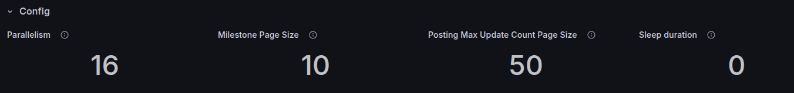
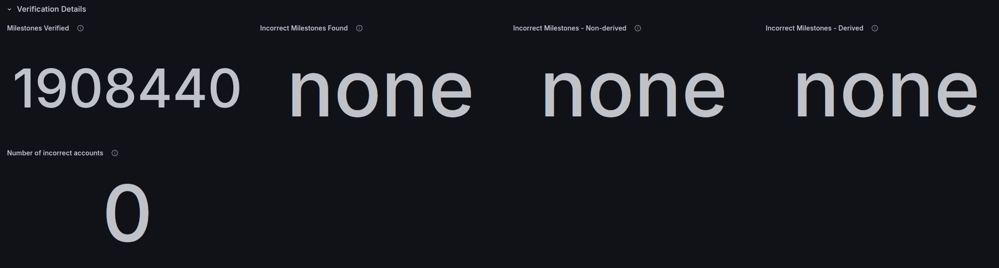
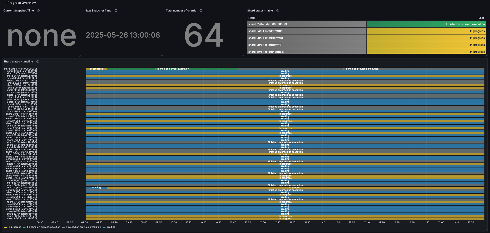
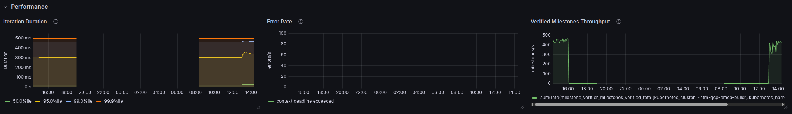
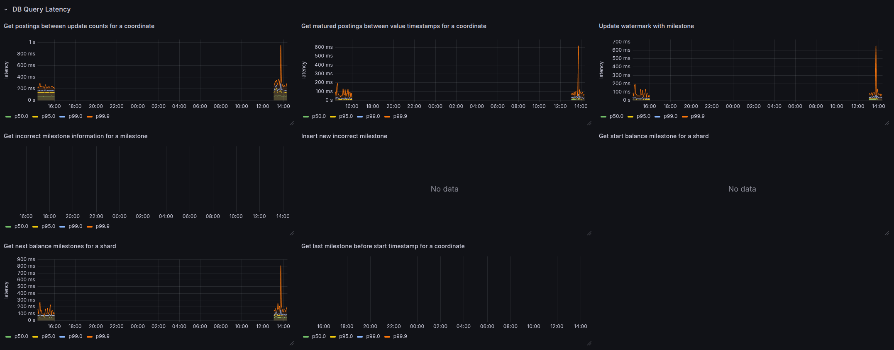
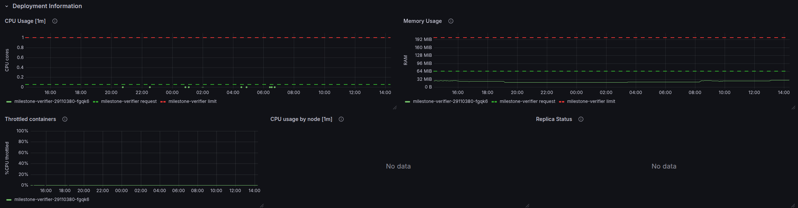

# Balance Milestone Reconciler

The *Balance Milestone Reconciler* is an additional tool to monitor the correctness of the internal balance data objects. It serves as a reconciliation control for clients and can be used to support investigations in the event of an incident. It runs in the background by default from Vault Core 5.7 onwards, as part of the `vault-core` TMComponent.

## Balance milestone

A Balance milestone is an internal representation of a [Balance](/vault-core/latest/EN/reference/balances#balances_resource) at one point in time. It is used to improve performance for on-the-fly balance calculation and to initiate balance calculation in Vault Core API calls. Milestones are generated every N postings, typically every 10 postings.

chat\_bubble

Balance milestones are not a source-of-truth financial data, meaning they can be deleted without corrupting a bank state. But having incorrect milestones can result in an incorrect balance value being returned by Vault Core.

## Overview

Milestone Reconciler is a Kubernetes CronJob that iteratively verifies that the balance milestones value credits and debits are identical to a corresponding sum of postings credits and debits written to the Ledger. Incorrect milestones are reported via logs and an alert. If not in the [read-only mode](/vault-core/5-8/EN/reference/balances/balance_milestone_reconciler#read_only_mode), the Reconciler can be halted and resumed later on without losing progress. The job manages reconciliation progress by dividing the whole set of customer accounts into smaller sets called shards. It processes these shards concurrently.

## Supported versions

The Balance Milestone Reconciler is available from Vault Core 5.7 onwards.

### What is an incorrect milestone

The milestone is considered incorrect if its value debits or value credits are not identical when compared to the postings written to the database.

### Impact of having incorrect milestones

Incorrect milestones will vary in impact depending on how they manifest. Some incorrect milestones can cause inconsistencies between transactions and the resulting balance changes, and may be detected by:

-   A bank’s reconciliation operations (if they involve checking live balances) - less impact.
    
-   A bank’s customer noticing inaccurate account balances - more impact.
    

Incorrect milestones may result in inconsistent balances being returned via `/v1/balances` or Core Stream API events, as well as balance fetching in contract execution. Incorrect milestones will have no impact if they are never used in balance calculation, but they represent a risk if there is a possibility that products will use them for balance calculation in the future.

Any incorrect milestones detected by the Milestone Reconciler job will be limited to the affected accounts and customers, and will have no urgent impact on critical journeys. To assess the impact of a particular case, contact your Thought Machine representative.

### Derived / non-derived incorrect milestones

Each milestone is calculated based on the previously generated milestone; therefore any error in calculation will be propagated to the subsequent milestone(s).

In the [Grafana dashboard](/vault-core/5-8/EN/reference/balances/balance_milestone_reconciler#monitoring), incorrect milestones are classified as either *incorrect derived* or *incorrect non-derived*:

-   *incorrect derived*: The error at this milestone has been derived from an error at an earlier milestone
    
-   *incorrect non-derived*: The error first manifested itself at this milestone, so it is useful for tracing the cause of an issue and assessing it’s impact
    

### Sharding

To allow concurrent execution, the job splits the account space into intervals of equal size based on the number of shards. The number of shards is hard-coded to 64 because any other value after initial watermarks are written to the table will be incompatible with the saved progress. The job reconciles shards in parallel using a pool of workers. The maximumn number of workers reconciling shards concurrently is by default 16.

### Snapshot timestamps

The reconciliation is coordinated by "snapshot time". When a `Next Snapshot Time` is set (to `now()`), it defines a *run* for the Reconciler to verify any outstanding milestones inserted before and up to the given value across all shards. When all shards have caught up to `Next Snapshot Time`, the `Current Snapshot Time` is set to this time value and the run ends. The next time the Reconciler executes it will set `Next Snapshot Time` again to `now()` to start the next run.

A single run may require multiple *job executions*. A shard’s reconciliation progress is continually written to the database as a `watermark`, so that on subsequent executions, the job can continue from where it left off. When a worker has verified all milestones of a shard up to `Next Snapshot Time`, the shard is considered "complete" for this `Next Snapshot Time`. When all shards have been verified up to `Next Snapshot Time`, the job updates `Current Snapshot Time` with this time value and resets `Next Snapshot Time`, signaling the current run has completed. On the next run, the job will set `Next Snapshot Time` again to `now()` to initiate a new round of reconciliation for all shards for any watermarks inserted before this new time.

## Configuration

By default, the Milestone Reconciler is turned on.

You can configure the The Milestone Reconciler job by editing its options in the `values.yaml` file (for more information, see [installing or upgrading Vault](/vault-core/latest/EN/environment_and_installation/infrastructure_docs/tmcomponent_operator_user_guide/installing_or_upgrading_vault)). The following summarises the configuration options:

  
| Value | Description | Default |
| --- | --- | --- |
| 
`ledger.jobs.balance_milestone_reconciler.schedule`

 | 

Defines the cron schedule the Milestone Reconciler job operates on in UTC time.

 | 

`"0 10 * * *"`

 |
| 

`ledger.jobs.balance_milestone_reconciler.inactive_period`

 | 

Sets the period that the job will remain idle, in UTC. For example, during EoD.

 | 

`""` (none)

 |
| 

`ledger.jobs.balance_milestone_reconciler.read_only`

 | 

If set to `true`, the job does not write to the DB. Restarts with saved progress are not supported in this case.

 | 

`false`

 |

### How to suspend the CronJob

To stop new k8s Jobs from being initiated, you can suspend the k8s CronJob.

To suspend a k8s CronJob, update `spec.suspend` field to `true` by executing:

Note that suspending the CronJob will not delete a Job that is already running.

### How to resume the Cronjob

To resume the suspended CronJob, update `spec.suspend` to `false`.

### Define schedule

To define a schedule of when to execute the tool, use a [Crontab](https://en.wikipedia.org/wiki/Cron) expression (UTC timezone).

### Define inactive period

To prevent the Reconciler tool from overloading business as usual activity, consider the peak load periods so that you can plan around them. To dedicate as much resource as possible for these peak load periods, such as End of Day (EoD) operations (which you can check via the **End of Day Health** row of the Ledger > End of Day dashboard), we provide a configurable inactive period where the milestone reconciliation is paused. The tool stops verifying milestones during this time every day.

For example: `"00:00-03:00"` will mean that the job will stop any activity every day from 00:00 to 03:00 UTC.

chat\_bubble

The tool can only be paused once per day by setting the inactive period. If more control is required, you can set `parallelism` of a currently executing k8s job to 0, and then scale it back by setting it to 1. For that, you can run `kubectl patch job balance-milestone-reconciler -p '{"spec":{"parallelism":<N>}}'` where `<N>` is either 1 or 0. Due to the fact that a CronJob creates new jobs periodically, this is effective only up until a CronJob creates a new job.

### Read-only mode

To execute the job in the read-only mode, change `ledger.jobs.balance_milestone_reconciler.read_only` to true.

In the read-only mode, the job will not write any data to the DB. It will only read from the Ledger database and keep the progress in memory. For larger deployment sizes this could incur the job taking longer to complete.

Incorrect milestones will be logged. To find information about them, you can filter logs for `"Found incorrect milestone"` message (logs for incorrect milestones are at WARNING level).

## Monitoring

To help monitor the job, use the Home > Dashboards > Ledger > **Balance Milestone Reconciler** dashboard.

### Config

**Config** displays configuration values for the current job execution:

### Verification Details

**Verification details** displays the number of milestones verified on the latest/current job execution, and how many incorrect milestones were found, if any:

### Progress Overview

**Progress Overview** displays the current progress of the Reconciler. It displays the current and next snapshot times. It also displays the state of each shard according to the latest/current execution:

-   `Finished on previous execution` - the shard has been verified up to `Next Snapshot Time` in a previous job execution.
    
-   `Waiting` - the shard has outstanding milestones to verify.
    
-   `In progress` - the shard is being verified.
    
-   `Finished on current execution` - the shard has been verified up to `Next Snapshot Time` during the latest/current job execution.
    

Check the **Deployment Information** row to see if a Job is executing.

### Performance

**Performance** displays how long one iteration of verifying a milestone takes, the error rate of a job, and it’s total throughput measured by milestones per second:

### DB Query Latency

**DB Query Latency** displays the latencies the queries that can affect performance of the job:

### Deployment Information

**Deployment Information** displays information about the deployment such as the CPU and memory usage:

## Alerts

### NonDerivedIncorrectMilestonesFound

The alert fires if new non-derived incorrect milestones have been found within the last hour. If this alert is observed, clients are advised to raise a ticket with support for remediation.