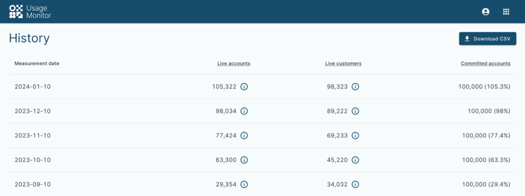

# Usage Monitor

Welcome to the Vault Core Usage Monitor application documentation.

## Logging in and permissions

chat\_bubble

You need to configure your Identity Provider (IDP) with your Vault Core details to support access to both Core Apps and Operations Dashboard.

### Role permissions

 
| Permission resource | Required operations |
| --- | --- |
| 
Usage commit

 | 

View

 |

### Accessing Usage Monitor

You can access Usage Monitor by using your unique client URL. Alternatively, you can visit Operations Dashboard and select Usage Monitor from the App Switcher in the navigation menu for each Vault Core app.

The following URLs contain a `$<placeholder>` in place of your unique client details for the purposes of these examples.

#### Example URL for bank-hosted environments:

#### Example URL for SaaS environments:

#### App Switcher:

#### More information:

If you require information about configuring access to Core Apps and Operations Dashboard, see the following setup guides. These guides link to the [Setting up and Configuring Vault with a SAML IDP](/vault-core/5-8/EN/environment_and_installation/infrastructure_docs/setting_up_and_configuring_vault_with_a_saml_idp/) guide and provide an overview of the overall steps to set up Vault Core.

-   Clients with a bank-hosted Vault Core environment: [Getting Started with Vault Core](/vault-core/5-8/EN/environment_and_installation/infrastructure_docs/getting_started_with_vault_core)
    
-   Clients with a Vault Core SaaS environment: [Environment details guide → Core Apps and Operations Dashboard](/vault-core/5-8/EN/environment_and_installation/saas/introduction_to_vault_saas/environment_details_guide#core_apps_and_operations_dashboard)
    

## What is Usage Monitor?

The Usage Monitor is a web application which measures historical usage of Vault Core by counting the total number of *live (customer) accounts* and *live customers* on a monthly *Measurement date*. It also displays the percentage of accounts in use, compared to an agreed number of *committed accounts*:

## The History columns and how the data is calculated

 
| Column name | Description |
| --- | --- |
| 
**Measurement date**

 | 

The date at which a total number of live accounts and customers that Usage Monitor has counted. The time is implicitly midnight.

 |
| 

**Live accounts**

 | 

The total number of live customer accounts in Vault Core as of the **Measurement date**.

A live account is any Customer Account that, in the three calendar months preceding the measurement date (inclusive), has had at least one posting or has a non-zero balance (which can be positive or negative). A Customer Account with zero balance is not considered a live account unless it has received a posting in the three months leading up to the measurement date.

For example, if the measurement date is 31 March, and a Customer Account with a zero balance receives one posting on or after 2 March (or 3 March if it’s a leap year), it is considered a live account.

 |
| 

**Live customers**

 | 

The total number of live customers in Vault as of the **Measurement date**.

A *live customer* is any customer that, in the three months preceding the **Measurement date**, has been associated with at least one *live account*.

 |
| 

**Committed accounts (and percentage used)**

 | 

The total number of accounts included in the fixed base price for your Vault Core instance, contractually agreed with Thought Machine. Any additional live accounts on the instance are charged at a Pay-as-You-Go (PaYG) rate.

The percentage of live accounts on Vault Core (as a proportion of the committed Accounts) is displayed in parentheses.

*Note: This column displays "0" if there is no fixed price agreement in place.*

 |

## Downloading the CSV

Depending on your contractual agreement, Thought Machine may request a CSV export of your Vault Core usage history, in which case you can use the **Download CSV** button to save the complete usage history for sending to us.

## Deployment and values.yaml

For Usage Monitor deployment information, see [Deploying Usage Monitor](/vault-core/5-8/EN/environment_and_installation/infrastructure_docs/tmcomponent_operator_user_guide/advanced_installation_options#deploying_usage_monitor).