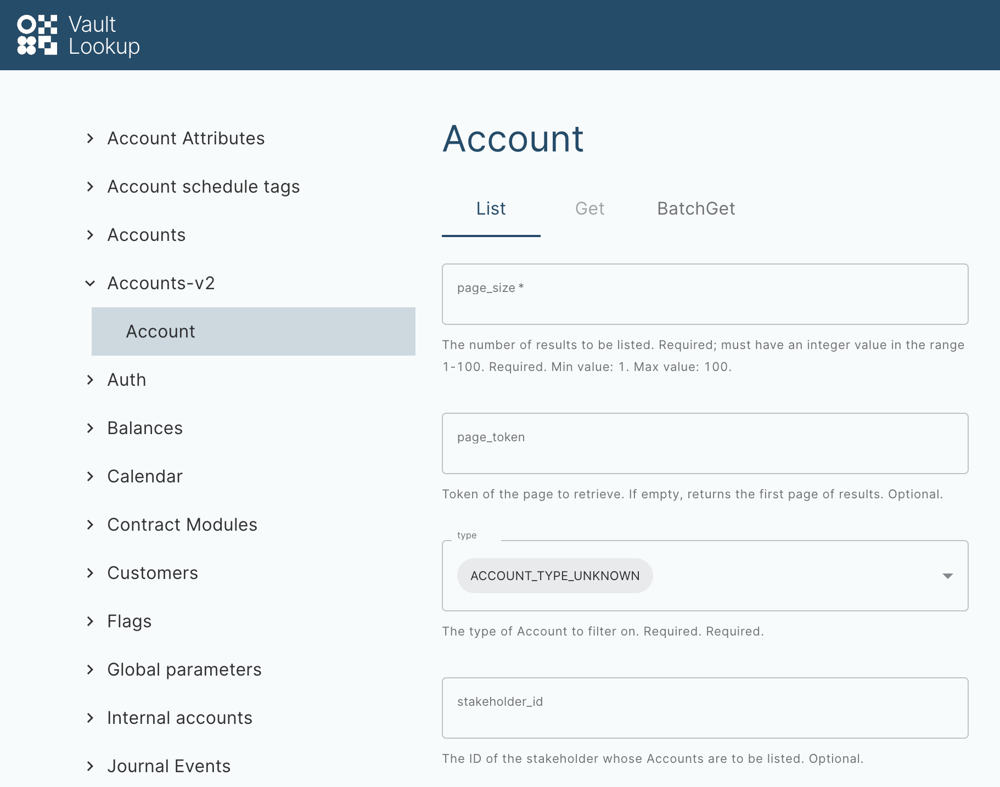

# Vault Lookup

Welcome to the Vault Lookup application documentation.

## Logging in and permissions

chat\_bubble

You need to configure your Identity Provider (IDP) with your Vault Core details to support access to both Core Apps and Operations Dashboard.

### Role permissions

 
| Permission resource | Required operations |
| --- | --- |
| 
Account

 | 

View

 |
| 

Account schedule tag

 | 

View

 |
| 

Account Migration

 | 

View

 |
| 

Account schedule association

 | 

View

 |
| 

Account update batch

 | 

View

 |
| 

Account update

 | 

View

 |
| 

Account attribute

 | 

View

 |
| 

Balances live

 | 

View

 |
| 

Balances time range

 | 

View

 |
| 

Bookkeeping date

 | 

View

 |
| 

Contract module version

 | 

View

 |
| 

Contract module

 | 

View

 |
| 

Smart Contract Module Versions Link

 | 

View

 |
| 

Customer address

 | 

View

 |
| 

Journal event

 | 

View

 |
| 

Journal events checksum

 | 

View

 |
| 

Global parameter value

 | 

View

 |
| 

Parameter Value Hierarchy Node

 | 

View

 |
| 

Parameter Value

 | 

View

 |
| 

Parameter

 | 

View

 |
| 

Payment device link

 | 

View

 |
| 

Account-plan association

 | 

View

 |
| 

Plan migration

 | 

View

 |
| 

Plan schedule

 | 

View

 |
| 

Plan update

 | 

View

 |
| 

Plan

 | 

View

 |
| 

Post posting failure

 | 

View

 |
| 

Ascync operation

 | 

View

 |
| 

Postings API client

 | 

View

 |
| 

Processing Group

 | 

View

 |
| 

Product version parameters timeseries

 | 

View

 |
| 

Restriction

 | 

View

 |
| 

Job

 | 

View

 |
| 

Supervisor contract version

 | 

View

 |
| 

Supervisor contract

 | 

View

 |
| 

Posting instruction batch

 | 

View

 |

### Accessing Vault Lookup

You can access Vault Lookup by using your unique client URL. Alternatively, you can visit Operations Dashboard and select Vault Lookup from the App Switcher in the navigation menu for each Vault Core app.

The following URLs contain a `$<placeholder>` in place of your unique client details for the purposes of these examples.

#### Example URL for bank-hosted environments:

#### Example URL for SaaS environments:

#### App Switcher:

## What is Vault Lookup?

### Definition

Vault Lookup is a Web Application that enables you to conduct read-only queries to retrieve resources from Vault Core’s Core API endpoints:

