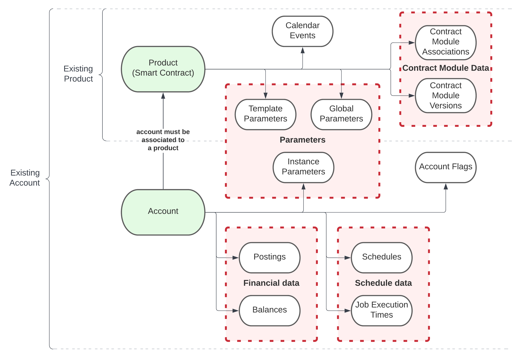
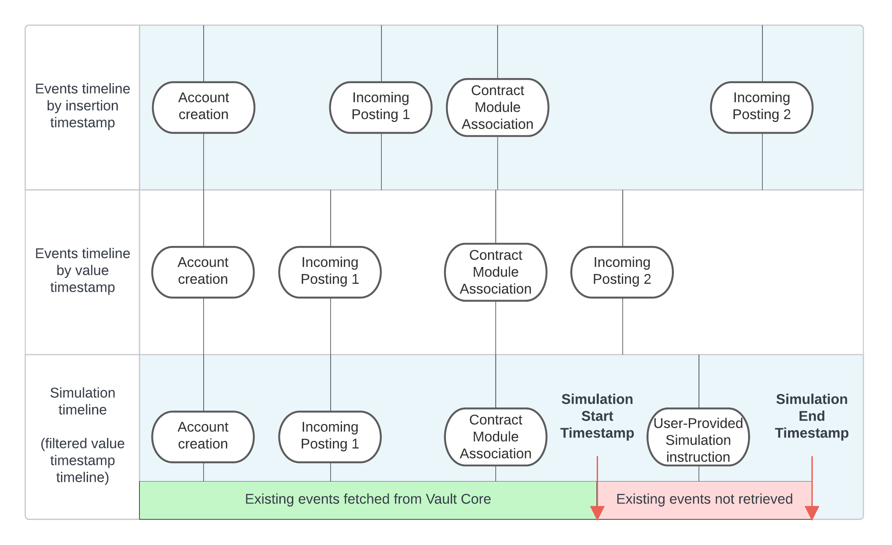

# Contract Simulation

*Contract Simulation* enables you to test Smart Contracts, Supervisor Contracts, and Contract Modules by simulating their execution without affecting the live Vault Core instance.

The Simulation works by registering a Smart Contract in an in-memory approximation of Vault Core, making it safe to reference any existing data and modify it in a simulation request. Any modifications made within a simulation do not persist after the request has completed.

In this guide, you can familiarise yourself with the [types of Contract Simulation](/vault-core/5-8/EN/reference/contracts/contract_simulation#types_of_contract_simulation), learn [how to use the API](/vault-core/5-8/EN/reference/contracts/contract_simulation#how_to_use_contract_simulation), and understand the [important caveats](/vault-core/5-8/EN/reference/contracts/contract_simulation#important_caveats_when_running_simulation) when running a simulation.

warning

Contract Simulation is a privileged API with Read access to customer account states (flags, parameters, balances).

Make sure that only the appropriate users are authorised to use this API due to its privileged data access.

## Types of Contract Simulation

You can run three different types of Simulations:

-   *New* Smart Contracts, Supervisor Contracts, or Contract Modules in a virtual simulation environment, where you can observe their outputs. You can create these contracts within the simulation request directly.
    
-   *Existing* Smart Contracts, Supervisor Contracts, or accounts in Vault Core. This is known as Existing *Account* or *Product* Simulation, which can simulate the following:
    
    -   *Existing Account Simulation*: Existing Vault Core accounts by retrieving the state of the account at the simulation start time. Any modifications made to existing accounts within a simulation do not persist after the Simulation request is completed.
        
        For more information, see [Existing Account Simulation](/vault-core/5-8/EN/reference/contracts/contract_simulation#existing_account_simulation).
        
    -   *Existing Product Simulation*: Existing Vault Core products and the state of their associated level at the simulation start time.
        
        For more information, see [Existing Product Simulation](/vault-core/5-8/EN/reference/contracts/contract_simulation#existing_product_simulation).
        
    

## Existing Account Simulation

*Existing Account Simulation* simulates existing Vault Core accounts by retrieving the state of an account at the simulation start time.

The state of the account includes all associated resources referenced within a Smart Contract or Supervisor Contract hook execution. For existing accounts, these resources include:

-   Event type schedules
    
-   Schedule last execution times
    
-   Postings
    
-   Balances
    
-   Account flags
    
-   Instance parameters
    
-   Expected parameter values (resolved for the account specified in the simulation request)
    

A subset of this behaviour is the ability to specify existing products (Smart Contracts, Supervisor Contracts, and Contract Modules) and retrieve their associated states as of the Simulation start time. For more information, see [Existing Product Simulation](/vault-core/5-8/EN/reference/contracts/contract_simulation#existing_product_simulation).

### Existing Account Simulation data hierarchy

The following diagram shows the hierarchy of data referenced in an Existing Account Simulation request:

Existing Account Simulation creates a simulated Vault instance that reflects what the real Vault instance was at the simulation start time, so associated existing data is only retrieved up to the start time.

However, it is important to note some resources in Vault Core have an *insertion timestamp* and a *value/effective timestamp* (see [Timestamps in Vault Core](/vault-core/5-8/EN/reference/postings#timestamps_in_vault_core)):

-   Insertion timestamp: The real-time timestamp when the resource was created. It is always increasing for a particular set of resources.
    
-   Value/Effective timestamp: The logical time of an event that is provided by the client in the Smart Contract hook execution. Sometimes referred as the *effective time* of the resource.
    

If a resource has a value/effective timestamp earlier than its insertion timestamp, it has been "backdated". If a resource has a value/effective timestamp later than its insertion timestamp, it has been "future-dated".

info

Contract Simulation refers to the *insertion timestamp* to determine whether or not a resource is included in a simulation. Only resources that were inserted *before* the simulation start time are included in the simulated Vault instance, regardless of their value/effective timestamp.

For example, if a posting was inserted after the simulation start time, it is **not** included in the simulated Vault instance, even if it is backdated (with a value timestamp earlier than the insertion timestamp). This reflects that if the real Vault instance was observed at the simulation start time, it would not have this posting.

The following diagram illustrates the data that the simulation references. As noted, Incoming Posting 2 is *not* retrieved as it was inserted after the simulation start time, even though it was backdated.

### Examples of Existing Account Simulation

Here are some example use cases for Existing Account Simulations, with a simulation start time equivalent to *now*:

-   Retrieving the loan repayment schedule of an existing loan if a given parameter (such as interest rate) were to change.
    
-   Retrieving the actual value of an existing savings account in one year’s time, given future dated interest rate adjustments, product version changes or postings made into or out of the account.
    
-   Validating whether a given set of postings would be accepted or rejected for an existing account, and the resulting balance given scheduled events (excluding account restrictions).
    

Other example use cases with a simulation start time *before* now but *after* the creation time of the existing account:

-   Retrieving account state at a point before a particular event happened (such as a posting or product migration), and running a simulation with different events.
    
-   Adjustment handling: simulating an account from a time in the past, inserting a posting at a time in the past and then allowing schedules to run until the present time to calculate the difference in balances.
    

## Existing Product Simulation

*Existing Product Simulation* simulates existing Vault Core products by retrieving the state of a product at the simulation start time. This includes Smart Contracts, Supervisor Contracts, and Contract Modules.

The state of the product includes all associated resources referenced within a Smart Contract or Supervisor Contract hook execution. For existing products, these resources include:

-   Global parameters
    
-   Template parameters
    
-   Calendar events
    

Separately, you can specify existing accounts and retrieve their associated states as of the simulation start time. For more information, see [Existing Account Simulation](/vault-core/5-8/EN/reference/contracts/contract_simulation#existing_account_simulation).

### Example of Existing Product Simulation

An example use case for Existing Product Simulation is to simulate actual values of global parameters contained within your Vault Core instance, without having to modify the simulation request each time (aside from the simulation start date, to pick up changes in parameter values).

You can also use the same Contract Module associations within the simulation request.

The following example request calls a derived parameter hook on a simulated account using existing product data:

## How to use Contract Simulation

Contract Simulation is a streaming endpoint in the Core API which can be accessed by making a REST request to [/v1/contracts:simulate](/vault-core/5-8/EN/api/core_api#contract).

Simulation internally replays all Smart Contract hooks (including scheduled events) that would have happened in the real Vault Core instance, and returns a JSON response.

### Instructions

First, you need to specify the following:

-   Start and end timestamps
    
-   Any existing or new Smart Contract(s), Supervisor Contract(s), or Contract Module(s) you want to simulate.
    
    -   For new contracts, define the corresponding `code` parameter as described in the [Contract Simulation](/vault-core/5-8/EN/api/core_api#contract) API reference.
        
    -   For existing accounts or products, see [Contract Simulation parameters](/vault-core/5-8/EN/reference/contracts/contract_simulation#contract_simulation_parameters).
        
    
-   `instructions[]` and `outputs[]` to run the simulation, as described in [Contract Simulation](/vault-core/5-8/EN/api/core_api#contract)
    

Then, make a request to the [/v1/contracts:simulate](/vault-core/5-8/EN/api/core_api#contract) endpoint in the same way as for any other `POST` request.

chat\_bubble

Simulation testing works in any version of the Contracts Language API, as it tests the product’s behaviour and integration with Vault Core using the [Core API](/vault-core/5-8/EN/api/core_api) endpoint.

The simulation will run through all the instructions one by one. Response lines are returned if hook directives or output logs are generated as part of this instruction processing.

#### Simulation response

Because this is a streaming endpoint, the response returns [new line delimited JSON strings](https://jsonlines.org/). You can use a JSON parsing library on each line as it is received on the response.

Not all response lines will be returned at once, rather, they are streamed to the client one by one. This allows the simulation to run for longer than typical and return more data than in a traditional request-response endpoint (due to size limits for singular responses).

lightbulb

You can use these responses in automated tests to help verify the behaviour of a Smart Contract. For example, you can check that the expected balances have been created.

You can also use these responses in end-user applications where the results can be rendered in a user-friendly way, such as a graph showing loan repayments.

To view examples of a Contract Simulation JSON response, see [Using Python for Contract Simulation](/vault-core/5-8/EN/reference/contracts/contract_simulation#using_python_for_contract_simulation).

### Contract Simulation parameters

To simulate existing accounts, products, and their associated state, specify the corresponding `id` parameter in the [Contract Simulation](/vault-core/5-8/EN/api/core_api#contract) endpoint.

  
| Parameter | Existing Account/Product | Description |
| --- | --- | --- |
| 
`existing_smart_contracts[]`

 | 

Smart Contracts

 | 

Specify the product version ID of the existing Smart Contract(s) you want to reference in the simulation. This will return their product state at the simulation start time.

 |
| 

`existing_contract_modules[]`

 | 

Contract Module

 | 

Specify the product version ID of the Contract Module(s) you want to reference in the simulation.

 |
| 

`existing_supervisor_contracts[]`

 | 

Supervisor Contract

 | 

Specify the product version ID of the Supervisor Contract(s) you want to reference in the simulation. This will return their product state at the simulation start time.

 |
| 

`existing_product_data_behaviour[]`

 | 

Product data

 | 

Specify whether to `include_all` or one or two data types in `include_data_types[]`: global parameters, template parameters, and/or calendar events. **Note**: This also affects *new* Smart Contracts data. For example, you can specify a Smart Contract that references an existing calendar, and simulate existing calendar events.

 |
| 

`existing_accounts[]`

 | 

Account

 | 

Specify the ID of the existing Vault Core Account(s) you want to reference in the simulation. This will return their account state (including the associated product state) at the simulation start time.

 |

### Using Python for Contract Simulation

Below is a simple Python script that makes a request to the [Contract Simulation](/vault-core/5-8/EN/api/core_api#contract) endpoint and outputs each response line.

info

In order to use this script, you must install the [requests library](https://pypi.org/project/requests/). You can install this using [pip](https://pypi.org/project/pip/) or some other Python package manager.

Running the above script produces output that looks something like this:

In the first line, the response informs us that an account was created with scheduled jobs. Then, the scheduled event runs twice, and we can see the `account note` confirming the Smart Contract got instructed. The events only ran twice because the simulation stopped when it reached the specified `end_timestamp`.

### Debugging Contracts using Simulation

#### Unstructured response logs

The `logs` field in the simulation response is intended for human-readable feedback and debugging.

warning

The content of simulation logs is unstructured and undocumented. These strings may change without notice between Vault Core releases (for example: phrasing changes, addition of metadata, or casing updates).

Do not rely on string-matching or regex patterns against the `logs` field for programmatic assertions in automated tests.

These enums are defined in the [Core API](/vault-core/5-8/EN/api/core_api#contracts) under the `posting_instructions[].contract_violations[].violation_type` field.

If you are transitioning from log-based testing to structured API testing, use the following mapping from the log string to the Protobuf-based Enum values:

 
| Simulation log String | Enum |
| --- | --- |
| 
AgainstTermsAndConditions

 | 

`CONTRACT_EXECUTION_VIOLATION_BREACH_TERMS_AND_CONDITIONS`

 |
| 

InsufficientFunds

 | 

`CONTRACT_EXECUTION_VIOLATION_INSUFFICIENT_FUNDS`

 |
| 

WrongDenomination

 | 

`CONTRACT_EXECUTION_VIOLATION_WRONG_DENOMINATION`

 |
| 

Custom

 | 

`CONTRACT_EXECUTION_VIOLATION_CLIENT_CUSTOM_REASON`

 |
| 

Unknown

 | 

`CONTRACT_EXECUTION_VIOLATION_UNKNOWN`

 |

#### Debugging Contracts using Logger

You can use [Logger](/vault-core/5-8/EN/reference/contracts/contracts_api_4xx/common_types_4xx/classes#logger) to add debug logs to Smart Contracts, Supervisor Contracts, and Contract Modules. This adds messages that are propagated upstream to the [/v1/contracts:simulate](/vault-core/5-8/EN/api/core_api#contract) endpoint.

Below is a simple Python script that adds debug logs into Contract code and in the response from the Contract Simulation endpoint.

The streamed out response:

### Helper script

The *Vault Caller* helper script makes Smart Contract testing easier by providing a simple Python-native way of calling the [Contract Simulation](/vault-core/5-8/EN/api/core_api#contract) endpoint without writing any REST requests. This script is intended for use during contract development.

For more advanced use cases (such as automated testing), we recommend using a framework capable of making REST calls.

#### Installation and usage

info

In order to use this script, you must install the [dateutil (v2.4.0)](https://pypi.org/project/python-dateutil/) and [requests (v2.22.0)](https://pypi.org/project/requests/) packages. You can install this using [pip](https://pypi.org/project/pip/) or some other Python package manager.

Once you install the external libraries, you can download [vault\_caller.py](/vault-core/5-8/EN/resources/smart_contracts/vault_caller.py) and start testing your contracts through the [Contract Simulation](/vault-core/5-8/EN/api/core_api#contract) endpoint.

Download download

warning

The Vault Caller script was written using Python 3.6.8, and is not kept up to date.

We expect Smart Contract writers to maintain their own method for calling Vault Core’s REST API. This script is only intended as a template for how this might look.

## Important Caveats when running Simulation

This section contains important information to be aware of when using Simulation and Existing Account Simulation.

-   [v1 InternalAccounts](/vault-core/5-8/EN/api/core_api#internal_accounts) (deprecated as of Vault Core v5.0) cannot be created in Simulation. To mimic a v1 internal account in Simulation, you can create a [v1 (Customer) Account](/vault-core/5-8/EN/api/core_api#accounts) with a blank Smart Contract.
    
    However, this means the v1 Account has an *account* balance and can stream balance events (similar to [AccountBalanceEvent](/vault-core/5-8/EN/api/core_api#accountbalanceevent) or [BalanceEvent](/vault-core/5-8/EN/api/core_api#balanceevent) topics), unlike in production instances of Vault Core where internal accounts do not have account balances and therefore do not stream out account balance updates.
    
-   Ledger balances are not supported in Simulation and cannot be queried for v1 or v2 Accounts (Customer or Internal), unlike in production instances of Vault Core which supports Ledger balances for all account types.
    
-   In production, [v2 Internal Accounts](/vault-core/5-8/EN/reference/accounts/accounts_version_2#creating_an_internal_account) do not have an account balance - they only have a Ledger balance. As Ledger balances are not supported in Simulation, as a workaround, you can derive the balance of a v2 Internal Account from Posting Events returned in the Simulation response. A working example constructing a balance view from Posting Events is available in the [Inception SDK](/vault-core/5-8/EN/reference/contracts/contracts_api_4xx/development_and_testing#inception_sdk).
    
-   Differently to Vault Core, the Accounts v1 API instructions in simulation will allow you to create, convert, or close accounts using Smart Contracts that reference Parameters via the `expected_parameters` [metadata field](/vault-core/5-8/EN/reference/contracts/contracts_api_4xx/smart_contracts_api_reference4xx/metadata#expected_parameters) in the Smart Contract. When creating or converting an account using the `CreateAccount` or `CreateAccountUpdate` instructions, you can specify `instance_parameter_values` to specify account-owned parameter values for a Parameter referenced as an expected parameter in the Smart Contract.
    
-   A Simulation Request cannot contain both Accounts v1 API instructions and Accounts v2 API instructions. This means that you must either to use `create_account`/`create_account_update`/`update_account` or `v2_create_account`/`update_account` for all account creations and updates. It is however possible to update an existing account with the v2 update account instruction independent of whether the account was created with Vault Core Accounts v1 or v2 API.
    
-   When creating an account with `v2_create_account` the following fields are not supported: `stakeholder_ids`, `alias`, and `details`. These fields also cannot be updated with `v2_update_account`.
    
-   When updating an account with `v2_update_account`, only one field can be updated per request.
    
-   Accounts can only be created in the `ACCOUNT_STATUS_OPEN` status. Any other provided status will be treated as `ACCOUNT_STATUS_OPEN`.
    
-   To use existing accounts, they must be in account status `OPEN` or `PENDING_CLOSURE` by the simulation start time. Attempting to run simulation with an account in any other account status will result in an HTTP 400 response.
    
-   The Metadata field `events_timezone` is not supported in CLv3 or Vault Core 4, and will default to the `UTC` time zone.
    
-   Existing plan supervision is currently not supported. This means that specifying an existing account ID will not also resolve its existing supervision associations and plan. Because of this, any existing plan schedules overriding the account schedules at simulation start time are also not provided to the simulation.
    
-   If an existing account is on a Smart Contract written in [Contracts Language API 3](/vault-core/5-8/EN/reference/contracts/contracts_api_3xx) and that Smart Contract defines scheduled events, then these schedules are always created in simulation with status `SCHEDULE_STATUS_PENDING`. This means that simulation ignores any status, skip timestamp, test pause timestamp (applied by a [schedule tag](/vault-core/5-8/EN/api/core_api#scheduletag), [account schedule tag](/vault-core/5-8/EN/api/core_api#account_schedule_tags), or otherwise).
    
-   If an existing account is on a Smart Contract written in [Contracts Language API 4](/vault-core/5-8/EN/reference/contracts/contracts_api_4xx) and that Smart Contract defines scheduled events, any schedule with status `SCHEDULE_STATUS_DELAYED` is overridden with status `SCHEDULE_STATUS_PENDING`. This means that simulation ignores the test pause timestamp (applied by a [schedule tag](/vault-core/5-8/EN/api/core_api#scheduletag), [account schedule tag](/vault-core/5-8/EN/api/core_api#account_schedule_tags), or otherwise).
    
-   What existing data is fetched for an existing account is determined by the union of all hook requirements specified by the hooks in its Smart Contract. If there is no hook requirement for a requirement data type, then it is not inserted in the simulation.
    
-   If an existing account has a lot of data associated, and large requirement periods within its contract (for example, fetching >1k postings due to a requirement period of one year in a Smart Contract hook), the simulation may take a long time to complete.
    
-   Existing parameter value `EffectiveTo` timestamps may not be recovered precisely as of simulation start times in the past. The simulation will use the `EffectiveTo` timestamp on the parameter value that is currently active in Vault Core.
    
-   Simulation does not know if existing parameter values, set via the `expected_parameters` metadata field, have explicitly set `EffectiveTo` timestamps. This means that simulation may accept instructions to create or update parameter values at timestamps that override existing parameter values, in cases where the real Vault Core instance would not allow.
    
-   In Simulation, as in Vault Core, after account conversion the Product Parameter history now reflects that of the Product that the account has been converted to. It does not show Product Parameter history of the original product the account was attached to.
    
-   Existing Account Simulations with start timestamps too far in the past (that is, to a previous major Vault Core version) may not behave as expected.
    
-   Existing Account Simulations with start timestamps before the migration event of accounts created through the Data Loader API (including migrated accounts with a `source_create_timestamp` before the simulation start timestamp) will result in an HTTP 400 response.
    
-   Simulation does not support more than one Processing Group. This means that it is not possible to use Existing Account simulation for two accounts in different processing groups.
    
-   When using a single Processing Group with a specific id (rather than the default), care should be taken to supply the `processing_group_id` on the `v2_create_account` instruction else it will fail.
    
-   Simulation does not allow accounts to be removed from a plan once associated. The only valid status for associating accounts with plans is `ACCOUNT_PLAN_ASSOC_STATUS_ACTIVE`.
    
-   When running multiple schedules at the same timestamp, all schedules will execute before their outcomes are processed, even if the schedules are in an event type group. The resulting behaviour is that the schedules will not see the outcomes of one another for any jobs that share the same instruction timestamp. If your schedules depend upon the outcomes of each other, we suggest that you define them to run sequentially, so that the event outcomes are always processed before the next event.
    
-   Schedules in simulation will not be blocked if the schedule jobs belonging to them instruct postings that are rejected. In a real Vault Core instance, if a contract instructs postings as part of a schedule job and any of those postings are rejected by Vault Core, then the schedule job will be marked as failed, along with the schedule, and subsequent schedule jobs will not be created. In contract simulation, for the same scenario, the schedule will not be marked as failed and will continue emitting subsequent schedule jobs.
    
-   As customers are not supported in Simulation, customer-owned Flags are not supported either. Flag Definitions are implicitly created with level `FLAG_LEVEL_ACCOUNT`. When using Existing Account Simulation for an account with stakeholders which have customer-owned Flags applied, these are treated as account-owned Flags instead.
    
-   The `create_posting_instruction_batch` instruction does not allow the `payment_device_token` to be set. The `target_account` must be set to `account_id`.
    
-   Existing account simulation does not respect account restrictions. If a restriction was in place at the start of the simulation, or added/removed during the simulation time window, this will not affect the simulation.
    
-   Simulation does not support Adjustments. Therefore, any schedules within a Smart Contract with Adjustment points defined on the [SmartContractEventType](/vault-core/5-8/EN/reference/contracts/contracts_api_4xx/common_types_4xx/classes#smartcontracteventtype) or adjustment smart contract hooks ([scheduled\_event\_adjustment\_hook](/vault-core/5-8/EN/reference/contracts/contracts_api_4xx/smart_contracts_api_reference4xx/hooks#scheduled_event_adjustment_hook), [post\_posting\_adjustment\_hook](/vault-core/5-8/EN/reference/contracts/contracts_api_4xx/smart_contracts_api_reference4xx/hooks#post_posting_adjustment_hook), [post\_parameter\_change\_adjustment\_hook](/vault-core/5-8/EN/reference/contracts/contracts_api_4xx/smart_contracts_api_reference4xx/hooks#post_parameter_change_adjustment_hook)) will be ignored during the simulation process.