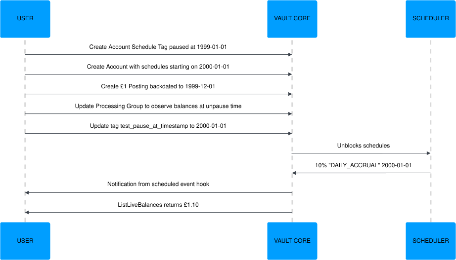

# Development and testing

Since [Contracts Language API 4.0](/vault-core/5-8/EN/reference/contracts/introduction#contracts_language_api), developing and unit testing Smart Contracts, Supervisor Contracts or Contracts Modules is no different to standard Python code development.

## Development

Smart Contract, Supervisor Contract and Contract Module files are plain Python files. Vault does not provide a GUI for creating Contracts. You can use any editor/IDE capable of editing Python files and rely on [Smart Contracts API](/vault-core/5-8/EN/reference/contracts/contracts_api_4xx/smart_contracts_api_reference4xx/), [Supervisor Contracts API](/vault-core/5-8/EN/reference/contracts/contracts_api_4xx/supervisor_contracts_api_reference4xx/), [Contract Modules API](/vault-core/5-8/EN/reference/contracts/contracts_api_4xx/contract_modules_api_reference4xx/), also [Common types](/vault-core/5-8/EN/reference/contracts/contracts_api_4xx/common_types_4xx/) reference for documentation. Smart Contracts, Supervisor Contracts together with Contract Modules are executed in a C Python interpreter. The Python version used in Contract execution is determined by the [Smart Contract API version](/vault-core/5-8/EN/reference/contracts/introduction#contracts_language_api) in use.

We recommend that you use the [Contracts SDK](/vault-core/5-8/EN/reference/contracts/contracts_api_4xx/development_and_testing#contracts_sdk) library locally for development and unit testing of the Contracts code, as it provides installable `contracts_api` Python package with accurate representation of the Contracts Language API code used in Contracts execution in the real Vault. This package enables standard Python development tools to be used for auto-completion, linting, code coverage and unit tests.

## Testing

There are several different ways that Smart Contracts, Supervisor Contracts and Contract Modules can be tested:

-   Unit tests using the [Contracts SDK](/vault-core/5-8/EN/reference/contracts/contracts_api_4xx/development_and_testing#contracts_sdk) library.
    
-   Using the [Contract Simulation](/vault-core/5-8/EN/reference/contracts/contract_simulation/) Core API endpoint.
    
-   Using the standard [Core APIs](/vault-core/5-8/EN/api/core_api/) and testing the Contracts behaviour via live Accounts end-to-end over time.
    
-   [Accelerated Testing](/vault-core/5-8/EN/reference/contracts/contracts_api_4xx/development_and_testing#accelerated_testing) of scheduled operations.
    

## End-to-end testing

In a test environment, you can create end-to-end tests of Smart and Supervisor Contracts that are running in production, and use the [Contract Events and Contract Executions API](/vault-core/5-8/EN/reference/contracts/contracts_api_4xx/running_contracts_in_production#contract_events_execution_api) to verify that a Smart Contract is invoked as expected, and that no error was encountered.

chat\_bubble

The Contract Executions API is best-effort delivery and subject to a data retention period. See [Contract Events and Contract Executions API](/vault-core/5-8/EN/reference/contracts/contracts_api_4xx/running_contracts_in_production#contract_events_execution_api) for further information.

## Contracts SDK

The Contracts SDK is a Python package that can be used to develop and unit test Smart Contracts, Supervisor Contracts and Contract Modules. It offers unit testing capabilities with accurate custom Contracts types representation, unit test utilities and some example unit tests. Most importantly, it provides an installable Python package, `contracts_api`, that can be used for local development and unit tests.

chat\_bubble

From Contracts Language API version 4.0, the Contracts SDK is the only package that provides unit test support for Contracts development.

Key Contracts SDK features:

-   The custom Smart Contracts, Supervisor Contracts and Contract Modules types included in the Contracts SDK are the same as the ones used in Vault to execute Contracts. All attributes and methods supported in the Contracts Language API version 4.0 have an implementation that is provided in the Contracts SDK library.
    
-   The Contracts SDK comes with a specification class that can be used for mocking the `vault` object. The spec class is a base class in the real `vault` object used to execute Contracts in Vault, and therefore does not allow invalid `vault` methods or arguments to be passed in unit tests.
    
-   From Contracts Language API 4.0, the Contracts SDK can be used together with standard Python tooling and imports to develop and unit test Contracts (see [Installation](/vault-core/5-8/EN/reference/contracts/contracts_api_4xx/development_and_testing#installation)).
    
-   Some custom Contracts types shipped with the Contracts SDK have attribute validations at initialisation. However, the validation mechanism is not defensive, as the custom classes contains typing hints and we recommend always running static type checks on developed Contracts code using the `mypy` module before uploading them as Products in Vault.
    

### Installation

You can download the zipped Contracts SDK package [here](/vault-core/5-8/EN/reference/contracts/sdk_download). The Contracts SDK package is released with every Vault Core release and contains all supported versions of the [Contracts API](/vault-core/5-8/EN/reference/contracts/introduction#contracts_language_api).

To use the Contracts SDK, you must install the [dateutil](https://dateutil.readthedocs.io/en/stable/) library. You can do this using [pip](https://pypi.org/project/pip/) or a similar mechanism.

chat\_bubble

This package does not provide any distribution licenses, and all software rights are with Thought Machine exclusively.

#### The `contracts_api` Python package

The Contracts SDK contains the `contracts_api` Python package installable using `pip`, which supports the Contracts Language API 4.0 only. To ensure that `from contracts_api import …` works in your Contract code, install the `contracts_api` package:

To uninstall the `contracts_api` package run:

To build a Python wheel with a specific `CONTRACTS_API_VERSION` for the `contracts_api` package, run:

##### Code completion

With the `contracts_api` package installed, you can use the Python code completion feature to help you to develop your Smart Contract. The following example shows the feature in use for various parameters of the Smart Contracts API language:

### Unit testing Contracts

You can base the unit tests for Smart Contracts, Supervisor Contracts, and Contract Modules of API versions 4.0 on the standard unittest Python module TestCase classes, importing the contracts being tested as standard Python modules. To import any custom types and the VaultFunctions classes for assertions or data mocking, install the `contracts_api` python package as explained in [Installation Section](/vault-core/5-8/EN/reference/contracts/contracts_api_4xx/development_and_testing#installation).

The following sections have some Smart Contract and Supervisor Contract unit tests examples. However, there are more examples included in the Contracts SDK under the `example_unit_tests` directory.

#### Testing Contracts with Contract module dependencies

Smart or Supervisor Contracts based on API version 4.0 that import Contract Modules in their code need to have the Contract Module packages that are named by their alias to be available locally for the imports to work in unit tests. To ensure that `from contract_modules import module_alias` works in your contract code, create local directory `contract_modules` with the `module_alias.py` file and add its parent directory to the Python path before running the unit tests:

chat\_bubble

When importing Contract Modules, the import statement should start exactly with the `from contract_modules import`. The `contract_modules` is a dedicated namespace where the Contract Modules linked to the Smart Contract are added during the contract execution in real Vault. See [Using Contract Module in Smart Contracts](/vault-core/5-8/EN/reference/contracts/contracts_api_4xx/contract_modules_overview#using_contract_modules_in_smart_contracts).

#### Smart Contract example unit test

In the following unit test example, the `simple_contract_v400` Smart Contract `scheduled_event_hook` is being unit tested. Note that:

-   The contract code can be imported as any other Python module.
    
-   You can use the standard Python unittest module and tools.
    
-   The `contracts_api` package provides access to custom Contracts Language API types and libs.
    

#### Supervisor Contract example unit test

In the following unit test example, the `supervisor_contract_v400` Supervisor Contract `post_posting_hook` is being unit tested. Note that:

-   The contract code can be imported as any other Python module.
    
-   You can use the standard Python unittest module and tools.
    
-   The `contracts_api` package provides access to custom Contracts Language API types and libs.
    

### Mocking Vault

The SDK comes with lib modules that provide the `vault` spec classes for [Smart Contract Vault object](/vault-core/5-8/EN/reference/contracts/contracts_api_4xx/smart_contracts_api_reference4xx/vault/) and [Supervisor Contract Vault object](/vault-core/5-8/EN/reference/contracts/contracts_api_4xx/supervisor_contracts_api_reference4xx/vault/) that can be used to create a mocked `vault` with accurate supported methods and their arguments. Unit tests will fail if an invalid `vault` method is mocked or called or incorrect arguments are passed to it.

The mocked `vault` is an instance of the `unittest.mock.Mock` and it needs to be configured either with the data the Contract expects, or data that is required to perform the desired test. For Supervisor Contract unit tests, the supervised accounts' `vault` objects must also be mocked and set on the supervisor mocked `vault` in the `supervisees` dictionary.

In the example below, a mocked `vault` object is constructed so that it can be used in unit tests for a Supervisor Contract, which is based on Contracts Language API 4.0 spec class. The `vault` object has a mocked `get_plan_opening_datetime` method and supervisees `vault` object with a mocked `get_parameter_timeseries` method.

## Simulation Testing

Contract Simulation is another way of testing Smart Contracts, Supervisor Contracts and Contract Modules. It involves registering a Smart Contract inside an in-memory approximation of Vault known as Contract Simulation.

Contract Simulation is provided with start and end times, and will internally replay all events that would have happened in the real Vault - all Smart Contract Hooks (including scheduled code) will run as they would have with a real Vault instance.

Note that the Simulation testing is agnostic of the Contract Language API version used for the Contracts development, as it tests the Products behaviour and integration with Vault using [Core API](/vault-core/5-8/EN/api/core_api#contract) endpoint.

Basic usage of the simulation endpoint is described in the [Smart Contracts reference](/vault-core/5-8/EN/reference/contracts/contract_simulation).

## Accelerated Testing

Vault Core provides a way to carry out Accelerated Testing, which allows users to test scheduled operations without waiting for real time to elapse. This provides the flexibility to control time progression, allowing users to easily set up test states, evaluate behaviours, and inspect resulting side effects.

For example, Accelerated Testing allows users to test and iterate on mortgage products without having to wait years to see if interest accruals, due amount calculations and re-amortisations work as expected. Importantly, these tests are executed against a live instance of Vault Core, ensuring high fidelity in behaviour and side effects.

Accelerated Testing also allows users to test their integrations with Vault Core, which is not possible with other forms of testing, such as the [Contract Simulation endpoint](/vault-core/5-8/EN/reference/contracts/contract_simulation).

### How to conduct Accelerated Testing

To carry out Accelerated Testing, you will first need to set up the backdated Accounts you want to test, before using Processing Groups and Account Schedule Tags to speed up time and see the resulting side effects that occur.

#### 1\. Set up Accounts for Accelerated Testing

1.  Create an [Account Schedule Tag](/vault-core/5-8/EN/api/core_api#account_schedule_tags) (AST) with a `test_pause_at_timestamp` set to a time in the past, relative to the first schedule execution timestamp to test.
    
2.  Create a Smart Contract. Include the Account Schedule Tag’s ID in the `scheduler_tag_ids` of the `SmartContractEventType` to be accelerated.
    
3.  Create a Customer.
    
4.  Create a backdated Account:
    
    -   If using the /v2/accounts API:
        
        -   Set the `smart_contract_version_id` to match the Smart Contract ID.
            
        -   Set the `activation_timestamp` to a time later than the `test_pause_at_timestamp`. This is used as the `hook_arguments.effective_datetime` in the Smart Contract’s activation hook, and sets the minimum for its `ScheduledEvents`’ start times.
            
        
    -   If using the /v1/accounts API:
        
        -   Set the `product_version_id` to match the Smart Contract ID.
            
        -   Set the `opening_timestamp` to a time later than the `test_pause_at_timestamp`. This is used as the `hook_arguments.effective_datetime` in the Smart Contract’s activation hook, and sets the minimum for its `ScheduledEvents`’ start times.
            
        
    

#### 2\. Optional: Set up supervised Accounts for Accelerated Testing

You have the option to conduct Accelerated Testing of Accounts supervised by plans. To set this up, after creating a backdated Account:

1.  Create a Smart Contract:
    
    -   Include the Account Schedule Tag’s ID in the `scheduler_tag_ids` of the `SupervisorContractEventType` to be accelerated.
        
    -   Override the `SmartContractEventType`, for example `overrides_event_types=[("smart_contract_alias", "SMART_CONTRACT_EVENT_TYPE")]`
        
    
2.  Create a backdated Plan using the Data Loader API. Set the `opening_timestamp` to a time later than the `test_pause_at_timestamp`. This is used as the `hook_arguments.effective_datetime` in the Smart Contract’s activation hook, and sets the minimum for its `ScheduledEvents`’ start times.
    
3.  Create a backdated Account Plan Association using the Data Loader API. Set the `start_timestamp` to the Plan’s `opening_timestamp`.
    

#### 3\. Optional: Create backdated resources

Once you have set up the backdated Accounts, you can create backdated Postings, Parameter Values, and/or Flags to mimic events that occur during an Account’s lifecycle (such as transactions and interest rate changes):

-   Create backdated Postings: Set their `value_timestamp` to a realistic value relative to the account’s `activation_timestamp`/`opening_timestamp`.
    
-   Create backdated Parameter Values: Set their `effective_from_timestamp` to a realistic value relative to the account’s `activation_timestamp`/`opening_timestamp`.
    
-   Create backdated Flags: Set their `effective_timestamp` to a realistic value relative to the account’s `activation_timestamp`/`opening_timestamp`.
    

#### 4\. Speed up time progression

To control time progression, you will need to repeat the following steps until you reach the end time:

1.  Update the default Processing Group to the active status (this can be done even if it is already in active status) and with `minimum_observation_timestamp_update_options.schedules_observe_balances_at_unpause_time` set to `true`.
    
2.  Update the `test_pause_at_timestamp` of the AST to a value equal or greater than the time that scheduled event(s) would be published. This will cause those events to be published.
    
3.  It will take up to a minute for schedules to execute and for their side effects (such as Postings) to become visible. To verify this has occurred, consume notifications from the `scheduled_event_hook`, or check for completed jobs using the [GET /v1/jobs endpoint](/vault-core/5-8/EN/api/core_api#_core_api_v1_scheduler_ListJobsResponse_ListJobs).
    
    1.  This can be sped up by reducing `scheduler.update_interval_secs` in `values.yaml` to a low number such as 2. This should only be done on test environments.
        
    
4.  Repeat these steps, advancing the `test_pause_at_timestamp` each time until the end time is reached. If desired, the [optional steps for creating backdated resources](/vault-core/5-8/EN/reference/contracts/contracts_api_4xx/development_and_testing#3_optional_create_backdated_resources) can be carried out prior to each repeat.
    

Below is an illustration of the overall flow:

### Inception SDK

The Inception SDK that ships with the Product Library contains tooling to automate and simplify Accelerated Testing. Its test framework helps to:

-   Handle the creation of test-specific Account Schedule Tags and modified contracts to refer to the test-specific Account Schedule Tags
    
-   Abstract Core API and Data Loader API considerations when creating backdated Accounts and Plans
    
-   Condense the steps within [Progressing Time](/vault-core/5-8/EN/reference/contracts/contracts_api_4xx/development_and_testing#progressing_time) into a single function call, even when multiple schedule executions need to be triggered
    

For more information, refer to the Product Library documentation that is contained in the [release file](/vault-core/5-8/EN/product_library/release_information/downloads).

### Known limitations

Accelerated Testing allows users to change the time at which scheduled events trigger. It preserves their effective time. Crucially, it does not change all of Vault Core’s functionality that depends upon real time. This means it is unsuitable for the following use cases:

 
| Unsupported use cases | Description |
| --- | --- |
| 
Non-functional testing

 | 

Accelerated Testing is not optimised for performance; using it in a live production environment would significantly impact Vault Core’s ability to handle reasonable load.

 |
| 

Triggering events into the future (future-dating)

 | 

The future relative to real time is important to Vault Core, as such triggering events beyond real time causes undesirable outcomes, such as failures and rejections. For this reason, we only support time manipulation in the past, ensuring we are backdating.

 |
| 

Testing behaviour related to snapshot timestamps

 | 

Behaviours relating to snapshot timestamps may be different. For example, schedules normally need to be in schedule groups to guarantee that a schedule can see previous schedules’ outputs. Due to the Processing Group updates in Accelerated Testing, this happens without schedule groups, which could hide a race condition present in a contract without schedule groups.

 |
| 

Testing the `post_parameter_change_hook`

 | 

Backdated parameter values do not trigger the `post_parameter_change_hook`, so financial logic within it, or dependent on it, cannot be tested.

 |
| 

Testing maturity of future-dated Postings

 | 

Accelerated Testing has no ability to trigger the maturity of postings; this can only be done by waiting for real time to elapse.

 |
| 

Testing future-dated Parameter changes

 | 

Accelerated Testing has no ability to trigger future-dated Parameter changes; this can only be done by waiting for real time to elapse.

 |

## Cleaning test environments

Over time, Vault Core environments used for testing become loaded with data that is no longer required, which can lead to environment slow-down and increased storage and processing costs. This is especially true for environments used for large-scale performance tests, so these benefit from automated cleaning to ensure runs are independent and unaffected by the data from previous tests.

warning

Thought Machine strongly recommends that environments other than production or production-representative instances are cleaned on a regular basis.

The following steps remove all the data from a Vault Core environment, providing a clean platform for further testing or using it for a different purpose. These steps will remove ALL database data including created API Service Account authentication tokens, Product Versions, Internal Accounts, Calendars and so on. You can use resource files and the [Configuration Layer Utility](/vault-core/5-8/EN/environment_and_installation/infrastructure_docs/configuration_layer_utility_user_guide/) to quickly restore Vault Core resources.

1.  Ensure the resource files to recreate the environment are available and there is no data required on the environment which is also stored outside the system.
    
2.  Check the Kafka Topics / Consumer Lag dashboard to ensure Kafka processing has completed and all messages have been consumed.
    
3.  Obtain the list of TMComponent k8s resources that are associated with the main Vault Core namespace using the command `kubectl get tmc`.
    
4.  Uninstall all TMcomponents that end with the namespace name. For example if the namespace is `tm-vault`, run: `vaultctl uninstall vault-core-tm-vault`.
    
5.  Check again that all messages have been consumed on all Vault Core Kafka topics. If there are unconsumed messages, lower the Kafka retention time to zero for any affected topics, then revert to standard retention once empty.
    
6.  Create an empty database instance to use with Vault Core and set it up following the steps in [Using a relational database](/vault-core/5-8/EN/environment_and_installation/infrastructure_docs/vault_cloud_infrastructure/using_a_relational_database/). Alternatively keep the same database host and drop all databases created as part of the Vault Core installation.
    
7.  Re-run the `vaultctl install` command with the required components. This will recreate the databases.
    
8.  Use the Configuration Layer Utility to re-create resources.
    
9.  Re-create service account authentication tokens, if using them rather than JSON Web Tokens, and associate them with upstream users of the APIs.