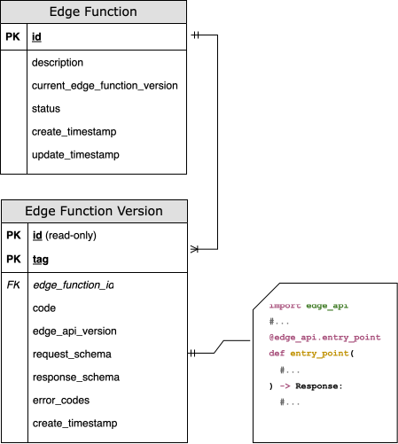

# How to update an Edge Function

lightbulb

If you are visiting this tutorial for the first time, take a look at the [Edge Functions Quick start guide](/vault-core/5-8/EN/reference/edge_functions/overview_and_getting_started/quick_start_guide) and [How to write an Edge Function](/vault-core/5-8/EN/tutorials/edge_functions_tutorials/how_to_write_an_edge_function). These guides explain some of the key concepts about Edge Functions, Edge Function versions, and how they relate to each other. You can view a diagram that provides an [overview of Edge Function resources and structure here](/vault-core/5-8/EN/tutorials/edge_functions_tutorials/how_to_write_an_edge_function#overview_of_edge_function_resources_and_structure).

## Overview of updating Edge Functions

There are three main reasons for updating an Edge Function, and they are distinctly different:

1.  Updating the fields or status of an existing Edge Function resource
    
2.  Updating an Edge Function resource to use a different, but existing, Edge Function Version as its current version (not creating a new Edge Function Version with new source code)
    
3.  Updating the source code of an Edge Function resource by creating a new Edge Function Version subresource
    

In addition, the Edge Functions platform provides two approaches for updating Edge Function resources and code for Edge Function Versions:

-   Using the Configuration Layer Utility (CLU) tool
    
-   Using the Edge Functions API
    

This tutorial covers all of these scenarios, focusing on using the API. You can get an overview of the CLU approach here and then follow the detailed guidance in the CLU’s dedicated documentation.

Follow the guidance for the scenario that matches what you want to achieve.

## Updating resources using the CLU

The Thought Machine Configuration Layer Utility is a tool that you can use to upload and manage resources for use with Vault Core. Each Edge Function is in one `.py` file.

In order to create or update an Edge Function resource using the CLU, the key steps are:

1.  Specify an Edge Function resource, for example `"test_edge_function"`.
    
2.  Add the new Edge Function resource and the required code and references to a manifest file.
    
3.  Import the manifest file, using the appropriate import command.
    

You can use the CLU to import a file using the following command:

You must pass the arguments with your command (represented by `[option(s)]` in the example), such as your authorisation token or JSON Web Token (JWT), and to set the addresses of the Vault Core API and Edge Functions API.

You must also provide the hostname for the Edge Functions API: `edge-functions-api`

Example:

**Example when using a Service Account token**

**Example when using a JWT (JSON Web Token)**

For a list of supported options for import, supported resources, and more information about using the CLU, see the [Configuration Layer Utility User Guide](/vault-core/5-8/EN/environment_and_installation/infrastructure_docs/configuration_layer_utility_user_guide).

## Updating the fields, status or version of an existing Edge Function

The key scenarios are as follows:

-   Updating information for an existing Edge Function resource - to do this, you must specify the fields to update to `update_mask`, and provide the updated information in the corresponding fields in the request body
    
-   Updating an existing Edge Function resource to associate a different, existing EdgeFunctionVersion (subresource) as the current version via the `current_edge_function_version.tag`
    

For example, you would update the `current_edge_function_version` tag if you want to specify a different Edge Function Version as the current version. This means that subsequent requests to execute the Edge Function result in executing the newly-specified Edge Function Version.

In this scenario, the Edge Function Version source code does not change. Instead, the only change is the Edge Function Version that is specified as the `current_version` of the Edge Function resource. You use the API to manage this, instead of the CLU, and generally only to test a different Edge Function Version.

To update the Edge Function parent resource, make a PUT request to the Edge Functions API:

You must provide the Edge Function ID and specify the field that you wish to update to `update_mask`.

The fields that you can update, and their corresponding values, are as follows:

-   `current_edge_function_version.tag` - the tag of the Edge Function Version that you want set as the current version of the Edge Function
    
-   `description` - the description of the Edge Function
    
-   `status` - the status of the Edge Function
    

The Edge Functions service ignores any fields that you do not include in this mask and does not update them.

info

Field combinations to avoid in update\_mask requests

You must not specify the `current_edge_function_version.code` field in the same request as the other fields when updating an existing Edge Function Version. This is because you should not attempt to update the source code for an existing Edge Function Version ID.

If you want to update/modify the source code that is associated with an Edge Function resource, you must create a new Edge Function Version instead. Otherwise, if you specify this field in the request, the request fails.

For information about the correct way to update the source code for an existing Edge Function, see [Updating the Edge Function source code by creating a new EdgeFunctionVersion](/vault-core/5-8/EN/tutorials/edge_functions_tutorials/how_to_update_an_edge_function#updating_the_edge_function_source_code_by_creating_a_new_edgefunctionversion)

Example:

For more information, see [How to upload an Edge Function](/vault-core/5-8/EN/tutorials/edge_functions_tutorials/how_to_upload_an_edge_function) and the [Edge Functions API reference](/vault-core/5-8/EN/api/edge_functions_api).

## Updating the Edge Function source code by creating a new EdgeFunctionVersion

To update the source code of an existing Edge Function (top-level) resource, you need to create a new EdgeFunctionVersion (subresource) for the Edge Function.

In the request, you must provide your updated source code and a new version tag (one that is not in use by another version), specifying the existing Edge Function resource.

This creates a new Edge Function Version (subresource) and assigns it as the current version for the Edge Function.

There are two ways that you can achieve this via the API, using the following endpoints:

-   [`CreateEdgeFunctionVersion`](/vault-core/5-8/EN/api/edge_functions_api#_edge_functions_api_v1_EdgeFunction_CreateEdgeFunction)
    
-   [`UpdateEdgeFunction`](/vault-core/5-8/EN/api/edge_functions_api#_edge_functions_api_v1_EdgeFunction_UpdateEdgeFunction)
    

To complete this using an API call for [`CreateEdgeFunctionVersion`](/vault-core/5-8/EN/api/edge_functions_api#_edge_functions_api_v1_EdgeFunction_CreateEdgeFunction), make a POST request to the Edge Functions API, specifying the Edge Function ID in the endpoint URL, and include the source code in the request body.

lightbulb

The `EDGE_FUNCTION_ID` is the value of `edge_function_version.edge_function_id` — in the following example code snippet, this is `TEST_EDGE_FUNCTION_ID`.

Permission scopes: `edge_functions:write`, `edge_functions.edge_function_versions:write`

  
| HTTP method | Name | Description |
| --- | --- | --- |
| 
`POST`

 | 

`CreateEdgeFunctionVersion`

 | 

Create a new Edge Function Version for an existing Edge Function.

 |

**Path (URL) request parameters:**

  
| Name | Description | Example |
| --- | --- | --- |
| 
Edge Function ID

 | 

*Required*. Unique ID of the parent Edge Function resource that you are updating.

 | 

`$EDGE_FUNCTION_ID`

 |

**Body parameters:**

  
| Name | Description | Example |
| --- | --- | --- |
| 
Request ID

 | 

*Required*. A unique ID used to ensure this request is idempotent.

 | 

`request_id`

 |
| 

Edge Function Version

 | 

*Required*. The Edge Function Version subresource that you are creating.

 | 

`EDGE_FUNCTION_VERSION`

 |
| 

`edge_function_version.**edge_function_id**`

 | 

The ID of the existing Edge Function resource that you are creating this new Edge Function Version for.

 | 

`"edge_function_id":$EDGE_FUNCTION_ID`

 |
| 

`edge_function_version.**tag**`

 | 

The version tag for the Edge Function Version (subresource) that you want to set as the current version of this Edge Function resource. When you make a request to execute an Edge Function, it triggers the execution of the specified current version. The current version is the Edge Function version that you specify here.

 | 

`"tag":"$EDGE_FUNCTION_VERSION_TAG"`

 |
| 

`edge_function_version.**code**`

 | 

The source code for the Edge Function Version. For guidance on writing Edge Function code, see [How to write an Edge Function](/vault-core/5-8/EN/tutorials/edge_functions_tutorials/how_to_write_an_edge_function)

 | 

`"code": "# Python Edge Function code"`

 |

To create a new `EdgeFunctionVersion` for the top-level Edge Function resource, make a POST request to the [`CreateEdgeFunctionVersion`](/vault-core/5-8/EN/api/edge_functions_api#_edge_functions_api_v1_EdgeFunctionVersion_CreateEdgeFunctionVersion) endpoint. The request creates a new `EdgeFunctionVersion` as a result; however, it does not set the new `EdgeFunctionVersion` as the `current_edge_function_version` of its associated Edge Function.

chat\_bubble

If you want to use the code of a new `EdgeFunctionVersion` when you execute its parent Edge Function, you must do one of the following:

-   specify the version tag of this new `EdgeFunctionVersion` when making the execution request
    
-   update the `EdgeFunction` to set the version tag of this new `EdgeFunctionVersion` tag as its default
    

This behaviour allows you to test new versions without affecting the default behaviour.

The other approach for updating the source code of an Edge Function through is to make an [`UpdateEdgeFunction`](/vault-core/5-8/EN/api/edge_functions_api#_edge_functions_api_v1_EdgeFunction_UpdateEdgeFunction) request.

You must provide the following in the request:

-   the ID of the Edge Function to update
    
-   updated source code in the `current_edge_function_version.code` field
    
-   a new value in the `current_edge_function_version.tag` field - this must be a value that you have not used for any other existing Edge Function Version
    

lightbulb

The `EDGE_FUNCTION_ID` is the value of `edge_function_version.edge_function_id` — in the example code snippet, this is `TEST_EDGE_FUNCTION_ID`.

Because the `UpdateEdgeFunction` endpoint receives a new version in the tag field - that is, for a version that does not exist, an update to an existing Edge Function Version subresource cannot occur. Instead of returning an error, it automatically creates a new Edge Function Version for the Edge Function that you specified, using the version `tag` and source `code` that you supplied.

To use this approach, make a `PUT` request to the Edge Functions API and include the source `code` and new version `tag` in the request body.

Permission scopes: `edge_functions:write`, `edge_functions.edge_function_versions:write`

  
| HTTP method | Name | Description |
| --- | --- | --- |
| 
`PUT`

 | 

`UpdateEdgeFunctionRequest`

 | 

Update an existing Edge Function.

 |

**Path (URL) request parameters:**

  
| Name | Description | Example |
| --- | --- | --- |
| 
Edge Function ID

 | 

*Required*. Unique ID of the parent Edge Function resource that you are updating.

 | 

`$EDGE_FUNCTION_ID`.

 |

**Body parameters:**

  
| Name | Description | Example |
| --- | --- | --- |
| 
Request ID

 | 

*Required*. A unique ID used to ensure this request is idempotent.

 | 

`request_id`

 |
| 

Edge Function

 | 

*Required*. The Edge Function resource with the update, containing the Edge Function ID and Edge Function details.

 | 

`edge_function`

 |
| 

`edge_function.**id**`

 | 

The ID of the Edge Function.

 | 

`"id": "$EDGE_FUNCTION_ID"`

 |
| 

`edge_function.**description**`

 | 

The description of the Edge Function.

 | 

`"description": "$EDGE_FUNCTION_NAME_DO_NOT_MODIFY"`

 |
| 

`edge_function. current_edge_function_version.**tag**`

 | 

The version tag for the Edge Function Version (subresource) that you want to set as the current version of this Edge Function resource. If you want to create a new Edge Function Version, use a tag that you have not used before. When you make a request to execute an Edge Function, it triggers the execution of the specified current version.

 | 

`"tag":"$NEW_VALUE_FOR_NEW_VERSION"`

 |
| 

`edge_function.current_edge_function_version.**code**`

 | 

The source code for the Edge Function Version. For guidance on writing Edge Function code, see [How to write an Edge Function](/vault-core/5-8/EN/tutorials/edge_functions_tutorials/how_to_write_an_edge_function)

 | 

`"code": "# New Python Edge Function code"`

 |
| 

`edge_function.**status**`

 | 

The description of the Edge Function. Acceptable values:

-   `EDGE_FUNCTION_STATUS_ACTIVE`
    
-   `EDGE_FUNCTION_STATUS_INACTIVE`
    

 | 

`status`

 |
| 

`update_mask`

 | 

*Required*. Update mask to specify which fields in the resource to update. You can specify more than one field in an array. The allowed fields are:

-   `description`
    
-   `current_edge_function_version.tag`
    
-   `current_edge_function_version.code`
    
-   `status`
    

 | 

`"update_mask": { "paths": [$FIELD_NAME]`

 |

### Example curl request to update the Edge Function with a new Edge Function Version

The table lists all valid fields that you can update in `edge_function` and pass to `update_mask` (`description`, `status`, `current_edge_function_version.code`, and `current_edge_function_version.tag`). However, in this example step, the goal is to update the Edge Function with new code by creating a new Edge Function Version. Because of this you should only update the following fields under `edge_function` and pass them the `update_mask` parameter:

-   `"current_edge_function_version.**code**"`
    
-   `"current_edge_function_version.**tag**"`
    

## Check that the new Edge Function Version is available

After creating the new Edge Function Version, make a [`GET`](/vault-core/5-8/EN/api/edge_functions_api#_edge_functions_api_v1_EdgeFunction_GetEdgeFunction) request to return the details of the current Edge Function Version for the Edge Function. This allows you to check whether your new Edge Function Version is available as the current version of the Edge Function that you updated.

Permission scopes: `edge_functions:read`, `edge_functions.edge_functions:read`

**Path (URL) request parameters:**

  
| Name | Description | Example |
| --- | --- | --- |
| 
Edge Function ID

 | 

*Required*. Unique ID of the parent Edge Function resource that you are updating. Some documentation examples use a placeholder to represent this: `$EDGE_FUNCTION_ID`

 | 

`create_savings_account`

 |

Alternatively, you can make one of the following requests:

-   [`ListEdgeFunctions`](/vault-core/5-8/EN/api/edge_functions_api#_edge_functions_api_v1_ListEdgeFunctionsResponse_ListEdgeFunctions)\` - to list all filtered EdgeFunction resources
    
-   [`BatchGetEdgeFunctions`](/vault-core/5-8/EN/api/edge_functions_api#_edge_functions_api_v1_BatchGetEdgeFunctionsResponse_BatchGetEdgeFunctions) – to retrieve all Edge Function resources for the Edge Function IDs that you specify