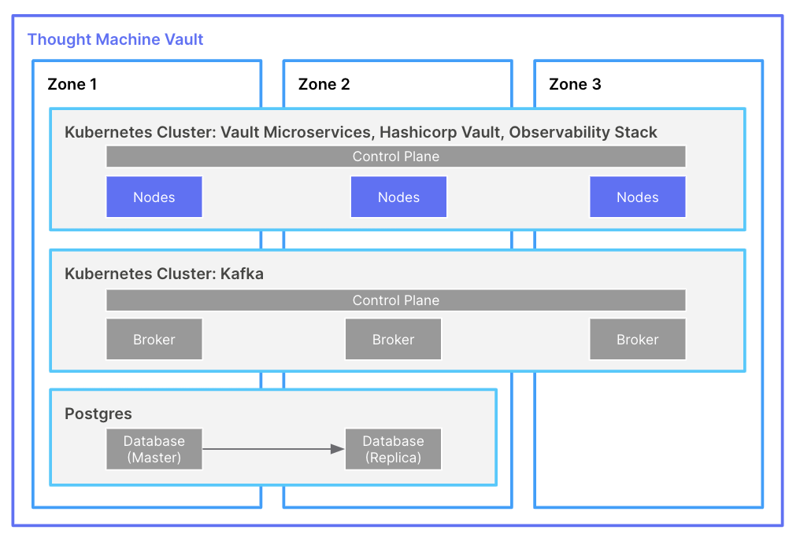
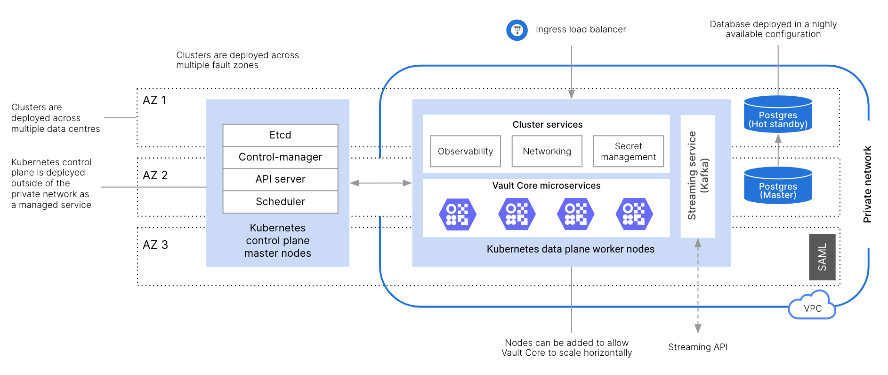
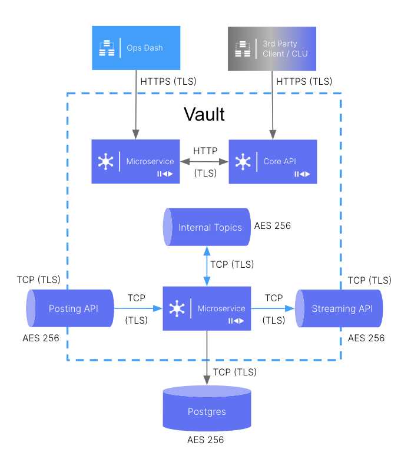
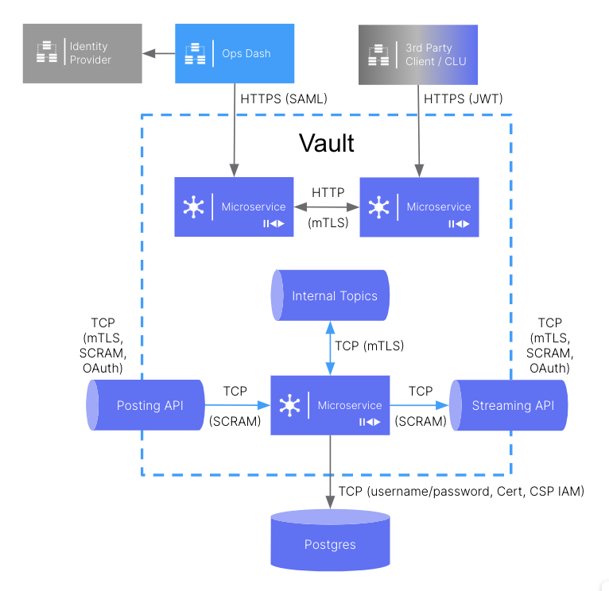

# Architecture

This page goes through how Vault Core is designed for cloud functionality.

## How is Vault Core built?

Vault Core is a next-generation, cloud-native, core banking engine which is architecturally implemented as a distributed system running on a Kubernetes cluster.

Vault Core is built around APIs using a microservices architecture. Your bank-hosted Vault Core instance includes most of the necessary services and infrastructure components to successfully run a bank’s core systems, such as account management, transaction processing, and product configuration. Additional services, provided by the bank or other vendors, connect through Vault Core’s APIs to complete a seamless, frictionless banking system.

By running Vault Core on Kubernetes, the infrastructure inherits advantages like high availability and horizontal scalability, which enables the system to respond to variable load throughout the banking day. These advantages optimise the use of cloud resources and make Vault Core resilient against many types of error.

Much of what happens inside the Vault Core microservices cluster is abstracted away as part of the Kubernetes layer, which enables a real cloud-native and cloud-agnostic solution.

## Vault Core design characteristics

Vault Core’s services follow these design characteristics to fully exploit all cloud features and support clients of all sizes.

### Scaling

Scaling is the measure of a system’s ability to decrease or increase in performance and cost, in response to changes in processing demands. A scalable solution is expected to remain stable and maintain its performance after a steep workload increase (whether expected or spontaneous).

Vault Core’s infrastructure enables efficient and elastic scaling for modern banking workloads in the following ways:

**Stateless microservices application layer**

-   Scales linearly and horizontally without having to size for peak loads.
    
-   Relies on the Kubernetes Horizontal Pod Auto-scalers (HPAs) to automatically scale pod replicas based on thresholds set on collected metrics, and a baselined redundancy allocation.
    
-   Scales based on standard metrics such as CPU and memory, and custom metrics like gRPC requests per second for specific services.
    

**Industry-leading open source database platform**

-   Postgres supports zero downtime storage (auto)scaling.
    
-   Disk space can be allocated appropriately and grow as the volume of data stored increases. Storage can be scaled up but not down.
    
-   CPU can be added to database instances, and databases may be switched to different instance types. This usually results in a short period of downtime (GCP AlloyDB excepted).
    

**Event-driven messaging based on the Kafka streaming platform**

-   Scales writes to achieve high throughput for asynchronous transaction processing.
    
-   Scales services independently based on their load profile.
    
-   Streams real-time data while avoiding extra load on the database.
    
-   Reduces impact on online processing due to sudden spike in volume generated by batch processing.
    

### Resilience

Resilient design is realised through the application of high availability and disaster recovery concepts and rely on good practices including comprehensive monitoring, automation, and redundancy:

**High availability**

-   Is concerned with components of the workload.
    
-   Mitigates against local disruption.
    

**Disaster recovery**

-   Is concerned with a complete copy of the entire workload.
    
-   Mitigates against large-scale events.
    

### High availability

Availability can simply be understood as system uptime: the percentage of time the system is available and operational, allowing data to be accessed. Highly available systems are designed to minimize downtime and avoid loss of service.

Vault Core uses three main cloud technologies to provide high availability of Vault Core when it is in operation:

-   *Kubernetes*: The Kubernetes control plane and data plane, as well as the actual microservices running on top of them, are deployed across three zones. Traffic is load-balanced across all nodes.
    
-   *PostgreSQL*: Logical database replication is achieved through a Postgres Master with a hot standby (in a second zone). This ensures zero data loss with fast automated failover.
    
-   *Kafka*: Kafka brokers are deployed across three zones to ensure high availability in an active-active-active setup. Topics are replicated synchronously to brokers running in different zones for fault tolerance. This ensures zero data loss and zero time to recover.
    

The diagram below shows how these technologies are configured in Vault Core:

A zone will have a different meaning depending on how Vault Core is deployed (on-premise or in a public cloud):

-   *On-premise*: in this case a zone represents a Fault Domain. This is a physical separation of workload across hardware within a single data centre. This includes separate power, cooling and network components across multiple server racks.
    
-   *Public cloud*: in this case a zone represents an Availability Zone. This is a physical separation of workload across three or more data centres. The data centres are linked by high-speed connections. This setup offers protection against localised disasters.
    

### High-level architecture

Wherever it is deployed, a Vault Core deployment follows a scalable and resilient architecture pattern.

There are key architectural differences between a legacy, monolithic architecture and a modern, cloud-native distributed architecture such as Vault Core. In a legacy architecture:

-   The bank’s core back-end systems, including core banking and customer system of record, are all hosted on a single mainframe.
    
-   Business processes are managed as multiple process steps, updating the same database, predominantly executing under a single unit of work so in the event of a failure, all write operations rollback atomically.
    
-   Performance of legacy systems is typically described as database read and write operations.
    

In a modern architecture:

-   A distributed, cloud-native core like Vault Core uses horizontal auto-scaling to make efficient use of resources at load.
    
-   Microservices Architecture allows for concurrent processing of data through user journeys.
    
-   Performance of modern architecture systems is typically described as user journey business operations.
    

## Security considerations

The security of a Vault Core deployment involves two aspects: data encryption and authentication.

### Data encryption

The diagram below shows the security protocols and standards that are in place for data flows and data stores in a typical Vault Core deployment:

When data is in *transit*, all connections are encrypted using TLS. This includes:

-   Core API requests
    
-   Web UI requests
    
-   Reads and writes to Kafka streaming and Posting APIs
    
-   Reads and writes to Postgres
    

When data is at *rest*:

-   Public Cloud storage uses strong AES 256 encryption transparently
    
-   Bank-hosted instances may use Customer Managed Keys (CMK) to encrypt the CSP keys for additional privacy
    

### Authentication

The diagram below shows the authentication standards and protocols in place for the components that use authentication in a typical Vault Core deployment:

There are three main areas in Vault Core that use authentication:

-   The Operations Dashboard provides support for SAML integration with client IdP to manage users and roles
    
-   The Core API calls are secured using JSON Web Tokens (JWT) that define the permissions
    
-   The Posting and Streaming APIs support:
    
    -   mTLS (mutual TLS). This enables clients to authenticate with the server, in addition to the server authenticating with the client for added security
        
    -   Client-configured Access Control Lists (ACLs)
        
    -   SASL (Simple Authentication Security Layer) protocols include OAuth2, LDAP, SCRAM, and others
        
    -   Basic Authentication