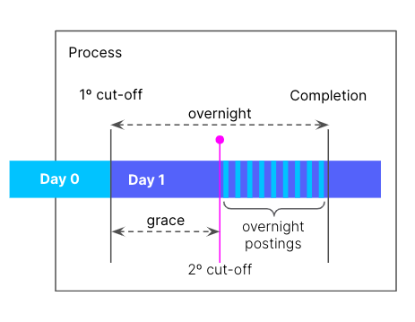
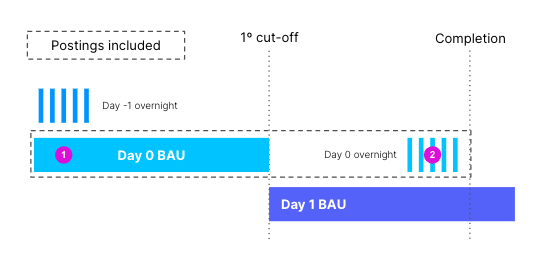
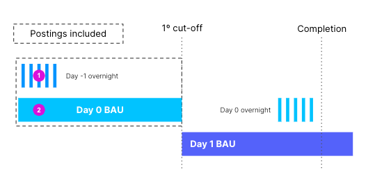
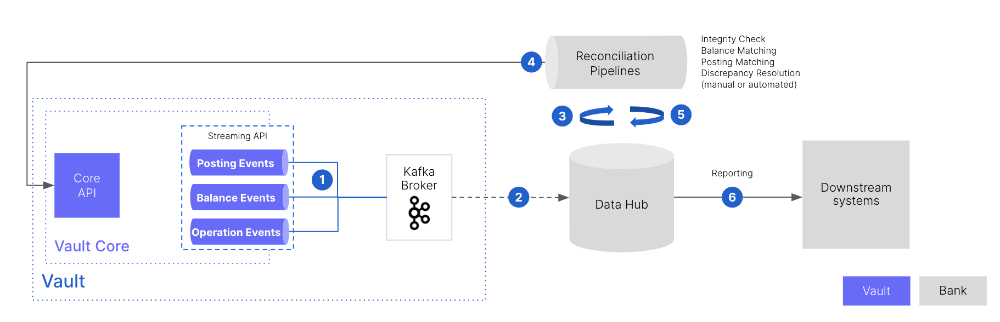

# Financial model

The Vault Core financial model defines how Vault Core operates financial movements (including [postings](/vault-core/5-8/EN/vault_core_overview/financial_model#postings_in_the_vault_core_financial_model) and the [End of Day (EOD)](/vault-core/5-8/EN/vault_core_overview/financial_model#end_of_day) process) in order to derive an account balance at any point in time.

## Key concepts used in the model

Vault Core’s purpose is to act as a ledger that records an ordered list of movements of funds for every bank account. From this ledger, an account balance can be derived at any point in time, or the account balances can be ordered into a balance timeseries.

Both aspects of the ledger are useful at different times. For example:

-   When deciding whether to allow an outbound payment, Vault Core needs to check the current balance to ensure the account has sufficient funds.
    
-   A scheduled job in Vault Core may need the full balance timeseries for the past month to determine whether to apply any specific fees or interest payments.
    
-   When deciding whether a customer account can be closed, Vault Core needs to factor in any future-dated Postings that have been accepted, but not yet valued (the value timestamp has not yet been reached).
    

### Postings in the Vault Core financial model

The [Postings](/vault-core/5-8/EN/reference/postings) resource is the sole mechanism for moving funds between two accounts in Vault Core. Postings can be generated internally (for example, by a [scheduled job](/vault-core/5-8/EN/reference/scheduler#schedule_jobs)) or externally by a client using a [Core API](/vault-core/5-8/EN/api/overview) resource.

In order for Vault Core to fulfil its role as a ledger, Vault Core’s financial model require the following data model and key concepts:

-   All postings can be divided into two categories; those for which Vault Core is the [source of truth or a system of record](#source_of_truth_vs_system_of_record).
    
-   To satisfy all use cases, Vault Core requires [three timestamps](/vault-core/5-8/EN/reference/postings#postings_timestamps) on each posting. This enables Vault Core to provide three different balance timeseries (or optionally orderings) for the same set of postings.
    

### Vault Core as the source of truth vs system of record

Vault Core draws a distinction between postings for which Vault Core is the *source of truth* or a *system of record* (SoR).

Vault Core is the source of truth for postings where Vault Core is the decider of the state of the funds. There are two sub-categories of postings for which Vault Core is the source of truth:

-   Postings that Vault Core makes itself, such as interest accruals triggered by a Smart Contract schedule.
    
-   Postings representing an external request for Vault Core to make a decision. A common example is an `AUTHORISATION` posting, which is a request for Vault Core to ringfence some funds, and would typically be made by a payment integration prior to finalising the transfer.
    

Vault Core is a SoR for postings where Vault Core records the movement of funds outside Vault Core’s control.

## End of Day

*End of Day* (EOD) is the *position* of all of a bank’s accounts at the end of a banking day. It is also used to refer to the [process](/vault-core/5-8/EN/vault_core_overview/financial_model#end_of_day_process) by which the [EOD position](/vault-core/5-8/EN/vault_core_overview/financial_model#reaching_an_eod_position) is reached (for example, by taking each customer’s balance at exactly midnight and applying the agreed interest or fees).

### End of Day process

Running a successful End of Day (EOD) process requires a clear understanding of the key terms steps involved to determine the [EOD position](/vault-core/5-8/EN/vault_core_overview/financial_model#reaching_an_eod_position) or balances of all accounts.

The diagram below demonstrates the relationships between the terms used in the EOD process:

*Business as usual* (BAU): The movement of funds ([postings](/vault-core/5-8/EN/api/core_api#postings)) that occur during normal customer use of their account, such as an ATM withdrawal or a card purchase. This normal customer activity occurs uninterrupted, even as Vault Core calculates interest and fees on their account.

*1º cut-off* (primary cut-off): A specific point in time (often midnight) when the balance is used to calculate interests and fees. This point in time marks the boundary between separate banking days.

*2º cut-off* (secondary cut-off): A specific point in time after the 1º cut-off when EOD processing begins. This is when interest and fees are calculated, adjustments to account balances are made, and EOD schedules are executed.

info

After the 2º cut-off point has passed, it is no longer safe to backdate postings. If postings are not backdated, Vault Core refers to the balance at the 1º cut-off to calculate fees and interest, and posts these to the account.

If there are any postings that require backdating after the 2º cut-off, you must use a different approach to determine the EOD position—for example, by simulating a hypothetical account lifecycle. For more information, see [Contract Simulation API](/vault-core/5-8/EN/api/core_api#contracts).

*Grace period*: The period of time between the 1º cut-off and the 2º cut-off when it is still possible to backdate late-arriving postings. These can be backdated to before the 1º cut-off, which changes the (observed) balance of the customer’s account at the 1º cut-off point.

chat\_bubble

Given the importance of this balance in determining fees and interest, some banks allow late-arriving postings to be backdated to midnight, thereby changing the balance used to calculate interest.

*Overnight postings*: Postings that are made by scheduled jobs as part of the EOD process, such as interest and fee applications. These postings occur after the 2º cut-off, and may overlap with BAU activities (for example, if a customer makes an ATM withdrawal at midnight).

*Completion*: The point in time at which all EOD processing has completed. This is important for downstream systems, as it indicates the point at which the [EOD position](/vault-core/5-8/EN/vault_core_overview/financial_model#reaching_an_eod_position) is available for onward reporting.

### Reaching an EOD position

To reach an End of Day (EOD) position, you must choose a complete set of both BAU and overnight postings to include in the calculation.

lightbulb

Overnight postings must be included consistently to reach a consistent position.

There are two options to choose from to include the overnight postings:

#### At the 2º cut-off point

Include the overnight postings in the banking day that just ended at the 2º cut-off point:

In this example, the calculation for the EOD position for Day 0 is:

`Day 0 BAU + Day 0 Overnight postings`

This requires the bank to wait until Completion to calculate the EOD position.

#### At the 1º cut-off point

Include the overnight postings in the banking day that just started at the 1º cut-off point:

In this example, the calculation for the EOD position is:

`Day 0 BAU + Day -1 Overnight postings`

This requires the bank to wait until the 1º cut-off point to calculate the EOD position.

### Using Vault Core for EOD processing

Typically, End of Day (EOD) processing is executed daily at midnight. This is configurable by clients and can vary from product to product.

Through Vault Core, you can use [Smart Contracts](/vault-core/5-8/EN/reference/contracts) to specify Schedule Code, a component of Smart Contracts that is executed on a regular cadence. Schedule Code can refer to the state of the account from a specific point in time. The Smart Contract can make any necessary calculations to generate accrued interest and fees, while adding the corresponding set of postings to the ledger (marking these postings so that they are clearly differentiated downstream for reporting purposes).

A number of Vault Core resources are available to implement EOD processing:

-   *Schedule(s)*: The rule(s) defining the cadence for repeated generation of a schedule event. For more information, see [Schedules](/vault-core/5-8/EN/reference/scheduler#schedules).
    
-   *Schedule events*: The triggers that Smart Contracts listen to in order to run their Schedule Code. For more information, see [Scheduler Jobs](/vault-core/5-8/EN/reference/scheduler#schedule_jobs).
    
-   *Schedule code*: The code within a Smart Contract that executes when a specific schedule event occurs. The Code takes the effective date of the Schedule Event to determine the state of the account to base calculations. For more information, see [Smart Contracts scheduled event hook](/vault-core/5-8/EN/reference/contracts/contracts_api_4xx/smart_contracts_api_reference4xx/hooks#scheduled_event_hook).
    
-   *Schedule tags*: All accounts must finish processing all their Schedule Code before the EOD position is known. A Schedule Tag is used for this purpose; Vault Core issues an event when all tagged processing has completed. For more information, see [account schedule tags](/vault-core/5-8/EN/api/core_api#account_schedule_tags).
    
-   *Operation Event*: The event issued when Vault Core has finished executing all the Schedule Code in all accounts with a shared account schedule tag. For more information, see [Core Streaming API Scheduler events](/vault-core/5-8/EN/api/core_api#scheduler_events).
    

lightbulb

You can also view long-running processes via the [Vault Jobs](/vault-core/5-8/EN/reference/core_apps_and_operations_dashboard/vault_jobs) app.

### Typical implementation

Banks implementing an End of Day (EOD) process will be consumers of the data produced by Vault Core. All the events that Vault Core produces should be collected, and used to populate and maintain an [Online](/vault-core/5-8/EN/vault_core_overview/coexistence#online_data_hub) or [Offline](/vault-core/5-8/EN/vault_core_overview/coexistence#offline_data_hub) Data Hub.

The Data Hub can generate reports once it has received all the data from Vault Core. Any strategy used to confirm that all data has been received must consider the following:

-   Vault Core provides stream reconciliation so that downstream systems can check the events received against counts and checksums of events issued.
    
-   Business as usual (BAU) postings belong to the banking day on which they are instructed. BAU postings after the 1º cut-off point do not belong in the End of Day (EOD) position.
    
-   Overnight postings are generated between the 2º cut-off point and Completion:
    
    -   The bank can decide which day to include the overnight postings (as described in [Reaching an EOD position](/vault-core/5-8/EN/vault_core_overview/financial_model#reaching_an_eod_position)).
        
    -   An [account schedule tag](/vault-core/5-8/EN/api/core_api#account_schedule_tags) can be used to indicate when all postings have been generated.
        
    

The diagram below exemplifies an implementation for EOD processing:

At each numbered step in the diagram, the following activities occur:

1.  The bank consumes the events from the streaming API topics. At a minimum, this includes Postings and Balances.
    
2.  These events are persisted in an operational data store.
    
3.  Reconciliation runs regularly throughout the day, checking the arrival of all expected events.
    
4.  Financial and operational reconciliation checks against Vault Core. If any events are missed, they can be re-streamed.
    
5.  [OperationEvents](/vault-core/5-8/EN/api/core_api#operationevent) indicates the completion of a Schedule Tag. This can trigger the final round of reconciliation before calculating the EOD position.
    
6.  Generate the required reporting.