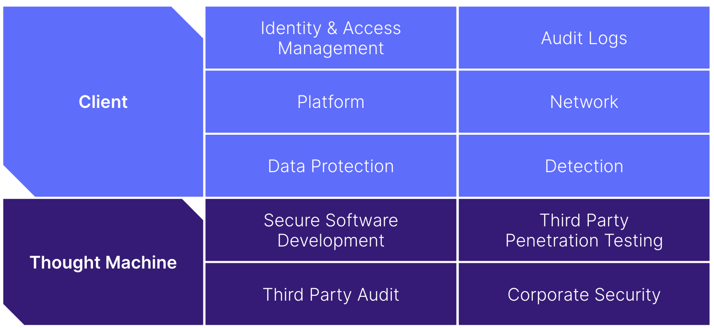
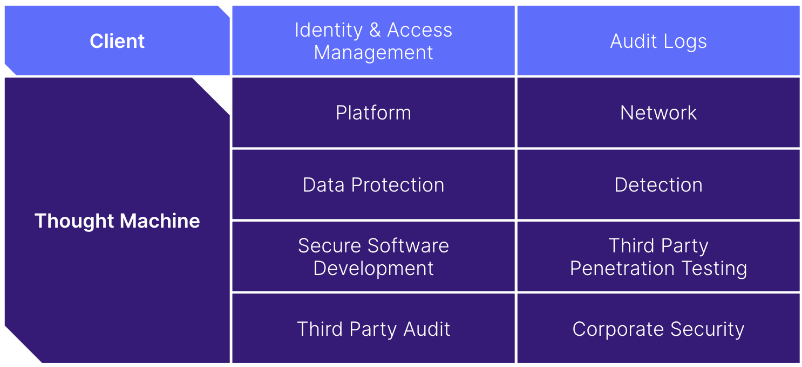
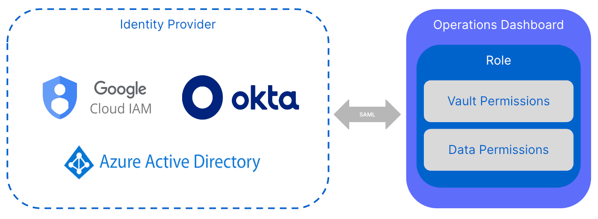
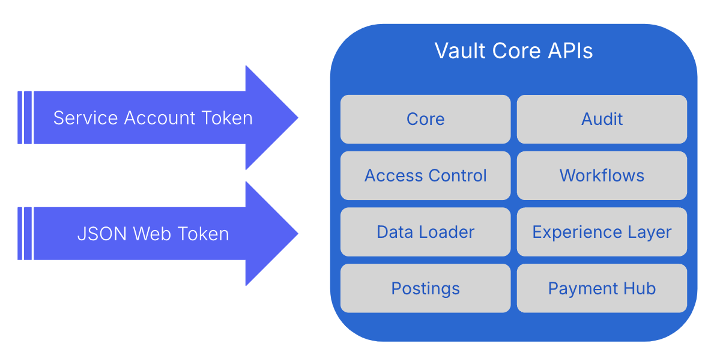

# Security

Here, you can learn about Thought Machine’s approach to security, and the different controls and techniques it implements to ensure its products are as secure as possible.

Thought Machine creates technology that can run the world’s banks according to the best designs and software practices of the modern age. An important element is the security built into those products, and Thought Machine believes that security is paramount in the design, development, and testing of its products. Vault Core is built with this philosophy in mind, where security is baked into the product development lifecycle from its inception.

To ensure confidentiality, integrity, and availability are maintained in Vault Core, Thought Machine undertakes a multifaceted approach to information security that includes:

-   Defining [Information Security](/policy/latest/EN/company_policies_and_procedures#information_security) policies, standards, and procedures to ensure alignment with security good practices and consistency across our products
    
-   Engaging third-party audits to demonstrate alignment with industry frameworks and industry good practices
    
-   Conducting background checks and enforcing mandatory security, risk, compliance, and data protection training for all employees
    
-   Performing threat modelling and independent penetration testing against Vault Core components
    
-   Automated scanning of Vault Core source code and container images to proactively identify vulnerabilities
    
-   Encrypting all data at rest and in transit within Vault Core
    
-   Providing Audit capabilities within the Vault Core product
    
-   Monitoring and responding to security incidents 24/7
    

## Shared Responsibility Model

Security is a shared responsibility between Thought Machine and our clients. As Vault Core can be deployed in either a bank-hosted or SaaS model, clients must be familiar with Thought Machine’s Shared Responsibility Model. This model outlines the security components that Thought Machine is responsible for versus the client and differs depending on the deployment model selected.

## Compliance

Thought Machine undergoes regular third-party audits to ensure alignment with industry frameworks. Certifications and reports from these audits are available to clients on the Vault Portal and include the following:

-   **ISO 27001**: Defines guidelines for implementing an organisational Information Security Management System
    
-   **ISO 22301**: Defines guidelines for business continuity to ensure resilience and continuity
    
-   **SOC 2 Type 2**: Assesses controls to maintain system confidentiality, integrity, and availability
    

Figure 1. Thought Machine certifications and standards

Thought Machine utilises industry-leading public cloud providers AWS and GCP to host Vault Core SaaS environments. These providers also undergo independent assessment, and their certifications and reports can be downloaded directly from the provider.

## Secure Software Development

Thought Machine has placed the secure software development lifecycle at the heart of its Vault Core development process. This approach ensures that it builds the most secure software while maintaining a high level of collaboration across engineering teams.

This approach has three key elements:

-   A process of secure software development
    
-   A culture of ownership and collaboration
    
-   Transparency, communication and collaboration with clients
    

Each element fosters the necessary practices and culture internally and communicates Thought Machine’s commitments to its clients.

### Threat Modelling

Thought Machine performs threat modelling against all Vault Core software components. Every team is responsible for building and maintaining these models. The Threat Models are based on the industry standard STRIDE methodology that focuses on identifying and enumerating:

-   Potential threat actors and attack vectors
    
-   The severity of the threats based on the impact they can have on Vault Core, its data, and its operations
    
-   Controls and methods to mitigate the identified threats
    

### Secure Design and Development

As Thought Machine designs and develops Vault Core, it considers the security requirements identified in the Threat Model. These requirements include:

-   Protection against unauthorised access, disclosure, or modification of data
    
-   Protecting the integrity and validity of data input, storage, processing, and output
    
-   Protection against the loss and unavailability of information, systems, and services
    
-   Data privacy for sensitive data - in particular, that of individuals
    
-   Application of security standards and good industry practice
    
-   Minimisation of available services and capabilities to reduce exposure to threats
    

chat\_bubble

For a detailed overview of our SSDLC approach clients can review the Secure Software Development Whitepaper available on the Vault Portal.

### Code Scanning

Thought Machine performs testing on all code that it intends for use in production environments. This includes code used in its software products, such as Vault Core, SaaS environments, and internal Thought Machine operations.

Its testing objectives are to validate that the code meets the intended objectives of:

-   Secure configurations and standards based on industry good practices
    
-   Identification of security vulnerabilities, including those from third-party suppliers
    
-   Functional and non-functional testing to validate requirements for data integrity and availability are met
    

Thought Machine utilises testing techniques based upon their suitability for the type of code and objective, and utilises the following as appropriate:

-   Peer review
    
-   Static application security testing (SAST)
    
-   Dynamic application security testing (DAST)
    
-   Known CVE scanning
    
-   Third-party library testing
    
-   Penetration testing
    

Thought Machine evaluates the third-party software and libraries that it uses in Vault Core for vulnerabilities, as well as any licensing restrictions. Test findings are documented, reported, and assigned to the team responsible for the affected component. The findings and their remediation efforts are tracked until they are resolved.

Wherever possible, Thought Machine automates security testing to provide testing consistency and accelerate reporting and resolution of vulnerabilities.

### Client Vulnerability Disclosure

Thought Machine publishes all identified and resolved vulnerabilities for all supported versions of Vault Core to clients via its [Vulnerability Report](/vault-core/5-8/EN/vault_release_information/vulnerability_report). The details for each vulnerability include:

-   Relevant container image name
    
-   CVE number
    
-   CVS score
    
-   Container image resource path
    
-   Container image resource
    
-   Reference
    

Thought Machine has defined service levels for the remediation of vulnerabilities in officially supported versions of Vault Core. It measures all vulnerability service levels from the release date of the vulnerability as recorded in the official CVE to the date that the fix is released to clients.

chat\_bubble

For a detailed overview of Thought Machine’s approach to vulnerabilities and associated service level agreements, clients can review the Vulnerability Management Standard available on the Vault Portal.

### Penetration Testing

In addition to Thought Machine’s threat modelling and automated testing, it engages independent third parties to perform regular penetration testing against Vault Core. These penetration tests provide an additional level of assurance of the effectiveness of its secure development lifecycle and mitigating controls.

Penetration testing is against:

-   Vault Core APIs for all major releases, or where material changes warrant ad-hoc testing
    
-   Configuration of Vault Core SaaS environments across both GCP and AWS
    

Thought Machine documents and tracks the findings from these tests until resolution. Clients can request the reports from this testing from Thought Machine.

### Input validation and injection attacks

Vault Core uses gRPC for all its messages. Because gRPC is strongly typed and allows defining formats for string-based parameters, injection attacks are harder to mount and a level of input validation is embedded in the messaging system. However, because the message parsing system is the first thing that evaluates Vault Core requests, this means Vault Core performs input validation before all other checks such as authentication or authorisation

Thought Machine ensures that:

-   Vault Core uses prepared statements and query builders to communicate with the database, mitigating SQL injection attacks.
    
-   It mitigates cross-site scripting via use of the React framework for the front end and denylisting the error-prone React methods in static code analysis.
    
-   It uses GraphQL to perform queries between the front end and the service supporting the Operations Dashboard; Thought Machine regularly scans these endpoints using InQL and mitigates any vulnerabilities found.
    
-   It mitigates CSRF by using the appropriate configuration in the Tornado web server that it uses to serve the Operations Dashboard.
    

## Data Protection

Thought Machine has designed Vault Core in line with the principle of least privilege to ensure that the confidentiality and integrity of its data are maintained. In addition to Identity and Access Management controls, encryption of data at rest and in transit provides an additional layer of protection. It does not have different tiers or levels of data sensitivity: all data is treated as highly sensitive and subject to the most stringent security controls.

In the case of Vault Core SaaS environments data is always accessed via secure services, such as bastions and privileged access management services, and it is never necessary for individuals to access databases directly.

### Encryption at Rest

All traffic stored within Vault Core is encrypted at rest through the use of native cloud service provider keys. For example, in the case of AWS the Key Management Service (KMS) is used to generate symmetric keys to provide AES-256 encryption on data stores. In the case of GCP, stores are encrypted at rest by default using AES-256.

In general, encryption keys used for encryption at rest are rotated transparently by the cloud service provider.

### Encryption in Transit

All traffic within Vault Core is encrypted in transit through the use of TLS. This includes communication between underlying microservices, and communication between the application and clients (in the case of Vault Core SaaS). Vault Core SaaS uses the nginx ingress object for inbound client connections, which allows TLS versions 1.2 and 1.3 by default. Please refer to the [nginx ingress documentation](https://kubernetes.github.io/ingress-nginx/user-guide/tls/#default-tls-version-and-ciphers) for more detail.

Clients adopting Vault Core SaaS can securely integrate with the product via cloud-native technologies such as AWS PrivateLink or GCP Private Service Connect. This allows them to connect a virtual private cloud (VPC) under their ownership to a Thought Machine-owned VPC in which the Vault Core SaaS instance resides. These technologies make use of cloud service provider backbones to provide a secure integration and never traverse the internet.

### Secrets Management

Vault Core utilises Hashicorp Vault to securely store and govern access to secrets. Hashicorp Vault validates and authorises clients, such as microservices, before providing them access to secrets or stored sensitive data. Vault Core also supports the use of AWS Secrets Manager for secrets storage, as an alternative to Hashicorp Vault from version 4.6.

## Identity and Access Management

Identity and Access Management (IAM) is a critical control when operating in the cloud. In line with industry good practices, Vault Core services align with the principle of least privilege. Identity and Access Management is used throughout Vault Core to enforce authentication and authorisation, including for interactive and programmatic access, and service-to-service communication.

### Interactive Access

The Operations Dashboard provides a graphical interface for clients to interact with Vault Core. Access to the Operations Dashboard is available through integration with a client’s SAML 2.0 identity provider (IDP). Vault Core supports integration with common industry identity providers, such as Okta, Google Cloud IAM, and Azure Active Directory.

Figure 2. Operations Dashboard SAML IDP integration

### Programmatic Access

Programmatic access refers to access via Vault Core APIs. For providing programmatic access, there are two approaches:

-   **Service Account Tokens**: It is possible to embed Service Account Tokens in the request headers for Vault Core REST APIs. Permissions are based on an API path and HTTP method, as opposed to objects served by the API. For example, a token with access to customers has control over all customer objects in line with the provided method (PUT, POST, GET). You can manage Service Account tokens and their permissions either via a REST API or the Operations Dashboard.
    
-   **JSON Web Tokens (JWTs)**: You can use JWTs as bearer tokens for authentication to Vault Core REST APIs. Each JWT must be signed with the private key of a public key pair. Vault Core is then provided with the public key of this key pair, which it uses to verify the signature on the JWT, confirming its authenticity. Once the signature on the JWT has been verified, Vault Core then authorises the request by validating the claims within the JWT.
    

Figure 3. Programmatic access to Vault Core APIs

chat\_bubble

The legacy method of using Service Account Tokens was deprecated as of release 4.3, and will be removed no earlier than release 7.0.

#### JSON Web Tokens

Authentication with the Vault Core REST API is achieved via JSON Web Tokens (JWTs) as bearer tokens. JWTs are defined by [RFC 7519](https://datatracker.ietf.org/doc/html/rfc7519). You must ensure that each JWT is signed with the private key of a public key pair. Vault Core is then provided with the public key of this key pair, which it uses to verify the signature on the JWT, confirming its authenticity.

Once the signature on the JWT has been verified, Vault Core then authorises the request by validating the claims within the JWT.

Vault Core validates the claims using Policies written in [Rego](https://www.openpolicyagent.org/docs/v0.12.2/how-do-i-write-policies/#what-is-rego) and evaluated using the [Open Policy Agent (OPA) framework](https://www.openpolicyagent.org/). It is possible for you to configure the rules contained within these policies. For more information on configuring Rego Policies see [OPA Policies](/vault-core/5-8/EN/reference/policies/opa-policies#overview_opa).

From release 5.3 onwards, there is support for *optionally* validating the `aud` field of a JWT (see [RFC 7519, section 4.1.3](https://datatracker.ietf.org/doc/html/rfc7519#section-4.1.3)). If any audience settings are configured, then Vault Core checks if the JWT `aud` field is provided on the token and compares it against the appropriate setting documented below. For examples on how to configure see [JWT Audience](#jwt_audience) section below.

#### Public keys

You can configure APIs with the following attributes in the `values.yaml` file:

 
| Name of key or parameter | Description |
| --- | --- |
| 
JSON Web Key Set (JWKS) URI

 | 

This URI defines the location of the public keys used by the API to authenticate JWT signatures, and it supports multi-tenanted JWKS. The API gRPC handler pods to fetch client-provided public keys at start-up, at set, configurable intervals thereafter, and whenever the handler is unable to determine which key to use to authenticate a JWT (such as when the keys have been rotated). The variable path for the JSON array is `.bearer_auth.issuers`. Each issuer must be an object with an `"iss"` key representing the issuer string and a `"jwks_uri"` key representing the JWKS URI.

 |
| 

Issuer JWT audience

 | 

Optional. If set, this value is used to match against the `aud` field value of a JWT issued from a specific issuer. If this value is empty (empty string or not set), Vault Core tries to validate against the **Default JWT audience** instead. Represented by `"jwt_audience"` key on each issuer of the `.bearer_auth.issuers` JSON array.

 |
| 

Default JWT audience

 | 

Optional. If set, this value is used to match against the `aud` field value of a JWT if there is no **Issue JWT audience** configured for the JWT’s issuer. If this value is empty (empty string or not set), `aud` validation is skipped. The variable path is `.bearer_auth.default_jwt_audience`

 |
| 

Public key refresh time period

 | 

This parameter defines how frequently Vault Core will refresh its local cache of public keys using the JWKS URI. The default time period is: 7 days. Vault Core will fetch the latest set of public keys using the JWKS URI whenever it encounters a reference to a public key it does not recognise, but additional periodic refreshes ensure that deprecated public keys are evicted from the cache. The variable path is `.bearer_auth.jwks_refresh_period`.

 |
| 

Maximum permitted lifetime of a JWT

 | 

This parameter is used to reject JWTs where the difference between the exp claim (when the token expires) and the nbf claim (the time from which the JWT is valid) exceeds this parameter. Where a JWT does not contain the nbf claim, the current time is used. Although clients may have different requirements around the maximum lifetime of a token, Thought Machine strongly recommends issuing JWTs with short lifetimes in order to limit the security impact. The variable path is `.bearer_auth.max_token_lifetime`.

 |
| 

Static public keys

 | 

These keys are loaded from the secret store (Hashicorp Vault) and used by applications that cannot expose their public keys via a client-defined JWKS URI. These keys are checked before the keys returned by the JWKS URI. This variable takes the form of a block of JSON and is named .bearer\_auth.static\_public\_keys in the `values.yaml` file.

 |

The following example is a minimal example of a complete `values.yaml` configuration file that defines the public key configuration:

chat\_bubble

The `fname` parameter in the example refers to the public key stored in the secret store at location `secret/[PREFIX]/api-key-secrets`, where \[PREFIX\] is the path to your secrets store in Hashicorp Vault.

When determining which public key to use given some JWT, Vault Core first matches the key ID and signature algorithm specified in the JWT header against the set of static keys. If Vault Core does not find a key among these, it next looks in the keys returned by the JWKS URI. It makes an additional call to this endpoint in cases where a matching key is not found in the local cache.

##### JWT Audience

In the previous example, because there are no configured JWT Audience settings, there is no validation on any `aud` fields added to any incoming JWTs. As a result, Vault Core accepts the JWTs if they are valid on other requirements.

The following snippet provides an example for the optional JWT Audience configuration. This `values.yaml` configuration supports multiple issuers, supporting both issuer specific `"jwt_audience"` configuration or falling back to checking against the `default_jwt_audience` value.

chat\_bubble

The matching of non-empty audience configuration is that of an exact equality match; therefore, the `aud` value must exactly match either of the configurations above.

-   In the above example, the first and second issuers have a `"jwt_audience"` value configured. Any JWTs with an `aud` field coming from these issuers will also have that `aud` value compared to the `"jwt_audience"` configured for the same issuer for that JWT and be rejected if they don’t match.
    
-   The third issuer in the example doesn’t have a `"jwt_audience"` value configured. In this case, if an `aud` field value is included for a JWT from the third issuer, then the validation will fall back to checking against `default_jwt_audience` (if it is configured).
    
-   If `default_jwt_audience` is not configured, then the `aud` field from a JWT provided by the third issuer would be ignored in validation and accepted (assuming other validation passes).
    

### JWT Generation Process

Thought Machine does not define the process that is used to derive a JWT. However, you should follow good practices when implementing JWTs in order to provide a secure system.

Here are some general recommendations:

-   You should keep the private key that is used to sign the JWTs separate from the user or system that requires a JWT.
    
-   The JWT procurement process should verify that the user or system requiring a JWT is allowed a JWT with the required claims.
    

These requirements can ensure that clients to an API cannot issue JWTs with arbitrary claims. [OpenID Connect](https://openid.net/connect/) (OIDC) is one such system that satisfies these requirements. OIDC is implemented by a variety of publicly available identity providers; therefore, Thought Machine encourages clients to use such a system where possible.

Vault Core supports the following signature algorithms:

-   ECDSA-SHA256 (ES256)
    
-   ECDSA-SHA384 (ES384)
    
-   ECDSA-SHA512 (ES512)
    
-   ED25519 (EdDSA)
    
-   RSA-SHA256 (RS256)
    
-   RSA-SHA384 (RS384)
    
-   RSA-SHA512 (RS512)
    

error

We strongly recommend that the lifetime of issued JWTs be as short as possible to limit the impact, should a token be leaked. Typically, the lifetime value should be set to at least 5 mins, and no more than 24 hours.

Additional Public and Private Claims may be required depending on the Policy attached to the API gateway.

Vault Core does not track the status of user accounts associated with JWTs, nor does it use token introspection to determine whether a JWT has been revoked. If there are concerns that a live JWT has leaked, the most effective way of preventing that JWT from being accepted by Vault Core is to rotate the public keys used by Vault Core. Vault Core automatically fetches the latest JWKS when it encounters a JWT with a key ID that is not known to Vault Core. In addition, Vault Core periodically refreshes its JWKS cache, evicting stale keys in the process.

### Service to Service Communication

Vault Core also utilises IAM for authentication and authorisation between services:

-   *Service to Service*: Vault Core is implemented using a microservice architecture. Services communicate with each other through the service mesh (Istio). The service mesh establishes mTLS connections between services, with certificates being regularly rotated.
    
-   *Service to Database*: Vault Core supports two methods for service to database authentication:
    
    -   IAM roles (AWS only)
        
    -   Username and Password (all cloud providers)
        
    
-   *Service to Kafka*: Some services must communicate with Kafka. This is done securely over TLS and authenticated with certificates.
    
-   *Service to Hashicorp Vault*: When services start, they must dynamically retrieve the required secrets from the HashiCorp Vault. Each microservice has an associated fine-grained policy which allows access to the minimum set of secrets required for the application to function. A HashiCorp Vault token is issued to the pod upon initialisation, after authenticating it via the Kubernetes API. This token is short-lived and immediately discarded once all required secrets are retrieved.
    

## Access control policies

There are three methods that can be used in Vault Core to manage access control:

-   Using the resource-based `access_control_policies` capability
    
-   Using attribute-based access control (an Extension which only applies to the [Vault Accounts App](/vault-core/5-8/EN/reference/core_apps_and_operations_dashboard/vault_accounts))
    
-   Using OPA (Open Policy Agent) policies
    

### Resource-based access control

The `access_control_policies` capability enables the enforcement of client-defined permissions to resources. Policies define a set of actions that in turn define a group of permissions and rules that need to be fulfilled in order to execute that action. Permissions are simple attributes that must be possessed by the caller in order to take an action. Rules define a logical expression comparing two operands. These rules are used to execute logical decisions in policy evaluations, such as to enforce a \`maker-checker' rule on a ticket.

Policies must be pre-configured and referenced in [Workflow and Ticket](/vault-core/5-8/EN/reference/policies/legacy-policies#workflow-and-ticket-policies) definitions in order for access to be controlled within instances of those Workflows or Tickets. To enforce access controls via policies, an access control context is passed into requests to the Workflow API, to confer the specified level of access to the targeted resource.

#### Component segregation strategy

As we are leveraging a microservice architecture, we have the benefit of being able to integrate controls for each microservice as we do not assume that the traffic coming from other sources should be accepted blindly. Our different components use certificates to authenticate and authorise the legitimate traffic.

### Attribute-based access control (ABAC)

As of Vault Core 5.8, you can use attribute-based access control logic to set up Product-based Access Control for the Vault Accounts App. For more information, see [Setting up and configuring OIDC authentication](/vault-core/5-8/EN/environment_and_installation/infrastructure_docs/setting_up_and_configuring_oidc_authentication).

### OPA Policies

Vault Core uses the [Open Policy Agent](https://www.openpolicyagent.org/) to evaluate policies and enforce access control. These Policies can be created and updated using the `/v1/policies` endpoints on the Core API. For more information, see the [Core API](/vault-core/5-8/EN/api/core_api#policy_management) documentation.

Policies are evaluated against an evaluation input. The input object contains properties that are to be used by the policy during evaluation. Each Policy defines the input properties it expects and supports through a reference to a policy schema.

For more detail on how to work with Rego Policies and a list of the schemas provided by Vault Core, see [OPA Policies](/vault-core/5-8/EN/reference/policies/opa-policies#overview_opa).

## Audit and Detection

Audit and Detection are critical to enable observability of activities occurring within an application. Thought Machine has designed Vault Core with this principle in mind, where all actions invoking Vault Core APIs are recorded to provide an auditable trail.

### Vault Core Audit Logs

Vault Core records information on all authenticated requests made to its APIs and makes this available for ingestion via the Audit API and Kafka Streaming API. Application logs in Vault Core come in two main types:

-   **Audit Logs**: Record all information corresponding to a request
    
-   **Action Logs**: Record the effects of a request on a Vault Core Object (if applicable)
    

Audit logs have a limited lifespan in Vault Core, and can no longer be accessed after the configured period has expired. For bank-hosted instances of Vault Core, this has a default setting of one day and is configurable by clients via the values.yaml file. For Vault SaaS, this is set to seven days and is not configurable. Clients can ingest logs for persistent storage to meet their unique data retention requirements.

### Application Security Monitoring

Vault Core contains an observability package. This package consists of a Kibana instance which allows it to query a number of different logs. Specific security events receive the \[audit\] label as a tag. This provides Thought Machine with high confidence when setting up alerts because false positives are very unlikely when events are tagged with that label. Moreover, Thought Machine can provide you with a Prometheus instance containing metrics, allowing Operations teams to configure alerts or enable pre-configured alerts.

### Detection and Threat Response

The Thought Machine Threat Operations team provides security monitoring, detection, and incident response for information security incidents. Threat Operations monitors and reports on the security of Thought Machine and client SaaS environments 24x7.

The Threat Operations team receives logs, events, and alerts from myriad sources, including, but not limited, to:

-   Anomaly Detection: Detects abnormal behaviour and potential threats
    
-   Cloud Configuration Events: Continuous compliance checks against industry standards, such as the Center for Internet Security (CIS)
    
-   Security Incident and Event Monitoring: Custom alerts configured in our SIEM tooling
    
-   Network Traffic Logs: Logs from network infrastructure such as load balancers and network firewalls
    
-   Infrastructure Logs: Logs from infrastructure workloads, such as Kubernetes clusters
    

Bank-hosted clients should ensure they have adequate coverage of detection capabilities to identify and respond to potential security incidents.