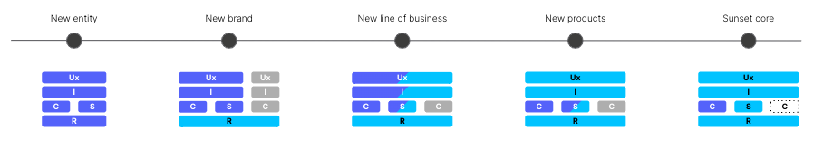
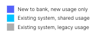
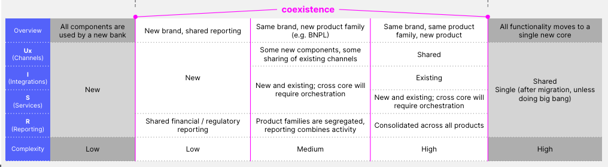
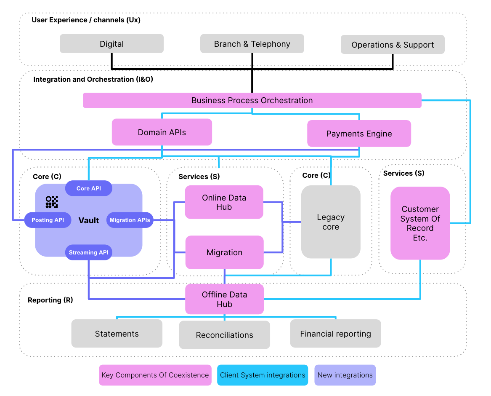
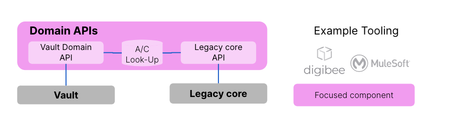
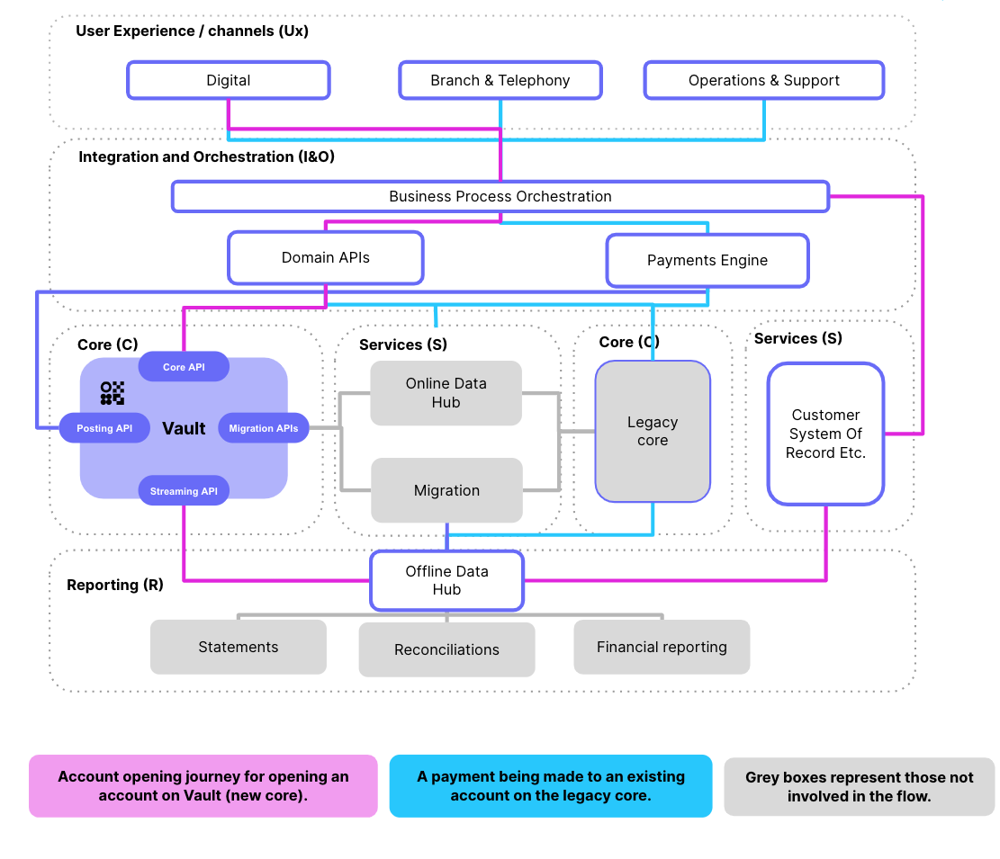
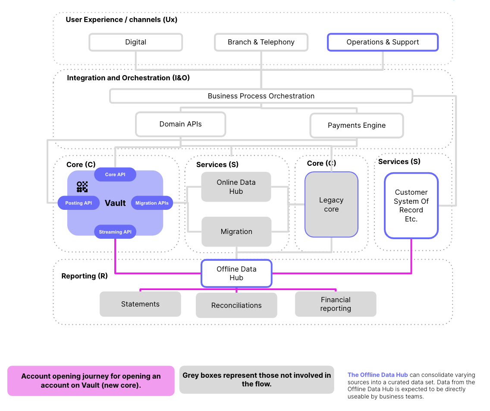
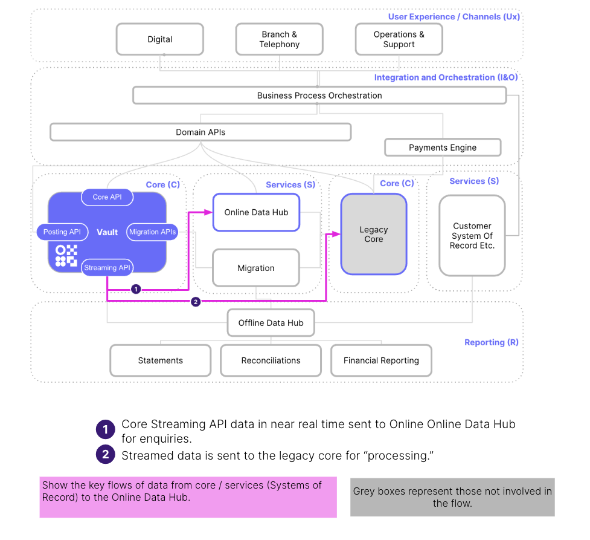
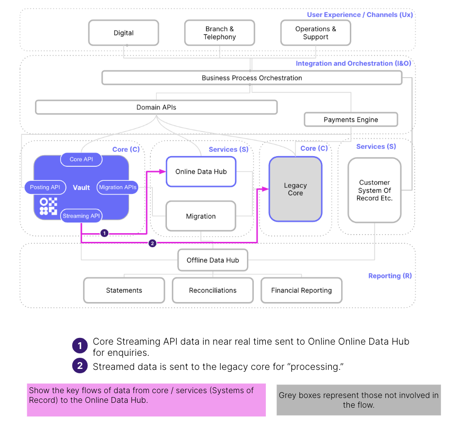
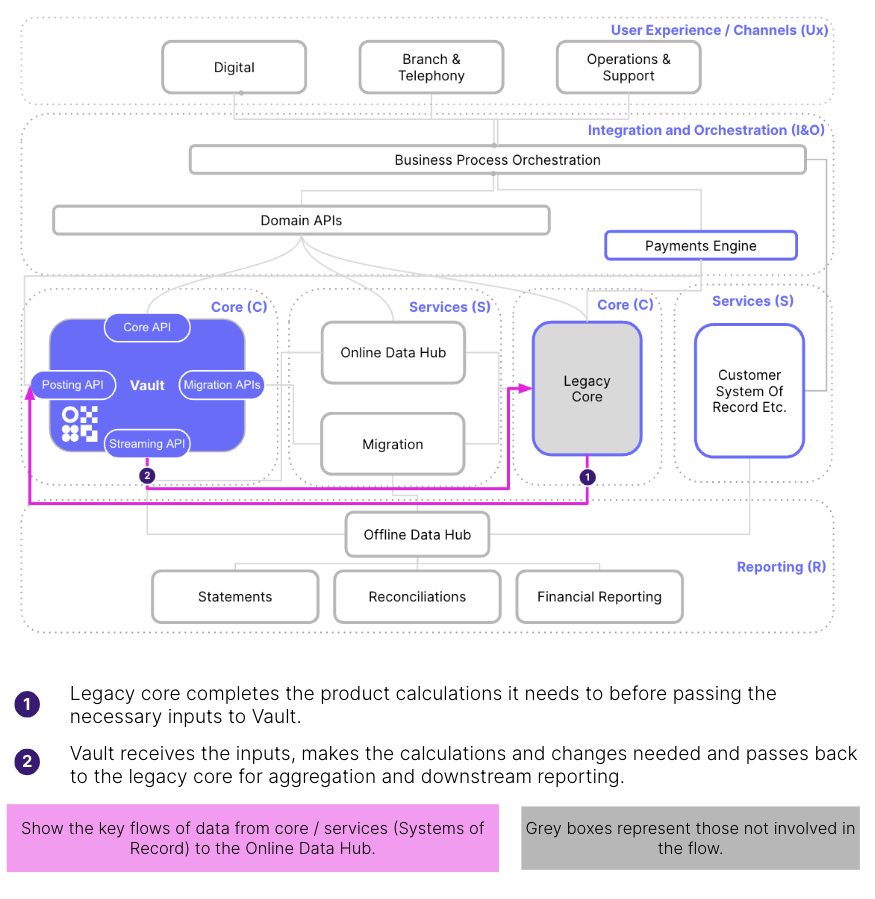

# Coexistence

## Introduction

This section introduces *Coexistence*: how Vault Core can coexist with a legacy banking core.

### Definition and Context

When a client chooses Vault Core as their new core banking platform, a key decision to be made is how to migrate from their existing legacy core to Vault Core. Many clients avoid the 'big bang' migration strategy of moving their entire business over to Vault Core in a single step, and instead choose to make incremental migration steps. For example, when launching all new products on Vault Core while maintaining all existing products on their existing core, there is explicit or tacit acceptance of the need to manage a legacy core alongside Vault Core - referred to as *coexistence*. For smaller single core banks this represents a new challenge, while for larger banks this is a common design consideration for any transformation programme.

### Positioning Coexistence

Traditionally, coexistence - especially in a migration scenario - is seen as a 'necessary evil.' In many cases this is still true. But depending on the bank’s wider business and technology strategy, it may better be seen as a strategic enabler. For example:

-   Managing coexistence correctly enables the bank to support Mergers and Acquisition (M&A) scenarios, where two banks need to operate as one.
    
-   The technologies needed to support coexistence represent a strategic step into modern cloud architectures and an enabler for simplifying changes in the future.
    

### Key Coexistence Considerations

The key considerations around coexistence are:

-   Is the programme a wider (cloud) transformation or a 'hollowing out' of a core?
    
-   To what extent can the coexistence design align to the bank’s wider technology strategy?
    
-   Can coexistence be somewhat simplified by taking a customer lens or view to migration? For example, removing cross-core fund transfers between accounts held by the same customer on different cores?
    
-   Does in-house tooling to support coexistence exist? Where there is no such tooling, do you buy or build?
    
-   What enterprise data goals or principles need to be adhered to?
    

### Architectural options

The following components of a banking system serves to highlight the fact that any coexistence solution must take into account a variety of shared systems:

-   Channels (Ux) - the mechanisms that customers can use to interact with their banking services; be this online, telephone or branch banking or cards and payment networks.
    
-   Integration and Middleware (I) - the systems that mediate channel requests, routing and orchestrating requests across multiple services and cores.
    
-   Cores (C) - the system enforcing account rules and storing customer balances.
    
-   Services (S) - the systems providing; Know Your Customer (KYC), fraud, migration, Anti-money Laundering (AML) services, and so on.
    
-   Reporting (R) - the systems aggregating data from bank activity and consolidating this into various financial and regulatory reports.
    

How these components are used determines how coexistence is defined for your particular use-case. You may want some components to be shared by both cores or have completely separate instances of these components for each core.

The diagram below illustrates some of the possible states of coexistence:

The key used in the diagram is:

The table below defines how the components are used in each of these states:

## Coexistence components

To achieve a coexistence state involves multiple components with every bank using a different mix of components. No two banks look the same and this view is only intended to act as a common basis for demonstrating the potential coexistence patterns that clients could adopt.

To manage coexistence, banks need to firstly assess the capabilities available in the bank today. However, we expect it to include a large proportion of those highlighted in the diagram below, which are considered to be key components of coexistence:

Where these capabilities do not exist or require enhancements to adequately support coexistence, Thought Machine can support you to define your architectural transformation.

This section breaks down the key components of coexistence (highlighted in the diagram), with the aim to:

-   Describe each component.
    
-   Explain why it is important in coexistence.
    
-   Call out component changes likely required to support coexistence.
    
-   Share possible tooling available.
    

### Business Process Orchestration

Business Process Orchestration (BPO) is the link between customer channel applications and the deeper middleware layers and/or backend services. BPO is a stateless system overseeing the completion of the end-to-end customer process (for example, onboarding a customer), by calling, ordering and timing the calls to different services in the process chain. It is designed to unify channel applications into a common language and data protocol that is then used to communicate with downstream systems.

#### Programme implementation considerations

The following implementation points must be considered for BPO:

-   BPO enhancements will be required to support cross-core servicing journeys. For example, transfers between an account stored on the legacy core and Vault Core.
    
-   The separation and orchestration of Customer System of Record (SoR); distinct from the legacy core.
    
-   The migration itself may require enhancements to BPO. For example, if following an onboarding or off-boarding approach.
    
-   To support atomicity, the bank needs to ensure that business processes are committed (or not) in their entirety across the more complex coexistence architecture (SAGA).
    

### Payments engine

The Payments Engine is the payment operations platform. In most cases it will have the ability to connect to multiple payment channels (via the payments gateway) to process payments on a customer’s behalf. The engine will manage the end-to-end payments journey, ensuring that checks with bank’s internal systems (for example, fraud) are completed as part of the process.

The payments engine will need to be configurable. This is required in order to:

-   Accept a variety of incoming types of payments messages.
    
-   Handle different journeys depending on the type of payment.
    
-   Communicate with a variety of systems (including both cores) to support the end-to-end processing of a payment.
    

To support the routing of payments to the appropriate core, an account look-up table will need to be maintained within the payments engine.

#### Programme implementation considerations

The following implementation points must be considered for the Payments Engine:

-   Larger banks have for many years operated with payment engine(s) that are integrated with multiple cores. The payments engine(s), potentially via multiple potential steps, need to be able to communicate with new and legacy product cores. Adding Vault Core into this existing set-up is an established part of the transformation programme, though some difficulty may be introduced due to the asynchronous nature of the Vault Postings API.
    
-   Banks with a single legacy core may have a tighter integration into their payments engine. The need to deliver a separate second integration for Vault core may represent a larger effort as part of the programme.
    

### Domain APIs

Domain APIs expose a coherent set of business functions or capabilities to the upstream layer. They are stateless.

Once a request from the BPO layer has been received, the Domain API needs to use an 'Account Look-up' read optimised database so it knows to route requests to the appropriate core. The diagram below shows a typical facade pattern that might be implemented in the Domain API to support requests from the BPO layer:

In some banks there may be routing capability sitting above the Domain API, as this capability may not sit across all core product systems. Read requests are routed to the Online Data Hub for quick servicing.

Domain APIs are normally implemented in a synchronous (single thread request and response) model. This means that the Domain API makes a request to the Online Data Hub (the Vault Core or legacy core) and waits for a response. This may be important to align to wider architecture patterns (for example, SAGA).

#### Programme implementation considerations

The following implementation points must be considered for the Domain API:

-   Some clients may not currently have Domain APIs in the estate. If not, this will be an early implementation step required to work with Vault Core and will later enable coexistence.
    
-   There is a need to determine Domain API timeouts when it does not receive a response. This includes how many times it will retry and if there is a continued failure, what or how the failure will be reported to the BPO.
    

### Online Data Hub

The Online Data Hub refers to the 'front face' of Vault Core and legacy core data.

It is a readily available source of truth for retrieving information to support a unified, cross-core, customer experience (for example, retrieving a total view of all cross-core account balances) in a state of coexistence.

The Online Data Hub should be fed information (updated) in the most frequent interval possible. With Vault Core this will be near real-time (asynchronously) using the Core Streaming API.

The Online Data Hub is optimised for read queries from Domain APIs and scales to support increases in read enquiries (for example, if there are many historic transaction queries).

#### Programme implementation considerations

The following implementation points must be considered for the Online Data Hub:

-   If there is not an Online Data Hub currently in place, this will be an early coexistence enabler. An Online Data Hub will minimise customer migration impacts by providing channels with an ability to service customers (to an extent) during the migration event.
    
-   Additionally, and more broadly, if there is not an Online Data Hub currently in place, then a legacy core data transform will be required into the enterprise or target format.
    
    If an Online Data Hub does exist, then a decision point during the coexistence setup process will be reached, when the data format of the Online Data Hub changes and Vault Core no longer performs a transform as part of the move to the architectural target state.
    

### Migration

The Migration service represents the Extract, Transform and Load (ETL) routine that would be followed for the phase of the migration process that takes place during the period of coexistence.

A migration service or pipeline should exist that can take the common legacy format(s), transform the data (plus filtering and enriching) and load to Vault Core via the Migration API(s). This should be automated as much as possible and can support dry runs as well as the live event.

It is likely that this migration service is made up of a series of finely orchestrated steps to perform discrete migration activities (for example, data filtering).

#### Programme implementation considerations

The following points must be considered when implementing this phase of the migration process:

-   Upfront time and investment is required to build a regular and repeatable migration pipeline in advance of the first tranche of data to migrate. This pipeline needs to cater for all legacy data sources that will be required to support migration. For example, retrieving and merging data from multiple systems to form one file or set of data for load.
    
-   The incremental effort for each migration tranche should then be materially reduced as common patterns and routines are consistently followed as each phase of the migration is undertaken.
    

### Customer System of Record (CSoR)

The CSoR provides the master view of customer data (for example, name, date of birth and portfolio of product holdings) across the group or estate. In larger banks this provides what is referred to as a Single Customer View (SCV). The SCV can take various feeds from upstream or downstream to arrive at this single or master view that is external to the core.

In a coexistence state it is expected that a view of customer product holdings will need to be held in the Business Process Orchestration or Domain API layer to support routing to the appropriate core. This will need to be continually maintained.

#### Programme implementation considerations

The following implementation points must be considered for the CSoR:

-   *For Banks With An Externalised SCV*: Larger banks have for many years operated with a SCV that is extracted away from product systems. Where this is the case, then less work is required to operate in a state of coexistence, with only additional feeds from the CSOR to Vault Core (via BPO) being required. For example, to apply restrictions across all bank products for that customer.
    
-   *For Banks Without An Externalised SCV*. In these cases, the legacy product cores will often store, and sometimes even master, Customer data. Where this is the case, then a migration to Vault Core involves not only the migration of product data into Vault Core, but also the (likely) migration of customer data into a new Customer System of Record (CSoR) as well.
    
-   Regarding sequencing, this activity often occurs as a precursor to Product migrations. This is either as an entirely separate transition state for all customer data, or as an enabling activity as part of each migration event, ahead of the Product migration in the Schedule of Events.
    
-   Only the external Customer ID (the Customer ID belonging to the new CSoR) is loaded to Vault Core as part of the Product migration. This enables a clear mapping back to the Customer system, which will likely be required for routing and reporting purposes.
    

### Offline Data Hub

An Offline Data Hub is best understood when compared with a Data Lake:

-   A *Data Hub* (in a coexistence context), represents a curated (organised) source of truth that is fed from a variety of upstream CSoR systems. The focus is to transform and aggregate a domain’s (for example, core banking) data, providing direct feeds to downstream systems. There may be multiple data hubs across a large bank. Direct querying and reconciliations of the domain’s data may be possible and is normally used to support batch processing (for example, for statements).
    
-   In comparison, a *Data Lake* is a Domain or often a cross-bank store of unstructured data. Inherently, the data is not refined and therefore comes with limited quality assurance. It is used to provide a 'base level' for users to consolidate and build reporting to predominantly downstream or external systems.
    

#### Programme implementation considerations

The following implementation points must be considered for the Offline Data Hub:

-   The programme needs to define and understand the data capabilities that exist today. For example, data hubs, data lakes, data warehouses or none of these data stores?
    
-   The scope of the programme needs to be clear from the outset. Attempting to introduce a (domain) data hub into a bank is a large transformational effort that will require cross-bank support and coordination.
    

## Coexistence patterns

Coexistence patterns refer to the potential set-up of coexistence within the core banking domain to assist clients and partners in determining what coexistence will look like in their organisation, given their current architectural estate and capabilities.

### Coexistence pattern library

This is a collection of patterns that can be useful in planning coexistence. The patterns are not mutually exclusive (more than one pattern can be used). Also, some may be used to support a transitional architecture state, while others may be used as part of a target state.

The patterns are:

-   *Mediator*: This pattern is used for the routing of requests determined by a dedicated lightweight routing service. Payments are routed via the Payment Engine. This pattern decouples the two cores to allow for an easier transition away from the legacy core. Often, there is no communication directly between the legacy core and Vault Core.
    
-   *Consolidated Reporting*: This pattern is used for Core systems reporting through a single Online Data Hub that feeds downstream reporting. The data is transformed through the Offline Data Hub to provide easily consumable data.
    
-   *Mirror Vault Core Through Legacy Core*: This pattern is used in cases where the integration of the legacy core is tightly coupled to downstream systems. In such cases, the bank may opt to mirror Vault Core activity through the legacy core. The Vault Core Streaming API provides events to the legacy core of every change of state on the account. Shadow accounts (internal or customer) in the legacy core are populated ahead of reporting cycles.
    
-   *Moving Funds Across Cores*: This pattern is used when funds are transferred from an account (for example, savings) on legacy core to an account (for example, a current account) on Vault Core. Movements of funds are routed via the Payments Engine - and potentially other services (for example, BPO).
    
-   *E2E Product Process Execution Across Cores*: This pattern is used when Product functionality is split across legacy and Vault cores to complete an end-to-end customer journey. This is needed in cases where the legacy core cannot provide the desired functionality. The legacy core remains the System of Record, with Vault Core operating as a secondary ledger.
    

The following sections describe each of these patterns in more detail.

### Mediator

The mediator pattern focuses on providing or inserting a third-party between two objects, much like an air-traffic controller is the mediator of aircraft at an airport where neither aircraft directly talk to each other. In our context, the mediator ensures there is no tight coupling or integration between the two cores with an upstream router determining which application should service the request.

#### Use cases

Typical use cases for this pattern would be:

-   Large banks with multiple cores, each supporting a unique product offering.
    
-   Where a client is completing a phased migration of products from a single legacy core instance to a single Vault Core instance over an extended period of time (months rather than weeks).
    
-   Where a bank expects to add more product cores in future. For example, as a result of inorganic growth or due to a merger or acquisition.
    
-   When adopting broader microservice architecture aims, with light integrations being built into the design.
    

#### Pros

The advantages of using this approach are:

-   This pattern is tried and tested. Large banks have been operating this way for a long period of time.
    
-   The pattern is simple - with each core independently handling end-to-end product behaviour, thereby avoiding core interdependencies. Also, the approach can minimise tranche-specific coexistence complexity, with each migration tranche reusing existing capability to suppress legacy usage and route new requests to Vault Core instead.
    
-   The implementation of the migration is complex, but the complexity is hidden from the customer.
    

#### Cons

The disadvantages of using this approach are:

-   For single core banks, it may introduce temporary architectural complexity.
    
-   The extraction of the customer as a separate System of Record, and its place in the migration journey may add complexity to the architecture. For example, when handling bank-wide customer level restrictions.
    
-   The performance impact of the additional routing service will cause an increase in round-trip time.
    

### Consolidated reporting

During an extended period of coexistence a bank will need to 'glue together' data feeds from the legacy core and Vault Core to arrive at overall total bank positions. For example, for month-end financial reporting. The implementation of this, via an Offline Data Hub, can 'protect' downstream systems and the programme more generally, from the addition or removal of cores or systems.

#### Use cases

Typical use cases for this pattern would be:

-   To funnel data streams from Systems of Record into a single view of reporting for bank business and technical users.
    
-   To load and transform data into a common format for downstream users.
    
-   To automate the joining of data to drive reporting or visualisation of an end-to-end sub-ledger or ledger view.
    
-   May be particularly useful during a phased parallel run when needing to compare and 'glue' core to core outputs or behaviour, as well as to provide wider BAU reporting.
    

#### Pros

The advantages of using this pattern are:

-   It is tried and tested. Large banks have been operating - at least to a certain extent - this way for a long period of time.
    
-   The pattern is simple - compared to other coexistence patterns. This pattern represents a simpler challenge to overcome.
    
-   This pattern is future-proof. Developing consolidated reporting in many cases will represent a future state that the bank more broadly wants to aim for. For example, consolidating customer and product data.
    

#### Cons

The disadvantages of using this pattern are:

-   The potential need to transform the enterprise data architecture to support the transition period of coexistence and the wider transformation.
    
-   Consolidating reporting during an extended period of coexistence demands that automation is built into the process to enable the two core positions to be 'glued' together.
    
-   Consolidated reporting may require a 'full breadth' of capabilities; from consuming message bus (for example, Kafka) events through to system or outputs files. This may mean staggering your data ingestion into consolidated reporting to ensure that the data is curated into the required state.
    

### Mirror Vault Core through the legacy core

Vault Core product behaviour is set up and defined with all changes (creation and update) streamed via the Vault Core Streaming API to the legacy core. Vault Core operates as the system of record for the products it is servicing, with the legacy core representing a source of truth for downstream reporting.

#### Use cases

Typical use cases for this pattern would be:

-   Quicker adoption of Vault Core into the bank estate to enable innovative product launches.
    
-   A tight coupling of the legacy core to downstream makes a full migration an extended, complex piece of work that will not quickly yield benefit.
    
-   Bank wants to continue to leverage their legacy core for an extended period of time as part of a longer transition to a cloud-based core. For example, where customer data remains on the legacy core until the end of the migration.
    
-   Likely deployed where programme budgets do not allow for a 'fuller' implementation of coexistence and the associated patterns (for example, consolidation of reporting).
    

#### Pros

The advantages of using this pattern are:

-   The pattern is simple - conceptually this represents a more straightforward approach compared to other patterns. Most of this simplicity is delivered via the lighter integration work required due to downstream systems not needing to be materially changed.
    
-   This pattern can be quickly implemented. Depending on the implementation approach, it is likely that this can deliver business benefits more quickly than other approaches.
    
-   This pattern provides an extended period of proving of Vault Core, ahead of starting the migration.
    

#### Cons

The disadvantages of using this pattern are:

-   This will require effort to change the legacy core to support full mirroring of Vault Core. For example, the insertion of accounts just before the EoD.
    
-   This can be viewed as a tactical investment. Adopting this pattern represents a tactical step that involves a degree of throwaway work.
    
-   This will mean an increase in Run Cost. There is a 'doubling up' of accounts required, as the structure on Vault Core will completely or in part be replicated on the legacy core. This will increase overall bank run costs and embed legacy core into the operation.
    

### Moving funds across cores

A large-scale phased product-led migration dictates that an automated solution will need to support cross-core product behaviour. Historically, banks have tried to avoid this coexistence pattern, instead opting for a manual workaround or interim process. However, as core migration coexistence extends over longer periods of time, banks are becoming increasingly interested in using this coexistence pattern.

#### Use cases

Typical use cases for this pattern would be:

-   Deployed where a product-led migration approach is being used, and customers have products split across cores for the period of coexistence.
    
-   Where migration cutover is being done in phases, either via a parallel run or as part of a coupled load and cutover process.
    
-   Likely only deployed where product coexistence runs over a number of months or years rather than days or weeks.
    

#### Pros

The advantages of using this pattern are:

-   It is tried and tested. Large banks have been operating - at least to a certain extent - this way for a long period of time.
    
-   It provides product coexistence - enabling a bank to take a product-led migration approach. For larger banks this approach is normally easier because they would typically be moving from many product systems to one (Vault Core).
    
-   It provides Coexistence longevity - enabling automated transfers between cores means the period of coexistence can be expanded or contracted more easily in line with the needs of the bank. There is less pressure to complete the migration because of manual interim processes.
    

#### Cons

The disadvantages of using this pattern are:

-   Careful consideration and planning is needed to handle failure scenarios to ensure a safe rollback can be performed. If sending data from one core to another and there is a failure then the whole E2E transaction needs to be removed, ensuring both cores are left in the correct state.
    
-   Sophisticated and performant orchestration is needed to support workflow journeys across cores. This may be more difficult depending on the capabilities of the legacy core.
    

### E2E product process execution across cores

Vault Core enables a wider spectrum of product behaviour than is often associated with legacy cores. This has given rise to using Vault Core to support discrete portions of product process behaviour, with the legacy core supporting the basic features of the account. Vault Core’s real-time streaming functionality means that it is easier to perform discrete activities in isolation and then pass across key updates to the legacy core for further processing to complete the end-to-end process.

#### Use cases

Typical use cases for this pattern would be:

-   Most likely to be deployed where Vault Core provides unique behaviour that cannot be provided on the legacy core.
    
-   Where banks desire to keep the legacy core as the System of Record for an extended period of time, perhaps due to extended licence terms.
    

#### Pros

The advantages of using this pattern are:

-   It enables the business to quickly deliver the innovative features they want to offer. Apart from the integration effort to couple the legacy core with Vault Core, it is likely that the remaining effort to integrate into the wider bank estate would be minimal.
    

#### Cons

The disadvantages of using this pattern are:

-   Coupling the legacy core with Vault Core could make achieving the target state of a single core more difficult.
    
-   Product Complexity - thorough functional and non-functional testing is likely to be needed. This is to ensure edge case scenarios of passing product data from ledger to ledger are accounted for. For example, if Vault Core as the sub-ledger needs to pass information to the legacy core just before the legacy EoD process commences.
    
-   Orchestration - additional SAGA pattern consideration or complication for unwinding or compensating transactions when there is a failure. For example, a network failure occurring part-way through the execution of the process.
    
-   Run Cost - there is a 'doubling up' of accounts as the accounts will, at least to a certain extent, need to be replicated across both the legacy core and Vault Core. This will increase overall bank run costs.
    

## Implementing coexistence

This section provides recommendations on planning and executing coexistence in order to support your core banking transformation. Coexistence represents a full project in its own right and needs to be run as such from the outset.

### Pre-programme start

Before the migration programme even begins, it is worth considering:

-   Understanding the coexistence vision.
    
-   Documenting the current capabilities of the system.
    

#### Understanding the coexistence vision

The recommendations for this part of the programme are:

-   Define coexistence and what it does and does not entail, and why it is distinct from migration.
    
-   Explore coexistence patterns and how they may or may not apply to your bank. Each bank is unique.
    
-   Agree your coexistence principles, constraints and assumptions (for example, solution automation versus manual solution). The principles should be both technical and non-technical (for example, cost constraints).
    
-   Determine the technical 'big bets' and investments needed to support coexistence. Feed these investments into the programme business case.
    

#### Documenting current capabilities

The recommendations for this part of the programme are:

-   Understand the tooling capabilities that exist across the bank to support coexistence.
    
-   Understand the engineering (people) capabilities that can (or cannot) be leveraged by the programme.
    
-   Identify weak spots in the architecture. For example, the lack of ability to stream messages in real time from the legacy core.
    
-   Document the 'sphere' that coexistence will operate within. That can be the product-level domain as well as the bank or enterprise-wide domain.
    

### Early part of the programme

This period typically takes place before or alongside material migration work commencing. During this phase, consider:

-   Defining transition and target state.
    
-   Identify and map the changes.
    
-   Agree the plan and implement it.
    

#### Defining transition and target state

The recommendations for this part of the programme are:

-   The requirements of coexistence will likely change as you proceed through your transformation programme. For example, there may be cohorts of migration that are independent and therefore these cohorts don’t need to cater for cross-core transfers.
    
-   Define what the target will be at each state and the capability gaps that exist. This will help to drive individual packages of work.
    

#### Identify and map changes

The recommendations for this part of the programme are:

-   The programme needs to document to a reasonable level the changes needed. This will likely involve change by wider bank system owners and external partners.
    
-   Each change should be mapped to a transition state and ideally migration event, so the benefits of each investment in terms of what it unlocks are clear.
    
-   Engage partners and vendors early to accelerate delivery and account for contracting timelines.
    

#### Agree the plan and implement it

The recommendations for this part of the programme are:

-   Having engaged all parties, the timelines for delivering coexistence need to be agreed at senior levels.
    
-   The coexistence builds will generate dependencies for migration and will need to be tracked closely across the programme.
    
-   The technical and non-technical challenges arising from coexistence rise quickly at the start of the programme and decrease gradually, as transition state and migration events are completed. This concept and message needs to be managed with stakeholders.
    

### Summary

Though there are no *silver bullets* to managing coexistence, in our experience there are certain key success factors you should consider from the outset:

-   *Don’t neglect coexistence*: Don’t focus entirely on the migration and leave coexistence as an afterthought. Planning and executing coexistence requires time and input from many parties.
    
-   *Be realistic on capabilities*: Coexistence can be a complex undertaking. Be realistic on what can and cannot be achieved and look to less elegant or manual solutions to handle low-volume edge cases.
    
-   *Invest in a central coexistence team*: The cross-cutting nature of coexistence means many stakeholders will need to be engaged and co-ordinated. Invest in a highly skilled and empowered team to do this.
    
-   *Answer key questions*: When starting a coexistence effort the number of design questions can quickly multiply. Early in the programme focus on the big decisions and defer edge cases until later. Do not get bogged down in the details.
    
-   *Separate migration and coexistence*: Migration is a process, coexistence is a state. Different teams have different skill sets and needs, and this should be factored into your programme structure.
    
-   *Know your data*: Depending on your migration approach there could be many different customer cohorts or cross-product scenarios to account for. After the big decisions and direction for coexistence have been made, start jumping into the data so you are clear on the extent of the challenge.
    
-   *Test in a Live environment early*: Functionally and non-functionally you should plan for an extended period of coexistence-specific testing. Think carefully and invest early in your environment needs for replicating a coexistence production scenario.
    
-   *'Click-Through' reconciliations*: Invest significant time and effort in designing and building data reconciliations. Plan for failures, use dedicated data visualisation tooling, and ensure that there is a quick and easy way to drill down into issues to find the root cause.