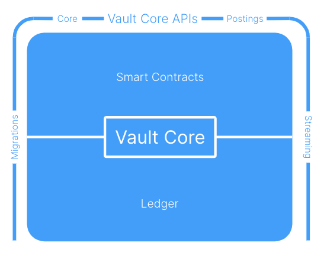
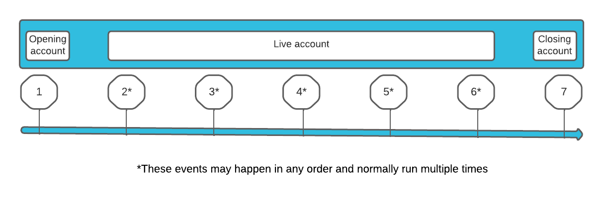

# What is Vault Core?

Vault Core is a digital [core banking system](https://www.gartner.com/en/information-technology/glossary/core-banking-systems) that provides a real-time ledger that maintains the current state of customer (*external*) accounts and bank (*internal*) accounts.

## Conceptual model

The following conceptual model highlights the main components of Vault Core:

Funds (or other assets) are moved between accounts by instructing Vault Core via a posting instruction (*Postings*). When posting instructions are sent to Vault Core they are subjected to the business logic of the account (the *Smart contract*). The posting will be accepted or rejected based on the logic that is defined in the Smart contract.

All accepted postings will move funds or assets and give rise to new account balances. The balance of an account will be recorded in many dimensions to facilitate processing activities on an account, such as calculating interest payments or financial reporting.

As a real-time system, accepted postings, updated balances and all other state changes that occur in Vault Core are provided as a stream of events that clients can consume, and use to trigger or provide information to other banking systems and processes.

Vault Core is designed to be highly available and to scale to meet short-term (*spikes*) and long-term (*growth*) changes in demand. This is achieved through a distributed, cloud-based infrastructure.

## Ledger

Vault Core’s ledger is an append-only series of accepted fund movements (postings).

Fund balances can be recorded in many dimensions (known as coordinates), including: Currency Denominations, Funds phase and Asset type (as explained in [Balances](/vault-core/5-8/EN/vault_core_overview/what_is_vault_core#balances)).

When a posting is recorded onto the ledger it causes a change in the balances, either immediately or at the requested future time.

All postings (accepted and rejected) are provided as events on an event stream, as well as the new balances that arise after accepted postings.

The ledger is used to provide balances when running the account logic within a Smart Contract.

### Accounts

There are two types of account in Vault Core: *Customer Accounts* and *Internal Accounts*.

#### Customer Accounts

The vast majority of accounts in Vault Core are *Customer accounts*. Customer accounts will always have a specific Smart Contract associated with them and a set of parameters used to drive product behaviour. Logic inside the Smart Contract can use the values of that account’s balances and parameters in order to maintain the account, often by accepting or rejecting incoming postings, as well as generating postings themselves.

#### Internal Accounts

Double-entry bookkeeping will almost always require an *Internal account* to be involved in funds movements (the exception being movements within an account between addresses).

Internal Accounts have a full set of balances (and dimensions) but cannot have any Smart Contract logic; their role in double-entry bookkeeping means they can be used as an aggregation. For example, internal accounts can be used as a scheme *vostro* account - tracking funds that will need to be sent during settlement.

For more information, see [Accounts version 2](/vault-core/5-8/EN/reference/accounts/accounts_version_2/).

### Balances

The balance of an account is recorded in several dimensions (also known as coordinates):

-   Asset classes
    
-   Denominations
    
-   Addresses
    
-   Phases
    

The [denomination](/vault-core/5-8/EN/vault_core_overview/what_is_vault_core#denominations) (currency) dimension is used to ensure that all accounts in Vault Core can be multi-currency (if desired). The other dimensions, such as [Asset classes](/vault-core/5-8/EN/vault_core_overview/what_is_vault_core#asset_classes), [Addresses](/vault-core/5-8/EN/vault_core_overview/what_is_vault_core#addresses) and [Phases](/vault-core/5-8/EN/vault_core_overview/what_is_vault_core#phases) are used to simplify the logic of the account when defining it in a Smart Contract.

For more information, see [Balances](/vault-core/5-8/EN/reference/balances/) and [Balances Core API](/vault-core/5-8/EN/api/core_api#Balances).

#### Asset classes

The Asset type in Vault Core designates funds as either *Commercial Bank Money* or *Cash* by default; other asset types can be defined by clients to meet their own use cases. For example, reward points.

#### Denominations

Denominations (typically ISO currency codes) ensure that funds in different denominations can be held separately.

The Smart Contract writer can ensure that the account only allows for postings in permitted denominations. Vault Core supports multi-denomination accounts by default.

#### Addresses

*Addresses* provide the ability to segregate funds within an account.

Every account has a *DEFAULT* address; that is the address to which postings are normally sent. For a simple current account this address may be the only address in use.

Using extra addresses in an account enables Vault Core to support use-cases such as:

-   Rounding up each payment to the nearest whole currency unit and paying this into a *savings pot*.
    
    To support this use-case, a SAVINGS address can be used to collect the round-up amounts.
    
-   Ensuring that the FEES applied to an account are treated differently when calculating interest. (For example, where required by regulation.)
    
    To support this use-case, a FEES address can be used to hold any fees, separate from the DEFAULT address.
    

#### Phases

*Phases* are used to indicate where money should not be available to the account holder; but should be visible to them (and may be used in calculations).

Funds are held in one of three phases:

-   *Committed*: The funds available to the customer
    
-   *Pending Incoming*: Funds that will likely be available to the customer soon. For example, an incoming payment prior to clearing, such as a cheque.
    
-   *Pending Outgoing*: Funds that will likely be taken from the customer soon. For example, an outgoing payment prior to clearing, such as a debit card transaction.
    

### Postings

Postings are the result of fund movements. In Vault Core, a *Posting* specifically means a single credit or debit of a specified amount.

The Vault Core Postings model is built on two key principles:

-   *The ability to model any type of financial transaction*: Vault Core is designed to model any financial transaction, internal or external. This is done by exposing primitives that not only process financial transactions but record their intention (for auditability). Multiple financial transactions can be linked together by step-by-step instructions that get verified and applied by the Postings APIs, powering the design of complex, multi-stage financial processes.
    
-   *Guaranteed consistency of a bank’s financial state*: The Postings APIs together act as the single source of Vault Core’s financial truth. Therefore the Postings APIs guarantee that the Postings Ledger is always in a consistent state.
    

Vault Core uses double-entry bookkeeping, so it is not possible to make a single credit or debit. There will always need to be a balanced set of credits and debits for a posting to be accepted into the ledger. This is referred to as a *Posting Instruction*.

Postings Instructions can have a *[Type](/vault-core/5-8/EN/reference/postings#posting_instruction_types)* in order to give financial context and purpose to the funds movements.

#### Posting Batches

Posting Instructions can be gathered into a *batch* - this is the smallest set of posting instructions that must be accepted, or rejected together.

For more information, see [Posting Instruction Batches](/vault-core/5-8/EN/api/core_api#PostingInstructionBatch).

For example, a batch could consist of the following posting instructions:

-   A transaction and the transaction fee.
    
-   An outbound and inbound FX leg.
    

chat\_bubble

This is not a batch in the sense of *batch processing*, where the same operation is performed on every item contained in the batch. In a posting batch, if any posting instruction is rejected, then the entire batch of posting instructions will be rejected. You should only batch together posting instructions where this is the required behaviour. For example, where bulk payments are used, the payments should be de-bulked and instructed individually.

#### Posting types

Postings move funds between account balance addresses of the same dimensions (phases, denominations and asset classes), as explained in [Balances](/vault-core/5-8/EN/vault_core_overview/what_is_vault_core#balances). Vault Core includes built-in Posting Types to achieve these movements.

For example, *Outbound Hard settlement* types move funds out of an account and *Inbound Hard Settlement* types move funds into an account.

For a full description of Vault Core posting types, see [Posting Instruction Types](/vault-core/5-8/EN/reference/postings#posting_instruction_types).

### Payment Devices

It is common to want to associate one or more payment devices (such as a physical card, a virtual card, an IBAN, a sort code and account number) to a customer account.

To support this requirement, Vault Core uses *Payment Devices* to provide multiple types of links to a customer account.

For more information, see [Payment Devices](/vault-core/5-8/EN/api/core_api#payment_devices).

## Smart Contracts

Smart Contracts are the encapsulation of the business logic for a customer account; they are an embodiment of the terms and conditions of the account. They contain the logic to accept and reject postings (in the pre-posting [hook](/vault-core/5-8/EN/vault_core_overview/what_is_vault_core#hooks)), and at other key points in the account’s [lifecycle](/vault-core/5-8/EN/vault_core_overview/what_is_vault_core#lifecycle). For example, opening and closing the account.

Contracts can also represent a wider range of product behaviours via parameterisation; parameters allow the representation - in a single Smart Contract - of accounts which share common functionality.

For a comprehensive introduction to Smart Contracts, see [Smart contracts overview](/vault-core/5-8/EN/reference/contracts/contracts_api_4xx/).

### Hooks

Hooks are used in a Smart Contract to define the logic to be executed when a certain event happens.

The following diagram shows the events in the lifecycle of an account and the hooks that are used at each of the stages:

  
| Stage | Events | Hooks used |
| --- | --- | --- |
| 
1

 | 

Account activation events

 | 

*Activation* - called once before Account activation and used to schedule definitions and perform initial money movements

 |
| 

2

 | 

Posting events

 | 

*Pre-posting* - before a posting is applied to the account, used to determine whether to accept the posting, or reject the posting.  
*Post-posting* - runs actions once a posting has been accepted. It can optionally instruct additional funds movements or generate events.

 |
| 

3

 | 

Scheduled events

 | 

*Scheduled event* - run at defined frequencies to carry out business processes or run regular account actions, such as interest accruals.

 |
| 

4

 | 

Conversion events

 | 

*Conversion* - carries out actions when converting an account to a new product version.

 |
| 

5

 | 

Parameter events

 | 

*Pre-parameter* - runs every time there is a request to update instance level parameters, to validate the change.  
*Post-parameter* - runs after a parameter value update has occurred and carries out any required actions.

 |
| 

6

 | 

Derived parameter events

 | 

*Derived parameters* - run when a request is made for the account’s derived parameters.

 |
| 

7

 | 

Closure events

 | 

*Deactivation* - carries out actions when an account closes.

 |

For more information about Hooks in Smart contracts, see [Hooks](/vault-core/5-8/EN/reference/contracts/contracts_api_4xx/concepts#hooks).

### Schedules

Schedules are used in Smart Contracts to execute certain operations on a regular cadence - common use cases are daily fees and interest accrual calculations and subsequent monthly application.

The initial schedule cadences are defined when the Smart Contract is activated. You can alter Contract schedules using the logic in the Contract when it is active.

For an example of scheduled events, see [Scheduled events and balance addresses](/vault-core/5-8/EN/tutorials/smart-contracts#exercise_five__scheduled_events_and_balance_addresses).

For more information, see [Scheduler](/vault-core/5-8/EN/reference/scheduler/).

### Parameters

Parameters allow a single Smart Contract to encapsulate multiple behaviours. For example, the ability to have a single Contract operate as an interest only or capital repayment mortgage.

All parameters in Vault Core are represented as a time-series, which means that they have a given value at each point in time.

Parameters can be defined at multiple levels in order to allow breadth of control, and depth of personalisation; the Smart Contract defines which parameters its needs, the level in the hierarchy in which they exist and if they can be overridden:

-   *Global parameters*: Global parameters have a single global value at any point in time. For example, the Bank of England base rate.
    
-   *Template parameters*: Template parameters are defined in a smart contract, they allow the setting of a parameter value across all contracts of that type (and for subsequent updates). A tracker mortgage could set the tracking offset from the global Bank of England rate - this would be the same for all mortgages of that type.
    
-   *Instance parameters*: Instance parameters apply to a single instance of a contract - a customer’s account. They allow each customer’s contract to have a specific parameter set. A common example is that interest is applied on the anniversary date of the opening of an account.
    

chat\_bubble

Vault Core 5 introduces a Parameters API for improved management of Parameters. For more information, see [Parameters](/vault-core/5-8/EN/reference/parameters).

### Lifecycle

An account can be considered to have a lifecycle, principally based on the hooks that are being executed. A typical lifecycle would be:

1.  The account is first activated, and schedules are defined.
    
2.  The account becomes operational, receiving postings and running schedules.
    
3.  Maintenance activities (such as, applying an updated Smart contract to the account or changing the interest rate for the account) may upgrade the account, or change parameters on it.
    
4.  The account balances may be drained prior to closure.
    

## Streaming events

All state changes that occur in Vault Core are provided as events on the event stream; for example, on account opening, the acceptance of a posting or the change of an account parameter.

Clients can consume these events at their own pace by consuming Kafka topics.

The streaming topics should be used to source and to fill downstream queries and data stores. This ensures that Vault Core is not subject to any polling or ad hoc queries.

### Topics

Vault Core provides topics in order to allow consumers to consume specific events.

For a list of topics by event, see [Core Streaming API](/vault-core/5-8/EN/api/core_api#core_streaming_api) reference documentation.

### Postings clients

When postings (funds movements) arise from multiple sources it can be useful to ensure that the activities are separated. Two key reasons for this separation are:

-   *High/Low priority*: Some postings have an immediacy due to the fact that a customer is waiting for the outcome. For example, an instant domestic payment scheme will often impose a strict timeline for a response.
    
    chat\_bubble
    
    MasterCard/Visa have strict deadlines by which a response must be given. Conversely, there are bulk / batch payment schemes and MasterCards / Visa settlements where there is not a tight timeline for a response.
    
-   *Multiple sources*: The domestic instant payments system and the cards system will both instruct postings, but do not need to see the outcome of the other system’s postings.
    

Postings clients can be registered in Vault Core; this will create a segregated response topic on which that client’s traffic (alone) will be visible.

Low priority traffic across all clients can be sent to the low priority postings topic; this will ensure that high priority postings are processed first.